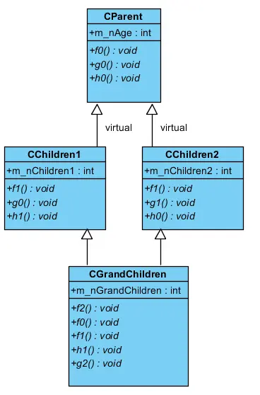
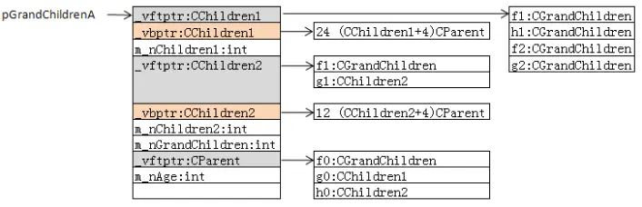
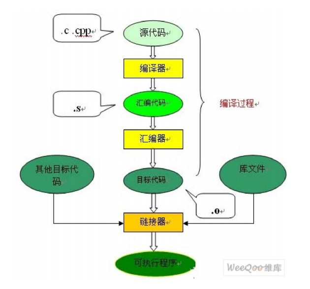
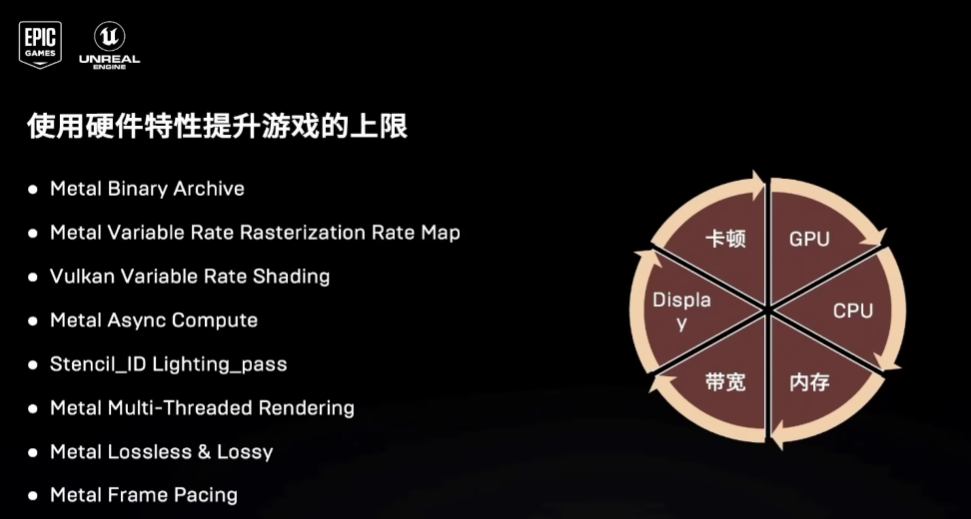

# C++ and Graphics Questions
<!-- TOC -->- [C++ and Graphics Questions](#c-and-graphics-questions)
- [C++ and Graphics Questions](#c-and-graphics-questions)
  - [1-C++](#1-c)
    - [1-1 Basic 计算机基础](#1-1-basic-计算机基础)
      - [  Q1 int，long在32位，64位中的长度](#--q1-intlong在32位64位中的长度)
      - [  Q2 一个32位的整数，全一表示所有的位都是1。在二进制表示法中，这个值的十进制是什么](#--q2-一个32位的整数全一表示所有的位都是1在二进制表示法中这个值的十进制是什么)
      - [ Q3 指针占几字节](#-q3-指针占几字节)
      - [ Q4 指针和引用的区别](#-q4-指针和引用的区别)
      - [ Q5 野指针产生的情况](#-q5-野指针产生的情况)
      - [ Q6 野指针如何Debug？](#-q6-野指针如何debug)
      - [ Q7 32位和64位下一些数据大小的区别](#-q7-32位和64位下一些数据大小的区别)
      - [ Q8 大小端 以及如何用代码判断机器是否为大小端；](#-q8-大小端-以及如何用代码判断机器是否为大小端)
      - [ Q9 位域](#-q9-位域)
      - [ Q10 平时遇到野指针，该怎么排查](#-q10-平时遇到野指针该怎么排查)
      - [ Q11 数组指针和指针数组的区别](#-q11-数组指针和指针数组的区别)
      - [ Q12 \*A = nullptr 一定会报错吗 为什么](#-q12-a--nullptr-一定会报错吗-为什么)
      - [ Q13 Switch 要比 if else更快，为什么](#-q13-switch-要比-if-else更快为什么)
    - [1-2 强转Cast](#1-2-强转cast)
      - [Q1 如果一个int指针赋给一个double指针，double的地址是什么？](#q1-如果一个int指针赋给一个double指针double的地址是什么)
      - [Q2 如何将const转为非const](#q2-如何将const转为非const)
      - [Q3 static\_cast和dynamic\_cast的区别，后者转化指针或引用失败时返回什么](#q3-static_cast和dynamic_cast的区别后者转化指针或引用失败时返回什么)
      - [Q4 要是用static\_cast进行父类子类转换会怎样](#q4-要是用static_cast进行父类子类转换会怎样)
    - [1-3 关键字](#1-3-关键字)
      - [ Q1 宏和inline](#-q1-宏和inline)
      - [ Q2 Const](#-q2-const)
      - [ Q3 两个cpp中都定义int a会不会报错](#-q3-两个cpp中都定义int-a会不会报错)
      - [ 04 struct和class有什么区别?](#-04-struct和class有什么区别)
      - [ 05 public继承和private继承](#-05-public继承和private继承)
      - [ 06 值类型 vs 引用类型](#-06-值类型-vs-引用类型)
      - [ Q7 内联函数在编译时期是从什么地方提高效率？](#-q7-内联函数在编译时期是从什么地方提高效率)
      - [ Q8 C++ UNION](#-q8-c-union)
    - [1-4 内存](#1-4-内存)
      - [ Q1 堆和栈，分别存些什么，栈中存放函数中哪些变量，函数参数的入栈顺序](#-q1-堆和栈分别存些什么栈中存放函数中哪些变量函数参数的入栈顺序)
      - [ Q2 new除了分配内存还有什么用法?](#-q2-new除了分配内存还有什么用法)
      - [ Q3 new重载有什么作用?](#-q3-new重载有什么作用)
      - [ Q4 内存对齐有什么用](#-q4-内存对齐有什么用)
      - [ Q5 结构体，一个int，一个bool，一个int，一个bool，内存大小是多少](#-q5-结构体一个int一个bool一个int一个bool内存大小是多少)
      - [ Q6 内存碎片产生原因，以及内部和外部内存碎片](#-q6-内存碎片产生原因以及内部和外部内存碎片)
      - [ Q7 STL的内存管理，如何避免内存碎片](#-q7-stl的内存管理如何避免内存碎片)
      - [ Q8 static和const 在内存上的模型布局和差别](#-q8-static和const-在内存上的模型布局和差别)
      - [ Q9  a多重继承 bc，new一个a之后，又向上转成了b和c，此时他们三个是共用一块内存吗?](#-q9--a多重继承-bcnew一个a之后又向上转成了b和c此时他们三个是共用一块内存吗)
      - [ Q10 用memset和memcp设置和拷贝内存中的内容](#-q10-用memset和memcp设置和拷贝内存中的内容)
      - [ Q11 栈何时会溢出](#-q11-栈何时会溢出)
      - [ Q12 内存的分页机制](#-q12-内存的分页机制)
      - [ Q13 虚拟页映射到磁盘上的情况](#-q13-虚拟页映射到磁盘上的情况)
      - [ Q14 程序的内存分配](#-q14-程序的内存分配)
      - [ Q15 静态和常量的区别](#-q15-静态和常量的区别)
      - [ Q16 对象的内存结构，考虑哪些因素，就一个对象由哪些组成、哪些成员会占用对象的空间？（虚函数，虚基类，内存对齐，继承体系）](#-q16-对象的内存结构考虑哪些因素就一个对象由哪些组成哪些成员会占用对象的空间虚函数虚基类内存对齐继承体系)
      - [ Q17 CPP的内存模型](#-q17-cpp的内存模型)
      - [ Q18 怎么把对象创建在栈上，怎么把对象创建在堆上？](#-q18-怎么把对象创建在栈上怎么把对象创建在堆上)
      - [ Q19 new了一个int类型的数组，new的前后发现进程中的内存占用是没有变化的，可能是什么原因导致的？](#-q19-new了一个int类型的数组new的前后发现进程中的内存占用是没有变化的可能是什么原因导致的)
      - [ Q20 栈和堆都在内存上吗，还是可以在硬盘上](#-q20-栈和堆都在内存上吗还是可以在硬盘上)
      - [ Q21 计算结构体的内存大小](#-q21-计算结构体的内存大小)
      - [ Q22 public，private，protected各自的权限范围，有没有例外？](#-q22-publicprivateprotected各自的权限范围有没有例外)
      - [ Q23 动态内存管理的手段](#-q23-动态内存管理的手段)
      - [ Q24 allocator和vector如何管理动态内存](#-q24-allocator和vector如何管理动态内存)
      - [ Q25 allocator为什么比new/delete管理好](#-q25-allocator为什么比newdelete管理好)
      - [ Q26 平时什么时候用malloc? 比如int a 这样内存申请在哪](#-q26-平时什么时候用malloc-比如int-a-这样内存申请在哪)
      - [ Q27 平时遇到内存泄漏，该怎么排查？](#-q27-平时遇到内存泄漏该怎么排查)
      - [ Q28 new与malloc的内存分配失败情况？以及malloc底层](#-q28-new与malloc的内存分配失败情况以及malloc底层)
      - [ Q29 new / delete的有无括号的情况与原理](#-q29-new--delete的有无括号的情况与原理)
    - [1-5 虚函数](#1-5-虚函数)
      - [ Q1 析构函数为什么是虚函数，析构函数不是虚函数一定会造成内存泄漏吗](#-q1-析构函数为什么是虚函数析构函数不是虚函数一定会造成内存泄漏吗)
      - [ Q2 一个类的虚函数和虚表是在哪一个阶段初始化](#-q2-一个类的虚函数和虚表是在哪一个阶段初始化)
      - [ Q3 虚函数怎么被调用以及实现机制](#-q3-虚函数怎么被调用以及实现机制)
      - [ Q4 C++的继承和多态](#-q4-c的继承和多态)
      - [ Q5 为什么构造函数不能被声明为虚函数？](#-q5-为什么构造函数不能被声明为虚函数)
      - [ Q6 虚函数表在内存哪一部分](#-q6-虚函数表在内存哪一部分)
      - [ Q7 有没有可能存在多个虚表指针的情况？](#-q7-有没有可能存在多个虚表指针的情况)
      - [ Q8 虚继承的意义](#-q8-虚继承的意义)
      - [ Q9 一个类有虚函数跟它没有虚函数内存大小一样吗？一个类有三个虚函数跟它只有一个虚函数内存空间大小一样吗？](#-q9-一个类有虚函数跟它没有虚函数内存大小一样吗一个类有三个虚函数跟它只有一个虚函数内存空间大小一样吗)
      - [ Q10 哪些函数不能是虚函数](#-q10-哪些函数不能是虚函数)
    - [1-6 右值](#1-6-右值)
      - [ Q1 右值引用的作用，移动构造函数如何实现](#-q1-右值引用的作用移动构造函数如何实现)
      - [ Q2 右值引用的底层实现](#-q2-右值引用的底层实现)
    - [1-7 STL](#1-7-stl)
      - [ Q1 map的类型，区别](#-q1-map的类型区别)
      - [ Q2 Vector扩容的时候的步骤，是否移动构造函数](#-q2-vector扩容的时候的步骤是否移动构造函数)
      - [ Q3 红黑树](#-q3-红黑树)
      - [ Q4 红黑树和avl的区别](#-q4-红黑树和avl的区别)
      - [ Q5 list查询时间这么慢，为什么还要用list呢](#-q5-list查询时间这么慢为什么还要用list呢)
      - [ Q6 堆是什么数据结构/大顶堆如何更新数据；](#-q6-堆是什么数据结构大顶堆如何更新数据)
      - [ Q7 STL的内存分配(两级适配器，内存池)](#-q7-stl的内存分配两级适配器内存池)
      - [ Q8 Vector和List的遍历速度比较(主要考虑cache)](#-q8-vector和list的遍历速度比较主要考虑cache)
      - [ Q9 百万级别的数据用什么数据结构存储？](#-q9-百万级别的数据用什么数据结构存储)
    - [1-8 设计模式](#1-8-设计模式)
      - [ Q1 设计模式了解哪些](#-q1-设计模式了解哪些)
      - [ 单例模式：](#-单例模式)
      - [ 工厂模式:](#-工厂模式)
    - [1-9 智能指针](#1-9-智能指针)
      - [ Q1 shared\_ptr的多线程操作是安全的吗](#-q1-shared_ptr的多线程操作是安全的吗)
      - [ Q2 讲讲智能指针的底层，可以相互转换吗](#-q2-讲讲智能指针的底层可以相互转换吗)
      - [ Q3 shared\_ptr线程不安全问题，如何保证多个shared\_ptr的读写安全？除了mutex，还有更高效的方法吗？](#-q3-shared_ptr线程不安全问题如何保证多个shared_ptr的读写安全除了mutex还有更高效的方法吗)
      - [ Q4 定义一个类，含有unique\_ptr，如何把这个类作为形参](#-q4-定义一个类含有unique_ptr如何把这个类作为形参)
      - [ Q5 Shadered\_ptr 什么时候释放计数的那块内存](#-q5-shadered_ptr-什么时候释放计数的那块内存)
    - [1-10 lambda表达式](#1-10-lambda表达式)
      - [ Q1 C++ 的lambda表达式](#-q1-c-的lambda表达式)
      - [ Q2 用auto定义一个变量接收一个lambda表达式，对这个变量求sizeof是什么结果？](#-q2-用auto定义一个变量接收一个lambda表达式对这个变量求sizeof是什么结果)
      - [ Q3 lambda表达式的底层实现，为什么是可运行的](#-q3-lambda表达式的底层实现为什么是可运行的)
    - [1-10 模板](#1-10-模板)
      - [ Q1 模板元编程了解多少，怎么用模板实现无符号十进制数值转换为等价二进制（数值计算，特化）](#-q1-模板元编程了解多少怎么用模板实现无符号十进制数值转换为等价二进制数值计算特化)
      - [ Q2 模板编译期间生成什么](#-q2-模板编译期间生成什么)
  - [2-计租，网络，操作系统](#2-计租网络操作系统)
    - [2-1 操作系统](#2-1-操作系统)
      - [ Q1 C++编译链接的过程](#-q1-c编译链接的过程)
      - [ Q2 链接的方式，多个程序共享一个动态库,其运行时加载几次，占用谁的内存](#-q2-链接的方式多个程序共享一个动态库其运行时加载几次占用谁的内存)
      - [ Q3 进程和线程的区别](#-q3-进程和线程的区别)
      - [ Q4 线程之间的通信（腾讯一面）](#-q4-线程之间的通信腾讯一面)
      - [ Q5 多线程有多少栈](#-q5-多线程有多少栈)
      - [Q6 无锁多线程如何协作（需要深入）](#q6-无锁多线程如何协作需要深入)
      - [Q7 锁和信号量的区别](#q7-锁和信号量的区别)
      - [Q8 临界区是什么？](#q8-临界区是什么)
      - [Q9 帧同步和状态同步](#q9-帧同步和状态同步)
      - [ Q10 多个线程访问同一个资源如何避免数据竞争](#-q10-多个线程访问同一个资源如何避免数据竞争)
      - [ Q11 GPU中的if怎么做的?](#-q11-gpu中的if怎么做的)
      - [ Q12 C++头文件保护怎么做](#-q12-c头文件保护怎么做)
    - [2-2 计算机网络](#2-2-计算机网络)
      - [Q1 TCP/UDP](#q1-tcpudp)
      - [Q2 TCP/UDP的例子](#q2-tcpudp的例子)
      - [Q3 TCP的三次握手（建立连接）](#q3-tcp的三次握手建立连接)
      - [Q4 TCP四次挥手（关闭连接）](#q4-tcp四次挥手关闭连接)
      - [Q5 浏览器输入网址到呈现网页的过程](#q5-浏览器输入网址到呈现网页的过程)
      - [Q6 TCP中的流量控制和拥塞控制 内部实现逻辑 ，在断网的情况下，重连的内部逻辑](#q6-tcp中的流量控制和拥塞控制-内部实现逻辑-在断网的情况下重连的内部逻辑)
  - [3-图形算法](#3-图形算法)
    - [3-1 几何](#3-1-几何)
      - [Q1 矩形蛋糕有一个矩形空洞，如何一刀切成等量两部分](#q1-矩形蛋糕有一个矩形空洞如何一刀切成等量两部分)
      - [Q2 几何如何判断一个凸包](#q2-几何如何判断一个凸包)
      - [Q3 怎么计算得到屏幕上某个像素射出去的光线](#q3-怎么计算得到屏幕上某个像素射出去的光线)
      - [Q4 在CPU上做视锥体剔除 如何用AABB加速](#q4-在cpu上做视锥体剔除-如何用aabb加速)
      - [Q5  什么是OBB](#q5--什么是obb)
      - [Q6 鼠标点击的时候，怎么判断屏幕选中的是哪一个物体](#q6-鼠标点击的时候怎么判断屏幕选中的是哪一个物体)
      - [Q7 在三维空间中用什么表示平面，和在二维空间中用什么表示直线，什么来表示法线](#q7-在三维空间中用什么表示平面和在二维空间中用什么表示直线什么来表示法线)
    - [3-2 深度](#3-2-深度)
      - [Q1 Z-fighting深度冲突的原因？大面积都有这个问题怎么解决？（腾讯一面）](#q1-z-fighting深度冲突的原因大面积都有这个问题怎么解决腾讯一面)
    - [3-3 渲染管线](#3-3-渲染管线)
      - [Q1 前向渲染和延迟渲染各自的好处与坏处？（腾讯一面）](#q1-前向渲染和延迟渲染各自的好处与坏处腾讯一面)
      - [Q2 光栅化算法和光线追踪算法的主要区别？](#q2-光栅化算法和光线追踪算法的主要区别)
      - [Q3 想要放大一个图片，可以在渲染管线上做什么操作](#q3-想要放大一个图片可以在渲染管线上做什么操作)
      - [Q4 不透明和半透明物体的绘制？](#q4-不透明和半透明物体的绘制)
      - [Q5 几何处理的剔除是在什么层级](#q5-几何处理的剔除是在什么层级)
      - [Q6 DDGI是什么](#q6-ddgi是什么)
      - [Q7 什么时候需要关闭early-Z](#q7-什么时候需要关闭early-z)
      - [Q8 什么是透视除法](#q8-什么是透视除法)
    - [3-4 MVP](#3-4-mvp)
      - [Q1 MVP的最后一个坐标空间是什么？他在Vulkan里和在OpenGL里的区别？](#q1-mvp的最后一个坐标空间是什么他在vulkan里和在opengl里的区别)
      - [Q2 怎么实现一个场景内的物体始终朝向摄像机](#q2-怎么实现一个场景内的物体始终朝向摄像机)
      - [Q3 齐次坐标的作用](#q3-齐次坐标的作用)
      - [Q4 Model View Project 三个矩阵式什么计算的？](#q4-model-view-project-三个矩阵式什么计算的)
    - [3-5 PBR](#3-5-pbr)
      - [Q1 描述一下渲染方程](#q1-描述一下渲染方程)
      - [Q2 什么是BRDF](#q2-什么是brdf)
      - [Q3 有什么类型的BRDF](#q3-有什么类型的brdf)
      - [Q4 现代的PBR一般用哪种BRDF](#q4-现代的pbr一般用哪种brdf)
      - [Q5 讲述Cook-Torrance BRDF；微表面模型中如何反应材质的粗糙程度？](#q5-讲述cook-torrance-brdf微表面模型中如何反应材质的粗糙程度)
      - [Q6 PBR里IBL的贴图生成](#q6-pbr里ibl的贴图生成)
    - [3-6 光照模型](#3-6-光照模型)
      - [Q1 Lambertian 漫反射模型](#q1-lambertian-漫反射模型)
      - [Q2 Phong 模型](#q2-phong-模型)
      - [Q3 Blinn-Phong 模型](#q3-blinn-phong-模型)
    - [3-7 光线追踪](#3-7-光线追踪)
      - [Q1 Whitted style的局限](#q1-whitted-style的局限)
      - [Q2 Path Tracing](#q2-path-tracing)
      - [Q3 重心坐标](#q3-重心坐标)
      - [Q3 在CPU的光线追踪和在GPU的光线追踪哪个好，所有情况都是在GPU好吗](#q3-在cpu的光线追踪和在gpu的光线追踪哪个好所有情况都是在gpu好吗)
      - [Q4 离线渲染和实时渲染的技术栈区别 分别用什么技术](#q4-离线渲染和实时渲染的技术栈区别-分别用什么技术)
    - [3-8 后处理](#3-8-后处理)
      - [Q1 SSR的实现](#q1-ssr的实现)
      - [Q2 渲染管线里散焦模糊怎么做](#q2-渲染管线里散焦模糊怎么做)
      - [Q3 游戏里Bloom的作用 如何降低功耗](#q3-游戏里bloom的作用-如何降低功耗)
    - [3-9 抗锯齿](#3-9-抗锯齿)
      - [Q1 TAA的实现](#q1-taa的实现)
      - [Q2 抗锯齿 FXAA 和 MSAA](#q2-抗锯齿-fxaa-和-msaa)
    - [3-10 Unreal + Unity](#3-10-unreal--unity)
      - [Q1 简单聊一下Lumen](#q1-简单聊一下lumen)
      - [Q2 Unity资产的生命周期](#q2-unity资产的生命周期)
    - [3-11 Shader](#3-11-shader)
      - [Q1 Unity Shader里面顶点着色器和像素着色器的输入输出分别是什么](#q1-unity-shader里面顶点着色器和像素着色器的输入输出分别是什么)
      - [Q2 Shader里的SSBO](#q2-shader里的ssbo)
      - [Q3 GLSL 140和430有什么区别](#q3-glsl-140和430有什么区别)
      - [Q4 怎么在GLSL里用Step高效率实现if和else的判断](#q4-怎么在glsl里用step高效率实现if和else的判断)
    - [3-12 Texture](#3-12-texture)
      - [Q1 为什么要把环境贴图mipmap，环境贴图的mipmap的每一级是怎么生成的？](#q1-为什么要把环境贴图mipmap环境贴图的mipmap的每一级是怎么生成的)
    - [3-13 Shadow](#3-13-shadow)
      - [Q1 级联阴影贴图边缘有一个很高建筑的情况，前一个遮挡后一个?](#q1-级联阴影贴图边缘有一个很高建筑的情况前一个遮挡后一个)
      - [Q2 Shadow mapping是怎么把Camera Depth转到Light Depth的深度坐标下的](#q2-shadow-mapping是怎么把camera-depth转到light-depth的深度坐标下的)
  - [4-项目](#4-项目)
    - [4-1 EDR](#4-1-edr)
    - [4-2 Vulkan](#4-2-vulkan)
      - [ Q1  Vulkan和OpenGL的差别 深度讲](#-q1--vulkan和opengl的差别-深度讲)
      - [ Q2 为什么目前的大部分游戏都是用OpenGL-ES 而不是 Vulkan? 是移动端的驱动不支持吗?](#-q2-为什么目前的大部分游戏都是用opengl-es-而不是-vulkan-是移动端的驱动不支持吗)
    - [4-3 性能优化](#4-3-性能优化)
      - [ Q1 TBDR和IMR各自的优势](#-q1-tbdr和imr各自的优势)
      - [ Q2 移动端的硬件特性提升渲染的上限](#-q2-移动端的硬件特性提升渲染的上限)
    - [4-4 NERF](#4-4-nerf)
  - [5-综合题](#5-综合题)
    - [5-1 智力](#5-1-智力)
      - [ Q1 25匹马，5个赛道，最少赛几场可以求出前三快的马](#-q1-25匹马5个赛道最少赛几场可以求出前三快的马)
      - [ Q2 两个玻璃球的经典题目](#-q2-两个玻璃球的经典题目)
    - [5-2 数学](#5-2-数学)
      - [ Q1 导数的意义，极限和导数的关系](#-q1-导数的意义极限和导数的关系)
      - [ Q2 微分的意义](#-q2-微分的意义)


## 1-C++

### 1-1 Basic 计算机基础

#### <span style="color:#FFA07A;">  Q1 int，long在32位，64位中的长度
1-int 在 32 位和 64 位系统中通常都是 32 位（4 字节）。</br>
2-long 在 32 位系统中通常是 32 位（4 字节），而在 64 位系统（如大多数现代 Mac 和 Linux 系统）中通常是 64 位（8 字节）。

#### <span style="color:#FFA07A;">  Q2 一个32位的整数，全一表示所有的位都是1。在二进制表示法中，这个值的十进制是什么
这个值是11111111111111111111111111111111，在有符号的整数表示法（通常是二进制补码表示法）中，这个二进制值表示-1（因为最高位是1，表示这是一个负数，此时后面的需要取反加一）。
在无符号的整数表示法中，这个值是4294967295（即2的32次方减1）。</br>

如果是有符号整数，全一再加一的结果就是0（因为-1加1等于0）。</br>
如果是无符号整数，全一再加一的结果会因为溢出而变为0

#### <span style="color:#FFA07A;"> Q3 指针占几字节
在 32 位系统中，指针通常占用 4 字节。</br>
在 64 位系统中，指针通常占用 8 字节。</br>

#### <span style="color:#FFA07A;"> Q4 指针和引用的区别
1-初始化</br>
指针可以在任何时候初始化，也可以先声明后初始化；引用必须在声明的时候立刻初始化。

2-NULL值</br>
指针可以指向NULL；引用必须始终指向一个有效的对象（不能是NULL）。</br>

3-改变所指/引的对象</br>
指针可以改变所指向的对象（即，可以重新赋值）；一旦一个引用被初始化指向一个对象，就不能再改变引用到其他对象。</br>

4-内存使用</br>
指针本身是一个变量，占用内存；引用则只是一个别名，不占用内存。</br>

#### <span style="color:#FFA07A;"> Q5 野指针产生的情况
1-未初始化的指针：如果你声明了一个指针但没有给它赋值，那么它就是一个野指针。</br>
2-指向已销毁对象的指针：如果你有一个指向对象的指针，而这个对象在某个时刻被销毁（例如，离开了它的作用域），那么这个指针就变成了一个野指针。(浅拷贝就是这种情况)。</br>

#### <span style="color:#FFA07A;"> Q6 野指针如何Debug？
1-使用断点和步进来debug</br>
2-打印语句</br>
3使用智能指针避免野指针</br>

#### <span style="color:#FFA07A;"> Q7 32位和64位下一些数据大小的区别
char的大小通常在所有系统上都是1字节。</br>
short通常在所有系统上都是2字节。</br>
int的大小通常在所有系统上都是4字节。</br>
long的大小在32位系统上通常是4字节，而在64位系统上可能是8字节。</br>
long long的大小通常在所有系统上都是8字节。</br>
浮点数float的大小通常在所有系统上都是4字节，而double的大小通常在所有系统上都是8字节。</br>
指针的大小在32位系统上是4字节，而在64位系统上是8字节。</br>

#### <span style="color:#FFA07A;"> Q8 大小端 以及如何用代码判断机器是否为大小端；
计算机科学中，大端序（Big-Endian）和小端序（Little-Endian）是两种不同的字节顺序。在大端序中，最重要的字节（Most Significant Byte，MSB）存储在最低的内存地址，而在小端序中，最重要的字节存储在最高的内存地址。例如，假设我们有一个32位的数值0x12345678：

在大端序中，它在内存中的表示为：12 34 56 78</br>
在小端序中，它在内存中的表示为：78 56 34 12

分成了四块是因为int占用了四个字节，可以说12 占用了第一个字节，在大端序中。</br>

```cpp
bool isLittleEndian() {
    int num = 1;
    char* byte = reinterpret_cast<char*>(&num);
    return *byte == 1;
}
```

在这个函数中，我们创建了一个整数 num 并将其初始化为1，然后我们创建了一个字符指针 byte 并将其指向 num 的内存地址。如果机器是小端序，那么最低有效字节（也就是 *byte）将是1；如果机器是大端序，那么最低有效字节将是0。因此，这个函数会在小端序的机器上返回 true，在大端序的机器上返回 false。</br>

#### <span style="color:#FFA07A;"> Q9 位域
位域（Bit-field）是C和C++语言中的一种特性，允许我们在结构体中定义一个精确宽度的字段。这种结构体的字段并不是字节（byte）为单位，而是位（bit）为单位。位域在需要精确控制数据布局和大小的情况下非常有用，例如在硬件编程或协议实现中。

```cpp
struct BitField {
    unsigned int is_keyword : 1;    // 占用1位
    unsigned int is_extern  : 1;    // 占用1位
    unsigned int is_static  : 1;    // 占用1位
    unsigned int line_count : 14;   // 占用14位
};
```

位域的优点是可以节省内存。例如，如果我们需要存储一个只有两个可能值的变量（如真/假），使用位域，我们只需要1位的空间。如果使用一个普通的int或bool变量，则需要4字节或1字节的空间。（1字节=8位）
位（bit）就是最小的单位 只有0或者1；

#### <span style="color:#FFA07A;"> Q10 平时遇到野指针，该怎么排查
使用静态代码分析工具：静态代码分析工具可以在编译时检测出可能的野指针。例如，在C++中，可以使用Clang的静态分析器。

使用动态分析工具：动态分析工具在运行时检测野指针。例如，Valgrind和AddressSanitizer可以检测到野指针访问。

#### <span style="color:#FFA07A;"> Q11 数组指针和指针数组的区别
数组指针是一个指针，它指向一个数组。例如，如果我们有一个整数数组，我们可以创建一个指向它的指针：
```cpp
int arr[10];
int (*ptr)[10] = &arr; // ptr是一个指向含有10个整数的数组的指针
```

指针数组则是一个数组，它的元素都是指针。例如，我们可以创建一个包含10个整数指针的数组：
```cpp
int* arr[10]; // arr是一个含有10个整数指针的数组
```

#### <span style="color:#FFA07A;"> Q12 *A = nullptr 一定会报错吗 为什么
不一定。在C++中，nullptr是一个特殊的值，用于表示一个空指针。将nullptr赋值给一个指针变量（例如，A = nullptr;）是完全合法的，不会引发错误。这种操作通常用来表示该指针变量目前不指向任何有效的对象。

然而，如果你试图通过一个空指针访问对象（例如，A->foo();或*A = someValue;），那么你的程序就会出现错误，通常会导致程序崩溃。这是因为空指针并没有指向任何可以访问的内存地址，所以试图通过空指针访问对象是非法的。

#### <span style="color:#FFA07A;"> Q13 Switch 要比 if else更快，为什么
跳转表（Jump Tables）：当switch语句包含许多case时，编译器可能会生成一个跳转表。这是一个数组，其索引对应于每一个case标签，数组的内容是每个case对应的代码块的内存地址。这样，程序只需要查找一次跳转表，就可以直接跳转到正确的代码块，而无需逐个检查所有的case。如果使用if-else语句，程序可能需要逐个检查每一个条件，这在有许多case的情况下可能会较慢。


### 1-2 强转Cast

#### <span style="color:#FFA07A;">Q1 如果一个int指针赋给一个double指针，double的地址是什么？
用reinterpret_cast，地址没变。dptr 指向的地址和 iptr 指向的地址是完全相同的。然而，当我们试图通过 *dptr 访问数据时，我们可能会得到一个不正确的 double 值，因为在这个地址上实际存储的是一个 int 值，而不是一个 double 值。</br>

```cpp
int i = 10;
int* iptr = &i;
double* dptr = reinterpret_cast<double*>(iptr);  // 将 int* 转换为 double*
```

#### <span style="color:#FFA07A;">Q2 如何将const转为非const
const_cast: 把const属性去掉，即将const转换为非const（也可以反过来），const_cast只能用于指针或引用。</br>
并且只能改变对象的底层const（顶层const，本身是const，底层const，指向对象const）；</br>

#### <span style="color:#FFA07A;">Q3 static_cast和dynamic_cast的区别，后者转化指针或引用失败时返回什么
static_cast 是最常用的转换类型，可以在任何的数据类型之间进行转换（只要转换是合法的）。</br>
static_cast 在编译时执行，因此它不能检查转换是否有效。可以向上转。</br>

dynamic_cast 主要用于处理基类和派生类之间的转换。它在运行时执行，以确保转换的有效性。如果 dynamic_cast 无法执行转换，它会返回一个空指针（对于指针类型）或抛出一个 std::bad_cast 异常(对于引用类型) 可以向下转。</br>

#### <span style="color:#FFA07A;">Q4 要是用static_cast进行父类子类转换会怎样
向下转型（从父类转换为子类）在编译时期不会有错误，但是在运行时可能会导致问题。如果实际上指向的对象并非是预期的子类类型，那么结果是未定义的。
原因就在于子类可能包含额外的成员变量和成员函数，这些在父类中并不存在。


### 1-3 关键字
#### <span style="color:#FFA07A;"> Q1 宏和inline
define宏命令是在预处理阶段对命令进行替换，Inline是在编译阶段进行插入。define的话是不会对参数的类型进行检查的，因此会出现类型安全的问题，比如定义一个max命令，但是传递的时候可能会传递一个整数和一个字符串，就会出错，但是Inline内联函数在编译阶段会进行类型检查；

#### <span style="color:#FFA07A;"> Q2 Const
const修饰符用来定义常量，具有不可变性。在类中，被const修饰的成员函数，不能修改类中的数据成员；</br>
指针常量指的是该指针本身是一个常量，不能被修改，但是指针指向的对象可以被修改；</br>
常量指针指的是这个指针指向的对象是一个常量，不能被修改，但是指针本身可以被修改。这涉及到一个顶层const和底层const的概念：顶层const，本身是const，底层const，指向的对象是const；

#### <span style="color:#FFA07A;"> Q3 两个cpp中都定义int a会不会报错
在两个不同的 .cpp 文件中定义同名的全局变量 int a 是会导致链接错误的。这是因为在链接所有的 .cpp 文件来生成可执行文件时，链接器会发现 int a 的多重定义。
解决的方式两种:</br>
1-两个都变成static</br>
2-留下一个定义好的int a，剩下的变成external

#### <span style="color:#FFA07A;"> 04 struct和class有什么区别?
1-默认的访问修饰符：</br>
这是 struct 和 class 之间最主要的区别。在 struct 中，成员的默认访问修饰符是 public，而在 class 中，成员的默认访问修饰符是 private。这意味着，如果你没有显式地指定访问修饰符（public、protected 或 private），那么 struct 的成员默认是公有的，class 的成员默认是私有的。</br>

2-继承：</br>
当一个 struct 或 class 继承自另一个 struct 或 class 时，如果没有显式地指定继承类型（public、protected 或 private），那么 struct 默认使用public继承方式，class 默认使用private继承方式。

#### <span style="color:#FFA07A;"> 05 public继承和private继承

公有继承（Public Inheritance）</br>
公有继承意味着基类的公有成员和保护成员会保持其原有的访问级别（public 和 protected）到派生类中。基类的私有成员不会被派生类继承。
```cpp
class Base {
public:
    int public_member;
protected:
    int protected_member;
private:
    int private_member;
};

class Derived : public Base {
    // public_member is public
    // protected_member is protected
    // private_member is not accessible from Derived
};
```
私有继承（Private Inheritance）</br>
私有继承意味着基类的公有成员和保护成员都会变成派生类的私有成员。基类的私有成员不会被派生类继承。 我们在class是默认私有的，所以要写public。

```cpp
class Base {
public:
    int public_member;
protected:
    int protected_member;
private:
    int private_member;
};

class Derived : private Base {
    // public_member is private
    // protected_member is private
    // private_member is not accessible from Derived
};
```

总的来说，公有继承表示 "is-a" 的关系，比如 "Dog is an Animal"，而私有继承表示 "is-implemented-in-terms-of" 的关系，比如 "Stack is implemented in terms of List"。

#### <span style="color:#FFA07A;"> 06 值类型 vs 引用类型
值类型的变量直接存储数据的值。当你将一个值类型的变量赋值给另一个值类型的变量时，原始变量的副本将被创建并赋值给新的变量。</br>
引用类型的变量存储的是数据的引用（也就是内存地址），而不是数据的实际值。当你将一个引用类型的变量赋值给另一个引用类型的变量时，它们都将引用同一个内存地址。这意味着，如果你更改其中一个变量的值，另一个变量的值也会跟着改变，因为它们都指向同一个内存地址。</br>

也就是 value 是传入了一个副本，reference是传入了一个内存地址；而且value拷贝副本的操作也是额外的开销。</br>

#### <span style="color:#FFA07A;"> Q7 内联函数在编译时期是从什么地方提高效率？ 
减少栈调用，当编译器看到内联函数调用时，它不会生成函数调用的代码，而是直接在调用处插入函数的代码体。这样就避免了函数调用的开销，如参数压栈、栈帧管理、返回地址的保存和恢复等。

#### <span style="color:#FFA07A;"> Q8 C++ UNION
当然可以。在C++中，union 是一种特殊的数据类型，它可以存储不同类型的数据，但是一次只能存储其中一种类型的数据。它的大小由其最大的数据成员确定，因为在任意时刻，只有一个数据成员可以有值。
```cpp
union MyUnion {
    int intMember;
    float floatMember;
    char charMember;
};
```
在这个例子中，MyUnion 可以存储一个 int， float 或 char。但是，这三个成员共享同一块内存空间，所以它们不能同时使用。

```cpp
MyUnion u;

u.intMember = 3; // Now the union holds an integer
std::cout << u.intMember << std::endl; // Access the integer

u.floatMember = 3.14; // Now the union holds a float
std::cout << u.floatMember << std::endl; // Access the float

// Note: Accessing u.intMember now would give unpredictable results

```
union 在C++中的使用有很多，其中一个最常见的用途是在当你需要在同一块内存空间中存储不同类型的数据，并且你确切地知道在任一时刻哪种类型的数据是有效的。


### 1-4 内存
#### <span style="color:#FFA07A;"> Q1 堆和栈，分别存些什么，栈中存放函数中哪些变量，函数参数的入栈顺序
在函数调用时，会为函数创建一个栈帧（Stack Frame），其中包括以下内容：

1-局部变量（Local Variables）
2-函数参数（Function Parameters）
3-返回地址（Return Address）
4-栈帧指针（Frame Pointer）

它可以因编译器和操作系统的不同而不同,常见的调用约定（如 cdecl，常见于 C 和 C++）通常会从右向左将参数压入栈中。

堆存储需要动态分配的数据，由程序员手动管理。</br>
由 new 创建的对象和数据</br>
动态数据结构，如链表、树、图等</br>

#### <span style="color:#FFA07A;"> Q2 new除了分配内存还有什么用法? 
在 C++ 中，new 的主要用途是动态分配内存并构造对象。当你使用 new 时，会发生以下两步操作：

1-分配足够的内存来存储对象。</br>
2-调用对象的构造函数以初始化该内存。

#### <span style="color:#FFA07A;"> Q3 new重载有什么作用?
关于 new 的重载，C++ 允许你重载 operator new 和 operator delete。这可以让你自定义内存分配和释放的行为。</br>
1-你可以使用它来实现自定义的内存管理策略，（比如从内存池分配）</br>
2-或者收集内存使用的统计信息。或者打印报错信息来debug。用于跟踪和调试。</br>

```cpp
void* operator new(size_t size) {
    std::cout << "Allocating " << size << " bytes\n";
    void* p = std::malloc(size);
    if (p == nullptr) {
        throw std::bad_alloc();
    }
    return p;
}
```

#### <span style="color:#FFA07A;"> Q4 内存对齐有什么用
内存对齐是计算机硬件对内存访问的一种优化。在许多系统上，当数据的地址符合某些特定规则时（通常是该地址是特定数值的倍数），访问数据的速度会更快。当为类型或结构选择内存布局时，编译器会尽量使每个元素都满足这些内存对齐规则。这可能会导致“填充”（padding）的插入，即在结构的某些部分插入额外的空间以满足对齐需求。</br>
一个字通常是4个字节；在64位系统中，一个字通常是8个字节。若不进行对齐，要取出两块地址中的数据，进行掩码和移位等操作，写入目标寄存器内存，效率很低。

#### <span style="color:#FFA07A;"> Q5 结构体，一个int，一个bool，一个int，一个bool，内存大小是多少
不是4+1+4+1 因为内存对齐 所以可能是12或者16，取决于编译器。

#### <span style="color:#FFA07A;"> Q6 内存碎片产生原因，以及内部和外部内存碎片
分成内部内存碎片和外部内存碎片:

内部碎片的产生：(由于内存对齐)因为所有的内存分配必须起始于可被 4、8 或 16 整除（视处理器体系结构而定）的地址或者因为MMU的分页机制的限制，决定内存分配算法仅能把预定大小的内存块分配给客户。假设当某个客户请求一个 43 字节的内存块时，因为没有适合大小的内存，所以它可能会获得 44字节、48字节等稍大一点的字节，因此由所需大小四舍五入而产生的多余空间就叫内部碎片。</br>

外部碎片的产生： 频繁的分配与回收物理页面会导致大量的、连续且小的页面块夹杂在已分配的页面中间，就会产生外部碎片。假设有一块一共有100个单位的连续空闲内存空间，范围是0~99。如果你从中申请一块内存，如10个单位，那么申请出来的内存块就为0~9区间。这时候你继续申请一块内存，比如说5个单位大，第二块得到的内存块就应该为10~14区间。如果你把第一块内存块释放，然后再申请一块大于10个单位的内存块，比如说20个单位。因为刚被释放的内存块不能满足新的请求，所以只能从15开始分配出20个单位的内存块。现在整个内存空间的状态是0~9空闲，10~14被占用，15~34被占用，25~99空闲。其中0~9就是一个内存碎片了。如果10~14一直被占用，而以后申请的空间都大于10个单位，那么0~9就永远用不上了，变成外部碎片。</br>

#### <span style="color:#FFA07A;"> Q7 STL的内存管理，如何避免内存碎片
128B以上就用malloc()  128B以下就用内存池，可以避免外部内存碎片，减少内存分配的开销，提高内存利用率。</br>
可以避免内存碎片是因为他是按照整个池的大小按块分配的。</br>

#### <span style="color:#FFA07A;"> Q8 static和const 在内存上的模型布局和差别

static全局变量: 在静态存储区</br>
static局部变量: 在静态存储区</br>
const全局变量: 在静态存储区</br>
const局部变量: 在栈上</br>

生命周期:</br>
无论是全局还是局部，static变量的生命周期都是整个程序的运行时间。</br>
局部const变量：这种变量的生命周期与函数的执行周期一致。当函数被调用时，这些变量被创建，当函数执行完毕时，这些变量被销毁。</br>
全局const变量：全局const变量的生命周期是整个程序的运行期间。从程序开始执行时就存在，直到程序结束时才被销毁。</br>

举个例子:</br>
对于多线程的程序，每个线程都有自己独立的栈，但所有线程共享相同的静态存储区，这意味着static和全局const变量在所有线程间共享。相比之下，局部const变量和其他局部变量一样，每个线程都有其自己的副本。</br>

```cpp
#include <iostream>

// 全局变量，存储在静态存储区
const int global_const = 10;

// 静态全局变量，存储在静态存储区
static const int static_global_const = 20;

void function() {
    // 局部变量，存储在栈上
    const int local_const = 30;
    
    // 静态局部变量，存储在静态存储区
    static const int static_local_const = 40;

    std::cout << local_const << " " << static_local_const << std::endl;
}

int main() {
    function();
    std::cout << global_const << " " << static_global_const << std::endl;
    return 0;
}
```


#### <span style="color:#FFA07A;"> Q9  a多重继承 bc，new一个a之后，又向上转成了b和c，此时他们三个是共用一块内存吗?

```cpp
class B { /* ... */ };
class C { /* ... */ };
class A : public B, public C { /* ... */ };

A* a = new A;
B* b = a;
C* c = a;
```

No, 如果你创建了一个 A 的对象，并将其向上转型为 B 和 C，那么 B 和 C 的指针实际上是指向 A 对象中对应部分的内存。也就是说，B 和 C 的指针并不是指向完全独立的内存块，而是指向 A 对象的内存中的一部分。在上面的代码中，b 和 c 都是指向 A 对象的内存的一部分。请注意，由于多重继承的内存布局，b 和 c 的值可能并不相同。</br>

也就是b指针会指向a里面自己那部分，c指针也会指向a里面自己那部分，所以他们两个并不是相同的。</br>

#### <span style="color:#FFA07A;"> Q10 用memset和memcp设置和拷贝内存中的内容
memset函数用于设置内存区域的值;</br>
```cpp
void *memset(void *str, int c, size_t n);
```

这个函数接收三个参数：</br>
str：这是一个指向要填充的内存块的指针。</br>
c：这是一个要设置的值。虽然这个参数是一个int类型，但实际上只有低8位被用于填充。</br>
n：这是要设置的字节数。</br>
```cpp
char array[10];
memset(array, 0, 10 * sizeof(int));
```

memcpy函数用于复制内存区域。</br>
```cpp
void *memcpy(void *dest, const void *src, size_t n);
```
dest：这是一个指向目标内存区域的指针，数据会被复制到这里。</br>
src：这是一个指向源内存区域的指针，数据会从这里被复制。</br>
n：这是要复制的字节数。</br>

```cpp
char src[10] = "hello";
char dest[10];
memcpy(dest, src, 6 * sizeof(char));  // Note that there are 6 characters to copy - 5 letters plus the null terminator
```

#### <span style="color:#FFA07A;"> Q11 栈何时会溢出
栈溢出（Stack Overflow），它发生在程序试图使用的栈内存超出了为其分配的内存空间时。</br>

1-深度递归： 这是最常见的栈溢出的原因。当一个函数递归调用自己并且没有适当的退出条件（也就是基本情况）时，这将导致无限递归。由于每次函数调用都会在栈上创建一个新的栈帧以存储局部变量和返回地址，无限递归最终会耗尽栈空间并导致栈溢出。</br>

2-大量的局部变量： 如果一个函数创建了大量的局部变量或者创建了非常大的局部变量，可能会耗尽栈空间并导致栈溢出，比如非常大的数组和数据结构。</br>

#### <span style="color:#FFA07A;"> Q12 内存的分页机制
内存分页（Paging）是现代操作系统中使用的一种内存管理策略。其主要目的是为了提高内存利用率，减少碎片，同时也支持虚拟内存和内存保护等特性。

在分页系统中，物理内存被划分为固定大小的块，这些块被称为页帧（Page frames）或物理页（Physical pages）。同样，操作系统也将进程的地址空间划分为固定大小的块，这些块被称为 页（Pages）或虚拟页（Virtual pages）。页的大小通常是2的幂，例如4KB或8KB。

当一个进程需要访问其地址空间中的某个地址时，操作系统以页为单位进行映射，将虚拟页映射到物理页。这个映射关系被存储在一个叫做页表（Page table）的数据结构中。每个进程都有自己的页表。

如果进程访问的虚拟页当前并未映射到物理页（例如，这个页还没有被加载到内存中，或者被换出到磁盘上），则会发生页错误（Page fault）。当发生页错误时，操作系统会找到一个空闲的物理页，将数据从磁盘加载到这个物理页，然后更新页表以建立新的映射。

分页机制的优点包括：

1-提高内存利用率：由于内存是以固定大小的页进行分配，所以可以减少内存碎片。</br>
2-支持虚拟内存：分页允许操作系统将部分内存数据放在磁盘上，从而使得总的可用内存量超过了实际的物理内存量。</br>
3-内存保护：每个页可以有自己的保护位，例如只读、可写等，这可以防止进程意外或恶意地修改其他进程的内存。</br>

#### <span style="color:#FFA07A;"> Q13 虚拟页映射到磁盘上的情况
虚拟内存为每个进程提供了一个看似私有的、连续的、通常从0开始的地址空间。这个地址空间只是一个抽象，它通过内存管理单元（MMU）和操作系统的内存管理代码映射到物理内存上的实际地址。

虚拟到物理的内存映射通常是不连续的，并且可以动态改变。例如，一个进程的虚拟内存中连续的两个页面可能会映射到物理内存中完全不同的地方。这种映射使得操作系统可以有效地管理和复用有限的物理内存资源，同时为每个进程提供了一个连续且大量的虚拟内存地址空间。

虚拟内存系统允许将虚拟地址空间的一部分映射到物理内存，而将其他部分映射到磁盘(比较慢)上。

当一个程序试图访问一个映射到磁盘（而非物理内存）的地址时，会触发一个叫做"页错误"（page fault）的事件。这时，操作系统会将对应的磁盘数据加载到物理内存中（找一个空闲的物理页），并更新虚拟到物理的映射，然后让程序继续执行。这个过程对程序是透明的，也就是说，除非因为发生页错误而导致的性能下降，否则程序无法感知这种映射变化。

这种技术被称为"虚拟内存"或"交换空间"（swap space）。它允许系统运行的程序总内存需求超过物理内存的大小，因为不常用的内存页可以被换出（swapped out）到磁盘，而需要用到时再换入（swapped in）到物理内存。

#### <span style="color:#FFA07A;"> Q14 程序的内存分配

1-代码区（Text Segment）：也被称为代码段，这部分内存存储了程序的机器语言代码。通常，这部分内存是只读的，以防止程序在运行时意外地修改其自身的代码。

2-数据区（Data Segment）：数据段通常被分为已初始化数据段和未初始化数据段（也称为 BSS）。已初始化数据段存储了程序中已经初始化的全局变量和静态变量，而未初始化数据段存储了未初始化的全局变量和静态变量。（这里包括全局区和静态区）

3-堆（Heap）：堆是用于动态内存分配的区域。当你在程序中创建一个新的对象或数组时，内存会从堆中分配。堆内存的分配和释放通常由程序员控制，如果管理不当，可能会导致内存泄露。(这里也包括new分配的自由存储区)

4-栈（Stack）：栈用于存储函数的局部变量，函数参数以及用于在函数调用过程中保存上下文的信息（例如，函数返回地址）。栈内存的分配和释放通常由编译器自动处理。

5-常量区（Constant Segment）：这部分内存用于存储程序的常量值，如字符串常量和其他类型的常量。这部分内存通常也是只读的。

#### <span style="color:#FFA07A;"> Q15 静态和常量的区别
const 是关注值的不变性，而 static 是关注变量的生命周期和可见性。

const：const 关键字的作用是定义常量，即值在定义后无法修改的变量。这个关键字可以用于各种类型的变量（例如，整型，浮点型，指针，类等）。

static：在 C++ 中，static 关键字的含义取决于它的上下文。在类的成员变量前使用 static，意味着这个变量是属于类的，而不是类的实例。无论创建多少个类的实例，都只有一个静态变量的拷贝。如果 static 用于局部变量，那么这个变量会在程序的生命周期内一直存在，即使包含该变量的函数或者代码块执行结束，这个变量也不会被销毁。如果 static 用于全局变量或者函数，那么这个变量或者函数只在定义它的文件中可见。

#### <span style="color:#FFA07A;"> Q16 对象的内存结构，考虑哪些因素，就一个对象由哪些组成、哪些成员会占用对象的空间？（虚函数，虚基类，内存对齐，继承体系）

1-数据成员的类型和数量：不同的类型占用的空间不同。例如，int类型通常占用4字节，double类型通常占用8字节。而对象类型的大小则取决于该对象类的定义。

2-Padding：在C++中，数据成员的布局顺序通常与在类定义中声明的顺序相同。但是，为了满足对齐要求，编译器可能会在数据成员之间插入填充字节，这会增加对象的总大小。

3-虚函数：如果类中包含虚函数，那么对象通常会包含一个额外的指针，用于指向虚函数表。虚函数表的大小取决于虚函数的数量，但通常不会影响对象本身的大小。

4-继承和多态：如果类使用了继承，特别是多重继承或虚继承，那么对象的内存布局就会变得更加复杂。这可能会导致对象包含额外的指针，例如指向虚基类的指针。

5-编译器和平台：不同的编译器和平台可能会有不同的内存布局规则和对齐要求。例如，32位和64位平台上的指针大小是不同的。

#### <span style="color:#FFA07A;"> Q17 CPP的内存模型

下面这个连接细看！非常通透
https://www.cnblogs.com/yunlambert/p/9876491.html

承接上一题，要是一个类有虚函数，那它会比没有虚函数的类多一个指针的大小，是指向虚表的虚指针。同理那虚表本身会被存储再内存上的静态数据区，虚指针都是放在开头。

01 单一继承:</br>
子类和父类都只有一个虚指针。如果子类覆盖了父类的某个虚函数，那么在子类的虚函数表中，这个函数的地址将会被替换为子类覆盖版本的函数地址。所以，当你通过父类指针或引用调用这个函数时，如果这个指针或引用实际上指向的是子类对象，那么将会调用子类的覆盖版本，而不是父类的原始版本。

02 多重继承：</br>
比如 a 继承了b和c，如下情况：如果父类都有虚函数，那子类a会包含每个父类的虚表指针。在这种情况下就是两个:
```cpp
class B {
public:
    virtual void func() {}
};

class C {
public:
    virtual void func() {}
};

class A : public B, public C {
public:
    virtual void func() {}
};
```
在这个例子里，修改A的func() 会分别在这两个虚函数表中覆盖父类的函数。

03 单一虚继承:</br>
虚继承，会维护两个指针，一个指向虚函数表，一个指向虚基类表，可以通过虚基类表来找到正确的基类对象。简单说就是，除了虚函数表指针，还多维护了一个虚基类表指针，来让他能找到基类。

虚函数表（vtable）指针：这个指针指向虚函数表，虚函数表中包含了类的虚函数的地址。当你调用一个对象的虚函数时，实际上是通过这个虚函数表指针来找到并调用正确的函数。这个机制使得我们可以在运行时根据对象的实际类型来调用相应的函数，实现了所谓的运行时多态。

虚基类表（vbase table）指针：只有在虚继承的情况下，对象才会有这个指针。这个指针指向虚基类表，虚基类表中包含了从派生类到虚基类的偏移量。当你访问一个对象的基类部分时，如果这个基类是通过虚继承得到的，那么实际上是通过这个虚基类表指针来找到并访问正确的基类对象。

04 多重虚继承:</br>
有好几种情况，但是记住就是，如果不是虚继承，就会直接继承父类的虚函数表指针，要是是虚继承，就不会继承父类的虚函数表指针，但是有一个虚基类表来指向基类。

</p>
</p>

05 钻石继承:</br>
b和c继承a，然后d继承b和c。这样d就会有两份虚表。</br>
会存在二义性的问题，因为两个父类会对公共基类的数据和方法产生一份拷贝，因此对于子类来说读写一个公共基类的数据或调用一个方法时，不知道是哪一个父类的数据和方法，也会导致编译错误。可以采用虚继承的方法解决这个问题(父类继承公共基类时用virtual修饰)，这样就只会创造一份公共基类的实例，不会造成二义性。</br>
看这个情况，Grandson继承了children1和children2，都继承了他们的虚函数表指针，但是children1和children2是虚继承Parent的，所以他们还会都有一个虚基类表指针，来指向他们的基类Parent。</br>
精妙绝伦。

#### <span style="color:#FFA07A;"> Q18 怎么把对象创建在栈上，怎么把对象创建在堆上？
用new就是在堆上，不用new就是在栈上。</br>
栈的例子：
```cpp
void foo() {
    std::string str = "Hello, World!";
    // ...
}
```
堆的例子：
```cpp
std::string* str = new std::string("Hello, World!");
// ...
delete str;  // 记得释放
```

#### <span style="color:#FFA07A;"> Q19 new了一个int类型的数组，new的前后发现进程中的内存占用是没有变化的，可能是什么原因导致的？
分页机制，这是指操作系统分配内存给进程的最小单位，也称为内存页。例如，在许多系统中，内存页的大小是 4KB。这意味着，即使你只需要 1 字节的内存，操作系统也会分配一个整页。这也是为什么小的内存分配可能不会立即反映在进程的内存使用统计中：因为内存已经按页预先分配给了进程。</br>

操作系统通常不会为每个 new 调用单独分配内存，而是会预先分配一大块内存给进程，然后由 C++ 的内存管理系统在这块内存中划分小块来满足 new 的需求。因此，如果你分配的数组较小，可能不足以触发操作系统为进程分配更多内存。

#### <span style="color:#FFA07A;"> Q20 栈和堆都在内存上吗，还是可以在硬盘上
栈（Stack）和堆（Heap）都是计算机内存中的一部分，它们用于存储程序在运行过程中需要的数据。它们都是在RAM（随机存取内存）上，而不是在硬盘上。

需要注意的是，虽然栈和堆都在内存中，但当内存不足时，操作系统可以使用虚拟内存技术，将部分数据暂时存储到硬盘上，这种技术叫做"交换"（Swapping）。但这只是一种临时的解决方案，因为硬盘的读写速度远低于内存，频繁的交换会严重影响程序的性能。

#### <span style="color:#FFA07A;"> Q21 计算结构体的内存大小
和Class是一样的，要考虑每一个成员变量的大小/ 内存对齐的padding / 虚指针 / 继承。
对的，struct也有虚函数和虚指针，而且继承会继承base类的所有非private的成员变量。

#### <span style="color:#FFA07A;"> Q22 public，private，protected各自的权限范围，有没有例外？
有例外，友元；
在C++中，可以使用friend关键字来声明友元类或友元函数。友元类可以访问其友元类的private和protected成员；友元函数可以访问其被声明为友元的类的private和protected成员。</br>

public：公共成员可以在任何地方访问，包括类的内部，派生类，以及类的外部。</br>
private：私有成员只能在类的内部访问，也就是只有类的成员函数可以访问。派生类和类的外部都无法访问。</br>
protected：保护成员可以在类的内部以及派生类中访问，但是不能在类的外部访问。</br>

#### <span style="color:#FFA07A;"> Q23 动态内存管理的手段

1-new 和 delete：new操作符用于在堆内存中动态分配内存，delete操作符用于释放已经分配的内存。
```cpp
int* ptr = new int;  // 分配内存
*ptr = 5;  // 在分配的内存中存储值
delete ptr;  // 释放内存
```

2-new[] 和 delete[]：如果你需要分配一组对象（例如数组），可以使用new[]和delete[]。
```cpp
int* arr = new int[10];  // 分配10个int的内存
for (int i = 0; i < 10; i++) {
    arr[i] = i;  // 存储值
}
delete[] arr;  // 释放内存
```

3-智能指针（Smart Pointers）：C++11引入了一些智能指针类，如unique_ptr，shared_ptr，和weak_ptr，以提供一种自动管理动态内存的方式。当智能指针离开其作用域时，它们会自动删除所指向的对象。
```cpp
{
    std::unique_ptr<int> ptr(new int(5));  // 分配内存并初始化
    // 当ptr离开作用域时，内存将被自动释放
}
```

#### <span style="color:#FFA07A;"> Q24 allocator和vector如何管理动态内存
std::allocator</br>
std::allocator是一个模板类，主要提供了内存分配和内存释放的功能，以及对象的构造和析构的功能。它被设计成可以与其他标准库容器一起使用，例如std::vector，std::list等。</br>

以下是std::allocator的一些主要方法：</br>

allocate(n): 分配能保存n个元素的内存。</br>
deallocate(p, n): 释放先前用allocate分配的内存。</br>
construct(p, args): 在给定位置p上构造一个对象，args为构造函数的参数。</br>
destroy(p): 销毁在给定位置p的对象。</br>

std::vector</br>
std::vector是一个动态数组，它可以自动管理其大小和容量。当你向std::vector添加元素时，如果当前的容量不足以保存新的元素，std::vector会自动重新分配更大的内存空间，并复制原有的元素到新的内存空间。</br>

std::vector内部使用std::allocator（或者其他满足Allocator要求的类）来管理其内存。当需要扩展其容量时，std::vector会使用allocator::allocate来分配新的内存，使用allocator::construct来构造新的元素，使用allocator::destroy来销毁旧的元素，并使用allocator::deallocate来释放旧的内存。</br>

这意味着std::vector的管理动态内存的方法实际上是由其使用的allocator决定的。</br>


#### <span style="color:#FFA07A;"> Q25 allocator为什么比new/delete管理好
1-对象生命周期管理：std::allocator将内存分配和对象构造分离，同样地，它将对象析构和内存释放分离。这样做的一个好处是允许开发者在已分配的内存中反复构造和析构对象，而不用每次都重新分配和释放内存。而new和delete在分配/释放内存的同时也会进行对象的构造/析构，这在某些情况下可能并不是我们希望的行为。</br>

2-容器和算法的兼容性：std::allocator是C++标准库中的容器（如std::vector，std::list等）使用的默认内存管理工具。这些容器也可以接受其他满足Allocator要求的类作为其内存管理工具。这为开发者提供了一种方式来自定义容器的内存管理行为。</br>

3-异常安全：std::allocator的construct和destroy方法提供了一种异常安全的方式来构造和析构对象。如果在使用new分配并构造对象时构造函数抛出异常，那么已分配的内存将会泄漏，因为delete无法被调用。而使用std::allocator，即使在调用construct时构造函数抛出异常，已分配的内存仍然可以通过调用deallocate来安全释放。</br>

4-内存效率：std::allocator可以一次性分配一大块内存，然后逐个在该内存上构造对象。这在添加大量元素到容器中时，可以避免反复调用new分配内存，从而提高效率。</br>

#### <span style="color:#FFA07A;"> Q26 平时什么时候用malloc? 比如int a 这样内存申请在哪
在C里的堆上分配一块内存就用malloc，int a这样的申请在栈上。

#### <span style="color:#FFA07A;"> Q27 平时遇到内存泄漏，该怎么排查？
使用内存泄漏检测工具：有很多工具可以帮助你检测内存泄漏，例如Valgrind、AddressSanitizer和LeakSanitizer。这些工具能够检测到程序中的内存泄漏，并告诉你哪些代码行导致的内存泄漏。

代码审查：检查所有使用malloc、calloc、realloc、new等分配内存的地方，确保每次分配内存后，都有相应的free或delete来释放内存。要特别注意异常处理和早期返回的情况，确保在这些情况下也能正确释放内存

#### <span style="color:#FFA07A;"> Q28 new与malloc的内存分配失败情况？以及malloc底层
分配失败: new有异常处理机制而malloc没有</br>
1-当new无法分配足够的内存时，它会抛出一个类型为std::bad_alloc的异常。如果你的代码没有捕获这个异常，程序将会终止。</br>
2-malloc没有异常处理机制。当malloc无法分配足够的内存时，它会返回NULL。</br>

malloc是C语言的内存分配函数，它的具体实现依赖于操作系统和C库。在Unix-like系统中，malloc通常通过系统调用brk和sbrk来改变数据段的大小，从而获取更多的内存。另外，为了提高内存利用率和分配效率，malloc会维护一个自由块（free blocks）链表，当内存被free时，这部分内存会被添加到自由块链表中，而malloc则会首先在自由块链表中查找是否有合适的内存块可以使用。</br>

#### <span style="color:#FFA07A;"> Q29 new / delete的有无括号的情况与原理
new: 用来分配单个对象的内存，并调用对象的构造函数。</br>
new[]: 用来分配对象数组的内存，并调用每个对象的构造函数。</br>
delete: 用来释放单个对象的内存，并调用对象的析构函数。</br>
delete[]: 用来释放对象数组的内存，并调用每个对象的析构函数。</br>


### 1-5 虚函数

#### <span style="color:#FFA07A;"> Q1 析构函数为什么是虚函数，析构函数不是虚函数一定会造成内存泄漏吗
当你通过基类指针删除一个派生类对象时，如果析构函数不是虚函数，那么就只会调用基类的析构函数，而不会调用派生类的析构函数。会有内存泄漏。
但是没有继承和多态的话，析构函数就不一定需要是虚函数。

```cpp
class Base {
public:
    Base() { }
    ~Base() { }  // 这里应该是 virtual ~Base() {}
};

class Derived : public Base {
private:
    int* m_array;
public:
    Derived() {
        m_array = new int[5];
    }
    ~Derived() {
        delete[] m_array;
    }
};

int main() {
    Base* b = new Derived();
    delete b;  // 这里只会调用Base的析构函数，不会调用Derived的析构函数，导致内存泄漏
    return 0;
}
```

#### <span style="color:#FFA07A;"> Q2 一个类的虚函数和虚表是在哪一个阶段初始化
虚表在编译阶段由编译器生成。编译器会为每一个包含虚函数的类生成一个虚表，包含指向类的所有虚函数的指针。虚表是静态的，也就是说它们在程序的整个生命周期内不会改变。

虚表指针是在对象创建时，也就是在运行时阶段初始化的。当一个对象被创建时，它的虚表指针会被设置为指向其类的虚表。如果对象是一个派生类对象，那么其虚表指针会被设置为指向派生类的虚表。这也是为什么我们可以通过基类指针或引用来调用派生类的虚函数：虚表指针总是指向对象的实际类的虚表。

概括: 虚表是类的，虚指针是对象的。然后虚表是编译时期创建的，虚指针是运行期间创建对象时候初始化的。

#### <span style="color:#FFA07A;"> Q3 虚函数怎么被调用以及实现机制
通过动态绑定，但是要加一个关键的点是: 通过指针或者引用去调用虚函数是非常关键的。当我们通过基类的指针或引用调用一个虚函数时，编译器会在运行时查找并调用正确的函数版本。这就是动态绑定的过程。

```cpp
Base base;
Derived derived;
Base* basePtr = &derived;

base.foo();     // Outputs "Base::foo() called"
derived.foo();  // Outputs "Derived::foo() called"
basePtr->foo(); // Outputs "Derived::foo() called"
```

#### <span style="color:#FFA07A;"> Q4 C++的继承和多态

继承:</br>
在 C++ 中，继承是面向对象编程的一个重要特性，允许我们创建一个新的类（派生类）来继承一个已存在的类（基类）的特性。派生类不仅继承了基类的所有非私有成员（属性和方法），还可以定义自己的成员。</br>

多态:</br>
允许我们通过基类的指针或引用来访问派生类的函数。这需要虚函数（virtual function）和动态绑定。</br>
在 C++ 中，我们可以使用 virtual 关键字声明一个函数是虚函数。派生类可以覆盖（override）基类的虚函数。</br>

#### <span style="color:#FFA07A;"> Q5 为什么构造函数不能被声明为虚函数？

1-通过虚表调用构造函数的时候，可能虚表还没建立：</br>
当我们创建一个类的对象时，构造函数是用来初始化对象的。在这个阶段，构造时还是父类；子类虚函数表可能还没有完全建立起来。由于虚函数的调用需要通过虚函数表，如果构造函数是虚函数，那么在对象初始化阶段可能无法正确调用它。</br>

2-没有继承构造函数的必要：</br>
在 C++ 中，派生类的继承不会继承基类的构造函数。每个类都应该有自己的构造函数用来初始化自己的数据成员。虚函数主要是用来实现多态，让派生类可以覆盖基类的函数。然而，由于构造函数不会被继承，所以没有需要让构造函数成为虚函数。</br>

#### <span style="color:#FFA07A;"> Q6 虚函数表在内存哪一部分
存储在静态区(static) 因为虚表是针对类 ，不是针对实例的；</br>

#### <span style="color:#FFA07A;"> Q7 有没有可能存在多个虚表指针的情况？
多重继承会有多个虚函数表指针；
虚继承除了有一个虚函数表指针，还会有一个虚基类指针；

#### <span style="color:#FFA07A;"> Q8 虚继承的意义
防止菱形继承会出现的二义性(编译错误)

#### <span style="color:#FFA07A;"> Q9 一个类有虚函数跟它没有虚函数内存大小一样吗？一个类有三个虚函数跟它只有一个虚函数内存空间大小一样吗？
有虚函数，那就多了一个虚指针的大小，三个虚函数只和虚表大小有关（放在静态区）。要是多重继承才有可能有两个或者更多的虚指针大小。

#### <span style="color:#FFA07A;"> Q10 哪些函数不能是虚函数

1-构造函数：虽然在某些语言中，如Java，构造函数可以是虚函数，但在C++中，构造函数不能是虚函数。主要的原因是因为构造函数是在对象的内存空间被分配后，但在对象被初始化之前调用的。在这个时候，虚函数表（vtable，用于支持虚函数的调用）还没有被设置好，因此不能调用虚函数。

2-内联函数：虚函数可以被声明为内联函数，但实际上，内联函数很少被用作虚函数。因为内联函数是在编译时内联到调用它的代码中的，而虚函数是在运行时通过虚函数表动态绑定的，这两种机制是互斥的。如果一个虚函数在编译时被确定为某个特定的版本，那么它就可以被内联，否则它就不能被内联。

3-静态成员函数：静态成员函数是属于类的，而不是属于类的对象的，因此它们不能是虚函数。静态成员函数没有this指针，也就没有虚函数表，因此不能支持动态绑定。

4-友元函数：友元函数不是类的成员函数，因此它们不能是虚函数。虚函数的机制依赖于对象的虚函数表，而友元函数既不属于类，也不属于对象，因此不能支持虚函数的机制。

```cpp
#include <iostream>
class Box {
private:
    double width;
public:
    friend void printWidth(Box box);
    void setWidth(double wid);
};
// 成员函数定义
void Box::setWidth(double wid) {
    width = wid;
}
// 请注意这个函数是在Box类的外部定义的，但因为它是Box类的友元，它可以访问该类的私有成员
void printWidth(Box box) {
    // 因为printWidth是Box的友元，它可以直接访问Box的私有成员
    std::cout << "Width of box: " << box.width << std::endl;
}
```


### 1-6 右值

#### <span style="color:#FFA07A;"> Q1 右值引用的作用，移动构造函数如何实现
右值引用可以绑定到即将销毁的对象（也就是右值），这使得我们可以安全地移动资源，而不是复制资源。这在处理大型对象（例如，大型数组或者 std::vector）时尤其有用，因为移动通常比复制更高效。
移动构造函数接受一个右值引用到其自身类型的参数，它会"窃取"这个参数的资源，而不是复制它们。这通常涉及到窃取参数的堆内存，然后将参数的指针设置为 nullptr，以防止参数在销毁时释放这些内存。

一个移动构造的例子：

```cpp
#include <cstring>
#include <iostream>

class String {
private:
    char* m_Buffer;
    unsigned int m_Size;

public:
    String(const char* string) {
        m_Size = strlen(string);
        m_Buffer = new char[m_Size + 1];
        memcpy(m_Buffer, string, m_Size);
        m_Buffer[m_Size] = 0;
    }

    // 移动构造函数
    String(String&& other) : m_Size(other.m_Size), m_Buffer(other.m_Buffer) {
        other.m_Size = 0;
        other.m_Buffer = nullptr;
    }

    ~String() {
        delete[] m_Buffer;
    }

    char& operator[](unsigned int index) {
        return m_Buffer[index];
    }

};

int main() {
    String string = "Hello";
    String second = std::move(string);
    return 0;
}
```

#### <span style="color:#FFA07A;"> Q2 右值引用的底层实现
右值引用是C++11引入的一种新的引用类型，用于支持移动语义和完美转发。它的标志是两个连续的&符号（&&）。右值引用允许我们对将要销毁的对象（也就是右值）进行引用，并从中窃取资源，以避免不必要的拷贝。
右值引用的底层实现主要取决于编译器，它为我们提供了一种新的引用类型，用于支持移动语义和完美转发。通过使用右值引用，我们可以避免不必要的拷贝，提高代码的性能。


### 1-7 STL

#### <span style="color:#FFA07A;"> Q1 map的类型，区别
1-map: 红黑树 排序 不允许相同的key</br>
2-unordered_map:哈希表 不排序 不允许相同的key</br>
3-multimap：红黑树 排序 允许相同的key</br>

#### <span style="color:#FFA07A;"> Q2 Vector扩容的时候的步骤，是否移动构造函数
Vetor扩容四个步骤:</br>
1-完全弃用现有的内存空间，重新申请更大的内存空间；</br>
2-将旧内存空间中的数据，按原有顺序移动到新的内存空间中；</br>
3-将旧的内存空间释放。</br>
4-使用新开辟的空间</br>

注意，在要是再复制的时候希望使用移动构造函数，首先Vector<>内的数据类型得是一个类，才能有移动构造函数，比如string。</br>
对于int这样的基础数据类型，它们不具有移动语义，因为它们的复制操作就是简单的位复制（bitwise copy），并且这种操作已经是最优的。换句话说，对于这样的类型，移动操作和复制操作的效果和性能是一样的。</br>

一个string的vector在发生move扩容的时候，string的指针被搬运到了新的vector空间内，但是每一个string内指字符元素的内部指针没有发生改变？string对象的内部指针（指向其字符数据的指针）实际上并没有改变，只是这个指针现在属于新的std::string对象。</br>

std::string对象的大小为24字节（在64位系统上）。这包括16字节用于存储字符指针、大小和容量，以及额外的8字节用于支持小字符串优化（Small String Optimization, SSO）。</br>

#### <span style="color:#FFA07A;"> Q3 红黑树
红黑树的每个节点都有一个颜色属性，可以是红色或黑色。在红黑树中，我们总是保持以下性质：

1-每个节点要么是红色，要么是黑色。</br>
2-根节点是黑色。</br>
3-所有叶子节点（这里的叶子节点指的是空（NIL）节点）都是黑色。</br>
4-如果一个节点是红色，那么它的两个子节点都是黑色。</br>
5-对于每个节点，从该节点到其所有后代叶子节点的简单路径上，均包含相同数目的黑色节点。</br>

在插入和删除操作改变了节点之后，需要进行维护，包括颜色改变, 和树旋转。</br>

#### <span style="color:#FFA07A;"> Q4 红黑树和avl的区别
红黑树经常被描述为一种弱平衡（或者说，"近似平衡"）的二叉树，这是因为它并不像AVL树那样严格地保证两个子树的高度差最多为1。

虽然红黑树的平衡性不如AVL树，但是在进行插入、删除等操作时，需要调整的次数通常较少，因此在某些场景下，红黑树可能会比AVL树有更好的性能表现。

#### <span style="color:#FFA07A;"> Q5 list查询时间这么慢，为什么还要用list呢
list是一个容器类，其底层实现为双向链表。虽然 std::list在查询（特别是非首尾元素的查询）上的时间复杂度为O(n)，但它在某些场景下仍然是非常有用的。以下是一些使用std::list的理由：</br>

1-插入和删除操作快：链表的插入和删除操作时间复杂度为O(1)，只需要改变一些指针就能完成操作，这一点优于数组和向量（vector）。

2-内存分配灵活：链表不需要连续的内存空间，元素空间在需要时被分配，在不需要时被释放。这使得它在处理大量数据时具有优势，因为它不需要预先分配固定大小的内存空间。

3-容器大小动态：std::list容器的大小是动态的，可以根据需要随时添加或删除元素。


#### <span style="color:#FFA07A;"> Q6 堆是什么数据结构/大顶堆如何更新数据；
堆（Heap） 是一种特殊的树形数据结构，每个节点都有一个值，且满足特定的性质。在一个最大堆（Max-Heap）或大顶堆中，每个节点的值都大于或等于其子节点的值。就是堆排序的思路。

#### <span style="color:#FFA07A;"> Q7 STL的内存分配(两级适配器，内存池)
一级直接使用系统的malloc/free进行内存分配/释放，而第二级适配器会维护一些固定大小的内存块（也叫内存池）来提供快速的内存分配/释放。

具体来说，第二级适配器会分配一大块内存，然后将其划分为一系列固定大小的小块，以便于快速分配。当用户请求一块内存时，适配器只需要从内存池中取出一块即可，而不需要调用系统的malloc。同样，当用户释放一块内存时，适配器只需要将其回收到内存池中，而不需要调用系统的free。

当分配的空间大小超过128B时，会使用第一级空间配置器，直接使用malloc()、realloc()、free()函数进行内存空间的分配和释放。当分配的空间大小小于128B时，将使用第二级空间配置器，采用了内存池技术，通过空闲链表来管理内存。
优势是避免外部内存碎片。

#### <span style="color:#FFA07A;"> Q8 Vector和List的遍历速度比较(主要考虑cache)
std::vector</br>
在内存中是连续的，这意味着它的所有元素都紧紧地排列在一起。这种连续的内存布局非常适合现代计算机的缓存设计，因为当一个元素被加载到缓存中时，它周围的元素也会被加载。这被称为缓存预取（cache prefetching）。因此，当遍历std::vector时，很多元素在你访问它们之前已经在缓存中了，这可以极大地提高遍历速度。

std::list</br>
相比之下，std::list在内存中是非连续的，它的元素分散在内存的各个地方。这意味着当你遍历std::list时，缓存预取几乎没有帮助，因为下一个元素可能位于内存的任何地方，而并非在当前元素附近。因此，每次访问一个新元素都可能需要从内存中加载，这会导致较大的延迟

#### <span style="color:#FFA07A;"> Q9 百万级别的数据用什么数据结构存储？

1-标准库容器 std::unordered_map 或 std::unordered_set</br>
std::unordered_map 和 std::unordered_set 是基于哈希表实现的，它们提供了平均时间复杂度为 O(1) 的查找操作。在处理大量数据并且需要快速查找时，这是一个很好的选择

2-标准库容器 std::set 或 std::map</br>
std::set 和 std::map 是基于红黑树实现的，它们提供了 O(log n) 的查找时间复杂度。它们比 std::unordered_map 和 std::unordered_set 在查找操作上慢一些，但是它们可以保存元素的顺序。


### 1-8 设计模式

#### <span style="color:#FFA07A;"> Q1 设计模式了解哪些

#### <span style="color:#FFA07A;"> 单例模式：
1）懒汉式，用到的时候才会加载，线程不安全，需要加锁；
```cpp
// version 1.0
class Singleton
{
private:
	static Singleton* instance;
private:
	Singleton() {};
	~Singleton() {};
	Singleton(const Singleton&);
	Singleton& operator=(const Singleton&);
public:
	static Singleton* getInstance() 
        {
		if(instance == NULL) 
			instance = new Singleton();
		return instance;
	}
};
// init static member
Singleton* Singleton::instance = NULL;
```
懒汉式单例模式是指在第一次获取实例时才进行实例化，这种模式在多线程环境下可能会引起问题。在你给出的代码中，getInstance()方法在判断instance是否为NULL后，会创建一个新的Singleton实例。如果两个线程同时调用这个方法，并且instance为NULL，那么它们都会创建一个新的Singleton实例，这就违反了单例模式的原则：全局只有一个实例。</br>

以下是可能的执行顺序：</br>

线程1进入getInstance()方法，检查到instance为NULL</br>
线程1被操作系统暂停，线程2开始执行</br>
线程2进入getInstance()方法，检查到instance仍然为NULL</br>
线程2创建一个新的Singleton实例，然后返回这个实例</br>
线程2结束，线程1恢复执行</br>
线程1继续在检查到instance为NULL后，创建一个新的Singleton实例，然后返回这个实例</br>

为了避免这种情况，需要在创建实例的过程中添加线程同步机制，如使用互斥锁（Mutex）或者其他同步技术，以确保在任何时候只有一个线程能够进入到创建实例的代码区域。</br>

如下:</br>
```cpp
#include <mutex>

class Singleton
{
private:
	static Singleton* instance;
	static std::mutex mtx;
private:
	Singleton() {};
	~Singleton() {};
	Singleton(const Singleton&);
	Singleton& operator=(const Singleton&);
public:
	static Singleton* getInstance() 
        {
		if(instance == NULL) 
		{
			std::lock_guard<std::mutex> lock(mtx);
			if(instance == NULL)
			{
				instance = new Singleton();
			}
		}
		return instance;
	}
};


// init static member
Singleton* Singleton::instance = NULL;
std::mutex Singleton::mtx;
```
其中懒汉式的instance只是初始化了一个指针，但是还没有值，所以就先创建一个空指针指向它。


2）饿汉式，在main函数开始的时候即创建对象，线程安全；
```cpp
class Singleton
{
private:
	static Singleton instance;
	Singleton() {};
	~Singleton() {};
	Singleton(const Singleton&);
	Singleton& operator=(const Singleton&);
public:
	static Singleton& getInstance() 
        {
		return instance;
	}
};

// init static member
Singleton Singleton::instance;
```
因为懒汉和饿汉都是在全局只有这一个变量，所以用的static，然后在初始化的时候，也不不用new，直接Singleton Singleton::instance;就可以了。

单例模式例子:  当类只能有一个实例，并且这个实例应该对于所有客户端代码都是可访问的时。例如，一个系统可能只需要一个窗口管理器或文件系统。

#### <span style="color:#FFA07A;"> 工厂模式:  
1）简单工厂，一个工厂生产多种产品，要指定产品的名字进行生产；</br>
2）普通工厂，将产品生产分配给多个工厂，但是每个工厂只生产一种产品；</br>
3）抽象工厂，将产品生产分配给多个工厂，每个工厂可以生产多种产品；</br>

实际例子:</br>
工厂模式: 当一个类无法预见它需要创建哪种类的对象时。例如，一个 UI 框架可能需要在不同的情况下创建不同的 UI 元素，但是具体需要创建哪种 UI 元素可能取决于用户输入或配置文件。</br>


### 1-9 智能指针

#### <span style="color:#FFA07A;"> Q1 shared_ptr的多线程操作是安全的吗
shared_ptr计数操作是线程安全的，但是多线程同时对shared_ptr修改，是不安全的。

首先，std::shared_ptr是线程安全的在于，你可以在多个线程中同时读取同一个std::shared_ptr实例，而且你可以在一个线程中安全地复制std::shared_ptr。这是因为std::shared_ptr的引用计数操作是原子的。这意味着，例如，如果你在一个线程中增加引用计数，而在另一个线程中减少引用计数，那么这两个操作不会互相干扰，你总是会得到正确的结果。

然而，std::shared_ptr不是线程安全的在于，你不能在多个线程中同时修改同一个std::shared_ptr实例。例如，如果你在一个线程中给std::shared_ptr赋值，而在另一个线程中读取它，那么你可能会看到一个不一致的状态。这是因为std::shared_ptr的赋值操作不是原子的。std::shared_ptr并不保护其指向的对象的线程安全性。如果你在多个线程中访问同一个对象，你需要自己来保证这个对象的线程安全性，例如，通过使用互斥锁。</br>
shared_ptr赋值包括:</br>

```cpp
// 创建一个新的 std::shared_ptr
std::shared_ptr<int> ptr1 = std::make_shared<int>(5);

// 创建另一个 std::shared_ptr 并让它指向同一个对象
std::shared_ptr<int> ptr2 = ptr1;

// 创建一个空的 std::shared_ptr
std::shared_ptr<int> ptr3;

// 让 ptr3 指向同一个对象
ptr3 = ptr1;

// 让 ptr1 变为一个空指针
ptr1 = nullptr;
```

#### <span style="color:#FFA07A;"> Q2 讲讲智能指针的底层，可以相互转换吗
C++的智能指针主要包括三种类型：std::unique_ptr，std::shared_ptr和std::weak_ptr。它们都封装了原始指针，并提供自动的内存管理，以防止内存泄漏。但是，每种智能指针都有其特定的使用场景和规则。

1-unique_ptr不能直接转换为shared_ptr或weak_ptr。但可以通过std::move将unique_ptr的所有权转移给shared_ptr。
```cpp
std::unique_ptr<int> u_ptr(new int(10));
std::shared_ptr<int> s_ptr = std::move(u_ptr); // u_ptr现在为空
```

2-shared_ptr可以直接转换为weak_ptr，并且这个过程不会增加引用计数。
```cpp
std::shared_ptr<int> s_ptr(new int(10));
std::weak_ptr<int> w_ptr = s_ptr; // s_ptr的引用计数仍然为1
```

3-weak_ptr不能直接转换为shared_ptr，但可以通过weak_ptr::lock方法获得一个新的shared_ptr。
```cpp
std::weak_ptr<int> w_ptr = std::make_shared<int>(10);
if (std::shared_ptr<int> s_ptr = w_ptr.lock()) {
    // 使用s_ptr 
}
```


#### <span style="color:#FFA07A;"> Q3 shared_ptr线程不安全问题，如何保证多个shared_ptr的读写安全？除了mutex，还有更高效的方法吗？

shared_ptr 计数是安全的 修改不安全</br>

尽管std::shared_ptr的引用计数操作是线程安全的，但是在多线程环境下，std::shared_ptr的使用仍然可能会遇到一些线程安全问题。主要的问题是，如果一个线程正在使用std::shared_ptr指向的对象，而另一个线程在同时修改这个std::shared_ptr（例如，使其指向另一个对象或者使其变为空），那么这可能会导致未定义的行为。</br>

方法：</br>
1-使用互斥锁（Mutex）：在修改std::shared_ptr或者使用其指向的对象之前，锁定一个互斥锁。在完成操作之后，解锁这个互斥锁。这是最通用的解决方案，但可能会带来一些性能开销。</br>

2-使用原子操作：C++标准库提供了一组用于std::shared_ptr的原子操作函数，例如std::atomic_load，std::atomic_store，std::atomic_exchange等。这些函数可以保证在修改std::shared_ptr时不会被其他线程干扰，从而提供一定的线程安全性。但是，它们无法防止在使用std::shared_ptr指向的对象时被其他线程干扰。</br>

3-使用std::shared_mutex和std::shared_lock：在C++17中，引入了shared_mutex和shared_lock，它们允许多个线程同时读取，但只允许一个线程写入。在这种情况下，你可以使用shared_lock来保护shared_ptr的读取，使用unique_lock来保护shared_ptr的修改。</br>

#### <span style="color:#FFA07A;"> Q4 定义一个类，含有unique_ptr，如何把这个类作为形参
std::unique_ptr不能被复制，只能被移动。这意味着你不能直接将包含std::unique_ptr成员的类的对象作为函数参数，因为这会涉及复制操作。</br>

简单说，不能用值传递，要用引用传递或者移动语义传递。

#### <span style="color:#FFA07A;"> Q5 Shadered_ptr 什么时候释放计数的那块内存
两个条件: 1-计数变成0， 2-没有week指针指向它；</br>

条件1 最后一个指向对象的shared_ptr被销毁或者被重新赋值，使得引用计数变为0。</br>
条件2 最后一个weak_ptr指向对象的shared_ptr被销毁，使得弱引用计数变为0。

当上述两个条件都满足时，shared_ptr会删除控制块。注意，即使引用计数变为0，如果还存在weak_ptr指向对象，控制块也不会立即删除，只有当最后一个weak_ptr被销毁后，控制块才会被删除。


### 1-10 lambda表达式

#### <span style="color:#FFA07A;"> Q1 C++ 的lambda表达式
C++11 引入了 lambda 表达式，这是一种方便创建匿名函数对象的语法。
```cpp
auto add = [](int x, int y) { return x + y; };
std::cout << add(2, 3);  // 输出 "5"
```

#### <span style="color:#FFA07A;"> Q2 用auto定义一个变量接收一个lambda表达式，对这个变量求sizeof是什么结果？

捕获变量 是一种让 lambda 表达式能够访问其定义之外的作用域的变量的方式。这使得 lambda 表达式能够在其函数体内使用在其定义之外已经存在的变量。
这里，add lambda 表达式捕获了变量 x，并定义了一个参数 y。当我们调用 add(2) 时，y 的值被设置为 2，然后在函数体内，x 和 y 都被使用了。
```cpp
int x = 1;

// lambda 捕获了变量 x，并定义了一个参数 y
auto add = [x](int y) { return x + y; };

std::cout << add(2);  // 输出 "3"
```
sizeof 操作符用于获取对象或类型所占的字节大小。
```cpp
auto lambda1 = []() {};
auto lambda2 = [x = 1]() {};
auto lambda3 = [x = 1, y = 2]() {};

std::cout << sizeof(lambda1) << std::endl;  // 输出 "1" 或者其他平台特定的最小对象大小
std::cout << sizeof(lambda2) << std::endl;  // 输出 "4" 或 "8"，取决于 int 的大小
std::cout << sizeof(lambda3) << std::endl;  // 输出 "8" 或 "16"，取决于 int 的大小
```

#### <span style="color:#FFA07A;"> Q3 lambda表达式的底层实现，为什么是可运行的
Lambda表达式在语法上看起来像一个函数，但可以被当作对象来使用。
```cpp
auto add = [](int a, int b) { return a + b; };
int sum = add(1, 2); // sum is now 3
```
在上述代码中，add是由lambda表达式创建的一个对象，可以像函数一样被调用。

在底层实现上，lambda表达式其实生成了一个匿名类的对象。这个类重载了函数调用运算符operator()，使得这个类的对象可以像函数一样被调用。

如果lambda表达式捕获外部变量（通过值或引用）时。在这种情况下，生成的类会有额外的成员变量用于存储捕获的值，并且这个类的构造函数会负责初始化这些成员变量。


### 1-10 模板
#### <span style="color:#FFA07A;"> Q1 模板元编程了解多少，怎么用模板实现无符号十进制数值转换为等价二进制（数值计算，特化）
模板元编程是C++中的一种技术，它使用模板来在编译时执行计算。这种技术通常用于生成编译时的数据结构或者执行编译时的算法。

模板元编程可以实现编译时的十进制到二进制的转换，基本的思想是使用递归模板和模板特化。下面是一个简单的示例：

```cpp
// 基本模板
template <unsigned long N>
struct Binary {
    static unsigned const value = Binary<N/2>::value * 10 + N % 2;
};

// 模板特化，处理N=0的情况
template <>
struct Binary<0> {
    static unsigned const value = 0;
};

// 用法示例
constexpr unsigned binary = Binary<10>::value; // binary的值是1010
```

#### <span style="color:#FFA07A;"> Q2 模板编译期间生成什么
模板是抽象的，直到它们被实例化，也就是说，直到编译器看到模板被使用时，它才会生成对应类型的代码。
当一个模板在编译期间被实例化时，编译器会生成与模板参数（例如类型或值）匹配的具体函数或类的代码。这个过程被称为模板的实例化。


## 2-计租，网络，操作系统

### 2-1 操作系统

#### <span style="color:#FFA07A;"> Q1 C++编译链接的过程
包括四个阶段：预处理阶段、编译阶段、汇编阶段、连接阶段。
</p>

1-预处理：预处理器取得 #include 文件，并处理 #define，#ifdef 等预处理指令。结果是一个“已预处理的”源代码文件。</br>
2-编译：编译器接受预处理的源代码文件，将其转换为汇编语言文件。</br>
3-汇编：汇编器将汇编语言文件转换为目标文件（Object file），目标文件包含了低级的机器语言代码。</br>
4-链接：链接器将一个或多个目标文件以及库文件合并到一起，生成一个可执行文件。</br>

#### <span style="color:#FFA07A;"> Q2 链接的方式，多个程序共享一个动态库,其运行时加载几次，占用谁的内存
1-静态链接：在编译时，链接器会将程序代码和所有库代码整合在一起，生成一个完整的可执行文件。这个可执行文件是独立的，不依赖于任何外部库。</br>
2-动态链接：在编译时，链接器并不会把库的代码整合进可执行文件，而是在运行时由动态链接器（或者叫加载器）加载库文件。如果多个程序使用同一个库，第一个程序加载一次就行，这个库只需要在内存中存在一份。</br>

#### <span style="color:#FFA07A;"> Q3 进程和线程的区别
（1）进程是运行时的程序，是系统进行资源分配和调度的基本单位，它实现了系统的并发；

（2）线程是进程的子单位，也称为轻量级进程，它是CPU进行分配和调度的基本单位，也是独立运行的基本单位，它实现了进程内部的并发；

（3）一个程序至少拥有一个进程，一个进程至少拥有一个线程，线程依赖于进程而存在；

（4）进程拥有独立的内存空间，而线程是共享进程的内存空间的，自己不占用资源；

（5）线程的优势：线程之间的信息共享和通讯比较方便，不需要资源的切换等.

#### <span style="color:#FFA07A;"> Q4 线程之间的通信（腾讯一面）
线程间通信（Inter-Thread Communication）是指在一个程序中的不同线程之间交换数据或者发送信号的过程。线程间通信常用于同步操作，例如一个线程等待另一个线程完成某项任务，或者一个线程通知另一个线程一个事件已经发生。以下是一些常见的线程间通信的方式：

1-共享内存：这是最直接也最常见的线程间通信方式。多个线程可以访问相同的内存区域，以此来共享数据。然而，直接使用共享内存可能会引发数据竞争（Data Race）问题，因此通常需要配合使用一些同步机制，如互斥锁（Mutex）或信号量（Semaphore）。

2-条件变量(等待数据加载)：条件变量是一种同步机制，它允许一个线程挂起自己，等待另一个线程通知它继续运行。例如，一个线程可能正在等待另一个线程完成数据的加载。使用条件变量，加载数据的线程在完成任务后可以通知等待的线程继续运行。

3-信号（Signal）与槽（Slot）：这是一种在某些编程框架中常见的事件驱动编程模式。一个线程可以发出一个信号，而另一个线程可以连接到这个信号的槽，以此来响应事件。当信号被发出时，连接到槽的线程会自动执行一段预定的代码。

4-消息队列：消息队列是一种数据结构，它允许一个线程向另一个线程发送消息。发送者将消息放入队列，而接收者从队列中取出消息。消息队列可以是线程安全的，也就是说，多个线程可以同时向同一个队列发送消息或者接收消息，而不会发生数据竞争。

5-管道（Pipe）和套接字（Socket）：管道和套接字是两种允许不同线程、进程甚至不同计算机之间通信的机制。管道通常用于同一台计算机上的线程或进程之间的通信，而套接字可以用于不同计算机之间的通信。

#### <span style="color:#FFA07A;"> Q5 多线程有多少栈
每个线程都有自己的栈空间。这是因为每个线程都有自己的独立的执行路径（也称为执行上下文或执行环境），这个执行路径需要使用栈来存储函数调用的信息（如局部变量、返回地址等）。所以，一个进程内的线程数就对应了该进程内的栈的数量。

#### <span style="color:#FFA07A;">Q6 无锁多线程如何协作（需要深入）

无锁多线程编程是一种避免使用互斥锁（如 mutex 或 semaphore）的编程方法，它主要依赖于原子操作和内存模型来确保线程之间的同步。以下是一些常用的无锁协作技术：

1-原子操作：这些是不能被线程中断的操作，如 std::atomic 在 C++ 中提供的操作。

2-CAS（Compare-and-Swap）：这是一种常用的原子操作，它在某些值没有被其他线程改变的情况下更新这个值。

3-乐观锁：这是一种假设冲突不会发生，但能检测出冲突并能进行恢复的机制。例如，通过版本号来检测数据在读取和写入之间是否被其他线程修改过。

4-Wait-free 和 Lock-free 数据结构：这些数据结构使用复杂的算法来实现在无锁的情况下的线程安全。

#### <span style="color:#FFA07A;">Q7 锁和信号量的区别
锁（Lock）
锁是一种简单的同步机制，比如互斥锁，通常用于保护临界区，以防止多个线程同时访问同一共享资源。当一个线程进入临界区时，它需要获取锁，如果其他线程已经持有锁，那么这个线程就会阻塞，直到锁被释放。当线程离开临界区时，它需要释放锁，以允许其他线程进入临界区。

信号量（Semaphore）
信号量是一种更复杂的同步机制，它包含一个整数值和一组等待队列。信号量的整数值可以被多个线程同时增加（称为“V”操作）和减少（称为“P”操作）。当一个线程试图减少信号量的值，但值已经为零，那么这个线程会被放入等待队列，并被阻塞，直到有其他线程增加了信号量的

#### <span style="color:#FFA07A;">Q8 临界区是什么？
在并发编程中，临界区（Critical Section）是一个访问共享资源（如数据结构或设备）的代码段，对临界区的访问需要互斥执行。这意味着在任何时刻，只有一个线程（在单核系统）或者一个少数几个线程（在多核系统）能执行临界区的代码。

临界区的概念是为了防止“竞态条件”（Race Condition）。竞态条件是一种并发错误，当两个或更多的线程同时读写某个共享数据，且最后的结果取决于线程执行的精确时序，就可能发生竞态条件。如果没有正确地使用同步机制来保护临界区，竞态条件可能导致数据不一致和不可预测的行为。

为了正确地同步对临界区的访问，通常需要使用一些同步机制，如互斥锁（Mutex）、读写锁（Read/Write Lock）、信号量（Semaphore）或者条件变量（Condition Variable）。这些机制可以确保在任何时刻，只有一个线程在执行临界区的代码，从而避免竞态条件。

#### <span style="color:#FFA07A;">Q9 帧同步和状态同步

帧同步:</br>
帧同步主要是在计算机图形学和游戏开发中的概念，是指保证每一帧的渲染操作在下一帧开始之前完成。在实时渲染的情况下，我们通常希望保持一个稳定的帧率（比如每秒60帧），这就需要在每一帧的开始时刻，确保上一帧的所有渲染操作都已经完成。帧同步的方法多种多样，其中包括垂直同步（VSync）和使用信号量、fence等同步基元（在如Vulkan和OpenGL等图形API中）。
垂直同步的意思就是: 垂直同步的工作原理是，强制渲染引擎等待显示器的垂直回扫完毕后再开始渲染下一帧。

状态同步:</br>
状态同步通常是在分布式系统或者多线程编程中的一个概念，是指在多个执行单元之间共享和同步状态信息。比如，在一个在线游戏中，服务器需要向所有的客户端发送最新的游戏状态，以保证所有玩家看到的游戏世界是一致的。在多线程编程中，多个线程可能需要访问和修改共享的数据结构，状态同步就是保证这种情况下数据的一致性和线程的协调。状态同步的方法也有很多，包括锁（如互斥锁和读写锁）、条件变量、原子操作等。

在多人在线游戏中，服务器必须确保在任何给定时间只有一个玩家（或者更准确地说，只有一个操作）能够修改游戏世界中的特定元素，比如一个宝箱。这就是所谓的状态同步或者互斥操作。

在这个例子中，当一个玩家试图打开宝箱时，服务器会对宝箱的状态进行锁定，以防止其他玩家同时修改宝箱的状态。一旦宝箱被打开（或者操作失败或者取消），服务器会解锁宝箱的状态，允许其他玩家尝试打开宝箱。

在多线程编程中，这种锁定和解锁的机制通常由互斥量（mutex）或者其他同步工具提供。这些工具可以确保在任何给定时间只有一个线程能够访问或者修改共享资源，从而防止数据竞争和不一致的状态。

#### <span style="color:#FFA07A;"> Q10 多个线程访问同一个资源如何避免数据竞争
用锁和信号量等同步机制。

1-互斥量（Mutex）：互斥量是一种同步机制，它可以防止两个线程同时执行某一程序段（通常是修改共享资源的部分）。在进入临界区（对共享资源进行访问的代码段）之前，线程需要获得互斥量的所有权；离开临界区时，线程需要释放互斥量。如果其他线程已经拥有了互斥量的所有权，那么试图获得互斥量的线程将被阻塞，直到互斥量被释放。

2-读写锁（Read-Write Lock）：读写锁是一种更为复杂的同步机制，它允许多个线程同时进行读操作，但是在进行写操作时，只允许一个线程进行操作，并且在进行写操作时，不允许有其他线程进行读或写操作。

3-条件变量（Condition Variable）：条件变量是一种同步机制，它可以允许某些线程在满足某种条件时才能继续执行。条件变量常和互斥量一起使用，以防止条件的检查和条件的利用之间的竞争条件。

4-信号量（Semaphore）：信号量是一种计数的同步机制，它可以控制同时访问某一资源或者资源集合的线程数量。当计数为0时，试图获取信号量的线程将会阻塞；当线程释放信号量时，信号量的计数会增加，可能唤醒等待的线程。

5-原子操作（Atomic Operation）：原子操作是一种底层的同步机制，它可以保证某个操作在执行过程中不会被其他线程中断。原子操作通常用于实现上述更为复杂的同步机制，或者用于实现无锁数据结构。

#### <span style="color:#FFA07A;"> Q11 GPU中的if怎么做的?
GPU中的处理单元（通常被称为线程）被组织在一起以形成“线程束”或“线程组”。在NVIDIA的术语中，这被称为一个“warp”；在AMD的术语中，这被称为一个“wavefront”。一个线程束通常包含了多个线程（例如，在NVIDIA的硬件中，一个warp包含32个线程）。

在一个线程束中，所有的线程都是同时执行的。在一个线程束中，所有的线程都是同时执行相同的指令的。这意味着，如果其中的一些线程在执行if语句时走向了不同的分支，那么所有的线程都必须等待最“慢”的分支完成。这被称为线程束分歧（warp divergence）或者控制流分歧（control flow divergence），这是影响GPU性能的一个重要因素。

因此，在编写GPU代码时，我们通常需要尽量避免线程束分歧，例如，通过确保在同一个线程束中的线程尽可能选择相同的if语句分支。

CPU 是为了处理大量的任务和复杂的控制流设计的。因此，CPU具有复杂的流程控制机制，如分支预测、乱序执行和规格化执行，这使得CPU能够有效地处理if语句和其他控制流语句。当CPU遇到if语句时，它可以预测哪个分支最可能被执行，并开始执行那个分支的指令。如果预测正确，那么CPU就已经提前完成了一部分工作，如果预测错误，那么CPU会丢弃已经开始但还未完成的工作，并转向正确的分支。

#### <span style="color:#FFA07A;"> Q12 C++头文件保护怎么做

在C++中，头文件保护是一种常用的防止头文件内容在同一次编译过程中被多次包含的技术。这是通过使用预处理器的条件编译功能来实现的，具体做法是在头文件的开始和结束处添加#ifndef、#define和#endif预处理指令。

下面是一个头文件保护的例子：
```cpp
#ifndef MY_HEADER_FILE_H    // 如果MY_HEADER_FILE_H没有被定义
#define MY_HEADER_FILE_H    // 那么定义MY_HEADER_FILE_H

// 头文件的内容...

#endif    // 结束#ifndef条件
```

这段代码的含义是，如果MY_HEADER_FILE_H没有被定义（也就是说，这个头文件还没有被包含过），那么就定义MY_HEADER_FILE_H并包含头文件的内容。否则（也就是说，这个头文件已经被包含过），就跳过头文件的内容。

这样，无论这个头文件被#include多少次，它的内容只会在第一次被包含时被编译，从而避免了重复定义的问题。


### 2-2 计算机网络
#### <span style="color:#FFA07A;">Q1 TCP/UDP
（1）TCP是传输控制协议，UDP是用户数据报协议；</br>
（2）TCP是面向连接的，可靠的数据传输协议，它要通过三次握手来建立连接，UDP是无连接的，不可靠的数据传输协议，采取尽力而为的策略，不保证接收方一定能收到正确的数据；</br>
（3）TCP面向的是字节流，UDP面向的是数据报；</br>
（4）TCP只支持点对点，UDP支持一对一，一对多和多对多；</br>
（5）TCP有拥塞控制机制，UDP没有。</br>

#### <span style="color:#FFA07A;">Q2 TCP/UDP的例子
TCP </br>
1-http/https：当你在Web浏览器中输入一个URL并按回车键时，浏览器会使用TCP协议与服务器通讯，请求网页的内容。</br>
2-电子邮件（SMTP/POP/IMAP协议）：发送和接收电子邮件需要数据的完整性和顺序，因此使用TCP。</br>
3-文件传输（FTP协议）：文件传输需要数据的完整性，因此使用TCP。</br>
4-远程终端（SSH协议）：远程终端需要数据的完整性和顺序，因此使用TCP。</br>

UDP</br>
1-视频会议/直播：视频会议或直播应用通常使用UDP，因为它们需要快速地传输数据，而且可以容忍少量的数据丢失。如果使用TCP，数据包的重传可能会导致延迟，影响用户体验。</br>
2-在线游戏：在线游戏需要快速的数据传输和低延迟，因此通常使用UDP。游戏可以容忍少量的数据丢失，因为丢失的数据（例如某个游戏帧的数据）在下一个数据包到达后可能就已经过时了。</br>
3-DNS查询：当你在浏览器中输入一个URL时，浏览器会发送一个DNS查询来解析这个URL的IP地址。DNS查询通常使用UDP，因为查询的数据量小（一个数据包就可以容纳），且需要快速响应。</br>

#### <span style="color:#FFA07A;">Q3 TCP的三次握手（建立连接）
1-SYN：首先，客户端向服务器发送一个 SYN (synchronize) 包来请求建立连接。这个包中包含一个随机的序列号（A）。</br>
2-SYN-ACK：之后，服务器接收到这个请求后，会发送一个 SYN-ACK (synchronize-acknowledge) 包作为响应。这个包中包含一个自己的随机序列号（B）和对客户端序列号的确认（A+1）。</br>
3-ACK：最后，客户端收到服务器的 SYN-ACK 包后，再发送一个 ACK (acknowledge) 包给服务器，确认接收到服务器的 SYN-ACK 包。这个包中的确认号为（B+1）。</br>

#### <span style="color:#FFA07A;">Q4 TCP四次挥手（关闭连接）
1-FIN： 当主动关闭连接的一方（通常称为客户端）决定关闭连接时，它发送一个FIN（结束）标志的包给另一方（通常称为服务器）。这个包表示客户端已经没有数据要发送了。</br>
2-ACK： 服务器收到FIN包后，会发送一个ACK（确认）标志的包给客户端，表示已经收到了FIN包。但是，服务器可能还有数据需要发送给客户端，所以并不会立即关闭连接。</br>
3-FIN： 当服务器已经发送完所有数据后，它会发送另一个FIN标志的包给客户端，表示服务器也没有数据要发送了。</br>
4-ACK： 客户端收到第二个FIN包后，也发送一个ACK标志的包给服务器，表示已经收到了FIN包。然后，客户端进入TIME_WAIT状态，等待一段时间以确保服务器收到了ACK包。等待时间过后，客户端关闭连接。</br>

#### <span style="color:#FFA07A;">Q5 浏览器输入网址到呈现网页的过程
1-DNS 查询：首先，浏览器会检查本地 DNS 缓存中是否有该 URL 对应的 IP 地址。如果没有，将发送一个请求到 DNS 服务器进行域名解析，获取对应的 IP 地址。</br>
2-建立 TCP 连接：获取到 IP 地址后，浏览器会向该地址发起一个 TCP 连接，通常是通过 TCP 的三次握手过程。</br>
3-发送 HTTP 请求：TCP 连接建立后，浏览器会通过该连接发送一个 HTTP 请求到服务器。这个请求包含请求的方法（如 GET 或 POST）、路径、头信息和可能的请求体。</br>
4-服务器处理请求并返回 HTTP 响应：服务器接收到请求后，会根据请求的内容进行处理，然后返回一个 HTTP 响应给浏览器。这个响应包含一个状态码（如 200 表示成功），响应头信息和响应体（通常是请求的 HTML 文件）。</br>
5-浏览器解析 HTML：接收到 HTTP 响应后，浏览器开始解析 HTML，构建 DOM（Document Object Model）树。</br>
6-加载资源：在解析 HTML 的过程中，浏览器可能会遇到其他的资源，如 CSS、JavaScript、图片等。浏览器会发送更多的 HTTP 请求去获取这些资源。</br>
7-执行 JavaScript：如果页面包含 JavaScript，浏览器会执行它，可能会修改 DOM 树或 CSSOM（CSS Object Model）树。</br>
8-渲染页面：最后，浏览器会根据 DOM 树和 CSSOM 树来渲染页面。它会进行样式计算、布局和绘制操作，最后在屏幕上显示页面。</br>

#### <span style="color:#FFA07A;">Q6 TCP中的流量控制和拥塞控制 内部实现逻辑 ，在断网的情况下，重连的内部逻辑

流量控制
流量控制是在发送方和接收方之间进行的。接收方通过在 TCP 报文段中的窗口字段告诉发送方它的接收窗口的大小，即它在缓冲区中可以接收的数据量。发送方通过查看接收方通告的窗口大小来调整发送数据的速率，从而防止接收方被发送过来的数据淹没。

拥塞控制
拥塞控制是在网络中进行的，目标是避免过多的数据拥塞网络，导致网络性能下降。TCP 使用了几种技术来实现拥塞控制，包括慢启动、拥塞避免、快速重传和快速恢复。

1-慢启动：当连接开始时，发送方先设置一个较小的拥塞窗口，然后每接收到一个 ACK，拥塞窗口就增大一些，这样发送速率就在指数级增长，直到发生丢包或达到阈值。

2-拥塞避免：一旦拥塞窗口达到阈值，发送方就转入拥塞避免模式，让拥塞窗口线性增长，以避免突然增加网络负载导致网络拥塞。

3-快速重传和快速恢复：如果发送方连续接收到三个重复的 ACK，它会立即重传可能丢失的报文段，而不是等待重传计时器到期，这就是快速重传。之后发送方会降低拥塞窗口，进入快速恢复阶段。

断网重连
TCP连接在断网的情况下，发送方会进入重传状态，每次重传时间间隔都会加倍，直到达到最大重传次数。如果在最大重传次数后还没有收到 ACK，发送方会关闭连接。要重新建立连接，需要进行新的 TCP 三次握手过程。

需要注意的是，TCP协议中并没有自动重连的机制，如果需要在网络中断后自动重新连接，通常需要在应用层实现这个逻辑，例如在检测到连接断开后，尝试重新发起连接请求。


## 3-图形算法

### 3-1 几何
#### <span style="color:#FFA07A;">Q1 矩形蛋糕有一个矩形空洞，如何一刀切成等量两部分
找到连接蛋糕中心点和空洞中心点的直线

#### <span style="color:#FFA07A;">Q2 几何如何判断一个凸包
凸包算法可以按照以下理解: 

1-找到最底部（y坐标最小，如果有多个则取x坐标最小的）的点，作为起始点P。

2-按照其他点与起始点P的极角进行排序。如果多个点具有相同的极角，则按照它们到P的距离排序(远到近)。

3-将起始点P和极角最小的点放入凸包中。

4-从排序后的点列表的开始位置，遍历每个点，检查是否使得路径产生右转。如果是，就回退到上一个点（即从凸包中删除最后一个点），然后继续检查新的最后一个点和当前遍历的点是否产生右转，直到产生左转为止。然后将当前遍历的点添加到凸包中。
右转的关键是看叉积，要是ABxBC的叉积是负数，那就是右转(右手定则 伸开你的右手，使得你的手指从第一个向量（称为向量A）弯曲到第二个向量（称为向量B)

5-当遍历完所有的点后，凸包就计算完成了。

#### <span style="color:#FFA07A;">Q3 怎么计算得到屏幕上某个像素射出去的光线
光线在世界空间中的表达式通常如下：
P(t) = O + tD
然后像素点是在近平面上；
所以我们可以把相机点和像素点，从屏幕空间转到裁剪空间再到相机空间和世界空间，就能得到世界空间下的光线方程。

#### <span style="color:#FFA07A;">Q4 在CPU上做视锥体剔除 如何用AABB加速
在M和V之后的摄像机空间：如果所有的AABB顶点都在视锥体面的同一侧（也就是说，都在面的外部），那么AABB就在视锥体之外，可以被剔除。

如果有一些顶点在视锥体面的内部，那么你需要继续检查下一个面。如果AABB通过了所有面的测试，那么它就在视锥体内

#### <span style="color:#FFA07A;">Q5  什么是OBB
OBB代表Oriented Bounding Box，也就是定向包围盒。与AABB（Axis-Aligned Bounding Box）相比，OBB并不需要与坐标轴对齐，而是可以自由地旋转。这意味着它可以更紧密地包围一个物体，从而可能提供更精确的碰撞检测和剔除结果。

AABB (Axis-Aligned Bounding Box)：这种包围盒的每个边都沿着坐标轴方向。因此，它们很简单，可以快速地进行计算和碰撞检测。但是，它们可能无法紧密地包围一个旋转的物体，因此可能会导致过多的误剔除或误碰撞。

OBB (Oriented Bounding Box)：这种包围盒可以自由地旋转，以更紧密地包围一个物体。因此，它们可以提供更精确的碰撞检测和剔除结果。但是，计算和碰撞检测的复杂度也会更高。

#### <span style="color:#FFA07A;">Q6 鼠标点击的时候，怎么判断屏幕选中的是哪一个物体
创建射线：鼠标点击屏幕上的一个点时，我们需要在这个点位置创建一条射线。这个射线通常从摄像机位置开始，穿过鼠标点击的屏幕位置，然后继续向前延伸。这个过程涉及到将鼠标点击的屏幕坐标转换为3D世界坐标，这个转换需要使用逆投影矩阵（Inverse Projection Matrix）。

检测碰撞：然后，我们需要检查这条射线是否与场景中的任何物体相交。这通常是通过碰撞检测算法完成的，例如包围盒（Bounding Box）或包围球（Bounding Sphere）检测。这些算法首先对物体进行粗略的检测，如果射线可能与物体相交，然后再进行更详细的碰撞检测。

选择物体：如果射线与多个物体相交，我们通常选择最接近摄像机的那个物体，因为这个物体看起来应该是在鼠标点击位置的最前面。

#### <span style="color:#FFA07A;">Q7 在三维空间中用什么表示平面，和在二维空间中用什么表示直线，什么来表示法线
在三维空间中 用ax + by + cz + d = 0来表示一个平面，而在二维空间中使用ax + by + c = 0来表示一个直线。其中abc可以来表示平面的法线。


### 3-2 深度
#### <span style="color:#FFA07A;">Q1 Z-fighting深度冲突的原因？大面积都有这个问题怎么解决？（腾讯一面）
Z-Fighting的原因是 模型重叠面(或者太近了)，导致同一个像素里出现多个深度值。</br>
解决方法有3:</br>

1-修改模型，检查是否有重叠面</br>
2-设置合适的near和far值，深度缓冲其实是非线性的，靠近相机的地方精度更高。(Near和Far 是在MVP的P，也就是投影矩阵的时候被设定的，通常需要手动设定。)</br>
假如你的深度缓冲只有10个深度级别，你的相机的near=1，far=100，那么你的深度缓冲可能是这样的：</br>
```cpp
0
0~1.0
1
1.0~1.1
3
1.1~1.234
4
1.234~1.325
5
1.325~1.55667
6
1.55667~1.9634
7
1.9634~5.434
8
5.434~23.34834
9
23.34834~99.999
```
这种可能导致在里相机比较远的地方深度等级划分过于粗糙，如果看的出是在某一个深度范围都出现了z-fighting，那就要调整近平面或者远平面(一般都是近平面)</br>
3-设置polygon offset</br>
深度偏移（Polygon offset）：这是OpenGL提供的一种解决方案，通过向多边形的深度值添加一个小的偏移量，可以使得几乎重合的多边形之间有一定的深度差别，从而减轻Z-fighting。</br>
由两个参数: factor和units 都是手动控制的。</br>


### 3-3 渲染管线
#### <span style="color:#FFA07A;">Q1 前向渲染和延迟渲染各自的好处与坏处？（腾讯一面）
前向渲染最大的好处就是可以处理了透明物体和MSAA比较简单，在延迟渲染里透明渲染需要另外开一个Pass，而且因为丢失了顶点信息，所以会很难实现MSAA。</br>
延迟渲染最大的好处就是效率高，可以实现多光源和多物体的大场景。</br>

#### <span style="color:#FFA07A;">Q2 光栅化算法和光线追踪算法的主要区别？
光线追踪最大的提高就是 全局光照，光栅化算法一直没有考虑的就是光源多次反射的效果。即使是PBR。</br>

#### <span style="color:#FFA07A;">Q3 想要放大一个图片，可以在渲染管线上做什么操作
1-在顶点阶段，Project阶段，可以设置近平面和远平面</br>
2-在顶点阶段，Model矩阵，也可以根据Scale值放大物体的顶点边界</br>
3-在Fragment阶段，可以改变UV</br>

#### <span style="color:#FFA07A;">Q4 不透明和半透明物体的绘制？
1-通常，我们需要先绘制所有的不透明物体，然后按照从后往前的顺序绘制所有的半透明物体。这个过程也被称为深度排序（Depth Sorting）。否则，如果一个半透明物体被绘制在一个不透明物体前面，那么不透明物体就会被错误地覆盖。</br>
2-透明物体需要开启alpha test，或者alpha blending，然后关闭early-Z</br>
3-在deffered rendering里，半透明物体要单独一个Pass绘制</br>

#### <span style="color:#FFA07A;">Q5 几何处理的剔除是在什么层级
一次在CPU上用包围盒做的视锥剔除，针对物体(不是图元)；</br>
第二次是在顶点着色器之后的裁剪空间里的剔除，这个是针对三角形的。</br>
两次裁剪的粒度不同，前者是在物体对象层面的，一般对对象的包围盒做剔除，剔除掉不在视锥体内的物体，NDC裁剪是在三角形层面做的，裁剪掉不在屏幕内的像素。</br>

#### <span style="color:#FFA07A;">Q6 DDGI是什么
Dynamic Diffuse Global Illumination</br>

DDGI（Dynamic Diffuse Global Illumination）是一种先进的光照技术，用于计算游戏或其他实时渲染环境中的光照分布。这种技术可以捕获复杂的光照条件，如间接光照，反射和漫反射等。

这种技术的主要目标是捕捉真实世界中的光照条件，并在虚拟环境中重新创建它们。DDGI实现了这一目标，通过动态地计算光照的变化，而不是预计算或使用静态光照模型。

在游戏和现实渲染中，DDGI可以提供更高的视觉质量和现实感，特别是在光照条件复杂或经常变化的场景中。然而，这种技术也相对资源密集，需要更多的计算能力来实时渲染光照效果。

#### <span style="color:#FFA07A;">Q7 什么时候需要关闭early-Z
最主要的一点是在Fragment Shader里要是对深度进行修改，就需要修改；</br>
1-Alpha Test</br>
2-Alpha Blend</br>
3-后处理 比如SSAO，因为SSAO需要知道每个像素的深度信息，如果Early-Z丢弃了某些像素，那么这些像素就不会被包含在SSAO的计算中。</br>

#### <span style="color:#FFA07A;">Q8 什么是透视除法
很多人初次学习把剪裁空间（Clip Space）和标准化设备坐标（NDC）混淆成同一个东西，事实上它们是完全不同的。

Clip Space是一个顶点乘以MVP矩阵之后所在的空间，Vertex Shader的输出就是在Clip Space上（划重点，当我们应用透视投影变换时，我们会将3D空间中的点转换到一个新的4D空间中，这个新的空间中的点有一个特性：它们的w坐标不再等于1），接着由GPU自己做透视除法将顶点转到NDC。

透视除法将Clip Space顶点的4个分量都除以w分量，就从Clip Space转换到了NDC了。

而NDC是一个长宽高取值范围为[-1,1]的立方体，超过这个范围的顶点，会被GPU剪裁。


### 3-4 MVP
#### <span style="color:#FFA07A;">Q1 MVP的最后一个坐标空间是什么？他在Vulkan里和在OpenGL里的区别？
Model 矩阵是用来将顶点坐标从模型空间（对象的本地坐标系统）变换到世界空间。

View 矩阵是用来将顶点坐标从世界空间变换到视图空间（也就是摄像机或者观察者的坐标系统）。

Projection 矩阵是用来将顶点坐标从视图空间变换到裁剪空间。然后，这些坐标将会被除以它们的齐次w分量，得到归一化设备坐标，这一步被称为透视除法。

在 OpenGL 和 Vulkan 的坐标系统中有一个主要的区别：Y轴的方向不同。在 OpenGL 中，Y轴向上指，而在 Vulkan 中，Y轴向下指。

#### <span style="color:#FFA07A;">Q2 怎么实现一个场景内的物体始终朝向摄像机
如果你想要使用MVP矩阵中的旋转值来让一个物体总是面向摄像机，你需要做的是保持模型矩阵（Model Matrix）的旋转部分总是和摄像机的旋转相同。这样，无论摄像机如何移动或旋转，物体总是保持面向摄像机。

#### <span style="color:#FFA07A;">Q3 齐次坐标的作用
在齐次坐标系统中，我们使用一个额外的维度来表示一个三维空间中的点或向量。这个额外的维度通常被称为 "w 维"，并且它的值用来区分一个点和一个向量。

如果 w=1，那么这个四维齐次坐标表示一个点。因此，一个三维空间中的点 (x, y, z) 可以表示为齐次坐标 (x, y, z, 1)。

如果 w=0，那么这个四维齐次坐标表示一个向量。因此，一个三维空间中的向量 (x, y, z) 可以表示为齐次坐标 (x, y, z, 0)。

这个额外的维度使得我们可以使用单一的矩阵乘法来表示和执行三维空间中的变换（如旋转、缩放和平移）。对于平移来说，这特别有用，因为在普通的三维坐标系统中，平移不能通过矩阵乘法来完成，但在齐次坐标系统中，可以。

总的来说，引入第四维并设定 w 的值不同来区分点和向量，是为了统一和简化三维空间的变换运算。

#### <span style="color:#FFA07A;">Q4 Model View Project 三个矩阵式什么计算的？
1-Model Matrix（模型矩阵）</br>
模型矩阵用于描述3D物体在世界空间中的位置、旋转和缩放。这个矩阵通常是由物体的位置（Translation）、旋转（Rotation）和缩放（Scale）参数计算得到的。</br>

2-View Matrix（视图矩阵）</br>
视图矩阵用于描述相机在世界空间中的位置和方向。这个矩阵通常是由相机的位置和朝向（LookAt）参数计算得到的。</br>
视图矩阵的作用是将世界空间中的物体转换到相机空间（也叫视觉空间或者观察空间）。在相机空间中，相机位于原点，朝向Z轴负方向。</br>

3-Projection Matrix（投影矩阵）</br>
投影矩阵用于将3D空间中的物体投影到2D屏幕上。这个矩阵通常是由屏幕的宽高比（AspectRatio）、视角（Field of View）和近远裁剪面（Near and Far Clipping Plane）参数计算得到的。</br>
投影矩阵的作用是将相机空间中的物体转换到裁剪空间。在裁剪空间中，物体的X和Y坐标表示其在屏幕上的位置，Z坐标表示其深度。</br>


### 3-5 PBR
#### <span style="color:#FFA07A;">Q1 描述一下渲染方程
渲染方程式Kajiya在1986年提出的，是光线追踪和PBR的基础，它描述了在物体p点出，沿着w_0方向的出射光式如何被计算的。分成两部分:</br>
Part1: 自发光。</br>
Part2: 反射光，这一部分采用了一个半球积分，描述了从半球所有方向的入射光经过BRDF之后再w_0方向的出射光的和。</br>

#### <span style="color:#FFA07A;">Q2 什么是BRDF
RDF，全称为双向反射分布函数（Bidirectional Reflectance Distribution Function），是一个函数，它定义了一个表面对光线的反射特性。BRDF描述了入射光线在表面上被散射到各个方向的比率。</br>
BRDF的值可以看作是从ω_i方向的单位辐射强度（即L(ω_i)）到ω_o方向的辐射强度（即dL(ω_o)）的比例因子。</br>

#### <span style="color:#FFA07A;">Q3 有什么类型的BRDF
1-Lambertian BRDF：Lambertian反射是最简单的反射类型，也被称为理想漫反射。它假设所有的光线都以相同的强度散射，无论观察的方向如何。这种模型在某些情况下可能过于简化，但是在许多应用中都很有用，特别是在实时渲染中。</br>

2-Phong BRDF：Phong模型是一个更复杂的模型，它包括漫反射和镜面反射两部分。它能够模拟出物体表面的亮点（即高光）。</br>

3-Blinn-Phong BRDF：Blinn-Phong模型是Phong模型的一个改进版本，它使用了不同的方式来计算高光，可以得到更真实的结果。</br>

4-Cook-Torrance BRDF：Cook-Torrance模型是Torrance-Sparrow模型的一个扩展，它引入了对表面粗糙度和折射率的考虑，能够模拟出更多的材质效果。</br>


#### <span style="color:#FFA07A;">Q4 现代的PBR一般用哪种BRDF
漫反射部分用的Lambertian BRDF，然后镜面反射部分用的Cook-Torrance BRDF</br>

#### <span style="color:#FFA07A;">Q5 讲述Cook-Torrance BRDF；微表面模型中如何反应材质的粗糙程度？
NFG：法线分布方向/菲涅尔/自遮挡</br>
粗糙度主要在N和G这两项考虑。</br>

#### <span style="color:#FFA07A;">Q6 PBR里IBL的贴图生成
生产三种贴图，都是在第一帧就生成，在shader里计算，后续帧就不用生成了。</br>
1-给镜面反射的 预过滤cubemap贴图 （Prefiltered Cube Map）</br>
2-给漫反射的 环境漫反射贴图（Irradiance Map）</br>
3-还有Lut贴图，计算视线夹角和roughness的积分</br>


### 3-6 光照模型
#### <span style="color:#FFA07A;">Q1 Lambertian 漫反射模型
Lambertian反射，也被称为理想漫反射，是一种物体表面对光线的反射方式，其中光线被均匀地散射到所有方向。这意味着无论你从哪个角度看这个物体，只要你能看到它，它看起来的亮度都是一样的。</br>
Lambertian反射的数学模型非常简单，它的BRDF（双向反射分布函数）可以被表示为一个常数，通常是1/π。这个常数的原因是因为光线被均匀地分散到半球的所有方向，半球的表面积是2π，所以平均到每个方向的散射光强度就是1/(2π)，但在BRDF中，我们乘以了cosθ（θ是光线和表面法向的夹角），对半球进行积分，得到的结果是π，所以最终的BRDF是1/π。</br>
``` 
L_o = kd * (L_i / π) * cosθ
```

#### <span style="color:#FFA07A;">Q2 Phong 模型
是一种用于近似光照效果的经验模型，特别适用于实时3D渲染。Phong模型包括了环境光（Ambient）、漫反射（Diffuse）和镜面高光（Specular）三个部分。</br>
```
I = I_a * k_a + I_d * k_d * (N · L) + I_s * k_s * (R · V)^n
```
I是物体的颜色（即最终的像素颜色）。</br>
I_a，I_d，I_s分别是环境光，漫反射光和镜面反射光的颜色。</br>
k_a，k_d，k_s分别是环境光，漫反射光和镜面反射光的反射系数，它们决定了物体对这些光线的反射强度。</br>
N是物体表面的法向量。</br>
L是从物体指向光源的向量。</br>
R是入射光线按照物体表面被完美镜面反射后的方向。</br>
V是从物体指向观察者的向量。</br>
n是光泽度系数，它决定了高光的大小，n越大，高光越小且更亮。</br>

这里 漫反射需要乘一个入射光和法线的夹角，越接近0度反射的越多。高光反射就是出射光和观察向量的夹角，越接近就越亮。</br>


#### <span style="color:#FFA07A;">Q3 Blinn-Phong 模型
唯一的区别就是求高光时候用的是半角向量；</br>
Blinn-Phong氏光照模型是对Phong氏光照模型的改进，Phong模型在处理高光时会出现光照不连续的情况。当光源和视点位于同一个方向时，反射光线跟观察方向可能大于90度，反射光线的分量就被消除了，所以出现高光不连续的现象。Blinn-Phong模型在处理镜面反射时不使用观察方向和反射光线的夹角来计算，而是引入了一个新的向量：半角向量(Halfway vector)。半角向量其实很简单，就是入射光线向量L和观察方向V的中间位置（角平分线）。</br>
Blinn-Phong求高光亮度的时候使用半角向量和法向量的点积来决定高光亮度。Phong是用反射光线和视线向量的点积来求高光亮度。</br>


### 3-7 光线追踪
思路:  跟着笔记上

#### <span style="color:#FFA07A;">Q1 Whitted style的局限
只有对镜面反射材质，和折射材质实现递归，对漫反射的材质就直接看反射点和光源的连线。

#### <span style="color:#FFA07A;">Q2 Path Tracing
使用了蒙特卡洛无偏，需要除以一个PDF实现无偏；</br>

解决问题:</br>
1-指数Bloom: 每次只选择一个光线区递归</br>
2-停不下来: 用俄罗斯轮盘赌的方法</br>
3-SSP小的时候模糊， Noise多：对一个像素追踪多个光线</br>

更多的方法: 光子映射 / 光源采样 / 双向 / MLT</br>

#### <span style="color:#FFA07A;">Q3 重心坐标
重心坐标，也称为质心坐标或重心系数，是一种在几何学中表示点相对于三角形或者更高维度多边形内部位置的方式。在二维空间中，每一个点都可以由一个三角形的三个顶点通过重心坐标唯一确定。</br>

当 a、b、c 都大于0且小于1时，点 P 在三角形内部。如果 a、b、c 中有一个等于 0，那么点 P 在三角形的边上。如果 a、b、c 中有一个等于 1，其他两个等于 0，那么点 P 与三角形的一个顶点重合。要是a b c 都等于1/3，那就是重心；</br>

#### <span style="color:#FFA07A;">Q3 在CPU的光线追踪和在GPU的光线追踪哪个好，所有情况都是在GPU好吗
GPU拥有极高的并行计算能力，使其非常适合执行光线追踪等高度并行的计算任务。</br>
但是，相比于CPU，GPU的存储空间通常较小。因此，当场景的复杂性增加（例如，大量的几何体、高解析度纹理等）到超过GPU内存容量时，CPU可能是更好的选择，因为CPU可以访问更大的内存空间。</br>

#### <span style="color:#FFA07A;">Q4 离线渲染和实时渲染的技术栈区别 分别用什么技术
1-离线渲染主要用于电影、动画和其他需要高质量图像的领域。由于它不需要实时计算，所以可以使用更复杂、更准确的光照模型和渲染技术，如光线追踪、路径追踪和全局光照。</br>
2-实时渲染主要用于视频游戏和交互式应用，如虚拟现实和增强现实。这些应用需要在分数秒内生成图像，以保持流畅的交互体验。因此，实时渲染通常需要使用一些近似技术和优化技术，如光照贴图、预计算辐射传输和简化的光照模型。实时渲染通常使用GPU进行计算，因此它也受到GPU的内存和计算能力的限制。</br>


### 3-8 后处理
#### <span style="color:#FFA07A;">Q1 SSR的实现
SSR（Screen Space Reflections）</br>
SSR是一种高效的图形反射技术，用于实现更逼真的光照效果。SSR的基本思想是在屏幕空间（而不是3D世界空间）内进行光线追踪，以模拟光线在表面上的反射。</br>

SSR的典型实现步骤如下：</br>

1-首先，渲染场景以生成颜色缓冲区（也称为帧缓冲区）和深度缓冲区。</br>
2-然后，对于每个像素，使用深度缓冲区中的信息在屏幕空间中模拟一个光线，并沿这个光线向前追踪，直到它与另一个表面交叉。</br>
3-最后，使用颜色缓冲区中的颜色信息来计算反射色。</br>
SSR是一种近似技术，它可以快速生成逼真的反射效果，但也有一些限制。例如，它只能反射屏幕空间内的对象，对于屏幕外的对象，SSR无法生成正确的反射。</br>

#### <span style="color:#FFA07A;">Q2 渲染管线里散焦模糊怎么做
深度场景渲染或散焦渲染，把相机变成一个面，而不是一个点；

在真实的相机中，光圈的大小会影响到景深，即在焦点前后多远的区域还能保持清晰。更大的光圈会导致更小的景深，产生更强烈的模糊效果。

在计算机图形学中，你可以通过以下方式模拟这种效果：

1-对每个像素进行多次采样：每个采样都模拟了光圈中的一个点。这就是所谓的多重采样技术。每个采样都应该有一个稍微不同的观察点和/或方向，以模拟光圈的面积。

2-模糊每个像素：然后，对每个像素的所有采样结果进行平均，产生一个模糊的效果。这个步骤可以使用各种不同的模糊算法，例如高斯模糊。

3-调整模糊程度：最后，你可以根据深度缓冲区（或者其他的深度信息源）来调整每个像素的模糊程度。一般来说，离相机更远的像素应该更模糊。

这种方法通常需要大量的计算资源，因为它需要对每个像素进行多次采样。然而，有一些优化技术可以减少所需的计算量。例如，你可以先在较低的分辨率上进行模糊，然后再将结果上采样到最终的分辨率。

上采样，一般使用双线性插值(周围的四个像素)。或者双三次插值(周围的16个像素)。

#### <span style="color:#FFA07A;">Q3 游戏里Bloom的作用 如何降低功耗
降低分辨率：Bloom通常在较低的分辨率下进行计算，然后将结果上采样并应用到最终的图像上。这可以减少计算量，从而降低功耗。


### 3-9 抗锯齿
#### <span style="color:#FFA07A;">Q1 TAA的实现
TAA（Temporal Anti-Aliasing）

TAA是一种反走样技术，用于减少图像中的锯齿效果。TAA的基本思想是将多个帧的信息综合在一起，以生成更平滑的图像。

TAA的典型实现步骤如下：

1-首先，记录当前帧和前一帧的颜色信息。

2-然后，对于每个像素，计算其在前一帧和当前帧之间的移动量（这通常使用motion vector或者深度缓冲区信息来完成）。
对于当前帧，我们有每个像素的深度信息（通过深度缓冲区得到）和该帧的视角变换信息。</br>
对于每个像素，我们可以使用其深度信息和视角变换信息，将其从屏幕空间（2D）映射到世界空间（3D）。这个过程通常被称为反投影（unprojection）。</br>
然后，我们可以使用上一帧的视角变换信息，将这个世界空间的点映射回上一帧的屏幕空间。这个过程通常被称为投影（projection）</br>

3-最后，使用前一帧的颜色信息和当前帧的颜色信息，以及像素的移动量，来生成一个混合的颜色。</br>

TAA可以有效地减少锯齿效果，特别是在运动的场景中。然而，由于它依赖于时间连续的帧，所以在处理快速移动的对象或者快速变化的场景时，可能会产生一些模糊或者尾迹。</br>

#### <span style="color:#FFA07A;">Q2 抗锯齿 FXAA 和 MSAA
FXAA的工作流程大致如下：</br>
1-边缘检测：FXAA通过计算像素颜色的梯度来找出图像中的边缘。</br>
2-应用模糊：一旦检测到边缘，FXAA就会沿着边缘方向对颜色进行插值，以模糊锯齿。</br>

https://mp.weixin.qq.com/s/shU-POBZRMSOPstkO8HlZA （明日细看）关键是 怎么检测边缘点。</br>

由于FXAA是在后处理阶段屏幕空间进行操作的，(而MSAA是在光栅化阶段进行操作的)它可以独立地处理每个像素，无需知道场景的几何信息或是像素的深度信息。这使得FXAA可以很容易地集成到现有的渲染管道中，而且可以高效地在GPU上并行执行。FXAA也有一些缺点。首先，因为它是基于像素颜色的梯度进行边缘检测的，所以可能会误判一些颜色渐变的区域为边缘。其次，由于FXAA是通过模糊边缘来消除锯齿的，所以可能会使图像略显模糊，尤其是在高对比度的边缘。</br>


### 3-10 Unreal + Unity
#### <span style="color:#FFA07A;">Q1 简单聊一下Lumen
在过去，实现全局光照效果通常需要预先计算（pre-baked）光照和阴影，这在动态改变场景时会带来问题。Lumen技术改变了这种情况，无论是静态的场景还是动态的场景，无论是直接的光线还是间接的光线，Lumen都能实时计算光照，提供更逼真的效果。

key1: SDF Lumen技术使用了一种称为Signed Distance Fields（SDFs，有符号距离场）的数据结构来表示场景中的几何体。这种数据结构可以更快地进行光线和几何体的交互测试，从而提高光线追踪的性能。

key2: Lumen还使用了一种称为Voxel Cone Tracing（体素锥追踪）的技术，来模拟光线的间接照明效果。这种技术会将场景划分为许多小的体素（类似于三维的像素），并使用这些体素来近似表示光线的传播和反射。

#### <span style="color:#FFA07A;">Q2 Unity资产的生命周期
有待补充


### 3-11 Shader
#### <span style="color:#FFA07A;">Q1 Unity Shader里面顶点着色器和像素着色器的输入输出分别是什么

顶点着色器</br>

输入：</br>
顶点位置（Position）</br>
顶点法线（Normal）</br>
纹理坐标（UVs）</br>
顶点色（Color）</br>
切线（Tangent）</br>

输出：</br>
转换后的顶点位置</br>
转换后的法线</br>
光照信息</br>
纹理坐标</br>
颜色信息</br>

像素着色器</br>

输入：</br>
转换后的顶点位置</br>
转换后的法线</br>
光照信息</br>
纹理坐标</br>
颜色信息</br>

输出：
像素着色器的输出是最终的像素颜色，通常包括RGBA四个通道。</br>

#### <span style="color:#FFA07A;">Q2 Shader里的SSBO
就是Storage Buffer，用于CPU和GPU之间交换大量数据的。</br>
1-SSBO没有UBO的大小限制，所以通常可以存储更多的数据。</br>
2-SSBO允许随机的读/写访问，这意味着你可以在运行时更改或读取SSBO中的任何数据。</br>

#### <span style="color:#FFA07A;">Q3 GLSL 140和430有什么区别
GLSL 140 对应于 OpenGL 3.1，而 GLSL 430 对应于 OpenGL 4.3。这两个版本之间有很多重要的改进和添加的特性。以下是一些主要的区别：

更好的内存控制：在 GLSL 430 中，引入了 Shader Storage Buffer Objects (SSBOs) 和 Compute Shaders，这两者都允许更强大和灵活的 GPU 内存控制。而在 GLSL 140 中，这些特性都是缺失的。

Compute Shaders：GLSL 430 通过引入 Compute Shaders，使得开发者可以更灵活地进行 GPGPU（General Purpose computing on Graphics Processing Units）编程。Compute Shaders 可以直接操作 GPU 内存，而无需通过图形管道。GLSL 140 不支持 Compute Shaders。

布局限定符：GLSL 430 引入了更强大的布局限定符，允许开发者更精确地控制变量和接口块的布局。这在 GLSL 140 中是不可能的。

更多内建函数：GLSL 430 包含了更多的内建函数，为开发者提供了更多的工具和功能。

总的来说，GLSL 430 提供了更多的特性和更强大的功能，但这并不意味着所有情况下都应该使用 GLSL 430。如果你的应用程序不需要 GLSL 430 的特性，并且需要在老旧的硬件上运行，那么使用 GLSL 140 可能是更好的选择。

#### <span style="color:#FFA07A;">Q4 怎么在GLSL里用Step高效率实现if和else的判断

在GLSL（OpenGL Shading Language）中，step(edge, x)函数可以用来实现条件判断。step函数将返回一个值，该值在x小于edge时为0.0，否则为1.0。这个特性可以被用来替代if-else结构。

例如，假设你有一个条件判断：

```cpp
float result;
if (x < edge) {
    result = a;
} else {
    result = b;
}
```
你可以使用step函数将其简化为：

```cpp
float result = mix(b, a, step(x, edge));
```
在这个例子中，mix函数根据step(x, edge)的结果在a和b之间进行线性插值。如果x < edge，step函数返回0.0，mix函数就返回b。否则，step函数返回1.0，mix函数就返回a。

这种方法的优点是它避免了条件分支，可以在GPU上提供更好的性能。然而，也要注意这种方法并不总是适用，特别是当条件判断更复杂或结果不能轻易线性插值时。


### 3-12 Texture
#### <span style="color:#FFA07A;">Q1 为什么要把环境贴图mipmap，环境贴图的mipmap的每一级是怎么生成的？
1-Mipmap可以根据纹理在屏幕上的尺寸，自动选择合适的纹理级别，从而避免不必要的纹理采样和过滤操作。这不仅可以改善渲染性能，还可以提高纹理的视觉质量。
2-环境贴图的Mipmap通常是通过对原始的环境贴图进行降采样来生成的。每一级的Mipmap都是上一级Mipmap的一半大小，具体的降采样方法可以是简单的平均值，也可以是更复杂的过滤算法。


### 3-13 Shadow
#### <span style="color:#FFA07A;">Q1 级联阴影贴图边缘有一个很高建筑的情况，前一个遮挡后一个?
这一个需要去查阅相关的资料，记得是在划分的时候，要把所有投影到该范围的内容都要包括进去。（高德面试题）

#### <span style="color:#FFA07A;">Q2 Shadow mapping是怎么把Camera Depth转到Light Depth的深度坐标下的
相机的深度图需要先通过一个矩阵变换到世界空间然后再变换到光源空间

对于阴影映射，我们需要将这些深度值从相机空间变换到光源空间。这通常是通过先将深度值从相机空间变换回世界空间（通过逆视图矩阵），然后再从世界空间变换到光源空间（通过光源的视图矩阵）。

这样，我们就可以将每个像素在相机空间的深度值与其在光源空间的深度值（即在阴影图中的深度值）进行比较，来判断该像素是否在阴影中。


## 4-项目

### 4-1 EDR


### 4-2 Vulkan
#### <span style="color:#FFA07A;"> Q1  Vulkan和OpenGL的差别 深度讲

1-OpenGL 是一个更高级别的 API，隐藏了很多底层的细节，让开发者更容易上手。然而，这种抽象化也限制了开发者对硬件的直接控制，可能影响到性能。

Vulkan 是一个更低级别的 API，给了开发者更多的控制权。这使得开发者可以更好地优化性能，但是也要求开发者对图形硬件的工作原理有更深入的理解。

2-Vulkan可以进行CPU上的多线程，就是记录命令和提交命令是分开的，以实现CPU端的多线程操作。

3-OpenGL很多东西都是自动完成的，但是Vulkan需要自己显式的管理各种Buffer和Image的生命周期。

4-vk和dx12一样，为大量的并行计算进行了原生的设计适配，从数据的组织和状态的管理变能看出。如Descriptor，用于描述资源；vk为shader language扩充了set标识和下标访问，结合原有的binding标识，实现了着色器中变量与绑定点的关联约定；而dx12则通过签名约定着色器的变量布局和寄存器槽对应关系。这样就可以一次性布置好大量的资源。但是，在这之前，你至少要先看看旧世代的设计，看看他们在每次只能设置/绑定一个资源/状态的环境下，是如何一步一步协调工作的；再到后来扩充的一系列无状态接口（4.0以后）；最后再来研究这个打破单步设置约束，全新的接口设计。

OpenGL的版本并没有像Vulkan那样的描述符集（Descriptor Set）的概念。在Vulkan中，描述符集是一种能够将一组资源（如纹理，缓冲区等）绑定到着色器变量的方式，并且这些资源可以一次性更新和绑定。这种设计方式对于管理大量资源非常有用，并且可以提高渲染效率。

在OpenGL中，资源的绑定更传统，通常需要为每个资源单独进行绑定。例如，如果你想要在着色器中使用一个纹理，你需要首先激活一个纹理单元，然后将纹理绑定到这个纹理单元：

#### <span style="color:#FFA07A;"> Q2 为什么目前的大部分游戏都是用OpenGL-ES 而不是 Vulkan? 是移动端的驱动不支持吗?
1-兼容性：OpenGL ES在移动设备上的支持广泛且历史较长，包括旧的和低端的设备。而Vulkan是一种更新的API，只有较新和较高端的设备才支持。如果开发者希望他们的游戏能够覆盖更广泛的用户，那么OpenGL ES可能是更好的选择。

2-开发复杂性：Vulkan提供了更多的控制权，但这也意味着它的使用更为复杂。开发者需要手动管理诸如内存和线程等资源。相比之下，OpenGL ES的使用更为简单和方便。

3-驱动支持：尽管许多设备理论上支持Vulkan，但实际上可能会遇到驱动的问题，如性能问题和兼容性问题。这可能会导致开发者需要投入更多的时间和资源来解决这些问题。

4-历史原因：许多游戏和引擎都是基于OpenGL ES开发的，因此转向Vulkan可能需要大量的工作。


### 4-3 性能优化

#### <span style="color:#FFA07A;"> Q1 TBDR和IMR各自的优势
至于为什么PC端通常使用IMR而不是TBR，主要有两个原因：

1-硬件和软件的兼容性：IMR已经被广泛地应用于各种图形API（如OpenGL，DirectX）和图形硬件中，因此它有很好的兼容性。

2-灵活性：PC端的图形应用通常会使用一些更复杂的渲染技术，这些技术在IMR中可能更容易实现。由于IMR按照顺序渲染每个三角形，开发者可以在渲染过程中动态地改变渲染状态，这为复杂的渲染技术提供了可能。

另外一点是IMR的峰值销量更高，这一点是自己的理解。

#### <span style="color:#FFA07A;"> Q2 移动端的硬件特性提升渲染的上限
</p>
</p>

1. Metal Binary Archive（解决卡顿问题）
2. Metal Rasterization Rate Map（优化GPU性能）
3. Vulkan Variable Rate Shading（优化GPU性能）
4. Metal Async Compute（优化GPU性能）
5. Stencil_ID Lighting_pass（优化GPU性能）
6. Metal Multi-Threaded Rendering（优化CPU，达到降低latency的目的）
7. Metal Lossless & Lossy（优化内存、带宽）
8. Metal Frame Pacing（Display）


### 4-4 NERF

## 5-综合题

### 5-1 智力
#### <span style="color:#FFA07A;"> Q1 25匹马，5个赛道，最少赛几场可以求出前三快的马
7场</br>
分五组 五场</br>
第六场：每组的第一名比赛 这样角逐出第一名的马</br>
第七场：第一名马本来组的第二第三名，和第六场的第二第三名</br>
其实25匹马在一个赛道跑完 只需要一场</br>

#### <span style="color:#FFA07A;"> Q2 两个玻璃球的经典题目
问题的描述可能如下：你有两个相同的玻璃球，站在一个100层的建筑前。这两个玻璃球非常脆弱，从某一层楼扔下去会碎，但是从这层楼以下的任何一层楼扔下去都不会碎。你需要找出那个临界楼层是哪一层，也就是最高的那一层，使得玻璃球扔下去不会碎。问题是，你如何找出这一层，同时尽量减少你扔球的次数？

这个问题的答案取决于你如何利用两个球来最小化最坏情况下的尝试次数。一个常见的策略是使用第一个球来确定一个可能的楼层区间（例如，每隔10层扔一次），然后在这个区间内使用第二个球进行逐层测试。


### 5-2 数学
#### <span style="color:#FFA07A;"> Q1 导数的意义，极限和导数的关系
在微积分中，导数是一个函数在某一点处的斜率。更具体地说，它是函数在这一点的切线的斜率。极限是微积分的基础概念之一，而导数则是通过极限定义的。</br>
导数是通过极限的概念定义的，它表示的是函数在某一点的局部变化率，或者说，它是函数在这一点的切线的斜率。

#### <span style="color:#FFA07A;"> Q2 微分的意义
在形式上，微分通常被写作 dy = f'(x) dx，其中 dy 是因变量 y=f(x) 的微小变化，dx 是自变量 x 的微小变化，f'(x) 是函数 f 在点 x 的导数。这表示，当 x 有一个微小变化 dx 时，y 的变化 dy 大约等于 f'(x) dx。这也就是说，函数在这一点的变化率（即导数）乘以 x 的微小变化，可以给出 y 的微小变化的近似值。

总的来说，微分的概念提供了一种方式，可以用来研究函数的局部性质，例如函数在某一点的斜率、函数在某一点附近的变化情况等