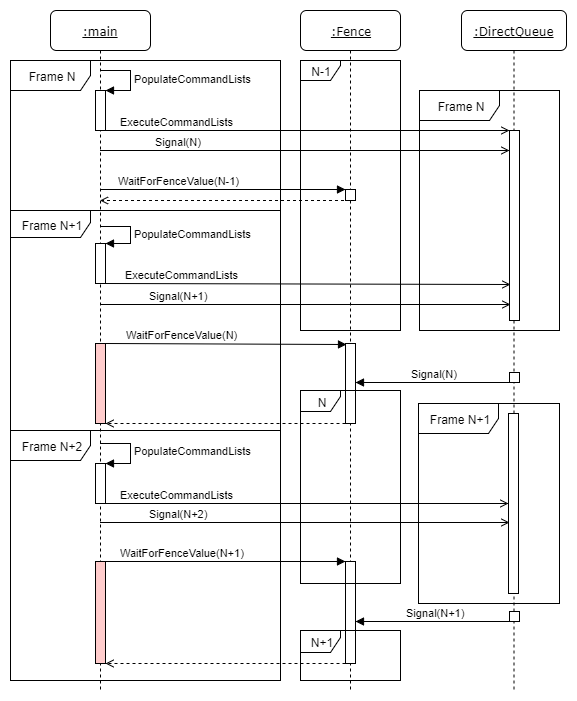

# DirectX12

### 01 Fence的框架
这个伪代码还是有点误导性的，因为其 _nextFrameID 实际上就是上一帧(double buffering的存在)

```cpp
// 01 检查fence值是否达到
method IsFenceComplete( _fenceValue )
    return fence->GetCompletedValue() >= _fenceValue
end method

// 02 阻塞CPU进程 直到达到fenceValue
method WaitForFenceValue( _fenceValue )
    if ( !IsFenceComplete( _fenceValue )
        fence->SetEventOnCompletion( _fenceValue, fenceEvent )
        WaitForEvent( fenceEvent )
    end if
end method

// 03 
method Signal
    _fenceValue <- AtomicIncrement( fenceValue )
    commandQueue->Signal( fence, _fenceValue )
    return _fenceValue
end method

// 04 Render
method Render( frameID )
    _commandList <- PopulateCommandList( frameID )
    commandQueue->ExecuteCommandList( _commandList ) // 执行 CommandList
    
    _nextFrameID <- Present()    // 画面present到屏幕上

    fenceValues[frameID] = Signal()    // 生成唯一Signal值 并添加fence(当前帧)

    // 这里虽然是_nextFrameID 但因为是double buffering，其实是上一帧
    WaitForFenceValue( fenceValues[_nextFrameID] ) // 等待上一帧渲染完成，才覆盖其buffer(理解为double buffering的另一个buffer更为恰当)

    frameID <- _nextFrameID
end method
```
</p>

这张图就明确标识清楚了 在CPU main里面的提交命令顺序和在GPU的 Queue里的执行顺序；是解耦的
然后由于Double Buffering的存在，CPU每次提交完一个frame，在开始下一个frame的时候，都需要等待上一个frame执行完毕(等待它空出来的buffer)。