# Vulkan Examples
Vulkan Examples系列记录SaschaWillems案例的学习过程，GitHub链接如下: 
https://github.com/SaschaWillems/Vulkan

Table of Content:
- [Vulkan Examples](#vulkan-examples)
  - [1-Knowledge](#1-knowledge)
    - [1 框架与流程](#1-框架与流程)
    - [2 Vulkan的同步](#2-vulkan的同步)
    - [3 TBDR架构](#3-tbdr架构)
  - [2-Examples](#2-examples)
    - [1-Triangle](#1-triangle)
    - [2-OffScreen](#2-offscreen)
    - [3-Deffered](#3-deffered)
    - [4-Input Attachments](#4-input-attachments)
    - [5-Instancing](#5-instancing)
    - [6-DefferedMultiSampling](#6-defferedmultisampling)
    - [7-MultiSampling](#7-multisampling)
    - [8-HDR](#8-hdr)
    - [9-Shadow Mapping](#9-shadow-mapping)
    - [10-Cascaded Shadow Mapping](#10-cascaded-shadow-mapping)
    - [11-Pipelines](#11-pipelines)
    - [12-Descriptor sets](#12-descriptor-sets)
    - [13-Dynamic uniform buffers](#13-dynamic-uniform-buffers)
    - [14-Push constants](#14-push-constants)
    - [15-Specialization constants](#15-specialization-constants)
    - [16-Texture mapping](#16-texture-mapping)
    - [17-Texture arrays](#17-texture-arrays)
    - [18-SubPass](#18-subpass)
    - [19-TextureCubeMap](#19-texturecubemap)
    - [20-TextureCubeMapArray](#20-texturecubemaparray)
    - [21-3D Texture](#21-3d-texture)
    - [22-Screen space ambient occlusion (SSAO)](#22-screen-space-ambient-occlusion-ssao)
    - [23-PBR](#23-pbr)
    - [24-PBR + IBL(Image Based Lighting)](#24-pbr--iblimage-based-lighting)
    - [25-Texture PBR + IBL](#25-texture-pbr--ibl)
    - [26-Image Compute Shader](#26-image-compute-shader)
    - [27-Compute Particles](#27-compute-particles)
    - [28-Compute RayTracing](#28-compute-raytracing)
    - [29-Compute Clothes](#29-compute-clothes)
    - [30-IndirectDraw (GPU Driven)](#30-indirectdraw-gpu-driven)
  - [3-VRS相关](#3-vrs相关)
    - [1-VRS](#1-vrs)
    - [2-GuangYu](#2-guangyu)

## 1-Knowledge

### 1 框架与流程
  ***代码结构:***  
  Vulkan Examples 88个案例都继承自VulkanExampleBase，同时在Base文件夹内也定义了如Devices，Buffer，SwapChain，Texture等功能。

  
  ***Vulkan流程:***  
  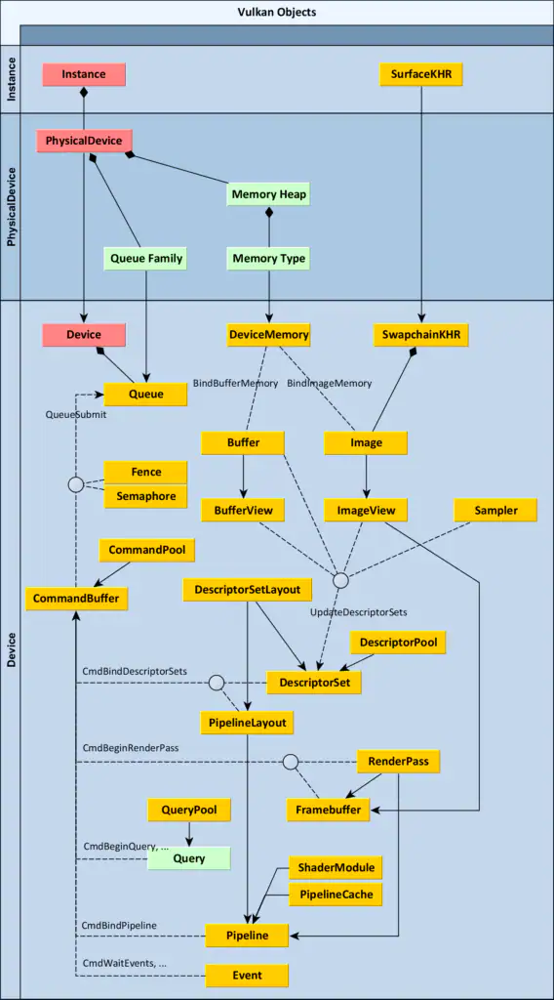

  每一帧的绘制可以分为以下几步: 
  vkAcquireNextImageKHR —— 从 SwapChains 获取下一个可以绘制到屏幕的Image 
  vkResetCommandPool/vkResetCommandBuffer —— 清除上一次录制的 CommandBuffer，可以不清但一般每帧的内容都可能发生变化一般都是要清理的。 
  vkBeginCommandBuffer —— 记录CommandBuffer 
  vkCmdBeginRenderPass —— 启用一个RenderPass，这里就连同绑定了一个 FrameBuffer 
  vkCmdBindPipeline —— 绑定Pipeline，Pipeline里就包含了Shader 
  vkCmdBindDescriptorSets —— 绑定 DescriptorSets，描述渲染管线中使用的资源(如Texture和一些)，同时需要给出 PipeLineLayout 
  vkCmdBindVertexBuffers & vkCmdBindIndexBuffer —— 绑模型，顶点和装配的Index 
  vkCmdDrawIndexed —— 绘制命令 
  vkCmdEndRenderPass —— 结束 RenderPass 
  vkEndCommandBuffer —— 结束 CommandBuffer 
  vkQueueSubmit —— 提交执行渲染任务 
  vkQueuePresentKHR —— 呈现渲染数据，这时候调用可能 vkQueueSubmit 还没执行完，但 Semaphores 会同步。

  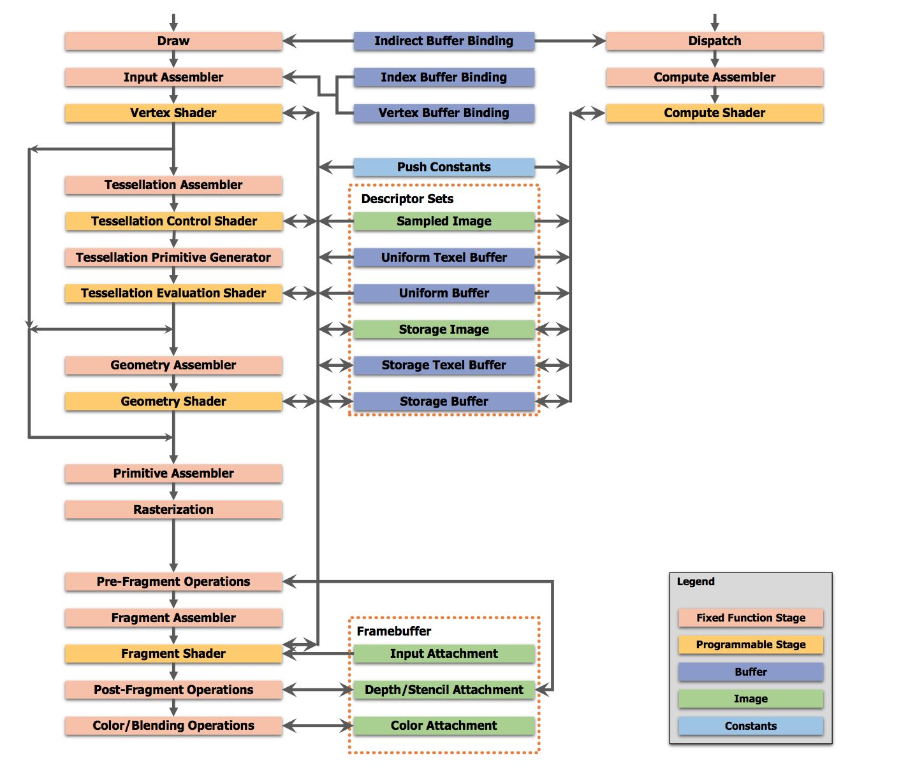

### 2 Vulkan的同步

  ***1-Queue & Command Buffer:***  
  Vulkan的同步主要还是在单独的VkQueue之间的，Queue和Queue之间的同步是一个比较小的部分。Queue是Command Buffer的提交点，用于渲染一帧图形或者执行一个计算任务。在一个GPU中可能有多个Queue，每个Queue可以独立的接收任务和执行命令，这为并行计算提供可能: 可以在不同的vkQueue上提交不同的Command Buffer, 这些任务将同时(或者几乎同时)在GPU上执行。 

  关于Queue为主体的概念，Command Buffer是提交到Queue上的，比如有两个Command Buffer先后提交到Queue上，我们不能假设在B在提交到Queue之前A就已经完全执行，如果B需要依赖A的结果，那我们就需要手动设置同步机制。 

  Queue上执行命令的overlap情况，Command Buffer提交到Queue上是 in-order的，但是Queue在执行命令的时候是 out-of-order的，因为在Submit了 Command buffer之后，Queue只看到一连串的线性命令流，所以我们不能假设Command buffer执行的时候自带同步和顺序，会存在overlap的情况(后提交的Command会覆盖前提交的Command)。 

  ***2-Pipeline Stage:***  
  Vulkan内有几种Command: 绘制命令(draw)，复制命令(copy/read)，计算命令(compute)。 在执行的时候都会按顺序通过一些列Pipeline Stage(就是渲染管线的各个阶段)。Queue上的同步是控制不同Command不同Pipelines Stage之间的同步。 

  TOP_OF_PIPE和BOTTOM_OF_PIPE 是两个不起实际作用的Pipeline Stage，Top标记的一个命令的开始而Bottom标记着一个命令的结束，如果希望设置Command A 执行完毕之后，Command B 才开始，那就让Command A的Bottom在 Command B 的Top开始之前执行完毕。 

  srcStageMask 表示需要等待这个Stage完成，还有其他的常用的Stage如ALL_COMMANDS_BIT 和 ALL_GRAPHICS_BIT。 
  dstStageMask 表示该部分需要等待srcStage工作执行完成之后才能执行。在barriers前的可以是out-of-order，在barriers后也可以是out-of-order，但这两个大块的执行顺序要是限定好的。 

  Event实现同步之间无关命令的Overlap: 
  1-vkCmdDispatch 
  2-vkCmdDispatch 
  3-vkCmdSetEvent(event, srcStageMask = COMPUTE) 
  4-vkCmdDispatch 
  5-vkCmdWaitEvent(event, dstStageMask = COMPUTE) 
  6-vkCmdDispatch 
  7-vkCmdDispatch 
  像是在这里，12在67前完成就ok了，4就很自由可以高效out-of-order执行。 

  ***3-Pipeline Stage & Render Pass:***  
  对于Compute和Transfer的Command，Pipelines Stage非常简单: 

    TOP_OF_PIPE
    DRAW_INDIRECT (for indirect compute only)
    COMPUTE / TRANSFER
    BOTTOM_OF_PIPE

  但是对于Graphics Pass就复杂了一些，还可以分成Geometry和Fragment两个部分: 

  Geometry: 

    DRAW_INDIRECT – Parses indirect buffers
    VERTEX_INPUT – Consumes fixed function VBOs and IBOs
    VERTEX_SHADER – Actual vertex shader
    TESSELLATION_CONTROL_SHADER
    TESSELLATION_EVALUATION_SHADER
    GEOMETRY_SHADER

  Fragmemt: 

    EARLY_FRAGMENT_TESTS
    FRAGMENT_SHADER
    LATE_FRAGMENT_TESTS
    COLOR_ATTACHMENT_OUTPUT

  重点注意的是，在Fragment里的几个Stage:Early-Z和Late-Z都有，其中在Early-Z里读取Depth attachment，我们需要设置一个loadOp去规定在读取Depth的时候是clear/Load/dont care，在Late-z中存储Depth，我们也可以一个StoreOp去规定在Store的时候是Store/Dont care。 
  同样的情况也适用于Color Attachment，要是我们不需要使用上一帧的attachment，load的时候就使用Clear用一个颜色覆盖，要是我们这一个attachment以后不需要被读取，那就在store的时候设置Dont care，不把这个attachment写入内存，这一能极大的节省带宽消耗。 
  COLOR_ATTACHMENT_OUTPUT 是color attachment完成的标志，要是需要等待一个color attachment渲染完成，那就用srcStageMask = COLOR_ATTACHMENT_OUTPUT！ 

  ***4-Early-Z 和 Late-Z:***  
  Early-Z是在 Fragment Shader之前做Depth-test，Late-z是在Fragment Shader之后做Depth-test。本质的区别是Early-Z可以进行效率提升，要是Early-Z都没通过那就不用进行Fragment Shader了。Early-Z虽好，却有局限，就是在Fragment Shader中不能改变深度值。比如一些树叶，建模是长方形的，但是通过Alpha Test让其有树叶的形状，这时候要是只有Early-Z的话，整个长方形就会遮盖后面的内容，而不是只有树叶，同理还有Alpha Blend。所以要是像Alpha Test和Aplha Blend这样的操作，就需要依赖Late-Z。 

  ***5-Memory!! availability & visibility***  
  Pipeline Barriers 内除了 execute Barriers 还有 memory barriers，是用来同步不同GPU之间的数据传输的。在Vulkan内还有一个非常重要的概念: 内存的可用性(availability)和可见性(visibility)。 
  举一个例子来区分: 

  1-可用性：假设我们有两个处理单元 A 和 B，A 将一些数据写入到它的本地缓存中。此时，这些数据对于 A 是"可用"的，因为 A 可以直接访问到这些数据。但是对于 B，这些数据还不是"可用"的，因为数据还没有被写入到 B 可以访问的地方（例如，主存或者共享缓存）。 

  2-可见性：继续上面的例子，假设 A 将数据从它的本地缓存写入到主存中，此时，这些数据对于 B 是"可用"的，因为数据已经被写入到 B 可以访问的地方。但是，如果 B 的缓存还没有被更新（也就是说，B 的缓存中还是旧的数据），那么新的数据对于 B 来说还不是"可见"的。只有当 B 的缓存被更新，新的数据才对 B "可见"。 

  这里涉及一个L1和L2缓存的概念，通常L1 Cache是每个处理器核心的本地缓存，对其他处理器核心不可见，而L2 Cache对所有处理器核心可见(可以理解成共享数据的缓存)。所以通常会通过Flushing和Invalidating这两个操作，让一个处理器核心的数据，为另一个处理器核心可用(avaliable)，然后可见（visible）。 

  1-使内存可用（Making memory available）—— Flushing（刷新）：这个操作通常指的是将本地缓存（如 L1 缓存）中的数据写回到主内存或更高级别的缓存（如L2缓存或主内存）中。这样做的目的是确保其他处理器（或核心）可以从主内存或更高级别的缓存中读取到最新的数据。这个过程通常在我们谈论 "Making memory available" 时发生。 

  2-使内存可见（Making memory visible）—— Invalidating（失效）：这个操作通常指的是标记本地缓存(L1)中的某些旧数据为无效，这样在下一次处理器尝试读取这些数据时，它将不从本地缓存中读取旧的数据，而是从更高级别的缓存（如 L2缓存或主内存）中加载最新的数据。这个过程通常在我们谈论 "Making memory available" 时发生。 

  ***6-Memory Barrier***  
  1-VkMemoryBarrier 
  通常在执行一个Pipeline Barriers内，有四件事是按顺序发生: 
    01 等待srcStageMask完成 
    02 让所有srcStageMask + srcAccessMask的内容available(Flushing——即写入L2或者Main Memory) 
    03 让刚刚的available memory变得visible(Invalidating即——让dstStageMask的本地缓存失效让它能读到srcStageMask写入的内容) 
    04 Unblock work in dstStageMask. 
  同时TOP_OF_PIPE 和 BOTTOM_OF_PIPE这两个阶段不执行内存访问，所以和这两个阶段相关的srcAccessMask 和 dstAccessMask 组合都是没有意义的，他们主要用于Execute Barriers。 
  同时也可以用两个PipelineBarriers让make available和make visible分开执行: 

    vkCmdDispatch – 写入到一个 SSBO, VK_ACCESS_SHADER_WRITE_BIT
    vkCmdPipelineBarrier(srcStageMask = COMPUTE, dstStageMask = TRANSFER, srcAccessMask = SHADER_WRITE_BIT, dstAccessMask = 0)
    vkCmdPipelineBarrier(srcStageMask = TRANSFER, dstStageMask = COMPUTE, srcAccessMask = 0, dstAccessMask = SHADER_READ_BIT)
    vkCmdDispatch – 从同一个 SSBO 中读取, VK_ACCESS_SHADER_READ_BIT

  2-VkBufferMemoryBarrier 
  限定了使用场景在Buffer，作者认为使用MemoryBarrier也是可以的。

  3-VkImageMemoryBarrier 
  ImageMemoryBarriers非常重要，因为涉及了ImageLayout，不同的ImageLayout可以认为是不同的图像存储格式，如VK_IMAGE_LAYOUT_COLOR_ATTACHMENT_OPTIMAL和VK_IMAGE_LAYOUT_DEPTH_STENCIL_ATTACHMENT_OPTIMAL，每种Image Layout都有着他们对应的使用场景下最佳的读写和存储性能。  
  ImageLayout的转换，是发生在Making memory available和Making memory available之间的，即发生在L2缓存上。可以理解成发生在L2缓存上的一个数据处理，对图像数据进行重排使其读取和存储效率更高。

  在Image的生命伊始：TOP_OF_PIPE能很好帮助ImageLayout转换，当我们刚刚分配了一个Image并希望使用它(比如在Compute阶段希望他的ImageLayout是GENERAL)，就希望能只对他进行布局转换而不进行任何其他操作，可以如下： 

    srcStageMask = TOP_OF_PIPE
    dstStageMask = COMPUTE
    srcAccessMask = 0 
    oldLayout = UNDEFINED 
    newLayout = GENERAL 
    dstAccessMask = SHADER_READ | SHADER_WRITE 

  这样就可以不需要进行任何等待和内存刷新，进行了布局转换。

  在Image的生命结束: 需要将ImageLayout转换为VK_IMAGE_LAYOUT_PRESENT_SRC_KHR才能呈现给SwapChain，所以需要借助BOTTOM_OF_PIPE进行高效转换； 
  srcStageMask = COLOR_ATTACHMENT_OUTPUT（假设我们在渲染过程中向交换链渲染） 

    srcAccessMask = COLOR_ATTACHMENT_WRITE
    oldLayout = COLOR_ATTACHMENT_OPTIMAL
    newLayout = PRESENT_SRC_KHR
    dstStageMask = BOTTOM_OF_PIPE
    dstAccessMask = 0

  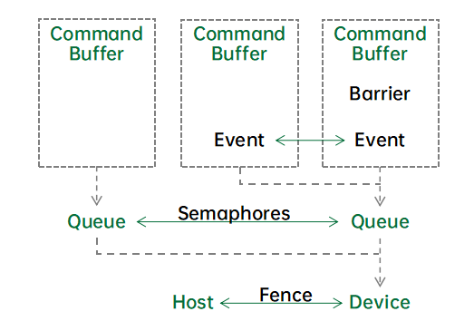

  ***7-Semaphores & Fences***  
  Semaphores主要用于GPU和GPU之间(Queue和Queue之间)的同步，而Fence主要是GPU和CPU之间的同步。如果Semaphores和Fences是一个PipelineBarriers，它们应该是一个ALL_COMMANDS_BIT，意味着是一个完全的Barriers； 

  明确GPU和CPU的工作范围: CPU主要负责创建和管理Vulkan的过程，包括创建各种RenderPass，Pipeline，UniformBuffer，CommandBuffer，然后把它Submit到GPU的Queue上。GPU则包括各种渲染和计算操作。 

  VkQueueSubmit的隐式内存保证: 例如，假设在 CPU 上创建了一个缓冲区并填充了一些数据，然后想在 GPU 上使用这些数据。在使用这些数据之前，你需要确保 GPU 可以看到 CPU 上的写入操作。在 Vulkan 中，你只需要在写入数据后调用 vkQueueSubmit，Vulkan 就会自动确保所有的内存写入操作对 GPU 可见，并不需要手动管理。 

  signal/wait semaphore 之间的隐式内存保证。Semaphore的作用相当于full memory barrier。比如我们有两个Queue，Queue1会Write一个Buffer，Queue2会read这个Buffer。semaphore可以作为vkQueueSubmit的参数传入，在Queue1 Submit时 signal semaphore，就相当于 Making this Buffer available，在Queue2 Submit时 wait semaphore，就相当于 Making this Buffer visible。所以在这个阶段不需要设置额外的Pipeline Barriers。 
  另外一个要注意的是在Queue2 vkQueueSubmit的时候，除了传入一个wait semaphore，还可以传入一个pDstWaitStageMask，这是一个Pipeline Stage，pDstWaitStageMask的stage在对应wait的semaphore被signal之前，是不会执行的。比如pDstWaitStageMask = FRAGMENT_SHADER_BIT，那Fragment Shader就需要等待Semaphore被signal之后才开始执行。可以这样理解 pDstWaitStageMask类似于Pipeline Barriers里的srcStageMask，是用于Execution dependency 的工具。 

  关于semaphore和fence的区别可以这样理解，semaphore和fence都是在vkSubmit的时候作为参数提交，但是semaphore是在GPU内下一个queue vksubmit的时候wait，而fence是CPU在wait，等这个queue的command buffer执行完之后开始后续的一些CPU操作。 

  需要注意在signal一个Fence的时候，和signal一个semaphore一样，它的内存也是flush到L2的Cache，还是只对GPU device available，并不是对CPU，要是需要让CPU也可见就得设置一个Pipeline Barriers让HOST也可用。 

  ***8-External subpass dependencies:***  
  这里主要讲的是外部和subpass怎么和External进行依赖，主要靠每个attachment的initialLayout和finalLayout，要是这个在subpass里面对于attachment设置不正确的话，则需要另外设置一个PipelineBarriers进行Image Layout的转换。比如对于Color Attachment，initialLayout通常是VK_IMAGE_LAYOUT_UNDEFINED，然后finalLayout通常是PRESENT_SRC_KHR。

  ***References:***  
  https://themaister.net/blog/2019/08/14/yet-another-blog-explaining-vulkan-synchronization/ 
  https://zhuanlan.zhihu.com/p/449222522  
  https://www.khronos.org/blog/understanding-vulkan-synchronization  
  https://github.com/KhronosGroup/Vulkan-Docs/wiki/Synchronization-Examples 
  https://www.lfzxb.top/early-z-test-and-late-z-test/

### 3 TBDR架构
  ***Why Vulkan*** 
  Vulkan的驱动更薄，在了解硬件架构和各个驱动特点的情况下，手动控制同步和带宽可以有效的提高游戏性能。

  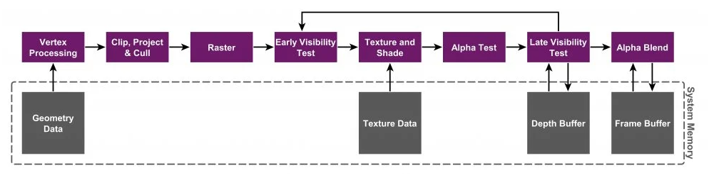

  ***IMR架构*** 
  IMR架构的GPU会直接将数据从系统内存（System Memory）中读取到渲染管线（Rendering Pipeline）。每个渲染命令都会立即执行，然后将结果写回到系统内存。这种方式的优点是简单直接，但是其缺点是，每个像素都需要读写System Memory上的Depth和Color buffer，频繁的访问会占用大量的内存带宽，成为瓶颈。

  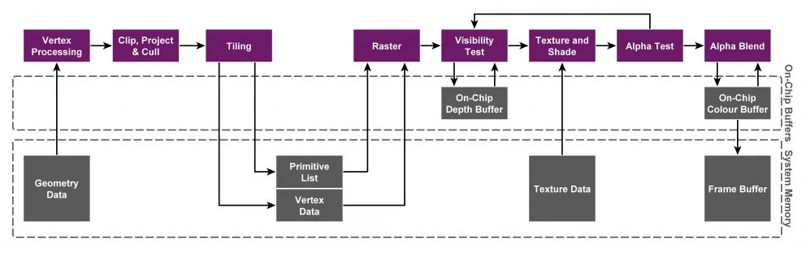

  ***TBR架构*** 
  TBR架构的GPU则采用了不同的方法。在这种架构中，屏幕被划分为多个小的区块（Tile），每个区块的大小通常是16x16或32x32像素。GPU会将每个区块的所有渲染数据加载到on-chip memory（片上内存）中，然后在on-chip memory中完成整个渲染过程，包括顶点处理、光栅化、像素处理等步骤。渲染完后再一块tile的渲染结果一次性写入系统内存。 
  这开辟的一个On-Chip Memory就十分关键，因为数据在GPU和On-Chip Memory之间传输开销可以忽略不计，节约了带宽降低了功耗，也降低了高带宽带来的发热问题。 

  另一种更底层的逻辑: 
  IMR不关注成本（即不关注效率），反复overdraw也无所谓，只求峰值性能大，把晶圆面积都给shader unit，牺牲效率 ，换得峰值性能，以及通过将shader unit数量最大化 换得更好的gpgpu向量计算通用性。 
  而TBR是最关注成本（最关注能效比），不追求峰值性能，但求最少的带宽 功耗使用量，追求的是最高效率。把晶圆面积都给片上帧缓冲，说白了就是放弃通用性和峰值性能，只针对图形渲染优化效率。 
  在架构上，IMR和TBR，是非常典型的的，“同一份半导体面积，到底是应该多给缓存，还是应该多给计算单元”，TBR选择前者，而IMR选择后者。 
  而缓存越大，虽然效率越高，但峰值性能低。而计算单元多，则峰值性能高，但效率下降。 
  不用电池的、独显的，肯定选IMR。但是要用电池、或追求性价比不舍得上独立显存（如游戏机），大概率会TBR。 

  ***区别的小例子*** 
  在手机上 Vulkan里开始一个Render Pass时，需要对每个Image Attachment设置一个Load Operation，这个Load Operation包括 Load、Clear、Dont Care。当我们需要用上一个Pass的Attachment的时候，就需要使用Load，从系统内存里加载数据。对于IMR结构来说，Load和Clear的区别不大，因为都是在System Memory内。但对于TBR来说，是不一样的因为它需要把上一个Pass的渲染数据从System Memory加载到自己的On-Chip Memory上，会带来带宽消耗，所以我们需要分情况设置是Clear还是Load，这能带来帧率和发热的优化，是属于优化管线降负载的过程。 
  另外一点，Mobile的GPU并不像PC的显卡那样拥有专用的显存，因为Mobile的GPU和CPU集成到同一芯片（也称为系统芯片，或SoC）上可以节省空间和能源。所以在Mobile的情况下，On-Chip memory是位于GPU上的一块很小的存储空间，可以类比与PC上的L1/L2 Cache。

  ***Vulkan内的SubPass*** 
  TBR并没有提供接口给用户自己Coding，都是硬件自己实现的，Andreno/Mali/PowerVR都对此有自己的优化。要是硬件支持的话，它会自己使用TBR进行渲染，不需要显示控制。 
  我们能做的就是合理的设置渲染流程来更好的利用TBR。在Vulkan内的一个体现就是合理运用SubPass来优化渲染流程。因为SubPass之间的 on-chip memory 可以共享的，这就是他们共享的本地memory。但是一个完整的Render Pass和另一个RenderPass之间的on-chip memory不是共享的，所以在一个Pass结束之后需要把它on-chip memory上的内容一起提交到System Memory上，才能被其他Pass可用，这个就类似Make Memory available。 
  所以合理使用SubPass能很好的利用TBR的效率。

  ***TBR架构能节省带宽和功耗*** 
  TBR节省带宽和功耗的典型例子是Deffered Rendering，要是在Vulkan里分成两个RenderPass，那GBuffer内的所有内容都是由第一个Pass先存储到System Memory上，然后再由第二个Pass去读取进On-Chip Memory，这就造成了很大的带宽消耗。而要是把GPass和LightingPass放在同一个RenderPass下的两个SubPass内，那GBuffer(一个Tile大小的)就会存储在On-Chip Memory上，LightingPass再去从On-Chip Memory上读取，这样的开销就可以基本忽略不计。 
  实测在Shader计算量一样，分辨率，帧率和其他条件都一样的情况下，用TBR的带宽能减少约25%，大约在5GB，CPU温度也可以降低大概5度，然后每消耗1GB的带宽大约会产生120mW的功耗(来自Arm开发者文档)。 

  ***带宽总量*** 
  思考一个问题，为什么都是Read和Write Depth和Color两个Buffer，IMR是多次Read/Write，TBR是一次Read/Write, 但是IMR的带宽会多很多。除了次数多，还存在大量的Overdraw，比如一个tile 16个像素，TBR一次性就write 16个像素，但是IMR可能在16个像素上有20次绘制，因为Overdraw。 

  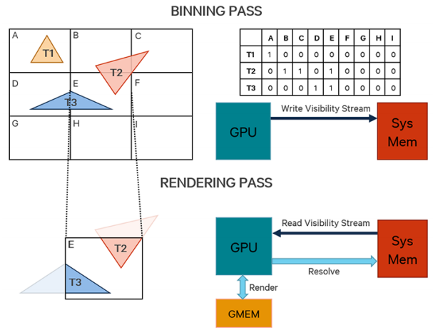

  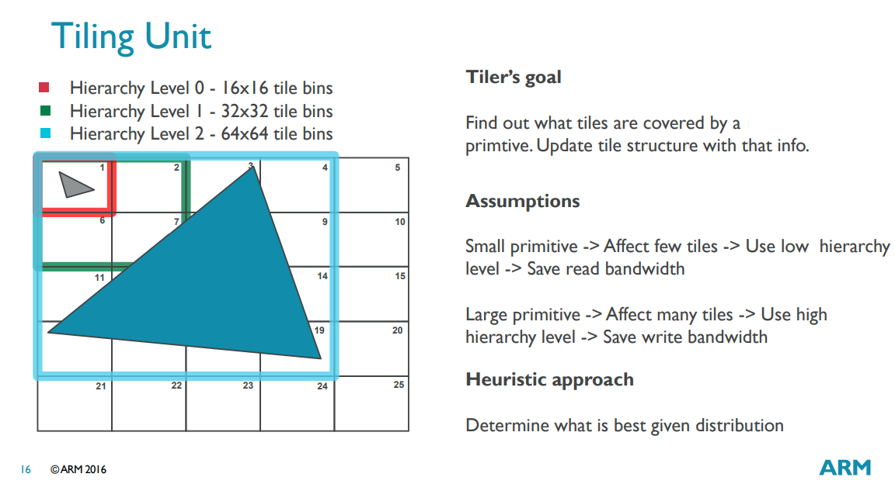

  ***Tiling阶段*** 
  TBR的优势都在后续的Per-Fragment操作，也就是(rasterize、depth-stencil test、PS以及blending的这些需要对framebuffer进行大量read-write的操作可以在on-chip的tile memory上进行)。但是在Vertex Shader阶段需要进行一个Tiling（也叫Binding）的操作，以确定每个primitive覆盖的tile后，再逐tile执行后面的操作。部分GPU（比如Mali）实际上会根据prmitive的大小用不同的hierarchy来组织tiling的过程和数据，这样就可以避免大三角形写入过多的tile buffer，造成不必要的带宽浪费。 
  所以在Vertex Shader结束之后会有一个内存写入的操作，来写入每个Tile覆盖了哪些Primitives，这是一个带宽开销。 

  ***Vertex Data管理*** 
  为了减少在VS阶段Fetch Geometry Data的开销，有两个做法: 
  1-根据顶点数据的用途，用合适的格式存储，比如能用8位的就不用32位。 
  2-Arm有一个IDVS(Intelligent Data Varying Shader)思路：就是VS先做Position的相关计算，等做完剔除之后，才回去Fetch其他顶点attribute的数据，做varying相关的计算(Varying变量是在VS和FS内传递数据的变量)。这种方式可以避免对那些最终不会出现在渲染图像中的顶点进行不必要的计算, 因为是做了剔除。 
  也就是实际上VS会执行2次，第一次执行一个specialized shader（可能只计算Position相关的信息），而第二次才会执行完整的VS，具体的考量可能是为了避免binning时额外的计算带来的开销和带宽，高通和Mali都做了类似的处理。所以这要求我们把Vertex Data分成两个vkbuffer，一个buffer存放position的值，一个buffer存放其他attribute。某些情况下，拆分之后的功耗能降低30%。 

  ***TBDR*** 
  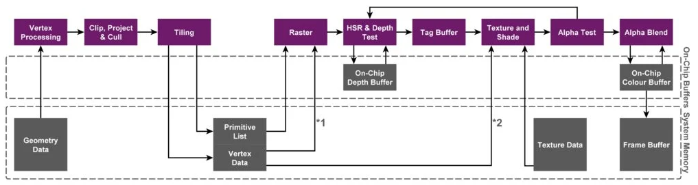

  TBDR最早指PowerVR的HSR，这个Deffered可以理解成 光栅化->Deffered->FragmentShader ,是在光栅化和FragmentShader之间的一个Deffered。用PowerVR的官方文档里面的话说就是：本来发生在这个阶段的Early-Z还是有OverDraw，但他们添加在TBDR里的HSR方法可以百分百消除Overdraw。

  首先看一下原本发生在这个阶段的Early-Z：Early-Z的主体是Fragment，但它是按Primitive从前往后渲染的。当发生物体交叉的情况下，比如先渲染了PrimitiveA的 m Fragment，当前这个m Fragment应该属于PrimitiveB，但是由于物体交错导致PrimitiveB在PrimitiveA后绘制，所以 PrimitiveA的 m Fragment能通过Early-Z并且后面会被PrimitiveB的 m Fragment覆盖。 
  HSR如何在Early-Z的基础上做Deffered？就是在Primitive A的Fragment m通过了Early-Z之后，不急着绘制，而是记录“Fragment m 应由Primitive A绘制”，然后去看其他Primitive，当当前Tile里的所有Primitive都遍历完之后，才绘制当前像素，确实可以100%保证不会有OverDraw。而且由于Tile-Based的优势，每个Tile内的Primitive并不会很多。 

  HSR的秘密在于除了on-chip Depth/Stencil外，还额外维护了一个Tag Buffer。Tag Buffer内包含了每个fragment 应该由哪个Primitive绘制的信息。

  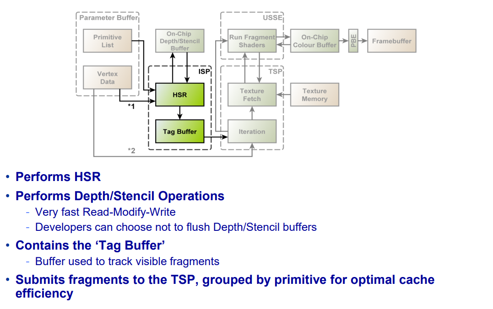

  回顾之前提到的 Vertex data管理，一般的Vertex Descriptions里是包含顶点的Position数据+UV数据+Normal数据在一个VertexBuffer内加载，但是在HSR中有一个类似Arm IDVS的操作，就是把Vertex的Position数据和用于纹理的Texture数据(UV / Normal)分成两个Buffer读取。在HSR阶段，只有position相关的数据会从DDR读取到GPU，而shading相关的数据（UV / Normal）只会在判定为visible后才读取到GPU，同时HSR后的visible primitives' depth直接写到on-chip depth buffer上，这样就节省了整体的带宽： 

  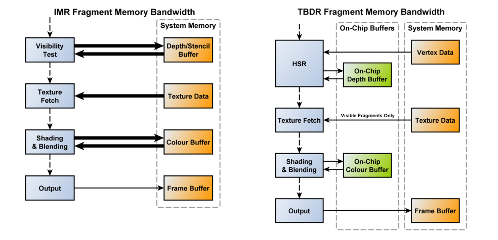

  这类技术最早被PowerVR引入，叫HSR（Hidden surface removal），后面又出现了高通的自己的LRZ（Low-Resolution Z），以及Mali的FPK（Forward Pixel Kill），但其实三者干的事情其实都差不多，那就是在tile上预先去除掉不可见的pixel（quads），来减少Overdraw。 

  ***References*** 
  https://docs.imgtec.com/starter-guides/powervr-architecture/topics/tile-based-deferred-rendering.html 
  https://zhuanlan.zhihu.com/p/259760974 
  https://zhuanlan.zhihu.com/p/565820105 
  https://developer.samsung.com/galaxy-gamedev/resources/articles/gpu-framebuffer.html 
  https://developer.apple.com/documentation/metal/metal_sample_code_library/rendering_a_scene_with_deferred_lighting_in_objective-c 
  https://zhuanlan.zhihu.com/p/131392827 
  https://developer.qualcomm.com/sites/default/files/docs/adreno-gpu/snapdragon-game-toolkit/gdg/gpu/overview.html#lrz 
  https://blog.imaginationtech.com/understanding-powervr-series5xt-powervr-tbdr-and-architecture-efficiency-part-4/ 
  http://powervr-graphics.github.io/WebGL_SDK/WebGL_SDK/Documentation/Architecture%20Guides/PowerVR%20Hardware.Architecture%20Overview%20for%20Developers.pdf 

## 2-Examples

### 1-Triangle
  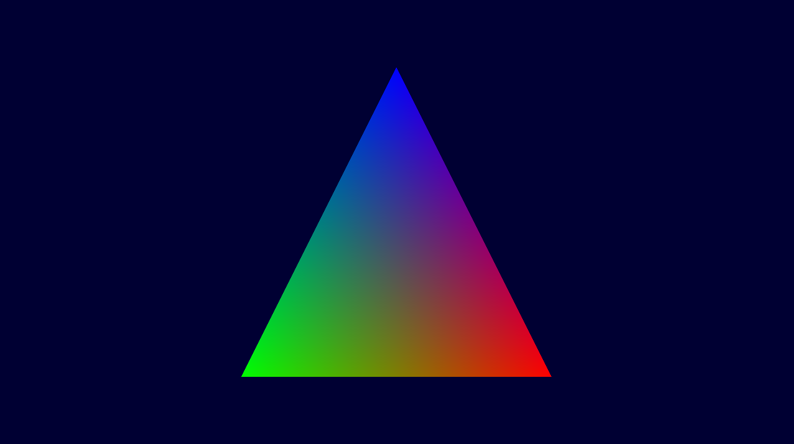

  ***应用场景:***  
  绘制了一个简单的三角形，并且加上了 fence 和 Semaphore 同步。

  ***RenderPass:***  
  只有一个RenderPass绘制三角形，有2个attachments(Color/Depth); 1个SubPass; 2个SubPass dependencies。 

  ***SubPass:***  
  只有一个SubPass，SubPass dependencies同步Color和Depth attachments的 EXTERNAL->SubPass0过程。

  ***FrameBuffer + Attachments:***  
  只有一个FrameBuffer，该FrameBuffer有2个ImageViews，分别是1个2Dcolor Attachment(SwapChain Image)和1个Depth Attachment的ImageViews。

  ***Synchronization:***  
  1-基础的两个semaphores：presentComplete 和 renderComplete。用于GPU各个Queue之间的同步。presentComplete；表示上一帧的present已经结束了，可以重新在这个Queue上submit一个command buffer去绘制。renderComplete在vkQueueSubmit运行完成后发出，表示render好了可以present到屏幕上，vkQueue PresentKHR需要等待这个信号量。 
  2-Fence是专注于做CPU与GPU之间的同步，在这里等待fence的目的是等待 Commmand Buffer 结束执行之后才能去reuse（重新加载数据和Bind各种Pipeline和Descriptor）。也就是Fence告诉GPU什么时候可以开始下一帧的操作。 
  3-SubPass Dependencies，如上所述。

  ***DescriptorSetLayout:***  
  只有一个DescriptorSetLayout:  
  Binding 0: Uniform buffer (Vertex shader) 

  ***DescriptorSet:***  
  只有一个DescriptorSet，更新Binding0内Uniform Buffer的内容。

  ***PipelineLayout:***  
  由DescriptorSetLayout创建，Binding都一致。

  ***Pipeline:***  
  只有一个pipeline，使用triangle.vert/frag shader去绘制三角形。

  ***Shader:***  
  triangle.vert/frag shader 绘制三角形。

  ***Uniform Buffers:***  
  Uniform Buffers 传入的只有MVP矩阵。

  ***Command Buffers:***  
  一个Command Buffer 只绘制一次，绘制三角形。

### 2-OffScreen
  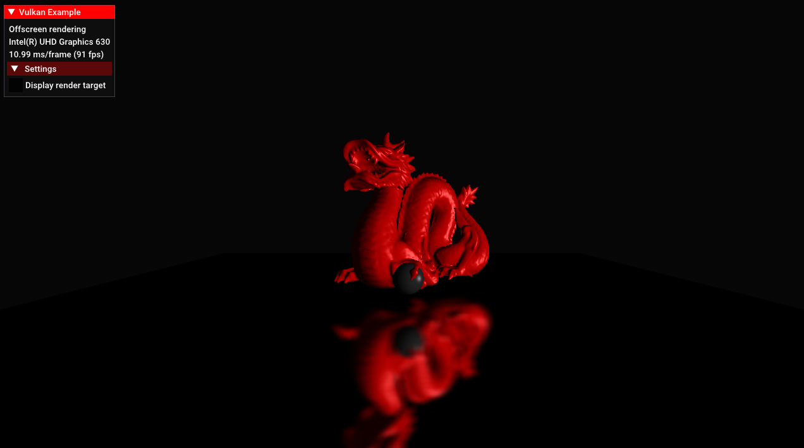

  ***应用场景:***  
  渲染了倒影的场景，一共两个Pass。第一个Pass渲染了Mirror的场景，第二个Pass再对Mirror的图像采样。

  ***RenderPass:***  
  有2个RenderPass: 第一个Pass用于渲染Offscreen场景。第二个Pass正常渲染。 
  1-Offscreen Pass有2个attachments(Color/Depth); 1个SubPass; 2个SubPass dependencies。 
  2-正常的Pass有2个attachments(Color/Depth); 1个SubPass; 2个SubPass dependencies。注意这个Pass完全是在基类 vulkanexamplebase.cpp 里定义的。

  ***SubPass:***  
  两个Render Pass都只有1个SubPass。Offscreen Pass内的SubPass dependencies是同步每个color attachments 从 EXTERNAL->SubPass0 和 SubPass0->EXTERNAL; 正常的Pass是分别同步Color和Depth attachments的 EXTERNAL->SubPass0过程。

  ***FrameBuffer + Attachments:***  
  有两个FrameBuffer，分别对应两个Pass。 
  1-Offscreen Pass的FrameBuffer有2个ImageViews，分别是1个2Dcolor Attachment和1个Depth Attachment的ImageViews。 
  2-Deffered Pass的 FrameBuffer有2个ImageViews，分别是1个2Dcolor Attachment(SwapChain Image)和1个Depth Attachment的ImageViews。

  ***Synchronization:***  
  1-基础的两个semaphores：presentComplete 和 renderComplete。用于GPU各个Queue之间的同步。presentComplete；表示上一帧的present已经结束了，可以重新在这个Queue上submit一个command buffer去绘制。renderComplete在vkQueueSubmit运行完成后发出，表示render好了可以present到屏幕上，vkQueue PresentKHR需要等待这个信号量。 
  2-SubPass Dependencies，如上所述。

  ***DescriptorSetLayout:***  
  有两种DescriptorSetLayout: Shaded Layout 和 Textured Layout  
  1-Shaded Layout 
  Binding 0: Vertex shader uniform buffer 
  2-Textured Layout 
  Binding 0: Vertex shader uniform buffer 
  Binding 1: Fragment shader image sampler (Mirror的Color) 
  Binding 2: Fragment shader image sampler (用不上，没有DescriptorSet update) 

  ***DescriptorSet:***  
  三种 Descriptor Set: Mirror / Model / Offscreen。Mirror用的是Texture的layout   Model和offscreen用的是Shaded的layout。 
  1-Mirror：用于采样OffScreen的color attachment。update Binding 0/1；  
  2-Model：用于在正常的Pass渲染龙。update Binding 0； 
  3-Offscreen: 用于在Offscreen的Pass渲染龙。update Binding 1;

  ***PipelineLayout:***  
  由两个DescriptorSetLayout创建，Binding都一致。

  ***Pipeline:***  
  有4个 Pipelines: Debug / Mirror / Phong / Offscreen 
  1-Debug：使用quad.vert/frag shader，用于debug的display只显示Mirror。 
  2-Mirror：使用mirror.vert/frag。 
  3-Phong：使用phong.vert/frag。 
  4-Offscreen：和Phong一样，使用phong.vert/frag。

  ***Shader:***  
  quad.vert/frag 是直接在Mirror Texture上采样颜色，也不做Blur，用于Debug模式。 
  mirror.vert/frag 是在Mirror Texture上采样颜色，并且做Blur有模糊的效果。 
  phong.vert/frag 是Phong模型，用于OffScreen和正常Pass的龙的渲染。

  ***Uniform Buffers:***  
  Uniform Buffers包括MVP矩阵和 Light Position。

  ***Command Buffers:***  
  两个Pass合在一个Command Buffer内，第一个Pass绘制Offscreen的龙，第二个Pass要是Debug模式就只绘制mirror，要是非Debug模式就绘制模糊之后的倒影和Phong的龙，也会绘制UI。

### 3-Deffered
  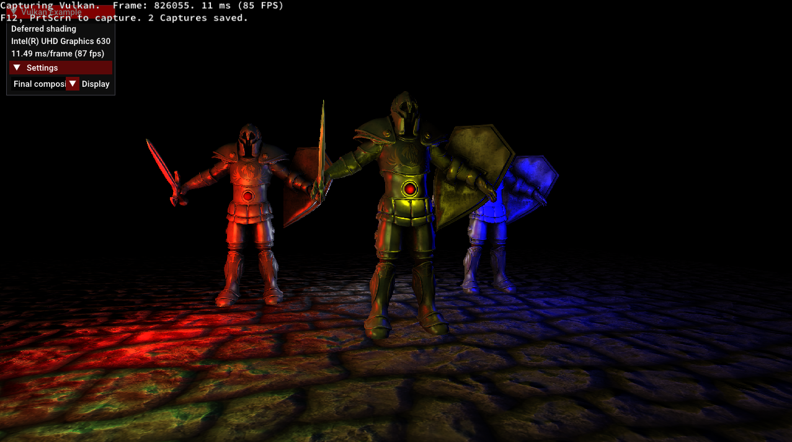

  ***应用场景:***  
  Deffered Rendering，一共两个Pass，第一个Pass忽略灯光去渲染 Position / Abedo / Normal 三个G-Buffer，第二个Pass再逐个计算光源的效果。实现了对多光源复杂场景的渲染效率的优化。

  ***RenderPass + Attachments:***  
  有2个RenderPass: 第一个Pass用于渲染G-Buffer，包括 Position/Abedo/Normal/Depth。第二个Pass逐光源计算光照效果。 
  1-G-Buffer Pass有4个attachments(Position/Abedo/Normal/Depth); 1个SubPass; 2个SubPass dependencies。 
  2-Deffered Pass有2个attachments(Color/Depth); 1个SubPass; 2个SubPass dependencies。注意这个Pass完全是在基类 vulkanexamplebase.cpp 里定义的。

  ***SubPass:***  
  G-Buffer Pass和Deffered Pass都只有1个SubPass。G-Buffer Pass内的SubPass dependencies是同步每个color attachments 从 EXTERNAL->SubPass0 和 SubPass0->EXTERNAL; Deffered Pass是分别同步Color和Depth attachments的 EXTERNAL->SubPass0过程。

  ***FrameBuffer + Attachments:***  
  有两个FrameBuffer，分别对应两个Pass。 
  1-G-Buffer Pass的FrameBuffer有4个ImageViews，分别是3个2Dcolor Attachment(Position/Abedo/Normal)和一个Depth Attachment的ImageViews。 
  2-Deffered Pass的 FrameBuffer有2个ImageViews，分别是1个2Dcolor Attachment(SwapChain Image)和1个Depth Attachment的ImageViews。

  ***Synchronization:***  
  1-基础的两个semaphores：presentComplete 和 renderComplete。用于GPU各个Queue之间的同步。presentComplete；表示上一帧的present已经结束了，可以重新在这个Queue上submit一个command buffer去绘制。renderComplete在vkQueueSubmit运行完成后发出，表示render好了可以present到屏幕上，vkQueue PresentKHR需要等待这个信号量。 
  2-一个offscreenSemaphore，需要等第一个Pass的Command Buffer 执行完之后，才轮到第二个Pass的Command Buffer submit。 
  3-SubPass Dependencies，如上所述。

  ***DescriptorSetLayout:***  
  只有1个DescriptorSetLayout，但是有5个Binding，后续可以分化出3种不同的DescriptorSet。 
  Binding 0：Vertex shader uniform buffer 
  Binding 1：Position texture（第2个Pass） / Scene colormap（第1个Pass） 
  Binding 2：Normals texture 
  Binding 3：Albedo texture 
  Binding 4：Fragment shader uniform buffer

  ***DescriptorSet:***  
  有3类DescriptorSet: Deferred Composition / Model / Background  
  1-Deferred Composition 用于第2个Pass渲染光照，只update Binding 1/2/3/4, 并不需要Vertex的信息。 
  2-Model 用于第一个Pass士兵的渲染，只update Binding 0/1/2。 
  3-Background 用于第一个Pass的地面渲染, 只update Binding 0/1/2。 
  之所以需要区分Model和Background，是因为他们的所需要读取的Texture不同。

  ***PipelineLayout:***  
  由DescriptorSetLayout创建，Binding一致。

  ***Pipeline:***  
  有两个Pipeline: Composition Pipeline 和 Offscreen Pipeline，都由PipelineLayout创建。 
  Offscreen Pipeline的Shader是 mrt.vert/frag 用于G-Buffers的渲染。 
  Composition Pipeline的Shader是 deferred.vert/frag 用于 光照的计算。

  ***Shader:***  
  mrt.vert/frag 主要是计算Position/Normal这两个attachments, abedo的attachment直接采样Texture。 
  deferred.vert/frag 主要是逐光源计算光照影响并且累加，xyz的位置值很好从Position Texture还原，因为Position贴图就直接是vec4(inWorldPos, 1.0)。

  ***Uniform Buffers:***  
  Uniform Buffers也分成两种: Offscreen 和 Composition。Offscreen的就包括了MVP矩阵，和三个士兵的instance实例化位置。Composition就包括6个光源的位置、颜色、半径，和viewPos。

  ***Command Buffers:***  
  两个Pass分别使用两个Command Buffer，用一个offscreenSemaphore去同步他们的submit顺序。第一个Command Buffer绘制G-Buffer，第二个Command Buffer绘制光照和加上UI。

### 4-Input Attachments
  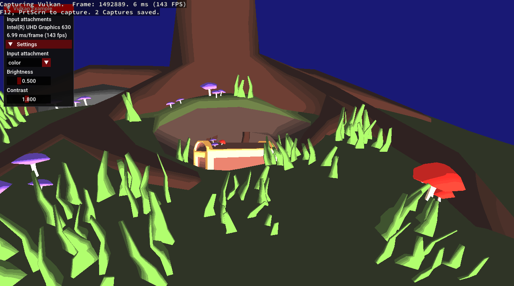

  ***应用场景:***  
  主要实现了在一个Pass内创建两个Subpass，然后第一个Subpass会输出Color和Depth两个Attachments，然后第二个Subpass会去采样第一个Subpass的结果然后加上对比度和亮度等效果。它可以使用在基础的图像后处理和image composition上。

  ***RenderPass + Attachments:***  
  只有一个RenderPass，包括了3个Attachments (0: Swap chain image color attachment / 1: Input color attachment / 2: Input Depth attachment); 2个SubPass; 3个SubPass dependencies。 
  第一个SubPass使用卡渲的方法绘制了Input color attachment 和 Input Depth attachment，输入进第二个SubPass读取后进行亮度和对比度等后处理，再输入到Swap chain image color attachment。

  ***SubPass:***  
  2个SubPass，作用如上。第一个SubPass的两个attachments(1,2) 作为Input Attachments记录在第二个subpass的Descriptions里。 
  3个SubPass Dependencies，作用主体都是color attachment。分别描述的是 EXTERNAL->SubPass0;SubPass0->SubPass1; SubPass0->EXTERNAL; 之间的依赖关系。

  ***FrameBuffer + Views:***  
  一个FrameBuffer下有3个Image Views，分别对应RenderPass下3个Attachments的View(0: Swap chain image color attachment / 1: Input color attachment / 2: Input Depth attachment)。

  ***DescriptorSetLayout:***  
  2个DescriptorSetLayout: attachmentWrite和attachmentRead，分别负责第一个SubPass里渲染color，depth，与第二个SubPass里读取input attachments进行后处理。 
  1-attachmentWrite 
  Binding 0: Uniform Buffer，这里是MVP变化矩阵。 
  2-attachmentRead 
  Binding 0: Color input attachment， 
  Binding 1: Depth input attachment， 
  Binding 2: Display parameters uniform buffer。 
  分别表示两个Input Attachments和通过UI传入的后处理参数。

  ***DescriptorSet:***  
  有2个DescriptorSet: attachmentWrite和attachmentRead, 由对应的DescriptorSetLayout创建，Binding一致。在此处update DescriptorSets的时候还需要根据Binding不同的格式准备		writeDescriptorSets 数据。

  ***PipelineLayout:***  
  有2个PipelineLayout: attachmentWrite和attachmentRead, 由对应的DescriptorSetLayout创建，Binding一致。

  ***Pipeline:***  
  有2个Pipline: attachmentWrite和attachmentRead，分别创建自PipelineLayout: attachmentWrite和attachmentRead。这两个Pipeline有分别绑定了对应的Shader: attachmentwrite.vert/frag 和 attachmentread.vert/frag。

  ***Shader:***  
  有2组shaders: attachmentwrite.vert/frag 和 attachmentread.vert/frag，分别负责两个SubPass。 
  attachmentwrite.vert/frag 实现了一个简单的卡渲效果，生成的 color 和 depth input attachments。 
  attachmentread.vert/frag 读取两个Inputattachments，并且用Uniforms内的后处理参数来进行曝光和对比度等效果调整。

  ***Uniform Buffers:***  
  包含两个内容，分别是给第一个SubPass的MVP矩阵，和给第二个SubPass的后处理参数。

  ***Command Buffers:***  
  draw了三次，第一次在SubPass0绘制整个场景，第二次在SubPass1做后处理的绘制，第三次绘制UI。

### 5-Instancing
  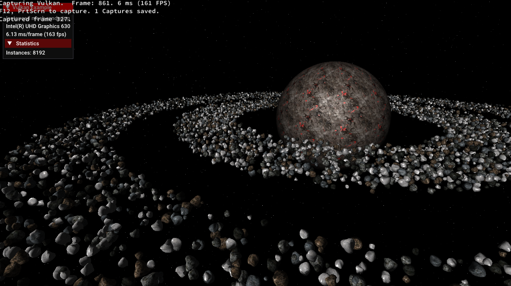

  ***应用场景:***  
  渲染过程中使用实例化（Instancing）功能来通过一个Vertex Buffer渲染多个相同Mesh的Instance，并且每个实例具有可变的参数和纹理（通过索引分层纹理）。 
  这个案例渲染了三种东西: 星空背景，星球，陨石群。

  ***RenderPass:***  
  用的是base基类里的RenderPass定义，来自vulkanexamplebase.cpp。有2个attachments(Color/Depth); 1个SubPass; 2个SubPass dependencies。

  ***SubPass:***  
  只有一个SubPass，SubPass dependencies是分别同步Color和Depth attachments的 EXTERNAL->SubPass0过程。

  ***FrameBuffer + Attachments:***  
  只有一个，FrameBuffer有2个ImageViews，分别是1个2Dcolor Attachment(SwapChain Image)和1个Depth Attachment的ImageViews。

  ***DescriptorSetLayout:***  
  值有一个DescriptorSetLayout，可以衍生出两个DescriptorSet: 
  Binding 0：Vertex shader uniform buffer  
  Binding 1：Fragment shader combined sampler Rock或者是Planet的texture sampler，共用的Binding

  ***DescriptorSet:***  
  Instance Rock和Planet分别有自己的DescriptorSet: 
  DescriptorSet.Instance Rock update Binding 0 / 1, Binding 1更新的是自己的Colormap；
  DescriptorSet.Planet update Binding 0 / 1，Binding 2更新的是自己的colormap；

  ***PipelineLayout:***  
  由DescriptorSetLayout创建，Binding一致。

  ***Pipeline:***  
  0-Pipeline是Instancing的关键，涉及到怎么把Instance Data绑定到Pipeline上的。 
  首先准备好的Instance Data数据要通过Staging Buffer的形式传入到GPU上。然后通过pipelineCI.pVertexInputStat传入的inputState包含了bindingDescriptions和attributeDescriptions。

  1-bindingDescriptions主要包含了Input Rate，用来说明这个Binding point的属性是面向每个Vertex和还是面向每个Instance的。这里分了两个Binding point，一个是per-Vertex的，一个是per-Instance的。 
  2-attributeDescriptions主要是说明每个attribute是对应哪个BindingPoint，这里有四个属性(Position / Normal / Texture coordinates / Color)就是per-Vertex的，另外四个(Position / Rotation / Scale / Texture array layer index纹理等级)就是per-Instance的，这些attribute会在shader里通过Location的形式呈现。

  
  一共有三个Pipeline，分别对应 Inatancing Rock / Planet /  Star field。 他们之间的区别就是Shader与inputState的不同。 
  1-Inatancing Rock Pipeline 使用了per-Vertex + per-Instance的inputState。Shader使用了instancing.vert/frag。 
  2-Planet pipeline 只使用了per-Vertex的inputState，因为没有Instancing。Shader使用了planet.vert/frag。 
  3-Star field Pipeline 没有采用per-Vertex 或者 per-Instance的inputState，因为它甚至不需要输入顶点。Shader使用了starfield.vert/frag。

  ***Shader:***  
  1-instancing.vert/frag。Instancing.vert对顶点进行了实例化转换，就是缩放旋转和Location，包括纹理的UV坐标缩放，并计算了法线向量和光线向量。Instancing.frag就是进行光照渲染。 
  2-planet.vert/frag，渲染一个球。 
  3-starfield.vert/frag，它使用了一个hash函数来生成噪声，并根据噪声值来确定星星的位置和颜色。

  ***Uniform Buffers:***  
  UBO包括View和Project矩阵，光源位置，和每个Rock的自转与公转速度。Instancing Data在cpp里自己定义。

  ***Command Buffers:***  
  先画Star Field，再画Planet，再画instacing Rock 再画UI。在绘制Instancing Rock的时候，需要通过vkCmdBindVertexBuffers命令，分别绑定Mesh Vertex 和 Instance Data。Instance Data的Buffer就是我们通过Staging Buffer提交到GPU的那些。在Triangle.cpp内在.cpp文件内自定义顶点并通过Staging Buffer提交的信息都需要这样的操作，还需要一个vkCmdBindIndexBuffer来绑定Index信息。

  ### 6-DefferedMultiSampling
  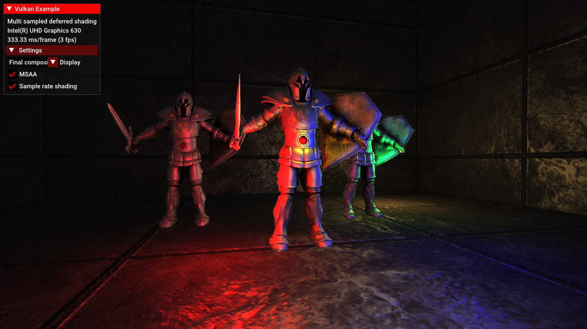

  ***应用场景:***  
  在Deffered Rendering的基础上添加了MultiSampling，和Sample Rate Shading两个操作。Sample Rate Shading一般搭配MSAA使用。在这种技术中，每个像素的采样率可以根据像素的位置和重要性进行动态调整，从而使不重要的像素采样率更低，重要的像素采样率更高，以提高性能。（有点类似VRS）

  此处更应该关心的是如何在Deffered Rendering里实现MSAA，因为在Deffered Rendering 里的MSAA存在Buffer极大和几何信息丢失的问题。这里好像采用的是一个SSAA，在OffScreen部分把G-Buffer都按照Sampling倍数存储，然后再在Deffered Pass中按SSAA的方法给每一个采样点做shading再求平均。所以这里是一个虚假的MSAA，其实是一个SSAA。

  ***RenderPass + Attachments:***  
  有2个RenderPass: 第一个Pass用于渲染G-Buffer，包括 Position/Abedo/Normal/Depth。第二个Pass逐光源计算光照效果。 
  1-G-Buffer Pass有4个attachments(Position/Abedo/Normal/Depth); 1个SubPass; 2个SubPass dependencies。这个Pass是在基类VulkanFrameBuffer.hpp里创建的, 但我们传入了AttachmentsInfo，规定了四个Attachments的大小都是Sample的大小(×4 ×16 ...)。 
  2-Deffered Pass有2个attachments(Color/Depth); 1个SubPass; 2个SubPass dependencies。注意这个Pass完全是在基类 vulkanexamplebase.cpp 里定义的，这个Pass的ColorAttachment是提交到SwapChain的，所以是原始的大小。

  ***SubPass:***  
  G-Buffer Pass和Deffered Pass都只有1个SubPass。G-Buffer Pass内的SubPass dependencies是同步每个color attachments 从 EXTERNAL->SubPass0 和 SubPass0->EXTERNAL; Deffered Pass是分别同步Color和Depth attachments的 EXTERNAL->SubPass0过程。

  ***FrameBuffer + Attachments:***  
  有两个FrameBuffer，分别对应两个Pass。 
  1-G-Buffer Pass的FrameBuffer有4个ImageViews，分别是3个2Dcolor Attachment(Position/Abedo/Normal)和一个Depth Attachment的ImageViews。 
  2-Deffered Pass的 FrameBuffer有2个ImageViews，分别是1个2Dcolor Attachment(SwapChain Image)和1个Depth Attachment的ImageViews。

  ***Synchronization:***  
  1-基础的两个semaphores：presentComplete 和 renderComplete。用于GPU各个Queue之间的同步。presentComplete；表示上一帧的present已经结束了，可以重新在这个Queue上submit一个command buffer去绘制。renderComplete在vkQueueSubmit运行完成后发出，表示render好了可以present到屏幕上，vkQueue PresentKHR需要等待这个信号量。 
  2-一个offscreenSemaphore，需要等第一个Pass的Command Buffer 执行完成之后完之后，才轮到第二个Pass的Command Buffer submit。 
  3-SubPass Dependencies，如上所述。

  ***DescriptorSetLayout:***  
  只有1个DescriptorSetLayout，但是有5个Binding，后续可以分化出3种不同的DescriptorSet。 
  Binding 0：Vertex shader uniform buffer 
  Binding 1：Position texture（第2个Pass） / Scene colormap（第1个Pass） 
  Binding 2：Normals texture 
  Binding 3：Albedo texture 
  Binding 4：Fragment shader uniform buffer

  ***DescriptorSet:***  
  有3类DescriptorSet: Deferred Composition / Model / Background  
  1-Deferred Composition 用于第2个Pass渲染光照，只update Binding 1/2/3/4, 并不需要Vertex的信息。 
  2-Model 用于第一个Pass士兵的渲染，只update Binding 0/1/2。 
  3-Background 用于第一个Pass的地面渲染, 只update Binding 0/1/2。 
  之所以需要区分Model和Background，是因为他们的所需要读取的Texture不同。

  ***PipelineLayout:***  
  由DescriptorSetLayout创建，Binding一致。

  ***Pipeline:***  
  Pipeline是MSAA的关键。有四个Pipeline，全部开启了MSAA。在MultisampleState内设置的，noMSAA的是通过把SampleCount设置=1实现:  
  1/2 deferred Pipeline，deferredNoMSAA Pipeline，是进行有或者没有MSAA的deffered rendering，共用deferred.vert/frag 的Shader。这两个Pipeline比起没有MASS的Deffered多了一个specializationInfo，其中的specializationData指定了SampleCount采样数。有MSAA的就直接指定SampleCount，没有MSAA的就让specializationData=1。 
  3/4 Offscreen Pipeline，offscreenSampleShading Pipeline是用于G-Buffers的渲染，共用mrt.vert/frag Shader。

  其中开启Sample Rate Shading需要设置一个minSampleShading = 0.25f; minSampleShading是Sample Rate Shading（采样率着色）技术中的一个参数，用于指定每个像素的最小采样率。它的值范围在0到1之间，表示像素的最小采样率与像素覆盖样本数的比率。例如，如果像素覆盖了4个采样点，而minSampleShading的值为0.25，则最终采样率为1（4*0.25）（这块是个人理解 有待深入研究）。

  在Vulkan中，硬件和API会自动处理MSAA和Sample Rate Shading操作，而不需要应用程序编写自己的代码来实现。应用程序需要做的是设置相应的参数，例如minSampleShading和SampleCount，并在使用Vulkan绘图管线时启用Sample Rate Shading功能，就可以了。

  ***Shader:***  
  mrt.vert/frag 主要是计算Position/Normal这两个attachments, abedo的attachment直接采样Texture。 
  deferred.vert/frag 里面有个关键的手动解析的操作。主要是逐光源逐像素计算光照影响并且累加，其中每个像素，又会进行MASS的多重采样，然后求各个采样点的平均值，用texelFetch()函数去采样，需要输入当前采样点的index，至于比如说一个像素需要采样8次，每个采样点的具体位置在哪，这个是VulkanAPI决定的 我们只需要确定采样的次数，以及每次用texelFetch()采样时输入当前的index就可以采样到具体的位置。采样点布局可以用VK_SAMPLE_COUNT_8_BIT/VK_SAMPLE_COUNT_16_BIT确定。

  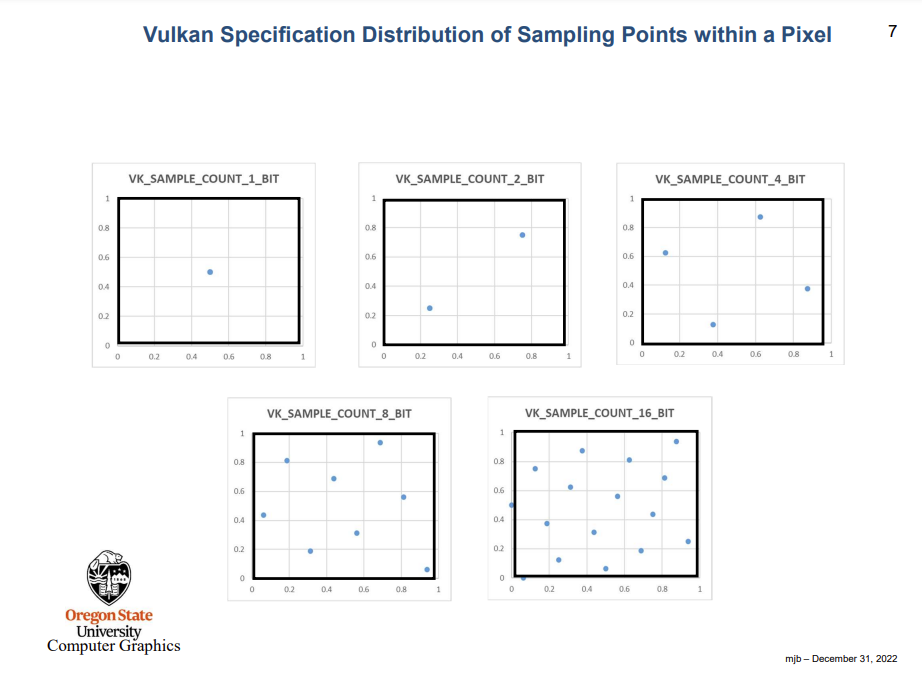

  ***Uniform Buffers:***  
  Uniform Buffers也分成两种: Offscreen 和 Composition。Offscreen的就包括了MVP矩阵，和三个士兵的instance实例化位置。Composition就包括6个光源的位置、颜色、半径，和viewPos。

  ***Command Buffers:***  
  两个Pass分别使用两个Command Buffer，用一个offscreenSemaphore去同步他们的submit顺序。第一个Command Buffer绘制G-Buffer，第二个Command Buffer绘制光照和加上UI。

  ***References:***  
  https://web.engr.oregonstate.edu/~mjb/vulkan/Handouts/MultiSampling.1pp.pdf

### 7-MultiSampling
  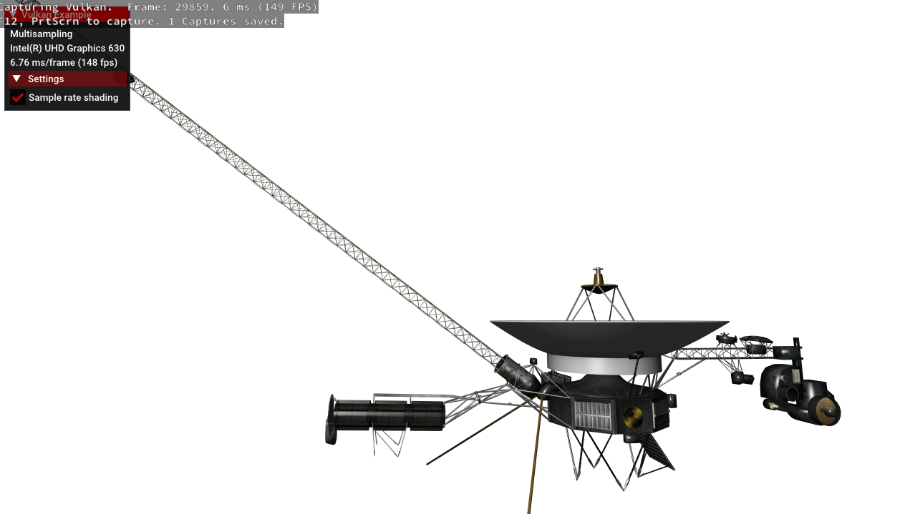

  ***应用场景:***  
  在一个简单渲染场景实现MSAA，和Sample Rate Shading。只是在Vulkan里实现MSAA的话操作非常简单，只需要在Pipeline里通过VkPipelineMultisampleStateCreateInfo设置一个MultisampleState即可，Vulkan 会自动处理多重采样的过程，无需手动编写额外的 MSAA 代码。

  ***MSAA:***  
  最直接的抗锯齿方法就是SSAA（Super Sampling AA）。拿4xSSAA举例子，假设最终屏幕输出的分辨率是800x600, 4xSSAA就会先渲染到一个分辨率1600x1200的buffer上，然后再直接把这个放大4倍的buffer下采样致800x600。这种做法在数学上是最完美的抗锯齿。但是劣势也很明显，光栅化和着色的计算负荷都比原来多了4倍，render target的大小也涨了4倍。 
  MSAA（Multi-Sampling AA）则很聪明的只是在光栅化阶段，判断一个三角形是否被像素覆盖的时候会计算多个覆盖样本（Coverage sample），但是在pixel shader着色阶段计算像素颜色的时候每个像素还是只计算一次。 

  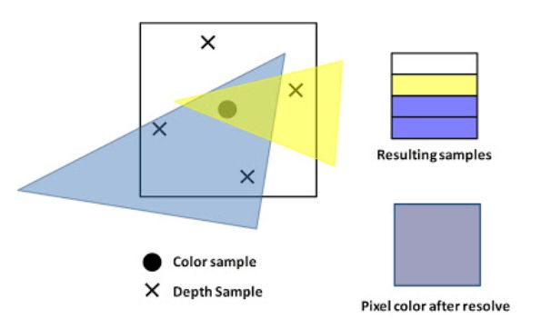 

  以上述场景为例子，一个像素里被两个三角形覆盖，我们先渲染蓝色的三角形再渲染黄色的三角形。

  step1: 光栅化阶段，对四个X位置的Sample执行三角形覆盖判断，在一个四倍分辨率大小的coverage mask中记录每个Sample被覆盖的情况。 
  step2：fragment shader阶段，在像素中心圆点处执行像素着色器。该点的位置、深度、法线、纹理坐标等信息由三角形三个顶点重心插值得到。图中采样到蓝色的值。 
  step3：对四个Sample执行模板测试与深度测试，并将测试通过的Sample数据写入四倍分辨率的模板缓冲与深度缓冲。每个Sample都拥有自己的深度值，依然是重心插值得到。 
  step4：发现左下两个Sample通过了深度测试，并且coverage mask为1，因此将紫色复制到这两个Sample对应的颜色缓冲中（依然是每个Sample一个颜色，共四倍大小）。其他两个Sample暂为背景色。 
  step5：重复上述流程绘制第二个黄色三角形，将像素着色获得的黄色复制到右上角的Sample中。 
  step6：所有绘制结束之后，通过一个resolve阶段，将四个Sample的颜色插值获得最终输出的像素颜色。及Blue * 0.75 + Yellow * 0.25

  在这个特殊案例里，一个Pixel有两个三角形覆盖，并且都通过了深度测试和模板测试，so要进行两次fragment shader。但是如果只有一个三角形覆盖的像素，比如在边缘区域，也是只需要进行一次fragment shader然后resolve一下就能得到最终的颜色值。 
  but what's the price? 可以看到在MSAA过程中虽然只用进行一次的fragment shader，但是coverage mask(统计覆盖率的)，深度缓冲，模板缓冲，以及Sample的颜色缓冲，都是以Sample为对象的四倍大小。所以代价就是空间，着也是为什么MSAA很难应用在Deffered Rendering内，因为Buffer成倍的增长给带宽带来了巨大的压力。

  ***MSAA in Deffered Rendering:***  
  1-MSAA本质上是一种发生在光栅化阶段的技术，也就是几何阶段后，着色阶段前，用这个技术需要用到场景中的几何信息。而Deffer Rendering事先把所有信息都放在了GBuffer上，Shading的时候已经丢失了顶点的几何信息。注意在Lighting Pass使用的是经过光栅化后的PositionTexture，记录的是每一个像素的位置，而不是我们在vertex Shader阶段的几何信息。但是做MSAA恰好需要顶点的几何信息去判断Sample点是否在某个三角形内。 
  2-上文提到的成倍的Buffer带来的带宽压力，要是8×Sample的话Buffer的大小就接近8倍是巨大的带宽压力。 
  但是在上一个案例里有 MSAA in Deffered Rendering的实现，可以看看在那个Vulkan案例中是怎么实现的。(其实那个案例也没有实现Deffered MASS，它实现的是一个SSAA)

  ***On Chip MSAA:***  
  Tile-Based 架构能极大的提高速度，原因是它把一个完整的frame buffer分为若干的tile，在一个tile渲染完成前GPU只会读写 on chip memory。等一个Tile都渲染完成之后才会将on chip memory里的内容一次性写入内存。 
  On chip memory 非常珍贵。旗舰级的 Adreno 630 亦只有 1 MiB 的on chip Memory。由于打开 MSAA 需要更多空间来保存渲染结果，GPU 只能够透过缩小 Tile 的尺寸来适应 On-Chip Memory 的固定大小。进行渲染的 Tile 数量会因此而增加。换言之，从 System Memory 传送 Raster 数据到 GPU / 把渲染结果从 GPU 传回 Framebuffer 的次数会增加，为带宽造成压力及延迟 (Latency)。这也是成倍缩小的效率。 

  ***RenderPass + Attachments:***  
  只有一个Render Pass，有3个Attachments(1-Sample大小的Color Attachment，用于渲染Sample Buffer；2-原始大小的Color Attachment，用于swapchain的交换；3-Sample大小的Depth，用于Depth Test)，有两个SubPass dependencies。
  
  ***SubPass:***  
  只有一个SubPass，两个SubPass dependencies，用于EXTERNAL->SubPass0的Color与Depth的同步。

  ***FrameBuffer + Attachments:***  
  只有一个FrameBuffer，其有三个ImageView，分别是 1-Sample大小的Color Attachment，用于渲染Sample Buffer；2-原始大小的Color Attachment，用于swapchain的交换；3-Sample大小的Depth，用于Depth Test 这三个Attachments的Image Views。

  ***DescriptorSetLayout:***  
  只有一个DescriptorSetLayout, 并且这个案例不需要采样任何Texture所以只有一个Binding: 
  Binding0: Vertex shader Uniform Buffer

  ***DescriptorSet:***  
  只有一个DescriptorSet，更新Binding 0。

  ***PipelineLayout:***  
  由DescriptorSetLayout创建，Binding一致。

  ***Pipeline:***  
  Pipeline是MSAA的关键，在这里有两个Pipeline都是有MSAA的，但是一个有Sample Shading，一个没有Sample Shading。 
  需要在VkPipelineMultisampleStateCreateInfo中设置MultisampleState来开始MSAA，然后通过multisampleState.sampleShadingEnable来开启sampleShading。共用mesh.vert/frag Shader。 

  ***Shader:***  
  这里只有一组Shader: mesh.vert/frag Shader。一个简单的Phong模型光照渲染。

  ***Uniform Buffers:***  
  Uniform Buffers只有Projection 和 Model矩阵，还有Light的Position。

  ***Command Buffers:***  
  只有两个部分: Draw Model 和 Draw UI。

  ***References:***  
  https://www.zhihu.com/question/20236638/answer/44821615 
  https://zhuanlan.zhihu.com/p/135444145 
  https://docs.nvidia.com/gameworks/index.html#gameworkslibrary/graphicssamples/d3d_samples/antialiaseddeferredrendering.htm 
  https://zhuanlan.zhihu.com/p/32823370 
  https://zhuanlan.zhihu.com/p/415087003 
  https://gwb.tencent.com/cn/tutor/summary/2 

### 8-HDR
  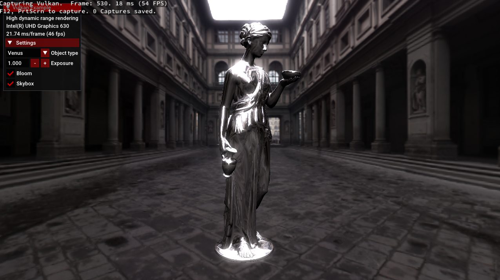

  ***应用场景:***  
  Implements a high dynamic range rendering pipeline using 16/32 bit floating point precision for all internal formats, textures and calculations, including a bloom pass, manual exposure and tone mapping. 
  实现一个高动态范围（High Dynamic Range，HDR）渲染管线，使用16/32位浮点精度来处理内部的格式、纹理和计算，包括进行泛光处理（bloom pass）、手动曝光（manual exposure）和色调映射（tone mapping） 
  在传统渲染中，颜色值通常使用8位整数表示，范围在0到255之间。而在高动态范围渲染中，颜色值使用16或32位浮点数表示，可以表示更大的范围和更高的精度，从而呈现出更真实、更丰富的光照效果。 
  在此处16/32位的浮点精度是在创建RenderPass的Attachments的时候就确定了，然后Bloom、Exposure、ToneMapping都是在Shader里实现的。

  ***RenderPass + Attachments:***  
  有三个RenderPass: 
  1-OffScreen Pass，渲染背景和维纳斯雕像，使用了32位的浮点图像精度，有三个attachment(渲染的图像，高亮区域，Depth)。有一个SubPass和两个SubPass Dependencies。 
  2-Bloom Filter Pass，用来渲染bloom，这里有两次Bloom分别是不同的方向，使用Bloom Filter Pass的是第一次方向=0的Bloom，只输出一张Color Attachment, 第二次方向=1的Bloom在Composition Pass中实现。也是由一个SubPass和两个SubPass Dependencies 
  3-Composition Pass，使用的是基类 vulkanexamplebase.cpp 里定义的的默认Render Pass。有Color和Depth两个attachment和两个SubPass Dependencies。

  ***SubPass:***  
  每个RenderPass都有一个SubPass。 
  OffScreen Pass 和Bloom Filter Pass 内的SubPass dependencies是同步每个color attachments 从 EXTERNAL->SubPass0 和 SubPass0->EXTERNAL; Composition Pass是分别同步Color和Depth attachments的 EXTERNAL->SubPass0过程。

  ***FrameBuffer + Attachments:***  
  有三个FrameBuffer，分别对应三个Pass； 
  1-OffScreen Pass，有三个Image View分别对应三个attachments(渲染的图像，高亮区域，Depth)。 
  2-Bloom Filter Pass，只有一个Image View对应一个attachment。 
  3-Composition Pass，有两个Image View分别对应SwapChain Image和Depth。

  ***DescriptorSetLayout:***  
  有三种DescriptorSetLayout: 

  1-models,用来渲染维纳斯和skybox 
  Binding 0: Vertex Uniform Buffer 
  Binding 1: Image Sampler，需要用来采样Skybox 
  Binding 2: Fragment Uniform Buffer

  2-bloomFilter, 用来做第一次Bloom 
  Binding 0: Image Sampler，场景图像，其实完全没用上 
  Binding 1: Image Sampler，高光区域的Image

  3-Composition, 用来做第二次Bloom和合成 
  Binding 0: Image Sampler，场景图像 
  Binding 1: Image Sampler，第一次Bloom的图像

  ***DescriptorSet:***  
  有四个DescriptorSet: 
  1-object，用来渲染维纳斯，使用DescriptorSetLayout.models。 
  2-skybox，渲染skybox，使用DescriptorSetLayout.Model。 
  3-Bloom filter，使用DescriptorSetLayout.bloomFilter。 
  4-composition，使用DescriptorSetLayout.composition。

  ***PipelineLayout:***  
  由DescriptorSetLayout创建，Binding也一致。

  ***Pipeline:***  
  有5个Pipeline: 
  1-composition，使用composition.vert/frag， 用于最后的Bloom组合，renderPass是CompositionPass。 
  2-bloom[0]，使用bloom.vert/frag，是第二次的Bloom，renderPass是CompositionPass。 
  3-bloom[1]，使用bloom.vert/frag，是第一次的Bloom，方向和第二次不一样，renderPass是BloomPass。 
  4-skybox，使用gbuffer.vert/frag，渲染天空盒，renderPass是OffscreenPass。  
  5-reflect，使用gbuffer.vert/frag，渲染维纳斯，renderPass是OffscreenPass。
 

  ***Shader:***  
  有三组Shader: 
  1-composition.vert/frag：非常简单，只采样了一次Offscreen图像，甚至连叠加都是靠后面的bloom的shader的DrawCall绘制后叠加。 
  2-bloom.vert/frag：做了一个方向的Bloom。 
  gbuffer.vert/frag：采样了skybox，计算了反射，用了Reinhard法的ToneMapping，还取出了高亮的范围给Bloom用。是最关键的一组Shader。 

  ***Uniform Buffers:***  
  Uniform Buffers包括给Vertex的MVP矩阵，也有给Fragment的Exposure参数。

  ***Command Buffers:***  
  就是按着三个Pass的流程，Skybox，Object，Bloom第一次，Bloom第二次，Composition。

### 9-Shadow Mapping
  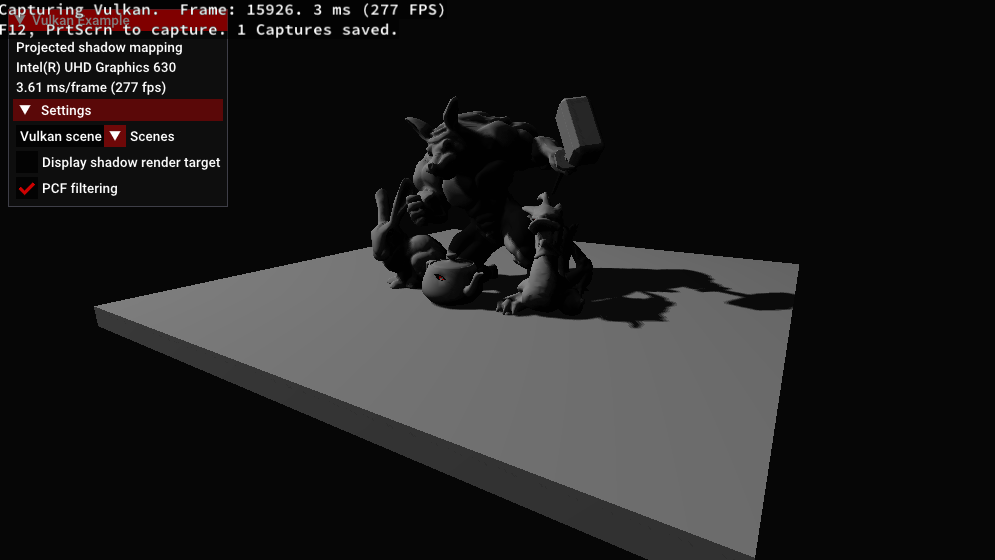

  ***应用场景:***  
  用Shadow Mapping方法生成Shadow，并且使用Bias和Slope系数去动态调整Bias，最后再加上一个PCF来生成软阴影。

  ***Shadow Mapping:***  
  Shadow Mapping经典的两个Pass: 第一个从光源出发的Depth only Pass，计算从光源看过去的Depth Map，第二个Pass从Camera出发去计算从Camera看过去的Depth Map。然后把Camera的Depth Map的深度值通过一个变化矩阵变化得到Light方向的深度值，然后再和Light的Depth Map比较。要是Camera能看到但是Light看不到的就是Shadow。

  ***Bias:***  
  因为Light的ShadowMap不是垂直于地面 并且由于像素的限制每一个像素内部都只有一个深度值，所以会带来摩尔纹。 
  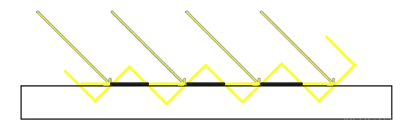 
  最好的解决办法就是让Light方向的ShadowMap深度值加一个Bias，这样多少能让这些误差的地方都能被照亮。 
  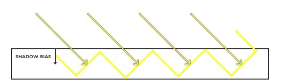 
  加Bias有个弊端就是会有有些物体接近承影面的地方的阴影会消失，比如人物的脚的阴影。这时会有就需要动态的调整Bias值，本案例使用的是Slope系数，参考斜率，当光照和场景的接触越接近90度，就可以给更小的Bias，越接近地平线说明误差越大，就可以更大的Bias。 
  学术界有一种避免Bias的方法: Second-Depth or Mid-Depth,就是在计算光源的ShadowMap的时候不使用第一个Depth，而使用第二深的Depth或者他们的中间值，这样不需要Bias。举个例子就是手动加厚了地板让Light的Depth值更大。但这个在工业界挺难落地的。

  ***Soft Shadow:***  
  PCF: Percentage-Closer Filtering，简单理解就是用一个卷积核去过滤硬阴影的边缘。缺点是卷积核大小固定并且增加了开销。 
  PCSS：Percentage-Closer Soft Shadows，相比PCF的改进是动态决定了卷积核的大小，让其能在靠近物体的时候更hard，在远离物体的时候更soft，符合人眼的观察效果。 

  ***RenderPass + Attachments:***  
  有两个RenderPass: 
  1-Depth Only Pass：渲染光源的Depth Map，只有一个Attachment就是Depth。只有一个Subpass，两个Subpass Dependencies。 
  2-正常的Pass: 渲染物体和阴影，使用的是基类 vulkanexamplebase.cpp 里定义的的默认Render Pass。有Color和Depth两个attachment和两个SubPass Dependencies。

  ***SubPass:***  
  两个RenderPass分别只有一个SubPass: 
  Depth Only Pass内的SubPass dependencies是同步depth attachments 从 EXTERNAL->SubPass0 和 SubPass0->EXTERNAL; 正常Pass是分别同步Color和Depth attachments的 EXTERNAL->SubPass0过程。

  ***FrameBuffer + Attachments:***  
  有两个FrameBuffer，分别对应的是两个RenderPass。Depth Only的Frame Buffer只有一个 Light Depth Map的Image View。正常的Pass的FrameBuffer，有两个Image View分别对应SwapChain Image和Depth。 

  ***DescriptorSetLayout:***  
  只有一个DescriptorSetLayout，两个Binding: 
  Binding 0: Vertex shader uniform buffer  
  Binding 1: Fragment shader image sampler (shadow map) 

  ***DescriptorSet:***  
  有三个DescriptorSet: 
  1-Debug：用于展示光源处的 Depth Map，Binding 0 和 Binding 1 都更新。 
  2-Offscreen shadow map generation：只有更新 Binding 0； 
  3-Scene rendering with shadow map applied: Binding 0 和 Binding 1 都更新。

  ***PipelineLayout:***  
  由DescriptorSetLayout创建，Binding一致。

  ***Pipeline:***  
  一共有四个Pipeline: 
  1-Debug Pipeline：使用 quad.vert/frag 目的是渲染Light Position处的 Depth 
  2-Scene Shadow Pipeline：使用 scene.vert/frag 目的是用Shadow Map渲染阴影 
  3-PCF Pipeline：比Scene Shadow多了一个PCF 
  4-Offscreen Pipeline：使用了Offscreen.vert/frag，用于DepthOnly Pass渲染Light的Depth Map

  ***Shader:***  
  1-quad.vert/frag 采样了Depth贴图，并转换成颜色值，呈现在Debug模式。 
  2-scene.vert/frag 实现了Shadow Mapping算法和PCF算法。阴影叠加在Diffuse颜色上。 
  3-offscreen.vert/frag 这一段用于渲染 Depth Map,注意这一段不需要用Fragment Shader，直接在顶点着色器输出Depth信息，Fragment Shader输出一个红色用于Debug。

  ***Uniform Buffers:***  
  MVP矩阵，还有一个DepthBiasMVP，lightPosition，还有ZNear和ZFar。这里的DepthBiasMVP用于把相机空间的Depth变到光照空间中并且计算和减去Bias，在scene的VertxShader中操作。

  ***Command Buffers:***  
  首先第一个Pass用Offscreen Pipeline绘制了LightPosition的 Depth Map, 第二个Pass就做选择，看是Debug还是ShadowMapping 还是带PCF的ShadowMapping，然后按需分配Pipeline和DescriptorSet去绘制。

  ***Reference:*** 
  https://banbao991.github.io/2021/04/02/CG/YLQ-GAMES202/03/ 
  https://blog.51cto.com/u_15076228/4527402 
  https://zhuanlan.zhihu.com/p/384446688 

### 10-Cascaded Shadow Mapping
  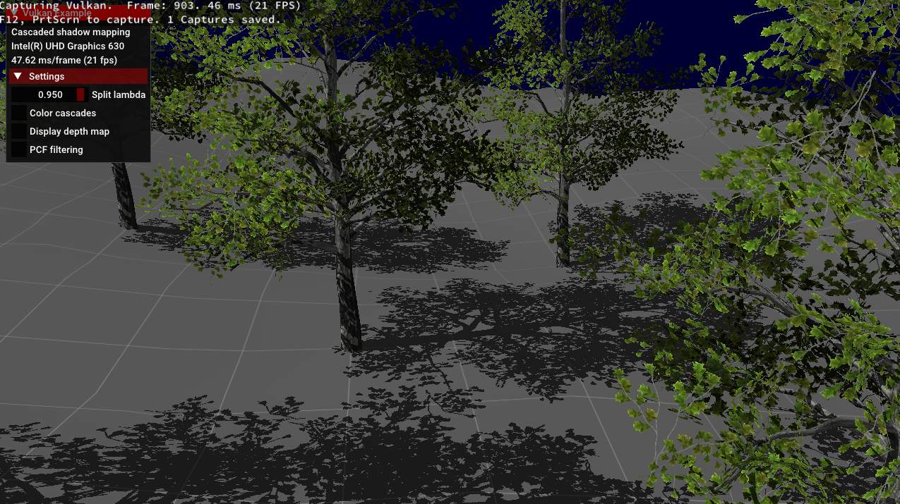

  ***应用场景:***  
  实现Cascaded Shadow Mapping，改善大场景的阴影质量。关键的算法都在updateCascades()函数里，是基于: 
  https://johanmedestrom.wordpress.com/2016/03/18/opengl-cascaded-shadow-maps/

  ***Cascaded Shadow Mapping:***  
  Cascaded Shadow Mapping(下文简称CSM)出现的原因是，当我们在渲染大场景的时候，相机近处的细节需要精细的阴影。但是如果我们只用一张光源的Depth Map计算阴影，那来自光源的Depth Map就得包括整个巨大的场景，在Depth Map分辨率一定的情况下(比如4096*4096)，分给相机近处区域的像素就少了，就会导致在大场景下相机近处的阴影质量特别糟糕。比如以下是用了一层CSM和三层CSM的效果，一层CSM近处的牛的阴影就特别糟糕。 

  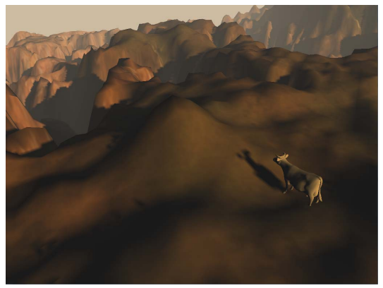

  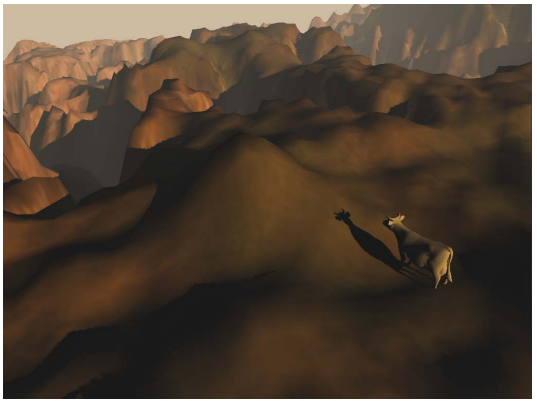

  CSM的做法是，把相机的视椎从近到远分割成若干层，然后每一层求一个最小包围盒来生成Light的Depth Map，比如这里第一层可能就只有一个牛和近处的地面，所以4096×4096的DepthMap只给牛用就能很好生成高质量阴影，第二层是近处的山，第三层是远处的山。由近及远生成三个Depth Map，虽然都是4096×4096但是覆盖的范围越来越大。最远的Depth Map就是能覆盖了整个场景。这样用多个Light方向的Depth Map就能保证阴影的精度。

  有非常多的方法用于如何分割相机的视椎体，比如对数分割，均匀分割，加权分割。然后还有一些如何针对每个分块构建光线包围盒的算法，可以参考References。

  ***RenderPass + Attachments:***  
  有两个RenderPass: 
  1-Depth Only Pass：渲染光源的Depth Map，只有一个Attachment就是Depth。只有一个Subpass，两个Subpass Dependencies。 
  2-正常的Pass: 渲染物体和阴影，使用的是基类 vulkanexamplebase.cpp 里定义的的默认Render Pass。有Color和Depth两个attachment和两个SubPass Dependencies。

  ***SubPass:***  
  两个RenderPass分别只有一个SubPass: 
  Depth Only Pass内的SubPass dependencies是同步depth attachments 从 EXTERNAL->SubPass0 和 SubPass0->EXTERNAL; 正常Pass是分别同步Color和Depth attachments的 EXTERNAL->SubPass0过程。

  ***FrameBuffer + Attachments:***  
  此案例有5个FrameBuffer！ 
  1-正常的Pass的FrameBuffer，有两个Image View分别对应SwapChain Image和Depth。 
  2-对于每一个cascade层级 都有一个Depth Buffer，都只有一个 Light Depth Map的Image View。这里有4个层级，所以有4个FrameBuffer。

  ***DescriptorSetLayout:***  
  这个DescriptorSetLayout有点复杂: 
  除掉UI，一共有两个DescriptorSetLayout； 
  1-CSM的DescriptorSetLayout，是在当前cpp创建的:  
  Binding 0：Vertex Shader Uniform Buffer 
  Binding 1：Image Sampler 
  Binding 2：Fragment Shader Uniform Buffer 
  2-descriptorSetLayoutImage，是在基类VulkanglTFModel.cpp里创建的,这个Binding是负责加载glTF模型的材质。 
  Binding 0：Image Sampler 

  ***DescriptorSet:***  
  在RenderDoc里一共可以找到8个DescriptorSet，其中创建了在CSM的cpp里创建了5个: 
  1 Scene rendering / Debug display 的 Descriptor Set，更新了CSM DescriptorSetLayout的全部三个Binding。 
  2-5 每个Cascade层级的Depth Pass都有一个 Descriptor Set，只更新CSM DescriptorSetLayout的Binding 0和Binding 1。 
  6-8 这三个DescriptorSet来自glTF的descriptorSetLayoutImage，是分别用来加载地面/树干/树叶的贴图的，只有更新一个Binding。 

  ***PipelineLayout:***  
  PipelineLayout也有两个: 
  1-Shaded PipelineLayout，包含两个DescriptorSetLayout，CSM的和glTFModel的。 
  2-Depth PipelineLayout，也包含两个DescriptorSetLayout，CSM的和glTFModel的。 
  当一个PipelineLayout创建的时候使用了两个DescriptorSetLayout，那这两个DescriptorSetLayout会合并在一起，比如说第一个DescriptorSetLayout有3个Binding，第二个DescriptorSetLayout有2个Binding，那最后的PipelineLayout就有5个Binding。

  ***Pipeline:***  
  这里有四个Pipeline，这一Part基本就是和普通的ShadowMapping一样了: 
  1-debugShadowMap：使用 debugshadowmap.vert/frag 目的是渲染Light Position处的 Depth，这里可以显示不同Cascade的DepthMap。 
  2-sceneShadow：使用 scene.vert/frag 目的是用Shadow Map渲染阴影。 
  3-sceneShadowPCF：比Scene Shadow多了一个PCF。 
  4-depthPass.pipeline：使用depthpass.vert/frag用于DepthOnly Pass渲染Light的Depth Map

  ***Shader:***  
  debugshadowmap.vert/frag：这组Shader就是用inCascadeIndex去采样对应层级的ShadowMap，并通过fragment shader呈现。 
  scene.vert/frag：这组Shader是关键，渲染场景的Diffuse，并且更具不同的Cascade进行Depth Map的采样然后计算Shadow。需要根据当前片段的视图坐标（inViewPos）确定片段所属的阴影贴图级联索引（cascadeIndex）。根据阴影贴图级联索引，计算出当前片段在阴影贴图中的投影坐标（shadowCoord）。同时也需要计算PCF的效果。以及在分层展示模式使用 红色/绿色/蓝色/黄色 来高亮区分四个Cascade层级。 
  depthpass.vert/frag：VertexShader根据顶点信息来渲染Depth深度。然后在Fragment Shader需要通过一个AlphaTest，把树叶和树干Alpha<0.5的地方给舍弃掉，就能精准保留树叶的轮廓。 

  ***Uniform Buffers:***  
  VS的Uniform Buffer定义了MVP矩阵和LightDir(这里是巨大的平行光)。 
  FS的Uniform Buffer定义了:  
  cascadeSplits：一个包含 4 个 float 元素的数组，表示cascade分割参数。它定义了cascade shadow mapping 的深度分割位置，用于将视椎的深度范围划分为多个cascade。 
  cascadeViewProjMat：一个包含 4 个 glm::mat4 元素的数组，表示cascade投影矩阵。它存储了每个cascade的视图投影矩阵，用于将场景从世界坐标系转换到Depth Map的纹理空间。 
  inverseViewMat：一个 glm::mat4 类型的变量，表示View矩阵的逆矩阵。它用于将片段的View坐标转换为世界坐标系。 
  此外还有一些通过UI控制的参数。

  ***Command Buffers:***  
  两个部分，一个是渲染几个不同的Cascade的Depth Map，一个是渲染Diffuse和计算Shadow。 
  这一章算法的重点都在设置Cascade的参数里。

  ***References:***  
  https://mouse0w0.github.io/lwjglbook-CN-Translation/26-cascaded-shadow-maps/ 
  https://www.cnblogs.com/KillerAery/p/15201310.html#cascade-shadow-mapcsm 
  https://developer.download.nvidia.com/SDK/10.5/opengl/src/cascaded_shadow_maps/doc/cascaded_shadow_maps.pdf 
  https://zhuanlan.zhihu.com/p/53689987 
  https://blog.csdn.net/qq_39300235/article/details/107765941 

### 11-Pipelines
  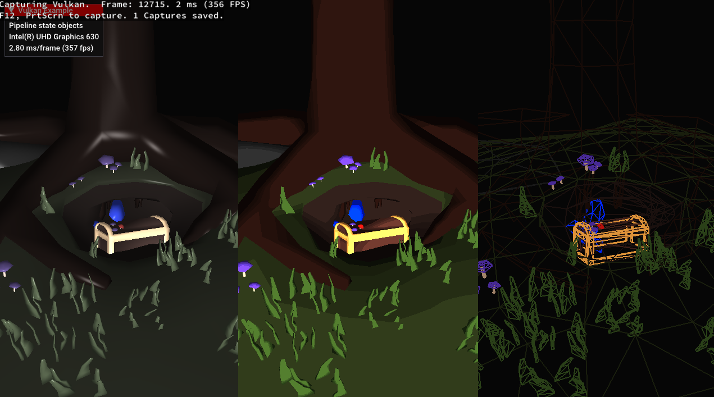

  ***应用场景:***  
  Using pipeline state objects (pso) that bake state information (rasterization states, culling modes, etc.) along with the shaders into a single object, making it easy for an implementation to optimize usage (compared to OpenGL's dynamic state machine). Also demonstrates the use of pipeline derivatives.

  在OpenGL中，这些状态是动态的，可以在渲染过程中随时更改。
  而在Vulkan中，引入了pipeline state objects (pso)）的概念。PSO将渲染所需的状态信息（rasterization states, culling modes）与着色器程序绑定成一个单独的对象。这样一来，渲染过程中只需绑定PSO对象，而无需逐个设置各个状态参数。

  这种设计带来了一些优势：易于优化使用：由于PSO对象将状态信息与shader绑定，可以在编译时对着色器和状态进行优化。此外，还提到了管线派生（pipeline derivatives）的使用。管线派生是指创建一个新的PSO对象，该对象继承了现有PSO对象的状态信息，并可以在其基础上进行修改。这样可以方便地创建具有类似但有微小差异的PSO对象，减少了重复配置的工作。

  这一个案例的精髓是我们可以create一个 base pipeline 然后在它的基础上进行多个派生。

  注意在创建Pipeline的时候有一个很重要的Info: Dynamic State, 即允许在管线绘制期间动态修改的，比如这个案例里就是VK_DYNAMIC_STATE_VIEWPORT, VK_DYNAMIC_STATE_SCISSOR, VK_DYNAMIC_STATE_LINE_WIDTH，是为了能修改viewport的时候可以动态修改线宽和viewport。要是在VRS内，还需要增加VK_DYNAMIC_STATE_FRAGMENT_SHADING_RATE_KHR，允许动态修改ShadingRate。

  ***RenderPass + Attachments:***  
  只有一个renderpass，使用的是基类 vulkanexamplebase.cpp 里定义的的默认Render Pass。有Color和Depth两个attachment和两个SubPass Dependencies。

  ***SubPass:***  
  只有一个SubPass，它的subpass dependencies分别同步Color和Depth attachments的 EXTERNAL->SubPass0过程。

  ***FrameBuffer + Attachments:***  
  只有一个FrameBuffer，有两个Image View分别对应SwapChain Image和Depth。 

  ***DescriptorSetLayout:***  
  只有一个DescriptorSetLayout: 
  Binding 0 : Vertex shader uniform buffer

  ***DescriptorSet:***  
  只有一个DescriptorSet，更新Binding 0；

  ***PipelineLayout:***  
  只有一个PipelineLayout，由DescriptorSetLayout创建并且Binding一致。

  ***Pipeline:***  
  Pipeline是这一章的精髓，总共有三个Pipelines: 
  1-Textured pipeline：使用 phong.vert/frag 渲染最左边的texture效果。 
  2-Toon shading pipeline：使用 toon.vert/frag 渲染卡渲效果。 
  3-Wire frame rendering pipeline：使用 wireframe.vert/frag 渲染线框效果。 
  精髓是pipeline derivatives，只需要创建一个Base Pipeline(Textureed pipeline) 然后它的index需要设置成-1；然后另外两个Pipelines在base Pipelines的基础上改动Shader就好了。

  需要注意的一点是在Vulkan内，线框模式并不是通过Shader渲染的，而是在Pipelines里指定rasterizationState.polygonMode = VK_POLYGON_MODE_LINE; 在此之前还需要enabledFeatures.fillModeNonSolid检测设备支持NonSolidMode。

  ***Shader:***  
  phong.vert/frag：进行Phong的着色。 
  toon.vert/frag：进行卡渲风格的着色。 
  wireframe.vert/frag：只进行了顶点变化和放大了顶点颜色，线框效果通过在Pipelines里指定VK_POLYGON_MODE_LINE的光栅化模式实现。 

  ***Uniform Buffers:***  
  包含MVP矩阵和LightPos。

  ***Command Buffers:***  
  分成左中右三个部分分别绘制了Texture，Toon，和Wireframe，最后draw了UI。

### 12-Descriptor sets
  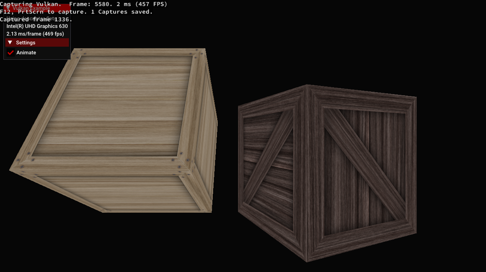

  ***应用场景:***  
  Descriptors are used to pass data to shader binding points. Sets up descriptor sets, layouts, pools, creates a single pipeline based on the set layout and renders multiple objects with different descriptor sets. 
  Descriptor Sets的关键作用是通过Binding Points向Shader传递各种数据。这个例子非常非常详细的展示了DescriptorSetLayout的创建，DescriptorSetPool的创建，和DescriptorSet的分配与更新，值得细读代码。

  ***RenderPass + Attachments:***  
  只有一个renderpass，使用的是基类 vulkanexamplebase.cpp 里定义的的默认Render Pass。有Color和Depth两个attachment和两个SubPass Dependencies。

  ***SubPass:***  
  只有一个SubPass，它的subpass dependencies分别同步Color和Depth attachments的 EXTERNAL->SubPass0过程。 

  ***FrameBuffer + Attachments:***  
  只有一个FrameBuffer，有两个Image View分别对应SwapChain Image和Depth。

  ***DescriptorSetLayout:***  
  DescriptorSetLayout有两个Binding: 
  Binding 0: Uniform buffers (used to pass matrices) 
  Binding 1: Combined image sampler (used to pass per object texture information) 
  在DescriptorSet规定的Binding都是和Shader里一致的。 
  1-binding规定了每一个Binding的Type(Uniform Buffer / Image Sampler)； 
  2-stageFlags规定了StateFrag(用在Vertex Shader还是Fragment Shader)； 
  3-descriptorCount规定了每一个binding绑定的数据数量(以Texture为例，就是绑定一个Texture还是绑定多个Texture)。

  在VertexShader和FragmentShader内的Binding就需要像如下这样和DescriptorSetLayout里的Binding匹配。 
  VS:
    layout (set = 0, binding = 0) uniform UBOMatrices ... 
  FS :
    layout (set = 0, binding = 1) uniform sampler2D ...; 
  
  ***DescriptorPool:***  
  DescriptorPool是这次的关键，DescriptorPool有两个容易混淆的概念: 
  1-PoolSize：PoolSize里的每个元素都是一种Descriptor Type，举个例子比如DescriptorSetLayout有5个Binding：2个Uniform Buffer, 3个Image Sampler。那PoolSize里面就只有两个元素: 一个是Uniform Buffer, 一个是 Image Sampler。它的目的是告诉驱动需要使用该Descriptor Type的数量。 
  2-MaxSet：这个是指最多能从DescriptorPool分配多少个DescriptorSet

  看回本章的例子：有两个方盒子和两个Texture，我们需要创建两个DescriptorSet来传递不同的Uniform Buffer和Texture信息，所以PoolSize里的Uniform Buffer类型的数量和Image Sampler类型的数量都是2，MaxSet也是2。要是每个盒子都需要多一个Image Sampler的Binding，那Pool Size里Image Sampler类型的数量就可以变成4。这两个值需要合理设置，设置的过大用不上会浪费资源。

  ***DescriptorSet:***  
  创建DescriptorSet分成两步，第一步是 Allocates an empty descriptor set without actual descriptors from the pool using the set layout，先是根据Layout给分配一个空的。第二步才是Update the descriptor set with the actual descriptors matching shader bindings set in the layout，就是根据需要的Binding使用vkUpdateDescriptorSets 函数和 vkUpdateDescriptorSets 函数来执行更新DescriptorSet的操作。

  ***PipelineLayout:***  
  PipelineLayout也只有一个，是根据DescriptorLayout来创建的。Binding一致。

  ***Pipeline:***  
  只有一个Pipeline，使用cube.vert/frag,渲染cube。

  ***Shader:***  
  只有一组Shader: cube.vert/frag, 就是采样Texture贴图然后赋予颜色。

  ***Uniform Buffers:***  
  只有MVP矩阵，MVP矩阵和Uniform Buffer都定义在cube的结构体下，update的时候把矩阵的值复制到Uniform Buffer下。

  ***Command Buffers:***  
  就是每一个Cube都Draw一次然后DrawUI，在这里还需要判断Animation是否开启，开启的话还会更具FrameTime来修改Cube的Rotation。

### 13-Dynamic uniform buffers
  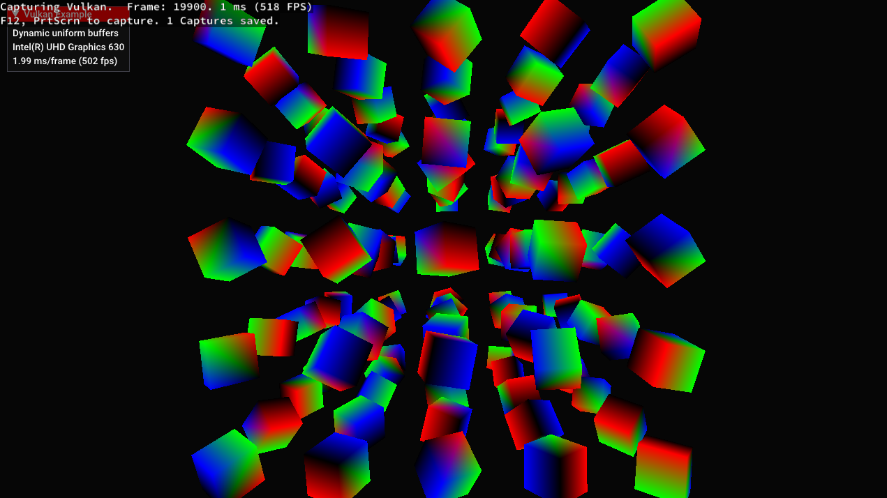

  ***应用场景:***  
  Dynamic uniform buffers are used for rendering multiple objects with multiple matrices stored in a single uniform buffer object. Individual matrices are dynamically addressed upon descriptor binding time, minimizing the number of required descriptor sets.

  在渲染多个对象时，每个对象可能需要使用不同MVP矩阵。通常情况下，我们可以将每个对象的MVP存储在一个Uniform Buffer Object中。然而，如果我们为每个Object创建一个独立的Descriptor Set，会导致Descriptor Set的数量很大。

  
  为了解决这个问题，可以使用Dynamic uniform buffers。在Dynamic uniform buffers中，我们只需要创建一个Descriptor Set，并将所有的Object都绑定到该Descriptor Set中。简单说就是一个减少DescriptorSet的技术，让某些UniformBuffer值是Dynamic的。

  这一章的重点是从底层的角度理解Dynamic Uniform Buffer，他是通过offset的方法获取正确的Buffer值，比如第一个Object的Uniform Buffer值的offset就=0，第二个Object对应的Uniform Buffer值的offset=4，第三个Object的offset=8这样。然后再每个Object之间的间隙就是Alignment，Alignment除了要能容纳Buffer值，也需要对齐计算机内存。

  ***RenderPass + Attachments:***  
  只有一个renderpass，使用的是基类 vulkanexamplebase.cpp 里定义的的默认Render Pass。有Color和Depth两个attachment和两个SubPass Dependencies。

  ***SubPass:***  
  只有一个SubPass，它的subpass dependencies分别同步Color和Depth attachments的 EXTERNAL->SubPass0过程。 

  ***FrameBuffer + Attachments:***  
  只有一个FrameBuffer，有两个Image View分别对应SwapChain Image和Depth。

  ***DescriptorSetLayout:***  
  只有一个Layout，包含两个Binding: 
  Binding0: UNIFORM_BUFFER  
  Binding1: UNIFORM_BUFFER_DYNAMIC  

  ***DescriptorSet:***  
  只有一个DescriptorSet，更新两个Binding。

  ***PipelineLayout:***  
  PipelineLayout由DescriptorSetLayout创建，Binding一致。

  ***Pipeline:***  
  只有一个Pipeline，使用base.vert/frag。

  ***Shader:***  
  base.vert/frag，该Shader只是实现了MVP矩阵变换然后output了input的color。那立方体的颜色插值效果是由Vulkan Pipeline里定义的着色模式决定的: VK_POLYGON_MODE_FILL, 这个着色模式和前面的线框类似，但是这回事一个插值的着色效果。https://registry.khronos.org/vulkan/specs/1.3-extensions/man/html/VkPolygonMode.html

  ***Uniform Buffers:***  
  本章关键！CommandBuffer的内容还是MVP矩阵，不过其中的Model矩阵，就是从模型空间到世界空间的变化，被设置成了dynamic的。 
  其中有关于Dynamic Uniform Buffer的代码被设置在prepareUniformBuffers()和updateDynamicUniformBuffer()内。 
  这两个函数主要是计算量Alignment值，并且计算了随机的旋转。updateDynamicUniformBuffer函数用于更新动态Uniform Buffer对象的数据。它通过遍历每个Object，更新每个Object的model矩阵。首先，它计算每个物体的索引和对应的偏移(glm::mat4* modelMat = (glm::mat4*)(((uint64_t)uboDataDynamic.model + (index * dynamicAlignment)));)。然后，它根据旋转速度更新旋转角度，并根据位置和旋转角度计算Model矩阵。最后，它将更新后的Model矩阵复制到Uniform Buffer对象的映射内存中，并通过调用vkFlushMappedMemoryRanges函数将更改刷新到主机内存中。这里的动态的旋转效果也是使用Model矩阵一起更新的。

  ***Command Buffers:***  
  Command Buffer里就是一个instance接着一个instance来画，每个instance都能根据对应的Index找到offset然后找到对应的Descriptor内容。

  ***References:***  
  https://github.com/SaschaWillems/Vulkan/tree/master/examples/dynamicuniformbuffer 

### 14-Push constants
  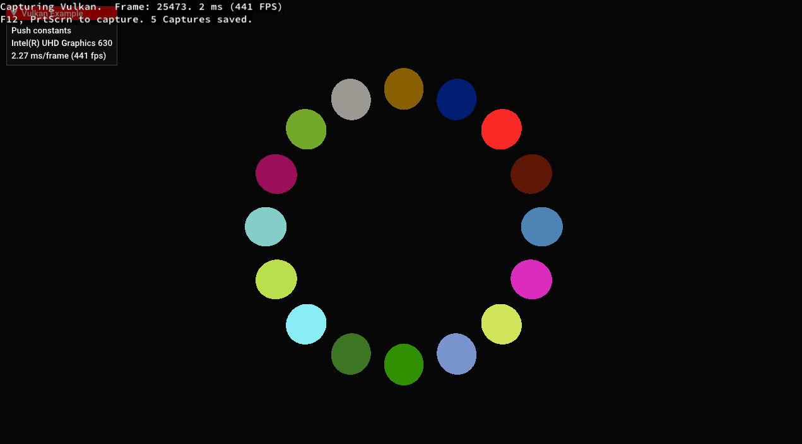

  ***应用场景:***  
  Uses push constants, small blocks of uniform data stored within a command buffer, to pass data to a shader without the need for uniform buffers. 
  Push Constant是一种比UniformBuffer更高效的给Shader传递数据的方式；小块或者不经常变化的数据可以直接存储在CommandBuffer，而不是通过UniformBuffer传入Shader。 
  在这个案例中，每个小球的Color可以有一个随机值然后Position按着圆环求出固定值。Color和Position组合作为Push Constants绑定在CommandBuffer内开始执行。

  ***RenderPass + Attachments:***  
  只有一个renderpass，使用的是基类 vulkanexamplebase.cpp 里定义的的默认Render Pass。有Color和Depth两个attachment和两个SubPass Dependencies。

  ***SubPass:***  
  只有一个SubPass，它的subpass dependencies分别同步Color和Depth attachments的 EXTERNAL->SubPass0过程。 

  ***FrameBuffer + Attachments:***  
  只有一个FrameBuffer，有两个Image View分别对应SwapChain Image和Depth。

  ***DescriptorSetLayout:***  
  只有一个DescriptorSetLayout，包含一个Binding: 
  Binding 0: Vertex shader uniform buffer 

  ***DescriptorSet:***  
  只有一个DescriptorSet，更新Binding 0

  ***PipelineLayout:***  
  PipelineLayout根据DescriptorSetLayout创建，Binding一致

  ***Pipeline:***  
  只有一个Pipeline，使用pushconstants.vert/frag

  ***Shader:***  
  pushconstants.vert/frag， 关键是在Vert里读取了Push Constant里的Color和Position。

  ***Uniform Buffers:***  
  Uniform Buffers里只有MVP矩阵，每个圆形的Position和Color放在PushConstant。

  ***Command Buffers:***  
  关键，对于每一个圆，都需要vkCmdPushConstants(....) 把data和CommandBuffer绑定在一起。这一步操作实现的PushConstants。

### 15-Specialization constants
  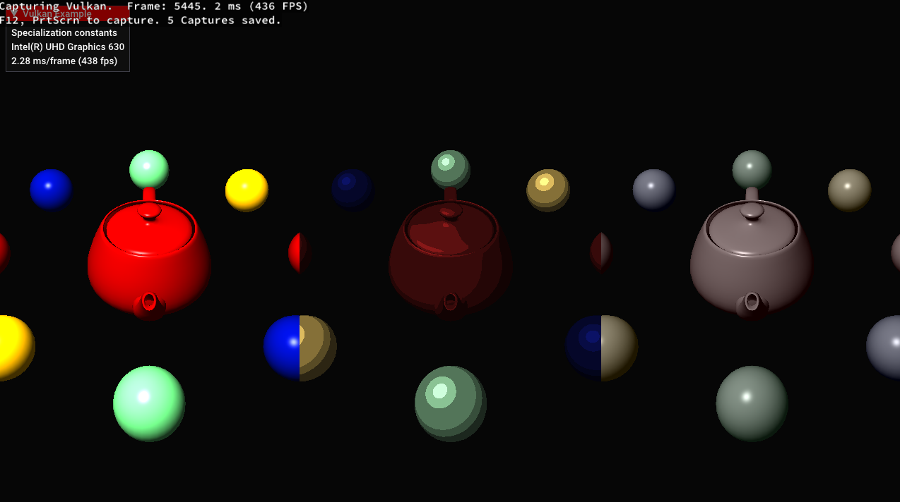

  ***应用场景:***  
  Uses SPIR-V specialization constants to create multiple pipelines with different lighting paths from a single "uber" shader. 
  使用SPIR-V专用常量（SPIR-V specialization constants）从单个uber shader创建具有不同光照路径的多个Pipeline。Uber Shader？ Uber Shader是一种多功能和高度可配置的着色器，它集成了多个渲染效果和功能的变体，以适应不同的渲染需求，这样的办法降低了维护的复杂度提高效率。

  ***RenderPass + Attachments:***  
  只有一个renderpass，使用的是基类 vulkanexamplebase.cpp 里定义的的默认Render Pass。有Color和Depth两个attachment和两个SubPass Dependencies。

  ***SubPass:***  
  只有一个SubPass，它的subpass dependencies分别同步Color和Depth attachments的 EXTERNAL->SubPass0过程。 

  ***FrameBuffer + Attachments:***  
  只有一个FrameBuffer，有两个Image View分别对应SwapChain Image和Depth。

  ***DescriptorSetLayout:***  
  有一个DescriptorSetLayout而且有两个Binding: 
  Binding 0: Vertex Uniform Buffer 
  Binding 1: Fragment Image Sampler 

  ***DescriptorSet:***  
  只有一个DescriptorSet，更新两个Bindings

  ***PipelineLayout:***  
  PipelineLayout根据DescriptorSetLayout创建，Binding一致

  ***Pipeline:***  
  这里是关键，只有一组 uber.vert/frag 的shader，但是有 Phong/Toon/Texture三组 Pipeline； 
  这里的specializationData是一个LightingModel和一个卡渲的常量toonDesaturationFactor；创建了两个specializationMapEntries，分别对应着色器中的两个specializationData。每个specializationMapEntries指定了常量的ID、大小和offset偏移量。 
  这里的specializationData是在fragment shader，所以需要给shaderStages[1]指定一个specializationInfo。接着在每次创建管线之前，都修改一下LightMode的index值。然后创建的管线就可以在Shader里switch到对应的shader代码。 

  ***Shader:***  
  uber.vert/frag，主要是在frag里 有三种渲染模式(Phong/Toon/Texture)，通过LightMode来switch。

  ***Uniform Buffers:***  
  包括MVP矩阵和LightPosition。

  ***Command Buffers:***  
  就是分成左中右三个区域，绑着不同的管线去绘制，最后再绘制UI。

### 16-Texture mapping
  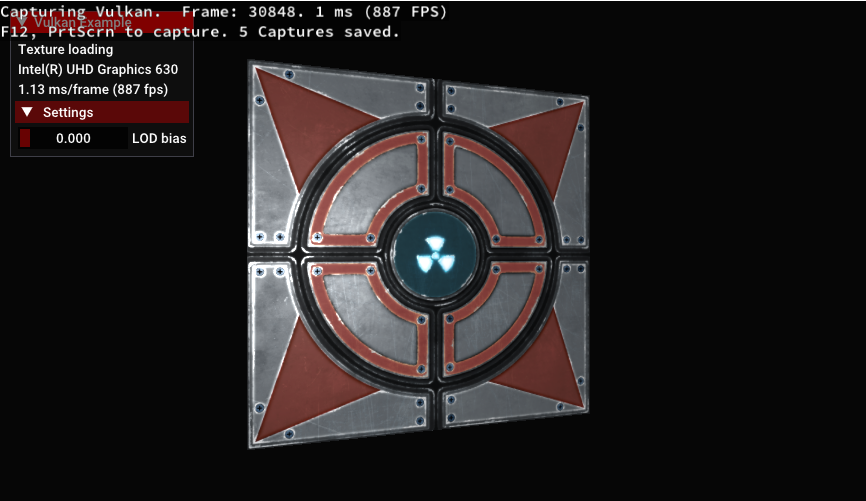

  ***应用场景:***  
  Loads a 2D texture from disk (including all mip levels), uses staging to upload it into video memory and samples from it using combined image samplers. 
  Vulkan提供了两种类型的图像贴图（tiling）或内存布局：线性贴图（Linear tiled）和最优贴图（Optimal tiled）。线性贴图（Linear tiled）图像：这些图像按原样存储，可以直接复制。但是由于它们的线性特性，它们与 GPU 不匹配，格式和功能支持非常有限。最优贴图（Optimal tiled）图像：这些图像以特定于实现的布局存储，以匹配硬件的能力。它们通常支持更多的格式和功能，并且速度更快。最优贴图图像存储在GPU Device上，CPU HOST无法访问。我们一般全部用Optimal tiled。 
  在LoadTexture的时候需要有一个VkFormat format = VK_FORMAT_R8G8B8A8_UNORM;规定了是RGBA四个通道都是8bit的大小。 

  ***Load Texture*** 
  Load Texture这个过程，是从CPU把CPU only的数据，移动到GPU的显存中。这里要注意CPU only的内存区域是GPU不可见的，而显存是CPU不可见的，所以需要一个中间的Staging Buffer去转运数据，Staging Buffer是在内存上的，对GPU可见，对CPU也可见。 
  明确一遍: data-内存或者硬盘上-仅CPU可见，Staging Buffer-RAM内存上-CPU(Host)和GPU(Device)都可见，DeviceLocal-GPU显存上-仅GPU可见。 
  所以在给Staging Buffer分配内存时指定的内存类型: VK_MEMORY_PROPERTY_HOST_VISIBLE_BIT表示是对HOST可见的，VK_MEMORY_PROPERTY_HOST_COHERENT_BIT表示HOST对该内存的写入操作是能被GPU立即知道的不需要特定更新。 
  而在Device上创建optimal tiled target image所设定的内存类型就是VK_MEMORY_PROPERTY_DEVICE_LOCAL_BIT

  所以整个读取数据的过程就是: 
  1-创建Staging Buffer 
  2-CPU把图像数据从硬盘加载到Staging Buffer 
  3-GPU在显存上创建Device Local Image 
  4-图像数据从RAM的Staging Buffer复制到Device Local Image上 
  5-Device上Image Layout的转换 
  6-清除Staging Buffer 

  其中细说4和5，是首先创建了一个Command Buffer copyCmd来记录Load的操作。 
  1-首先初始化了一个VkImageMemoryBarrier，用于从VK_PIPELINE_STAGE_HOST_BIT到VK_PIPELINE_STAGE_TRANSFER_BIT，就是staging buffer读取数据到Device Local的时候，ImageLayout从UNDEFINED转换成VK_IMAGE_LAYOUT_TRANSFER_DST_OPTIMAL。用于传输。 
  2-执行vkCmdCopyBufferToImage，从staging复制数据到Device Local的Image。 
  3-更新ImageMemoryBarrier，再使用一次Barrier在VK_PIPELINE_STAGE_TRANSFER_BIT到VK_PIPELINE_STAGE_FRAGMENT_SHADER_BIT的过程中吧ImageLayout从VK_IMAGE_LAYOUT_TRANSFER_DST_OPTIMAL转化成VK_IMAGE_LAYOUT_SHADER_READ_ONLY_OPTIMAL来给Shader读取。 
  4-Submit到Queue执行复制，这个呈现在RenderDoc里就是Copy/Clear Pass。 
  5-清理StagingBuffer释放内存。

  要是用TILING_LINEAR的方式，那Image的创建和内存分配都是在RAM上，需要通过一个ImageBarrier内存转换之后才能加载到GPU上，所以是比较低效的，它的ImageLayout的转换是VK_IMAGE_LAYOUT_PREINITIALIZED 到 VK_IMAGE_LAYOUT_SHADER_READ_ONLY_OPTIMAL，这种 PREINITIALIZED 的ImageLayout主要用于此部分CPU加载图像。

  ***Sampler*** 
  有了Sampler才能采样纹理，这里在creat Sampler的时候需要设置magFilter和minFilter为线性过滤(VK_FILTER_LINEAR), 决定纹理被放大缩小的时候的插值方式。还有Mipmap之间的插值方式，还有要根据Device是否支持来设置各向异性过滤的方式。

  ***Binding & Location*** 
  在Vulkan中，一个Binding描述了一个顶点缓冲（Vertex Buffer）的属性，并可以包含一个或多个属性（attribute）。每个属性在着色器中都有一个唯一的位置（Location）。因此，你可以把一个Binding看作是包含一个或多个Location的集合。 
  这是因为一个顶点缓冲（Binding）可以包含多种类型的数据（例如位置，颜色，纹理坐标等），这些数据在着色器中被分别访问，每种数据类型对应一个Location。 

  ***Vertex Descriptions*** 
  有顶点输入就需要设置一个Vertex Descriptions，定义在pipelineCreateInfo.pVertexInputState内，用于向Pipeline描述如何从特定Binding的VertexBuffer内读取数据(各种Location下的各种Attributes)。 
  它和DescriptorSet的区别如下: 
  Descriptor Set：描述了如何将各种类型的资源（Buffers, Image Samplers等）传递给着色器，其中每个资源都通过一个描述符（Descriptor）进行绑定（Binding）。 
  Vertex Input Descriptions：描述了如何从顶点缓冲（Vertex Buffer）中读取数据，并将这些数据（通过各种顶点属性Locations）传递给Vertex Shader。 

  ***Synchronization:***  
  同步这里，有两个非常重要的同步: 
  加载贴图资源的时候，从RAM加载到LocalDevice的时候，会用ImageMemoryBarriers做ImageLayout转换到可以传输，然后加载进来之后又通过一个ImageMemoryBarriers做ImageLayout转换到Shader可读。 
  然后再Subpass里队attachment也做了定义，比如对于Color Attachment，initialLayout通常是VK_IMAGE_LAYOUT_UNDEFINED，然后finalLayout通常是PRESENT_SRC_KHR。这也是做了一个ImageLayout的转换让其可以与External对接。 

### 17-Texture arrays
  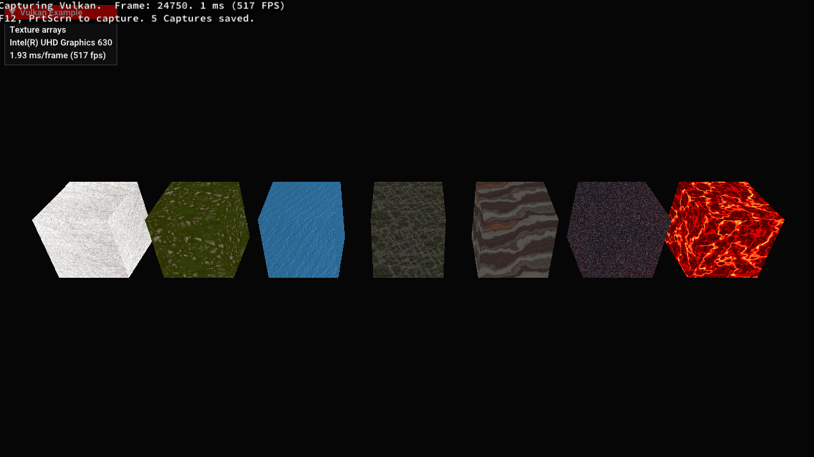

  ***应用场景:***  
  Loads a 2D texture array containing multiple 2D texture slices (each with its own mip chain) and renders multiple meshes each sampling from a different layer of the texture. 2D texture arrays don't do any interpolation between the slices. 
  可以理解成一次性输入一个Texture的Array。然后每个物体的Texture就从其中通过Index获得。 

  ***Texture Array:***  
  Vulkan中的Texture Array是一种特殊类型的图像，允许你在一个单一的数据结构中存储和访问多个2D Texture。每个纹理都被称为一个Layer，所有的Layer具有相同的尺寸和格式。有一个好处就是一个VkImage对象就可以包含多个Layers，这样就可以不用反复创建VkImage和ImageView并且多次分配Memory。 
  Texture Array的自由度是每个Layer都可以单独的进行Sample，但是每个Layer都必须拥有相同的Size和Format，并且共享同一个Mipmap链(就是每个Layer的Mipmap级别以及每一个级别的Mipmap大小是一样的。) 
  LayerCount是在ImageCreate的时候就传入ImageCreateInfo:

    imageCreateInfo.arrayLayers = layerCount;

  然后这个值在CommandBuffer内Draw的时候，和update UniformBuffer的时候都需要传入。 

### 18-SubPass
  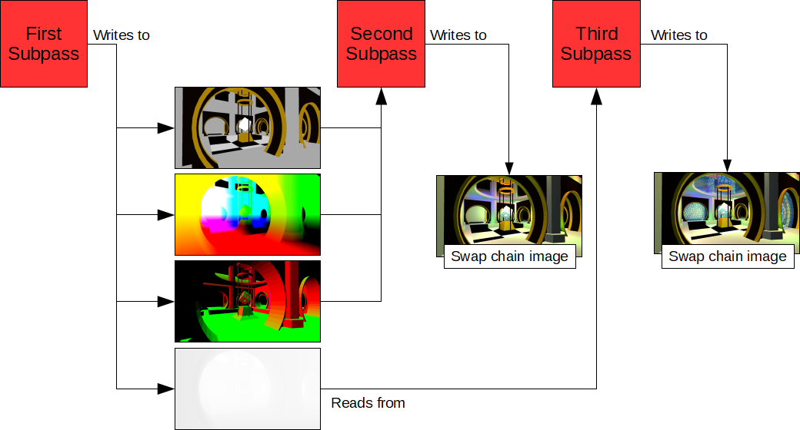

  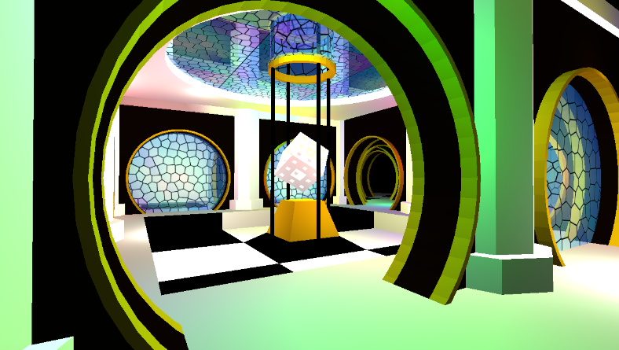

  ***应用场景:***  
  这里主要的应用场景是熟悉SubPass，这个案例里在一个Pass里面分了三个Subpass,前两个Pass分别是Deffered Rendering里的Deffered G-Buffer Pass和Deffered Composition Pass。然后第三个SubPass再处理透明物体。 
  透明物体不能放在Deffered Rendering里而需要另外开一个Pass的原因很简单，因为G-Buffer内每个像素只能记录一个顶点的位置和Shading信息，但是透明物体的渲染需要多个，所以需要再开一个Pass. 
  合理的使用SubPass能利用TBR架构和On-Chip Memory大大的提高效率。

  ***透明物体的渲染:***  
  透明物体的渲染一般放在所有不透明物体之后进行，在渲染之前需要对所有透明物体进行深度排序(Depth Sorting)，然后从远到近进行渲染，使用Alpha Blend进行混合:FinalColor = Alpha * ForegroundColor + (1 - Alpha) * BackgroundColor 
  从远到近是为了保证透明物体颜色叠加时候的颜色正确，越靠近Camera的越晚叠加。 
  Alpha Blend和Alpha Test的区别在于: Alpha Blend是用一个0-1的Alpha值去加权计算颜色，但Alpha Test是简单的设置一个阈值去判断是否需要保留or丢弃该像素。 

  ***RenderPass + Attachments:***  
  创建RenderPass和Attachments是subPass的关键，因为在这里三个Subpass都是在一个RenderPass里，所以所有的Attachment需要一起创建然后再分配； 
  这里创建了5个Attachment: 
  0-Swapchain Color 
  1-Deffered Position 
  2-Deffered Normal 
  3-Deffered Albedo 
  4-Depth

  然后分给三个Subpass 
  1-Deffered G-Buffer Pass 包含01234，都是作为ColorAttachment但是Swapchain Color并不出东西。 
  2-Deffered Composition Pass 包含01234，但注意SwapChainColor是作为ColorAttachment，123是作为InputAttachment。 
  3-Transparent Pass，包含014,1的那个Deffered Position也是作为InputAttachment传入的。 

  ***SubPass:***  
  重点关注各个SubPass之间的SubPassDepencency同步； 
  EXTERNAL -> Deffered G-Buffer Pass：Color和Depth都是读完才开始写。 
  Deffered G-Buffer Pass -> Deffered Composition Pass: Color要写完才开始读。 
  Deffered Composition Pass -> Transparent Pass: Color要写完才开始读。 
  Transparent Pass -> EXTERNAL: Color要写完才开始读。 

  ***DescriptorSet:***  
  这里只需要明白一点: 就是在input Attachment也是需要占用一个Binding，所以比如Deffered Composition Pass，那它就会有三个Binding分别是三个InputAttachment。

  ***Pipeline:***  
  Pipeline此处非常重要，特别是Transparent Pass的Pipeline里设置了Alpha Blend； 
  在绘制不透明的Pass时，在Pipeline的Alpha Blend这一栏都是： 

    VkPipelineColorBlendAttachmentState blendAttachmentState = vks::initializers::pipelineColorBlendAttachmentState(0xf, VK_FALSE);

  意思就是关闭了AlphaBlend，但是在Transparent Pass里，就需要合适的设置Alpha Blend:

  	// Enable blending
		blendAttachmentState.blendEnable = VK_TRUE;
		blendAttachmentState.srcColorBlendFactor = VK_BLEND_FACTOR_SRC_ALPHA;              // 用Alpha值混合
		blendAttachmentState.dstColorBlendFactor = VK_BLEND_FACTOR_ONE_MINUS_SRC_ALPHA;    // 原本的图像的Factor是 1-Alpha
		blendAttachmentState.colorBlendOp = VK_BLEND_OP_ADD;                               // 颜色操作用的加法
		blendAttachmentState.srcAlphaBlendFactor = VK_BLEND_FACTOR_ONE;                    // src的Alpha * 1
		blendAttachmentState.dstAlphaBlendFactor = VK_BLEND_FACTOR_ZERO;                   // dsc的Aplha * 0 意思是只用src的Alpha值
		blendAttachmentState.alphaBlendOp = VK_BLEND_OP_ADD;                               // 混合后Alpha相加
		blendAttachmentState.colorWriteMask = VK_COLOR_COMPONENT_R_BIT | VK_COLOR_COMPONENT_G_BIT | VK_COLOR_COMPONENT_B_BIT | VK_COLOR_COMPONENT_A_BIT;   // 四个通道都会被写入

  然后此时在Shader内就不需要再写Alpha Blend，在管线设置内就可以完成。Vulkan在Pipeline里设置Alpha Blend而不在Shader内，是因为在Pipeline里能实现一些硬件优化，而且更方便控制。

### 19-TextureCubeMap
  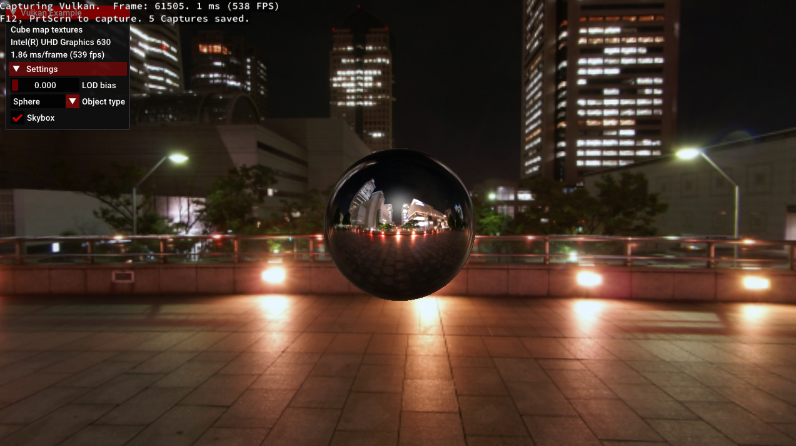

  ***应用场景:***  
  Loads a cube map texture from disk containing six different faces. All faces and mip levels are uploaded into video memory, and the cubemap is displayed on a skybox as a backdrop and on a 3D model as a reflection.

  上面提到过TextureArray的概念，其实CubeMap无非也是六个面的texture, 所以在创建CubeMap的时候的六张贴图也是通过TextureArray的方式传递进来的。

  具体的操作是在Image里设置，可以设置 arrayLayers 为6，并将 imageType 成员设置为 VK_IMAGE_TYPE_2D，然后在创建 VkImageView 对象时，将 viewType 成员设置为 VK_IMAGE_VIEW_TYPE_CUBE。这样，你就创建了一个cubemap。 
  在Vulkan和其他的API都是按照顺序传入这六个面: +X,-X,+Y,-Y,+Z,-Z；

  绘制过程是先绘制了一个SkyBox，然后在通过反射绘制3D Object。

  ***Image:***  
  在CreateImage的时候特别关键的两步: 设置arraylayers和flags为CUBE。不需要Cubemap的时候是不需要设置这个flag的。 

        // Cube faces count as array layers in Vulkan
		imageCreateInfo.arrayLayers = 6;
		// This flag is required for cube map images
		imageCreateInfo.flags = VK_IMAGE_CREATE_CUBE_COMPATIBLE_BIT;

  然后在CreateImageView的时候设置: 

    	// Cube map view type
		view.viewType = VK_IMAGE_VIEW_TYPE_CUBE;

  ***Skybox:***  
  Skybox一般是一个立方体模型，然后每一个面都有一个Cubmap的Texture对应。 
  SkyBox的创建有两点:

  1-在渲染CubeMap的Pipeline里需要把深度测试和深度写入都关闭，并且把混合模式设置成不透明，这个是为了让Skybox不会覆盖任何其他物体。而且cullMode要变成FrontFace，因为是从立方体内部看出去，所以背面应该被渲染，正面反而需要被裁剪。

    depthStencilState.depthWriteEnable = VK_FALSE;
	depthStencilState.depthTestEnable = VK_FALSE;
	rasterizationState.cullMode = VK_CULL_MODE_FRONT_BIT;

  2-在UpdateUniformBuffer的时候，需要把Skybox的MVP矩阵里View矩阵的平移值设置成0，也就是第四列设置成0；这样做可以让Skybox的中心固定在Camera的位置，Why还需要旋转和缩放？因为CubeMap需要和相机一起旋转，也需要缩放到适合屏幕的大小。

    // Skybox
    uboVS.modelView = camera.matrices.view;
    // Cancel out translation
    uboVS.modelView[3] = glm::vec4(0.0f, 0.0f, 0.0f, 1.0f);

  ***Synchronization:***  
  除此之外, 不管什么Texture，从CPU到Device Only Memory之间都是需要经过两个Pipeline Barriers (Image Memory Barriers)，做两个ImageLayout的转换。

  ***DescriptorSet:***  
  一个给SkyBox的，一个给3D Object的；

  ***Pipeline:***  
  同，一个给SkyBox的，一个给3D Object的，SkyBox的要关闭深度测试，深度写入，而且cullMode要设置成FRONT，到设置3D Object的Pipeline时，就需要开启深度测试，深度写入，然后cullMode设置成BACK。

  ***Shader:***  
  其中Skybox的Shader只是简单的采样了CubeMap，3D Object的Shader就是自己进行了一个Phong计算然后加上Reflect的CubeMap，Reflect也是采样了CubeMap, 在ambient和diffuse里都有加权值。

### 20-TextureCubeMapArray
  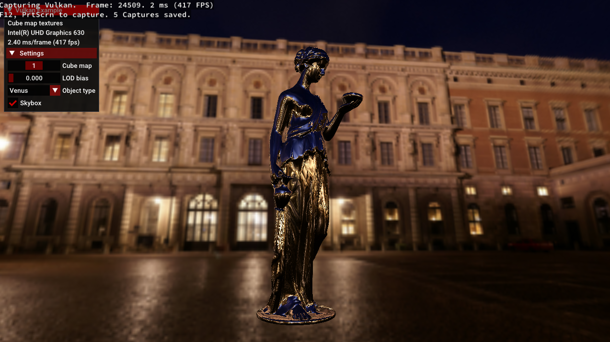

  ***应用场景:***  
  Loads an array of cube map textures from a single file. All cube maps are uploaded into video memory with their faces and mip levels, and the selected cubemap is displayed on a skybox as a backdrop and on a 3D model as a reflection. 
  像是CubeMap和TextureArray的组合，在都是通过Texture的方式通过一个文件传入。在这里比如有3个cubeMap，那Layers就是3*6。这里有三层考虑: 有3个CubeMap，每个CubeMap有6个Faces，每个Faces还有几个Mipmap，所以就需要用三个For循环去Get Image Offset然后Setup buffer copy regions。

  	// Setup buffer copy regions for each face including all of its miplevels
		std::vector<VkBufferImageCopy> bufferCopyRegions;
		uint32_t offset = 0;
		for (uint32_t face = 0; face < 6; face++) {
			for (uint32_t layer = 0; layer < ktxTexture->numLayers; layer++) {
				for (uint32_t level = 0; level < ktxTexture->numLevels; level++) {
					ktx_size_t offset;
					KTX_error_code ret = ktxTexture_GetImageOffset(ktxTexture, level, layer, face, &offset);
					assert(ret == KTX_SUCCESS);
					VkBufferImageCopy bufferCopyRegion = {};
					bufferCopyRegion.imageSubresource.aspectMask = VK_IMAGE_ASPECT_COLOR_BIT;
					bufferCopyRegion.imageSubresource.mipLevel = level;
					bufferCopyRegion.imageSubresource.baseArrayLayer = layer * 6 + face;
					bufferCopyRegion.imageSubresource.layerCount = 1;
					bufferCopyRegion.imageExtent.width = ktxTexture->baseWidth >> level;
					bufferCopyRegion.imageExtent.height = ktxTexture->baseHeight >> level;
					bufferCopyRegion.imageExtent.depth = 1;
					bufferCopyRegion.bufferOffset = offset;
					bufferCopyRegions.push_back(bufferCopyRegion);
				}
			}
		}

  这一段是最复杂的关键；在Vulkan内，要是需要从一个Buffer加载数据到一个图像，那就需要明确指定复制的源区域和目标区域。VkBufferImageCopy结构体就是干这事的，然后这里精细到每一个mipmap都需要一个VkBufferImageCopy，所以就有一个VkBufferImageCopy的集合Vector叫buffer copy regions，来描述怎么把数据从一个Buffer里读取分配给一堆Image。

  其他关于CubeMap的实现细节可以参考上一节 21-TextureCubeMap。

### 21-3D Texture
  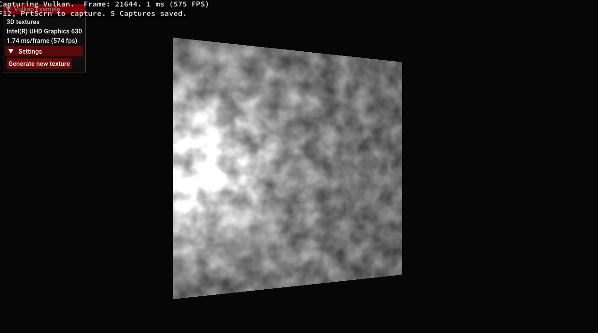

  ***应用场景:***  
  Generates a 3D texture on the cpu (using perlin noise), uploads it to the device and samples it to render an animation. 3D textures store volumetric data and interpolate in all three dimensions. 
  在CPU中用柏林噪声生成一个3DTexture，然后还是用Staging的方法提交到Device Local Memory。然后再渲染采样的时候，在3D纹理中，采样会在所有三个维度（宽度、高度和深度）上进行插值。

  ***Perlin Noise & Fractal Noise:***  
  这里主要是把柏林噪声的函数，和基于柏林噪声的分形算法给移植过来了，在后面Prepare 3D Texture里调用。 

  ***Image & Image View:***  
  在CreateImage的时候，需要指定是3D的ImageType: 

    imageCreateInfo.imageType = VK_IMAGE_TYPE_3D;

  然后再Create Image View的时候也需要是3D的ViewType: 

    view.viewType = VK_IMAGE_VIEW_TYPE_3D;

  ***Prepare 3D Texture:***  
  生成的Noise数据，也是通过Staging Buffer的方式存到内存上然后再存到Device Local的Memory上。 
  同样需要经过两个ImageLayout的转换，因为3D Texture也是以一个Image的格式传入的，所以和其他的Texture是一个流程。

### 22-Screen space ambient occlusion (SSAO)
  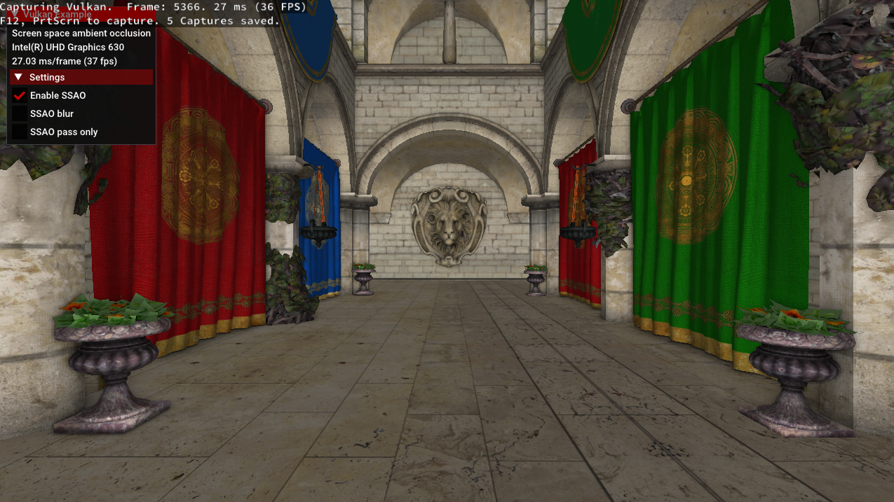

  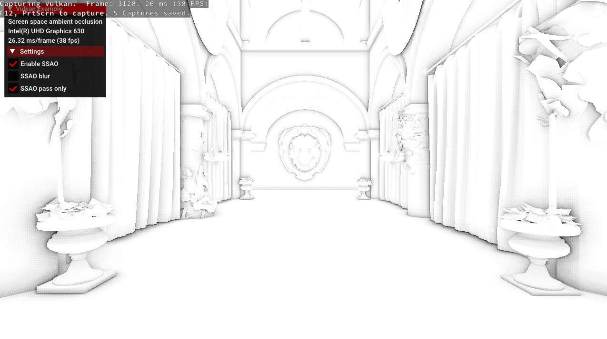

  ***应用场景:***  
  Adds ambient occlusion in screen space to a 3D scene. Depth values from a previous deferred pass are used to generate an ambient occlusion texture that is blurred before being applied to the scene in a final composition path. 
  该案例主要是实现了SSAO，而且是在Deffered的方法下实现的SSAO。

  ***SSAO:*** 
  详情参考这一篇:https://learnopengl-cn.github.io/05%20Advanced%20Lighting/09%20SSAO/ 
  环境光遮蔽(Ambient Occlusion)的原理是通过将褶皱、孔洞和非常靠近的墙面变暗的方法近似模拟出间接光照。这些区域很大程度上是被周围的几何体遮蔽的，光线会很难流失，所以这些地方看起来会更暗一些。

  屏幕空间环境光遮蔽(Screen Space Ambient Occlusion)的原理是： 
  对于屏幕空间(Screen-filled Quad)上的每一个片段，我们都会根据周边深度值计算一个遮蔽因子(Occlusion Factor)。这个遮蔽因子之后会被用来减少或者抵消片段的环境光照分量。遮蔽因子是通过采集片段周围球体/半球体核心(Kernel)的多个深度样本，并和当前片段深度值对比而得到的。高于片段深度值样本的个数就是我们想要的遮蔽因子。

  SSAO的波纹(Banding)和噪声(Noise)的解决办法: 
  如果样本数量太低，渲染的精度会急剧减少，我们会得到一种叫做波纹(Banding)的效果；如果它太高了，反而会影响性能。我们可以通过引入随机性到采样核心(Sample Kernel)的采样中从而减少样本的数目。但是随机采样会带来很明显的Noise(就是网格状的有规律排列的AO)，这就需要Blur来解决，所以在这里第二个Pass是做SSAO，第三个Pass还要做一个Blur。(OpenGL的链接里有对比图) 

  半球or整球: 
  最好用半球，因为整球会导致平整的墙壁也是灰蒙蒙的(因为总有50%会被遮盖)。 

  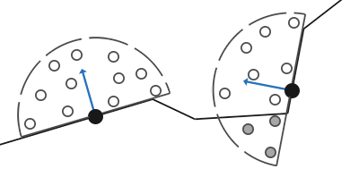

  随机半球旋转: 
  除了随机的Kernel Location，我们还需要再加一个随机量，就是绕着Z轴的一个随机旋转向量，这个随机旋转向量写入一个Buffer然后当做一个小的纹理在UniformBuffer传入，因为如果每个Kernel都给一个值得话会很占内存，Kernel数量很大，通常有64+。

  Lerp: 
  给一个Lerp的目的是，让Kernel更接近球心，就是分布更加集中。

  ***RenderPass + Attachments:***  
  总共有4个RenderPass，可以拿一张OpenGL案例里绘制的流程图，和Vulkan里是一样的。 
  Pass1-渲染GBuffer，包括Position/Normal/Depth, 在Vulkan的这个斯彭扎宫 (Sponza Palace)的demo里还需要绘制一张Diffuse。 
  Pass2-SSAO，传入的是 Position/Normal/SSAO Noise。 
  Pass3-Blur，传入的只有SSAO的output。 
  Pass4-Composition，计算光照和把AO叠进去、

  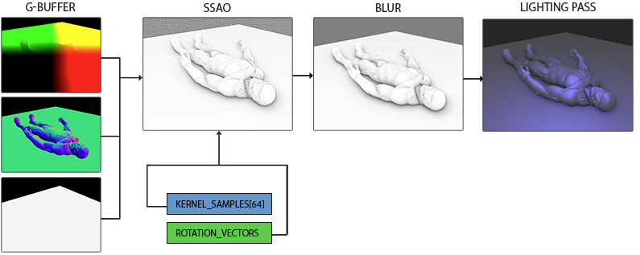

  ***Shader:***  
  SSAO的计算，主要是在Fragment Shader，首先要texture Noise，得到绕Z轴的随机旋转角度，然后变到TBN切线空间，再计算Kernel们的被遮挡率(这里一共有64个Kernel)。判断被遮挡了很简单，就是根据深度贴图去采样该像素在屏幕空间的深度，再去对比Kernel面对摄像机的深度z，要是Kernel的深度加上Bias之后还是小于深度贴图里的深度，就是被遮挡了。最后的亮度计算很直接: Color = 1.0 - (occlusion / float(SSAO_KERNEL_SIZE));

  ***Uniform Buffers:***  
  Uniform Buffer在SSAO很重要，这里涉及到怎么把随机产生的Kernel和Noise值传入Shader； 
  Sample Kernel 通过如下算法随机在一个半球内生成：首先在半个立方体内生成随机点，注意这里的z方向的随机值没有 *2.0 - 1，所以在X和Y方向的随机数是[-1,1]，在Z方向的就是[0,1]。这个通过一个UniformBuffer传入。 
  至于Random的Noise，这里生成了16个Random的Kernel旋转方向，然后存在一个Texture里面。 

### 23-PBR
  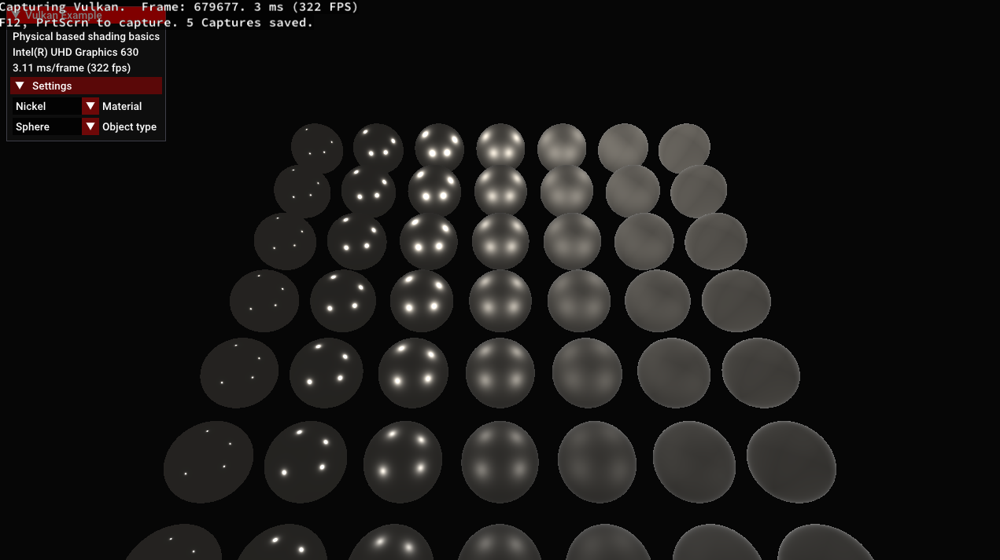

  ***应用场景:***  
  Physical based rendering as a lighting technique that achieves a more realistic and dynamic look by applying approximations of bidirectional reflectance distribution functions based on measured real-world material parameters and environment lighting. 
  Demonstrates a basic specular BRDF implementation with solid materials and fixed light sources on a grid of objects with varying material parameters, demonstrating how metallic reflectance and surface roughness affect the appearance of pbr lit objects. 

  ***Push Constant:***  
  每一行和每一列的小球的PBR参数通过Push Constant的方式在Command Buffer阶段传入;

    for (uint32_t y = 0; y < GRID_DIM; y++) {
      for (uint32_t x = 0; x < GRID_DIM; x++) {
        glm::vec3 pos = glm::vec3(float(x - (GRID_DIM / 2.0f)) * 2.5f, 0.0f, float(y - (GRID_DIM / 2.0f)) * 2.5f);
        vkCmdPushConstants(drawCmdBuffers[i], pipelineLayout, VK_SHADER_STAGE_VERTEX_BIT, 0, sizeof(glm::vec3), &pos);
        mat.params.metallic = glm::clamp((float)x / (float)(GRID_DIM - 1), 0.1f, 1.0f);
        mat.params.roughness = glm::clamp((float)y / (float)(GRID_DIM - 1), 0.05f, 1.0f);
        vkCmdPushConstants(drawCmdBuffers[i], pipelineLayout, VK_SHADER_STAGE_FRAGMENT_BIT, sizeof(glm::vec3), sizeof(Material::PushBlock), &mat);
        models.objects[models.objectIndex].draw(drawCmdBuffers[i]);
      }
    }

  首先定义了每一个球的位置，然后定义了Roughness 和 Metallic这两项； 然后球的位置就Push给Vertex Shader，至于metallic和roughness还有每个material的RGB信息就Push给Fragment Shader。

  ***RenderPass + Attachments:***  
  其实PBR的管线流程非常简单，重点都在Shader里。

  ***Shader:***  
  精髓中的精髓，PBR的Fragment Shader，因为这里是金属，所以BRDF只有镜面反射项，还没有漫反射项。 
  思考一个点，为什么roughness不同还会有漫反射？因为在PBR里的漫反射是物理上的“散射”，存于电介质(绝缘体)内，当散射范围大于像素，就表现为次表面散射，当散射范围小于像素，就表现为漫反射diffuse。 
  下面关于镜面反射的代码是精髓中的精髓。 

    // Normal Distribution function --------------------------------------
    float D_GGX(float dotNH, float roughness)
    {
      float alpha = roughness * roughness;
      float alpha2 = alpha * alpha;
      float denom = dotNH * dotNH * (alpha2 - 1.0) + 1.0;
      return (alpha2)/(PI * denom*denom); 
    }

    // Geometric Shadowing function --------------------------------------
    float G_SchlicksmithGGX(float dotNL, float dotNV, float roughness)
    {
      float r = (roughness + 1.0);
      float k = (r*r) / 8.0;
      float GL = dotNL / (dotNL * (1.0 - k) + k);
      float GV = dotNV / (dotNV * (1.0 - k) + k);
      return GL * GV;
    }

    // Fresnel function ----------------------------------------------------
    vec3 F_Schlick(float cosTheta, float metallic)
    {
      vec3 F0 = mix(vec3(0.04), materialcolor(), metallic); // * material.specular
      vec3 F = F0 + (1.0 - F0) * pow(1.0 - cosTheta, 5.0); 
      return F;    
    }

    // Specular BRDF composition --------------------------------------------

    vec3 BRDF(vec3 L, vec3 V, vec3 N, float metallic, float roughness)
    {
      // Precalculate vectors and dot products	
      vec3 H = normalize (V + L);
      float dotNV = clamp(dot(N, V), 0.0, 1.0);
      float dotNL = clamp(dot(N, L), 0.0, 1.0);
      float dotLH = clamp(dot(L, H), 0.0, 1.0);
      float dotNH = clamp(dot(N, H), 0.0, 1.0);

      // Light color fixed
      vec3 lightColor = vec3(1.0);

      vec3 color = vec3(0.0);

      if (dotNL > 0.0)
      {
        float rroughness = max(0.05, roughness);
        // D = Normal distribution (Distribution of the microfacets)
        float D = D_GGX(dotNH, roughness); 
        // G = Geometric shadowing term (Microfacets shadowing)
        float G = G_SchlicksmithGGX(dotNL, dotNV, rroughness);
        // F = Fresnel factor (Reflectance depending on angle of incidence)
        vec3 F = F_Schlick(dotNV, metallic);

        vec3 spec = D * F * G / (4.0 * dotNL * dotNV);

        color += spec * dotNL * lightColor;
      }

      return color;
    }

### 24-PBR + IBL(Image Based Lighting)
  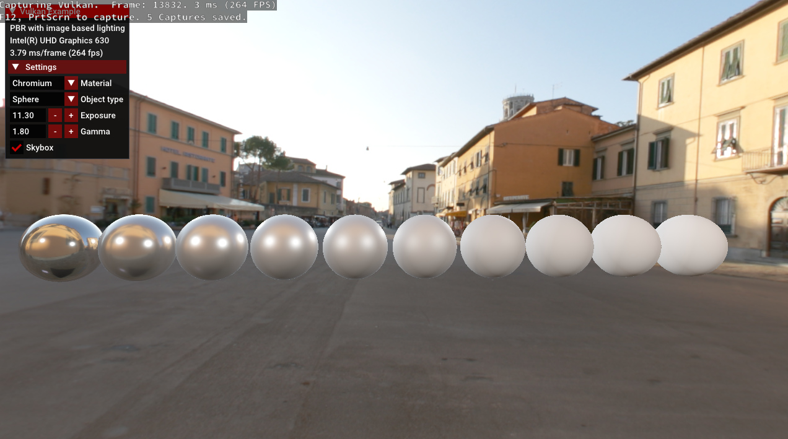

  ***应用场景:***  
  Adds image based lighting from an hdr environment cubemap to the PBR equation, using the surrounding environment as the light source. This adds an even more realistic look the scene as the light contribution used by the materials is now controlled by the environment. Also shows how to generate the BRDF 2D-LUT and irradiance and filtered cube maps from the environment map. 
  这一章的重点就是IBL，还有各种与计算贴图(cubmap的光照模糊mipmap，还有LUT) 
  这一章还包括很多预烘焙。有三个贴图: 

  1-Irradiance Map：这个贴图是对环境Cubemap的低频率版本，它被用来计算漫反射部分的光照。也是有多个Mipmap级别。 
  2-PreFiltered Map：这个贴图是环境Cubemap的预过滤版本，用于计算镜面反射部分的光照。对于金属或者有镜面反射的材质，这个映射尤为重要。有多个MipMap级别。 
  3-LUT 贴图，是Roughness和cosθv(视线和法线夹角的cos值，用点积求出)的预计算积分贴图。 

  ***RenderPass + Attachments:***  
  这里总共有4个renderPass，前三个RenderPass是用来烘焙预计算贴图，只在第0帧出现，然后后面每一帧都只执行第四个Pass去渲染SkyBox和计算有IBL的PBR光照，而且不管是三个贴图的预计算烘焙还是PBR的计算都是在Shader里实现，所以这一章的重点就是看看四个Shader。

  ***Generate Lut:***  
  这个GLSL片段着色器实际上是在实现对BRDF的蒙特卡洛积分，它是通过对半球上的所有可能的光源方向进行采样和求和来实现的。这个过程利用了Hammersley序列（用于产生低差异性的采样点，以提高积分的精度）和GGX重要性采样（使得更可能的方向被更频繁地采样，以减少方差）。 
  在这个过程中，θ和粗糙度的参数是通过Hammersley序列对i的操作得到的，这个序列提供了在[0, 1]区间内均匀分布的值。然后，这些值被用于计算θ（对应光的入射角度）和粗糙度，这两个参数都是在BRDF模型中使用的关键参数。

  ***Generate Irradiance Map:***  
  这个主要是生成给Diffuse采样的环境光。用一个卷积去卷这个CubeMap，然后计算半球内所有光源的贡献(注意是半球因为背后看不到) 然后再采样半球的时候会用cosθ来计算每个采样点的权重，越在弧顶的权重就越大。

  ***Generate PreFiltered Map:***  
  它使用了重要性采样（基于 GGX 分布）和 Hammersley 序列来在半球上分布采样点，然后计算并累积每个采样点的颜色贡献，生成对应表面粗糙度的预滤波环境贴图。也是用一个半球进行积分，但是会根据不同的Roughness。

  ***PBR + IBL:***  
  大部分和没有IBL的PBR是一样的，但是这里加上了diffuse，直接从Irradiance贴图里采样。使用F0和Lut贴图采样得到的两个积分计算出了Specular的分量。然后把IBL贡献的diffuse值和specular值加权相加，就的得到了IBL的ambient贡献。要是有其他光源的话就再加上其他光源的lighting PBR贡献。

### 25-Texture PBR + IBL
  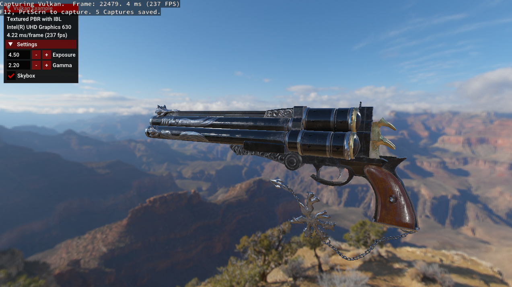

  ***应用场景:***  
  Renders a model specially crafted for a metallic-roughness PBR workflow with textures defining material parameters for the PRB equation (albedo, metallic, roughness, baked ambient occlusion, normal maps) in an image based lighting environment. 

  ***PBR Texture*** 
  相比于 PBR+IBL 的案例，PBR + Texture只是传入了更多的Texture信息。 本来通过Push Constant传入的 Roughness 和 Metallic信息，现在变成通过 RoughnessMap 和 MetallicMap这两张Texture传入。并且二外传入了三张贴图: Albedo Map, Normal Map, AO Map。对于一个Object模型会额外传入五张Map，然后在PBR的fragment Shader里参与计算。这是和 PBR+IBL案例的唯一区别。  

  ***RenderPass + Attachments:***  
  依旧是4个renderPass，前三个RenderPass是用来烘焙预计算贴图，只在第0帧出现，然后后面每一帧都只执行第四个Pass去渲染SkyBox和计算有IBL的PBR的Texture光照。 

### 26-Image Compute Shader
  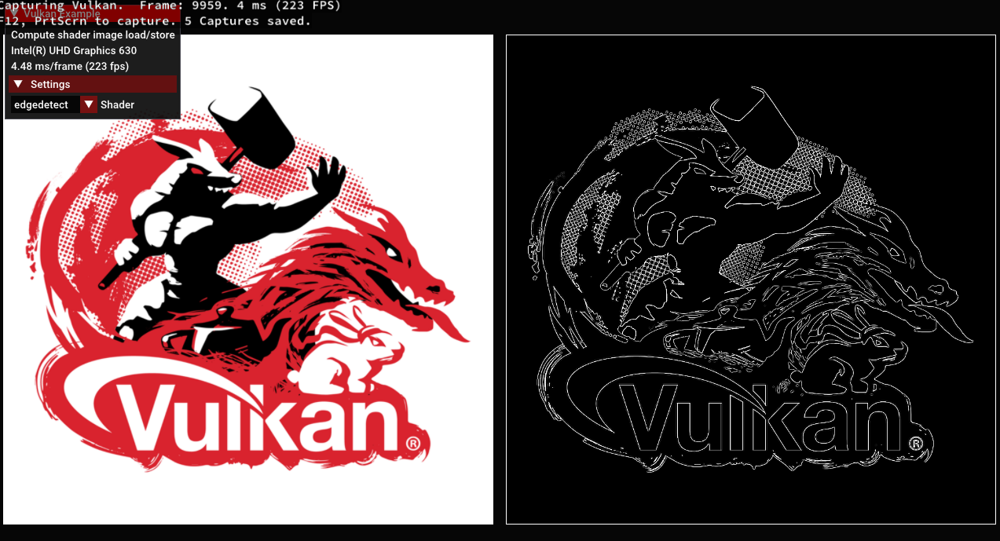

  ***应用场景:***  
  Uses a compute shader along with a separate compute queue to apply different convolution kernels (and effects) on an input image in realtime.

  Compute Shader 是一种现代图形管道中的一种可编程着色器，它专门用于在GPU上执行通用计算。与其他类型的着色器（如顶点着色器、几何着色器或像素着色器）不同，它不直接用于绘制3D图形，而是用于执行能在GPU上并行处理的任务。这使得它们非常适合执行图像处理、物理模拟等任务。它以.comp结尾，也会像.vert和.frag一样被编译成SPIR-V(.spv文件)之后再绑定到Pipeline和使用DescriptorSet。 
  Compute Shader的最大好处是可以以Pipleline的框架，在GPU里并行执行非绘制的通用计算。

  ***单独的 Queue*** 
  Computer Shader部分一般在绘制Queue之外再新建一个单独的Queue用于计算。分开两个Queue的原因是: Compute 任务一般占用大量的时间，和绘制命令在一个Queue上提交会阻塞当前Queue上的其他绘制命令。 
  回顾一下之前讲的同步，Queue接受到的是一个线性命令流，它会按命令流上命令的顺序执行命令。所以把Computer的命令和Draw的命令分开能更好的处理并行和同步。 

  ***Image的 Sharing Mode*** 
  要是我们有两个Queue Family(Compute 和 Graphics) 那就需要把Image的Shading Mode设置为VK_SHARING_MODE_CONCURRENT。
  
    std::vector<uint32_t> queueFamilyIndices;
    if (vulkanDevice->queueFamilyIndices.graphics != vulkanDevice->queueFamilyIndices.compute) {
      queueFamilyIndices = {
        vulkanDevice->queueFamilyIndices.graphics,
        vulkanDevice->queueFamilyIndices.compute
      };
      imageCreateInfo.sharingMode = VK_SHARING_MODE_CONCURRENT;
      imageCreateInfo.queueFamilyIndexCount = 2;
      imageCreateInfo.pQueueFamilyIndices = queueFamilyIndices.data();
    }

  Vulkan中，队列家族（Queue Family）是一个概念，它代表一组具有相同特性（如图形，计算，传输等）和内存可见性的队列。每个队列家族都有一个索引以便于识别。 
  然而，在一些硬件上，图形和计算命令可能共享同一个队列家族。这就是所谓的"图形队列和计算队列索引相同"的情况(就是只有一个Queue)。 
  如果显卡支持同时图形和计算命令的话，那就会有两个QueueFamily，然后他们的Indices也不一样，此时就需要设置Image的ShadingMode。因为他是Compute Queue的texture target，然后需要在Graphics Queue中读取。

  Image有两种Shading Mode: 独占和并发: 
  1-独占模式（VK_SHARING_MODE_EXCLUSIVE）: 图像只能在一个队列家族中使用，但可以在此家族的任何队列中使用。如果你想在另一个队列家族中使用该图像，你需要执行一个队列家族所有权转移操作。 
  2-并发模式（VK_SHARING_MODE_CONCURRENT）: 图像可以在多个队列家族中使用，无需执行所有权转移操作。然而，这可能会比独占模式的性能差。 

  ***Semaphores! Queue与Queue之间的同步:***  
  Semaphores一个典型例子就是在Queue与Queue之间同步，像Compute Queue和Graphics Queue这样的并行Queue尤其需要。 
  下面欣赏一下Vulkan Examples里submit CommandBuffer时候的同步代码: 

  	void draw()
	{
		// Compute Part
		// Wait for rendering finished
		VkPipelineStageFlags waitStageMask = VK_PIPELINE_STAGE_COMPUTE_SHADER_BIT;

		// Submit compute commands
		VkSubmitInfo computeSubmitInfo = vks::initializers::submitInfo();
		computeSubmitInfo.commandBufferCount = 1;
		computeSubmitInfo.pCommandBuffers = &compute.commandBuffer;
		computeSubmitInfo.waitSemaphoreCount = 1;
		computeSubmitInfo.pWaitSemaphores = &graphics.semaphore;
		computeSubmitInfo.pWaitDstStageMask = &waitStageMask;
		computeSubmitInfo.signalSemaphoreCount = 1;
		computeSubmitInfo.pSignalSemaphores = &compute.semaphore;
		VK_CHECK_RESULT(vkQueueSubmit(compute.queue, 1, &computeSubmitInfo, VK_NULL_HANDLE));	
		VulkanExampleBase::prepareFrame();

		// Graphics Part
		VkPipelineStageFlags graphicsWaitStageMasks[] = { VK_PIPELINE_STAGE_VERTEX_INPUT_BIT, VK_PIPELINE_STAGE_COLOR_ATTACHMENT_OUTPUT_BIT };
		VkSemaphore graphicsWaitSemaphores[] = { compute.semaphore, semaphores.presentComplete };
		VkSemaphore graphicsSignalSemaphores[] = { graphics.semaphore, semaphores.renderComplete };

		// Submit graphics commands
		submitInfo.commandBufferCount = 1;
		submitInfo.pCommandBuffers = &drawCmdBuffers[currentBuffer];
		submitInfo.waitSemaphoreCount = 2;
		submitInfo.pWaitSemaphores = graphicsWaitSemaphores;
		submitInfo.pWaitDstStageMask = graphicsWaitStageMasks;
		submitInfo.signalSemaphoreCount = 2;
		submitInfo.pSignalSemaphores = graphicsSignalSemaphores;
		VK_CHECK_RESULT(vkQueueSubmit(queue, 1, &submitInfo, VK_NULL_HANDLE));

		VulkanExampleBase::submitFrame();
	}

  其中prepareFrame() 和submitFrame() 两个分别利用了semaphores.presentComplete和semaphores.renderComplete两个信号量。 
  1-prepareFrame() 是从SwapChain里获取下一个要渲染的Image；它获取好了后，需要signal semaphores.presentComplete。然后后面的Submit Graphics Command的时候需要等待这个Semaphore才能开始执行相关的command； 
  2-submitFrame() 是把渲染好的图像送显。在Graphics Queue执行完之后会signal semaphores.renderComplete表示渲染已经完成了。再这个函数里需要等待该信号量，在得知渲染结束后才能送显。

  说回Semaphore:</b>
  关注三个信息点:waitStageMask / WaitSemaphores / SignalSemaphores。他们的关系是 WaitStageMask的阶段，要等待WaitSemaphores才能执行。然后在整个CommandBuffer执行结束之后再去SignalSemaphores。

  所以在ComputePart，需要 VK_PIPELINE_STAGE_COMPUTE_SHADER_BIT需要等待graphics.semaphore 才能开始执行。然后再Compute结束之后才signal compute.semaphore; 
  再GraphicsPart，VK_PIPELINE_STAGE_VERTEX_INPUT_BIT等待compute.semaphore, VK_PIPELINE_STAGE_COLOR_ATTACHMENT_OUTPUT_BIT等待semaphores.presentComplete。在Graphics的command buffer绘制结束之后才signalgraphics.semaphore, semaphores.renderComplete。 

  ***Compute Queue:***  
  在Graphics Queue之外还需要准备一个Compute Queue。这个Compute Queue有自己的一套DescriptorSetLayout，PipelineLaypout，DescriptorSet，Pipeline，还有Command Pool和Command Buffer。 

  ***Shader:***  
  在这个案例里定义了三组Shader: 每一组都对应着一个计算后处理逻辑，比如锐化等。需要注意的是定义了一个并行数量:

    layout (local_size_x = 16, local_size_y = 16) in;

  表示有16*16=256个并行，大多数GPU都能支持32 * 32 = 1024 或者64 * 64 = 4096个并行同时工作，所以1024个并行并不算多。 
  在这个案例中，compute shader的输出是也是存在一个resultImage里，所以这里的正常shader就是采样了Result Image的值。 
  但是Compute Shaders 的结果不仅可以存储在图像（Image）中，也可以存储在缓冲区（Buffer）中。如果存储在Image内的话，那这个Image就可以是一维的二维的或者三维的。 

### 27-Compute Particles
  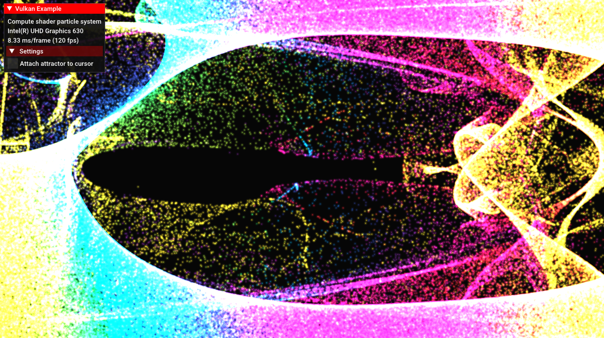

  ***应用场景:***  
  Attraction based 2D GPU particle system using compute shaders. Particle data is stored in a shader storage buffer and only modified on the GPU using memory barriers for synchronizing compute particle updates with graphics pipeline vertex access. 
  一个GPU上运行的粒子系统，粒子的行为是受到某种吸引力的影响。存储在shader storage buffer上，然后通过memory barriers进行同步和update。

  Storage Buffer也是一种存储格式，类似Uniform Buffer和Sampler2D。具体可以看后面的compute clothes部分。 

  如果你正在执行一项Compute Shader任务，需要在GPU上修改大量数据，然后可能在后续的渲染阶段使用这些数据，那么Storage Buffers可能是最佳选择。例如，假设你正在实现一个物理模拟，其中你需要在每个时间步更新每个粒子的位置和速度。你可以将粒子的状态存储在一个Storage Buffer中，然后使用一个计算着色器来更新它。

  ***RenderPass + Attachments:***  
  一个ComputePass 计算粒子的位置，用的是Shader内的粒子系统计算算法，计算某一点对于一个粒子的吸引力和排斥力。然后更新粒子的位置； 
  在GraphicsPass，就是把这些粒子给绘制在屏幕上； 

  ***Shader:***  
  一个粒子系统的Shader，用于更新粒子的位置，更新的逻辑是去计算吸引力和排斥力然后计算最后的坐标。

 ***Synchronization:***  
  这里涉及到两个Queue的转换，所以参考ComputeCloths案例，是一样的。需要有两种PipelineBarriers: 分别是GraphicsToCompute，和ComputeToGraphics。
  另外就是额外的两个Semaphores用于Compute队列和Graphics队列之间的同步。

### 28-Compute RayTracing
  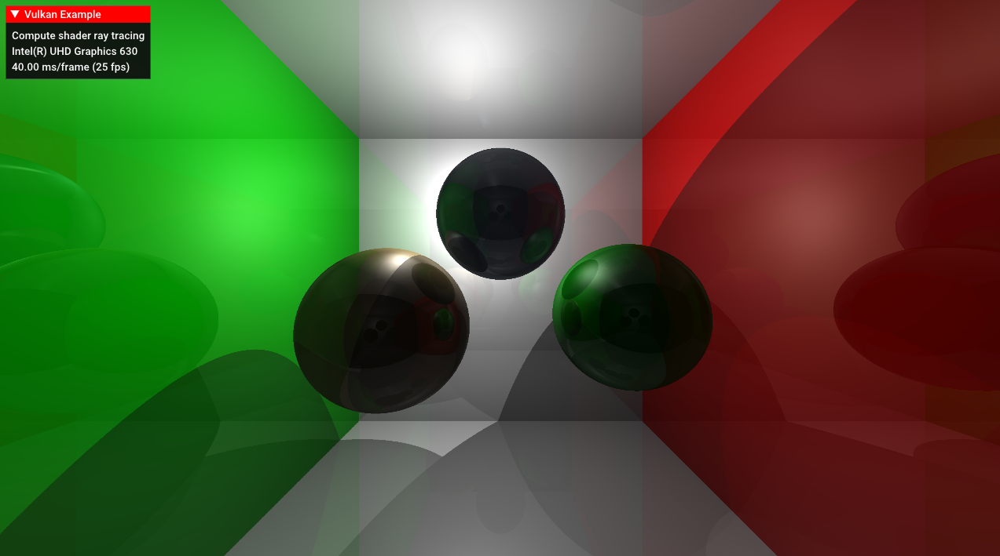

  ***应用场景:***  
  Simple GPU ray tracer with shadows and reflections using a compute shader. No scene geometry is rendered in the graphics pass.
  这里主要还是熟悉一个Compute Shader，光线追踪的算法是比whitted style还简单的，直接计算光线和场景最近物体的交叉点的漫反射和镜面反射效果，并没有递归去计算光源的全局多次反射。

  ***RenderPass + Attachments:***  
  和粒子系统的操作是十分相似的。两个Pass，第一个Pass计算，第二个Pass是绘制到屏幕上，不同的是这里用一个Image作为Compute Shader的输出。

  ***Synchronization:***  
  这里的同步主要也是两个Queue之间的 Buffer所有权转换，但除了Storage Buffer，还有一个Image，所以在Graphics 的Command buffer 和 Compute的Command Buffer在开始和结束的时候都需要去做一个Image的Pipeline Barriers的转换。
  其他storage buffer的转换，和队列与队列之间同步用的信号量，都和其他compute Shader 案例是相同的。

  ***Shader:***  
  这里的Shader实现了一个非常简单的RayTracing效果，直接计算光线和场景最近物体的交叉点的漫反射和镜面反射效果，并没有递归去计算光源的全局多次反射。

### 29-Compute Clothes
  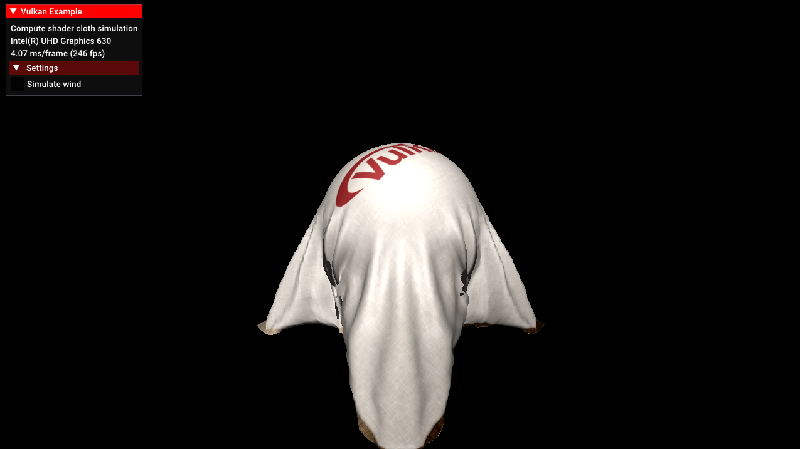

  ***应用场景:***  
  Mass-spring based cloth system on the GPU using a compute shader to calculate and integrate spring forces, also implementing basic collision with a fixed scene object. 
  这段话描述了在GPU上使用Compute Shader实现的基于质点-弹簧(mass-spring)系统的布料模拟，同时也实现了与固定场景物体的基础碰撞检测。 

  ***RenderPass + Attachments:***  
  可以理解成，分成两个Pass，每一帧都有一个ComputePass和一个GraphicsPass。GraphicsPass就走完整的管线，ComputePass就只有一个CS的阶段。在这里的ComputePass，要是数据存在Buffer内的话，就没有Attachment，通过Storage Buffer传输数据。 

  ***Storage Buffer*** 
  Storage Buffer也是一种存储格式，类似Uniform Buffer和Sampler2D。 

  1-Storage Buffers: 如果你正在执行一项Compute Shader任务，需要在GPU上修改大量数据，然后可能在后续的渲染阶段使用这些数据，那么Storage Buffers可能是最佳选择。例如，假设你正在实现一个物理模拟，其中你需要在每个时间步更新每个粒子的位置和速度。你可以将粒子的状态存储在一个Storage Buffer中，然后使用一个计算着色器来更新它。

  2-Uniform Buffers: 如果你有一些在整个渲染过程中保持不变的数据，或者每帧只更新一次的数据，那么Uniform Buffers可能是一个好选择。例如，在渲染3D场景时，你可能需要传递一个视图矩阵和一个投影矩阵到你的顶点着色器。这些矩阵在每一帧中只会改变一次，因此可以将它们存储在一个Uniform Buffer中。

  3-Sampler2D (Textures): 如果你需要在着色器中进行图像处理，或者需要使用2D纹理映射，那么Sampler2D是最佳选择。例如，假设你正在实现一个材质着色器，需要使用一张纹理贴图来决定物体表面的颜色。你可以将纹理贴图存储为一个2D纹理，然后在片元着色器中使用一个采样器来读取它。

  同时，Staging Buffer比Uniform Buffer的优势在于:

  1-读/写能力：不同于其他类型的缓冲区，如Uniform Buffers，Storage Buffers在OpenGL和Vulkan中允许着色器进行随机读写操作。这使得它们非常适合用于存储Compute Shader的结果，因为Compute Shader通常需要写入结果数据。

  2-大小：Storage Buffers通常能存储更大量的数据。例如，在OpenGL中，Storage Buffer的最大尺寸通常比Uniform Buffer的最大尺寸大得多，这使得它们非常适合存储大量数据。

  3-结构化数据：Storage Buffer还支持结构化数据，这意味着你可以在Compute Shader中定义复杂的数据结构，然后将这些结构存储在Storage Buffer中。这为存储复杂的结果数据提供了便利。

  4-并行计算：由于Compute Shader的并行性质，Storage Buffers能够让每个线程单独写入其结果，而不需要进行复杂的同步操作。

  ***Compute Command Buffers:***  
  在存在各方Command Buffer内，绑定了Pipeline，在开始computer Shader计算命令之前先加了Graphics to Compute barriers。 
  然后进行了64次迭代来计算当前的质点位置。这是因为物理模拟，特别是布料模拟这样的复杂模拟，通常需要多次迭代才能达到稳定和准确的结果。这是因为每次迭代更新粒子的位置和速度都是基于当前的状态，但是由于每个粒子的状态都会影响和它相连的粒子，所以需要多次迭代来逐渐逼近真实的物理行为。然后在每次的模拟过程中，都需要使用一个ComputeToComputeBarriers。保证前一个computer shader的结果写入storage buffer之后，下一个compute shader才去读取。 
  迭代完成之后最后再来一个ComputeToGraphics的Barriers，来保证Computer Shader在Shader部分以及完成写入了。 

  ***DescriptorSet:***  
  这里值看传入ComputerShader的值, 有两组: 
  Binding 0： Input Storage Buffer
  Binding 1： Output Storage Buffer
  Binding 2:  Uniform Buffer(这里是质点的结构体)

  Binding 0： Output Storage Buffer
  Binding 1： Input Storage Buffer
  Binding 2:  Uniform Buffer(这里是质点的结构体)

  我们可以看到在这一段内Binding0和Binding1是有了调转的，这个操作是为了保证上一次迭代output Storage Buffer能应用于下一个迭代的Input Storage Buffer，这个切换就是通过DescriptorSet的切换来实现的。

  ***Shader:***  
  Shder就是每一次迭代去更新每一个质点结构体里的值，包括位置和速度等。 
  考虑的力包括重力，然后还有当前质点周围八个质点给的弹力，还有阻尼力。考虑完所有力之后需要判断是否与球体发生了碰撞，要是有碰撞则需要把粒子推到球的表面并且把速度设置为0。 
  用欧拉方法进行数值积分，更新粒子的位置与速度。 

  ***Compute Queue:***  
  和每一个ComputeShader一样，需要给它单独开一个Queue去运行。这个Compute Queue有自己的一套DescriptorSetLayout，PipelineLaypout，DescriptorSet，Pipeline，还有Command Pool和Command Buffer。

  ***Synchronization:***  
  这里的同步 主要有三个PipelineBarriers、四个Semaphores(除了两个每个案例都有的presentComplete与renderComplete不谈，这里主要关注用于同步 Graphics Queue和Compute Queue的两个信号量)。

  PipelineBarriers，分成三个 GraphicsToCompute / ComputeToCompute / ComputeToGraphics。他们都是Buffer Barriers，主要用于Buffer所有权的转换。这里并不能跨queue进行同步，跨queue的是用Semaphore，这里的Barriers更多是在同一个Queue上，开始和结束的时候，进行storage buffer所有权的转换。比如在GraphicsCommand开始前，需要做加一个ComputeToGraphics，这里的src也不是COMPUTE_BIT,而是 TOP_OF_PIPE_BIT，因为在这个Queue上并没有COMPUTE_BIT。 同理在ComputeCommand结束的时候，也是需要加一个ComputeToGraphics，这里的dsc就是BOTTOM_OF_PIPE_BIT。这两个Barriers合在一起才是一个完整的Barriers。

  同理在Graphics->Compute 和在Compute->Compute(多次迭代)的过程中也需要做Buffer所有权的转换。

  在Graphics 和 Compute Queue之间同步用的也是两个信号量，他们互相等待和signal。

### 30-IndirectDraw (GPU Driven)
  

  ***应用场景:***  
  Rendering thousands of instanced objects with different geometry using one single indirect draw call instead of issuing separate draws. All draw commands to be executed are stored in a dedicated indirect draw buffer object (storing index count, offset, instance count, etc.) that is uploaded to the device and sourced by the indirect draw command for rendering. 

  这里的关键是所有需要执行的绘制命令都存储在一个专门的间接绘制缓冲区对象中。这个缓冲区包含了所有绘制命令需要的信息，例如索引数量（index count）、偏移量（offset）、实例数量（instance count）等。然后，这个缓冲区被上传到设备（即GPU）上，并被间接绘制命令用于渲染。 

  这种方法的优点是，你可以使用单一的间接绘制命令来渲染大量的实例化对象，而不需要为每个对象发出单独的绘制命令。这可以减少CPU和GPU之间的通信，提高渲染效率。 

  实际上是有一个GPU Driven的概念: 它的基本思想是尽可能地将渲染流程的控制权从CPU转移到GPU。在传统的渲染流程中，CPU负责生成和提交渲染命令，而GPU只负责执行这些命令。在GPU驱动的渲染流程中，GPU不仅执行渲染命令，还可以生成和修改这些命令。 

  优势有两个: 减少CPU和GPU之间的通信，还有提高渲染效率。

  ***Preparing the indirect draw Command Buffer:***  
  需要准备一个VkDrawIndexedIndirectCommand的vector集合去记录indirectCmd，一般有多少个模型，就需要多少个Command，每种模型又可以包括不同的instance数据。 
  这里导入的模型集合plants里面有多个模型，对每个模型都创建一个command。然后船舰好之后再把这个command buffer给staging到GPU的内存上。 
  注意一点: 在Device上的Buffer格式需要是: VK_BUFFER_USAGE_INDIRECT_BUFFER_BIT

  	// Prepare (and stage) a buffer containing the indirect draw commands
	void prepareIndirectData()
	{
		indirectCommands.clear();

		// Create on indirect command for node in the scene with a mesh attached to it
		uint32_t m = 0;
		for (auto &node : models.plants.nodes)
		{
			if (node->mesh)
			{
				VkDrawIndexedIndirectCommand indirectCmd{};
				indirectCmd.instanceCount = OBJECT_INSTANCE_COUNT;
				indirectCmd.firstInstance = m * OBJECT_INSTANCE_COUNT;
				// @todo: Multiple primitives
				// A glTF node may consist of multiple primitives, so we may have to do multiple commands per mesh
				indirectCmd.firstIndex = node->mesh->primitives[0]->firstIndex;
				indirectCmd.indexCount = node->mesh->primitives[0]->indexCount;

				indirectCommands.push_back(indirectCmd);

				m++;
			}
		}

		indirectDrawCount = static_cast<uint32_t>(indirectCommands.size());

		objectCount = 0;
		for (auto indirectCmd : indirectCommands)
		{
			objectCount += indirectCmd.instanceCount;
		}

		vks::Buffer stagingBuffer;
		VK_CHECK_RESULT(vulkanDevice->createBuffer(
			VK_BUFFER_USAGE_TRANSFER_SRC_BIT,
			VK_MEMORY_PROPERTY_HOST_VISIBLE_BIT | VK_MEMORY_PROPERTY_HOST_COHERENT_BIT,
			&stagingBuffer,
			indirectCommands.size() * sizeof(VkDrawIndexedIndirectCommand),
			indirectCommands.data()));

		VK_CHECK_RESULT(vulkanDevice->createBuffer(
			VK_BUFFER_USAGE_INDIRECT_BUFFER_BIT | VK_BUFFER_USAGE_TRANSFER_DST_BIT,
			VK_MEMORY_PROPERTY_DEVICE_LOCAL_BIT,
			&indirectCommandsBuffer,
			stagingBuffer.size));

		vulkanDevice->copyBuffer(&stagingBuffer, &indirectCommandsBuffer, queue);

		stagingBuffer.destroy();
	}

  ***prepare Instance Data:***  
  有了command，下一步就是给每一个模型分配一个随机的instance数据。这一段也是存在Buffer里然后Staging到GPU的内存上。关键是随机生成各种数据。

  	// Prepare (and stage) a buffer containing instanced data for the mesh draws
	void prepareInstanceData()
	{
		std::vector<InstanceData> instanceData;
		instanceData.resize(objectCount);

		std::default_random_engine rndEngine(benchmark.active ? 0 : (unsigned)time(nullptr));
		std::uniform_real_distribution<float> uniformDist(0.0f, 1.0f);

		for (uint32_t i = 0; i < objectCount; i++) {
			float theta = 2 * float(M_PI) * uniformDist(rndEngine);
			float phi = acos(1 - 2 * uniformDist(rndEngine));
			instanceData[i].rot = glm::vec3(0.0f, float(M_PI) * uniformDist(rndEngine), 0.0f);
			instanceData[i].pos = glm::vec3(sin(phi) * cos(theta), 0.0f, cos(phi)) * PLANT_RADIUS;
			instanceData[i].scale = 1.0f + uniformDist(rndEngine) * 2.0f;
			instanceData[i].texIndex = i / OBJECT_INSTANCE_COUNT;
		}

		vks::Buffer stagingBuffer;
		VK_CHECK_RESULT(vulkanDevice->createBuffer(
			VK_BUFFER_USAGE_TRANSFER_SRC_BIT,
			VK_MEMORY_PROPERTY_HOST_VISIBLE_BIT | VK_MEMORY_PROPERTY_HOST_COHERENT_BIT,
			&stagingBuffer,
			instanceData.size() * sizeof(InstanceData),
			instanceData.data()));

		VK_CHECK_RESULT(vulkanDevice->createBuffer(
			VK_BUFFER_USAGE_VERTEX_BUFFER_BIT | VK_BUFFER_USAGE_TRANSFER_DST_BIT,
			VK_MEMORY_PROPERTY_DEVICE_LOCAL_BIT,
			&instanceBuffer,
			stagingBuffer.size));

		vulkanDevice->copyBuffer(&stagingBuffer, &instanceBuffer, queue);

		stagingBuffer.destroy();
	}

  ***Command Buffers 中使用 Indirect:***  
  关键是下面这part代码, 首先绑定了对应的pipeline，然后要是支持multidraw，就只需要一个vkCmdDrawIndexedIndirect，要是不支持，那就得按照indirect buffer里模型的数量一个个draw。

    // [POI] Instanced multi draw rendering of the plants
    vkCmdBindPipeline(drawCmdBuffers[i], VK_PIPELINE_BIND_POINT_GRAPHICS, pipelines.plants);
    // Binding point 0 : Mesh vertex buffer
    vkCmdBindVertexBuffers(drawCmdBuffers[i], VERTEX_BUFFER_BIND_ID, 1, &models.plants.vertices.buffer, offsets);
    // Binding point 1 : Instance data buffer
    vkCmdBindVertexBuffers(drawCmdBuffers[i], INSTANCE_BUFFER_BIND_ID, 1, &instanceBuffer.buffer, offsets);

    vkCmdBindIndexBuffer(drawCmdBuffers[i], models.plants.indices.buffer, 0, VK_INDEX_TYPE_UINT32);

    // If the multi draw feature is supported:
    // One draw call for an arbitrary number of objects
    // Index offsets and instance count are taken from the indirect buffer
    if (vulkanDevice->features.multiDrawIndirect)
    {
      vkCmdDrawIndexedIndirect(drawCmdBuffers[i], indirectCommandsBuffer.buffer, 0, indirectDrawCount, sizeof(VkDrawIndexedIndirectCommand));
    }
    else
    {
      // If multi draw is not available, we must issue separate draw commands
      for (auto j = 0; j < indirectCommands.size(); j++)
      {
        vkCmdDrawIndexedIndirect(drawCmdBuffers[i], indirectCommandsBuffer.buffer, j * sizeof(VkDrawIndexedIndirectCommand), 1, sizeof(VkDrawIndexedIndirectCommand));
      }
    }

## 3-VRS相关

### 1-VRS
  ***0-VRS in Vulkan*** 
  随着渲染分辨率不断提高，设备性能的要求也随之增加。然而，当从例如4K分辨率升级到8K分辨率时，虽然视觉保真度翻倍，但设备性能的要求却增加了四倍。这组均匀的着色率会增加不必要的工作量，所以在一些低细节的地方可以使用VRS技术减少Shading次数(Fragment的着色率)，从而减少工作负载。

  有三种Shading Rate方式：per-draw / per-triangle / per-screen-region。 
  1-per-draw 可以通过pipeline 或者 dynamic state设置； 
  2-per-triangle 可以在Vulkan向Shader提供顶点信息的时候一起提供ShadingRate数据，Shader中处理； 
  3-per-screen-region 需要提供一种划分region方式，有两种方法: 提供多一张Image或者提供一个区分方程(比如越靠近中间的shading越精细)；

  ***1-Per-Draw state*** 
  可以通过VkGraphicsPipelineCreateInfo，在创建Pipeline的时候创建； 

    typedef struct VkPipelineFragmentShadingRateStateCreateInfoKHR {
      VkStructureType                       sType;
      const void*                           pNext;
      VkExtent2D                            fragmentSize;
      VkFragmentShadingRateCombinerOpKHR    combinerOps[2];
    } VkPipelineFragmentShadingRateStateCreateInfoKHR;

  也可以通过VK_DYNAMIC_STATE_FRAGMENT_SHADING_RATE_KHR，直接设置在Pipeline里； 

    void vkCmdSetFragmentShadingRateKHR(
      VkCommandBuffer                             commandBuffer,
      const VkExtent2D*                           pFragmentSize,
      const VkFragmentShadingRateCombinerOpKHR    combinerOps[2]);

  因为有per-draw / per-triangle / per-screen-region三种ShadingRate方法，所以可以一起使用，并且可以定义他们的组合方式: 通过一个combiner_ops数组，combiner_ops[0]是per-draw / per-triangle之间的组合，combiner_ops[1]是per-draw / per-screen-regio间的组合，其中Keep是使用前者的ShadingRate，Replace是使用后者的ShadingRate，MIN/MAX是取最大的or最小的(taking the max of (1,2) and (2,1) would result in (2,2))，MUL则是两个shadingRate的乘积；

    typedef enum VkFragmentShadingRateCombinerOpKHR {
      VK_FRAGMENT_SHADING_RATE_COMBINER_OP_KEEP_KHR = 0,
      VK_FRAGMENT_SHADING_RATE_COMBINER_OP_REPLACE_KHR = 1,
      VK_FRAGMENT_SHADING_RATE_COMBINER_OP_MIN_KHR = 2,
      VK_FRAGMENT_SHADING_RATE_COMBINER_OP_MAX_KHR = 3,
      VK_FRAGMENT_SHADING_RATE_COMBINER_OP_MUL_KHR = 4,
    } VkFragmentShadingRateCombinerOpKHR;

  ***2-Per-Triangle state*** 
  主要在Shader内处理

  ***3-Per-Region state*** 
  要是用Image的方法，那就可以有一个额外的Image，每一个像素值对应的是相应的per-region rate。可以在subpass中设置。包括attachment和TexelSize等信息。

    typedef struct VkFragmentShadingRateAttachmentInfoKHR {
      VkStructureType                  sType;
      const void*                      pNext;
      const VkAttachmentReference2*    pFragmentShadingRateAttachment;
      VkExtent2D                       shadingRateAttachmentTexelSize;
    } VkFragmentShadingRateAttachmentInfoKHR;

  pFragmentShadingRateAttachment是对应Image的描述，然后Imagsize必须大于FrameBuffersize/shadingRateAttachmentTexelSize,才能有足够的信息描述每一个Texel。就每一个Texel会是一个Region的最小划分区域，有一个ShadingRate的值。

  ***4-Available shading rates*** 
  获取Device支持的Shading Rate：使用以下的函数 

    VkResult vkGetPhysicalDeviceFragmentShadingRatesKHR(
      VkPhysicalDevice                            physicalDevice,
      uint32_t*                                   pFragmentShadingRateCount,
      VkPhysicalDeviceFragmentShadingRateKHR*     pFragmentShadingRates);

    typedef struct VkPhysicalDeviceFragmentShadingRateKHR {
        VkStructureType       sType;
        void*                 pNext;
        VkSampleCountFlags    sampleCounts;
        VkExtent2D            fragmentSize;
    } VkPhysicalDeviceFragmentShadingRateKHR;

  会返回对应的SampleCounts和FragmentSize如下: 

  | `sampleCounts`                                   | `fragmentSize` |
  | ----                                   | ---- |
  | `VK_SAMPLE_COUNT_1_BIT \| VK_SAMPLE_COUNT_4_BIT` | {2,2}          |
  | `VK_SAMPLE_COUNT_1_BIT \| VK_SAMPLE_COUNT_4_BIT` | {2,1}          |
  | ~0                                               | {1,1}          |

  ***25-References*** 
  https://zhuanlan.zhihu.com/p/628429688 
  https://registry.khronos.org/vulkan/specs/1.3-extensions/man/html/VkFragmentShadingRateCombinerOpKHR.html 
  https://blog.csdn.net/weixin_42585966/article/details/129322458 
  https://github.com/KhronosGroup/GLSL/blob/master/extensions/ext/GLSL_EXT_fragment_shading_rate.txt 
  https://github.com/KhronosGroup/Vulkan-Docs/blob/main/proposals/VK_KHR_fragment_shading_rate.adoc#problem-statement 
  https://github.com/KhronosGroup/Vulkan-Samples/tree/main/samples/extensions/fragment_shading_rate 

### 2-GuangYu

  ***1-GuangYuVRS构造函数:***  
  加载data: guangyuvrs, 并且初始化m_JoystickBigDrawLut和m_JoystickSmallDrawLut

  ***2-init:***  
  注册回调函数，将某个回调函数绑定在API的调用点之前或者之后，比如REGISTER_ONLY_PRE_MODULE_FUNCTOR_CUSTOMIZE(CmdBeginRenderPass, GuangYu)就是在CmdBeginRenderPass之前增加一个函数调用点。

  ***3-fini:***  
  用于取消注册一些回调函数，像UNREGISTER_MODULE_FUNCTOR(CreateDevice)，就是取消了和CreateDevice相关的函数调用点，没有规定是POST还是PRE就是一起取消了。

  ***4-onPreQueuePresentKHR:***  
  在QueuePresentKHR送显之前调用该函数，在帧数数40或者160倍数的时候，触发逻辑进行FailCase的检测。并且会checkJoyStickImageInfo()和checkRecordImageInfo()。

  ***5-onPreCmdBeginRenderPassGuangYu:***  
  在BeginRenderPass之前会调用该函数，这个combiner_ops数组记录了VkFragmentShadingRateCombinerOpKHR类型的值。在Vulkan中，combiner表示片段着色率合成操作。 
  combiner_ops[0] 表示 pipeline (A) 和 primitive (B)的合成，combiner_ops[1] 表示 pipeline (A) 和 attachment (B)的合成 
  VK_FRAGMENT_SHADING_RATE_COMBINER_OP_KEEP_KHR 表示ShadingRate不变。 
  VK_FRAGMENT_SHADING_RATE_COMBINER_OP_REPLACE_KHR 表示用B的ShadingRate去替换A里面的ShadingRate。 
  VK_FRAGMENT_SHADING_RATE_COMBINER_OP_MIN_KHR 表示取A和B里的ShadingRate的最小值。 
  该函数分别处理了 Opaque(不透明)、Transparent(透明)、UI、Others的情况的ShadingRate合成操作情况。

  ***6-onPreCreateGraphicsPipelinesGuangYu:***  
  在创建Pipeline之前会调用该函数对VkGraphicsPipelineCreateInfo进行修改，然后再创建Pipeline。对于每个图形管线的pDynamicState，会检查其中的动态状态是否包含了VK_DYNAMIC_STATE_FRAGMENT_SHADING_RATE_KHR。如果不包含，则会添加该动态状态到动态状态数组中，并更新pDynamicState的相关字段(在原本的DynamicState上加上VK_DYNAMIC_STATE_FRAGMENT_SHADING_RATE_KHR)。VK_DYNAMIC_STATE_FRAGMENT_SHADING_RATE_KHR就是可以允许在渲染过程中动态设置ShadingRate。

  ***7-onPreCreateFramebufferGuangYu:***  
  在CreateFrameBuffer之前执行的函数，这个函数通过VkFramebufferCreateInfo判断是否是透明的RenderPass，然后分别通过 createFramebufferWithShadingRateAttachment 创建一个带有ShadingRateAttachment的FrameBuffer，并且update对应的Attachment(不透明的或者透明的)。最后还将该FrameBuffer和对应的renderPass给Push到对应的RenderPassMap中(m_OpaqueFramebufferRenderPassMap/m_TransparentFramebufferRenderPassMap)。

  ***8-onPreCreateRenderPassGuangYu:***  
  这是在CreateRenderPass之前执行的函数，目的是创建有ShadingRate的RenderPass，还是分成了不透明的和透明的两部分，在检测没有有subpass，但是没有dependency和没有attachment的情况下，不透明的Pass设置了两个Attachment(Color/Depth)，透明的Pass设置了三个Attachment(Color/Depth/Alpha)。然后分别创建ShadingRateRenderPass，并且将该RenderPass分别放入 m_OpaqueRenderPassSet 或者 m_TransparentRenderPassSet中。
    
  ***9-onPostCreateRenderPassGuangYu:***  
  这是在CreateRenderPass之后执行的函数。这个函数主要是检测是否是UI的renderPass，然后添加UI的attachments，再然后就把该UIRenderPass的句柄加入到UiRenderPassSet中。
    
  ***10-onPostCreateDevice:***  
  这是在CreateDevice之后需要进行的函数，做了非常多的工作: 
  1-获取Physical Devices支持的ShadingRate信息，并存储在m_FragmentShadingRateDataArr中。 
  2-在queueFamilies中找到Graphics Queue Family，除了Graphics Queue Family还有 Compute Queue Family，Transfer Queue Family等，这里要寻找的是Graphics Queue Family。 
  3-创建CommandPool  
  4-设置m_Physical_device_fragment_shading_rate_properties的sType成员，并通过调用vkGetPhysicalDeviceProperties2KHR函数获取physical Devices的属性，其中包括fragment shading rate属性。 
  5-检查requested_format是都支持Shading Rate。
    
  ***11-onPreDestroyDevice:***  
  在DestoryDevice之前需要执行的函数，这里主要是释放了ImagePools里面的 ImageView/Image/Memory等。这里主要有两个ImagePool:usedImages和freeImages。
    
  ***12-onPreDestroyFramebuffer:***  
  在DestoryFrameBuffer前执行的函数，删除FrameBuffer，并把FreeImage.image从usedImages 转移到了freeImages(都是ImagePool)。

  ***13-onPreDestroyRenderPass:***  
  在DestoryRenderPass之前执行的函数，更具该RenderPass是透明或者不透明，分别从m_TransparentRenderPassSet与m_OpaqueRenderPassSet中移除元素。
    
  ***14-createShadingRateRenderPass:***  
  这个函数是在onPreCreateRenderPassGuangYu中会调用的，通过CreateInfo创建一个带ShadingRate的RenderPass。 
  创建RenderPass使用的是vkCreateRenderPass2KHR是VulkanAPI的一个拓展函数； vkCreateRenderPass2KHR相对于vkCreateRenderPass增加了一些额外的参数和结构体，用于支持扩展功能例如，在创建渲染通道时，vkCreateRenderPass2KHR中的VkRenderPassCreateInfo2KHR结构体可以包含更多的信息，如Shading Rate图像附件的描述。 
  该函数有以下操作: 
  1-根据原有的attachmentCount设置attachment 
  2-额外设置一个attachment给ShadingRate 
  3-设置fragment_shading_rate_reference结构体，描述attachment，包括设置ImageLayout/attachmentCount/sType 
  4-fragment_shading_rate_attachment_info结构体，来描述attachment的TexelSize和reference。 
  5-设置subpass_description结构体。 
  6-新建一个color_references 和一个depth_reference，并把原来Pass的attachment信息迁移来新的references里。 
  7-创建renderPass
    
  ***15-createFramebufferWithShadingRateAttachment:***  
  这个函数在onPreCreateFramebufferGuangYu里调用，这里创建Framebuffer的时候多整了一个ImageView在Framebuffer里，对应的是shading_rate_image和attachment。

  ***16-findMemoryType:***  
  查找Device上满足条件的内存类型索引并返回index。
    
  ***17-transitionImageLayout:***  
  这一个函数主要实现了ImageLayout的转换，涉及PipelineBarriers。首先了解一下什么是ImageLayout：Vulkan API定义好了ImageLayout的几种类型，比如:

  1-初始布局：VK_IMAGE_LAYOUT_UNDEFINED 
  这是图像的初始布局，表示图像内容不确定。在这个布局下，我们不能直接访问图像的内容。 

  2-转换布局：VK_IMAGE_LAYOUT_TRANSFER_DST_OPTIMAL 
  我们希望将图像用作传输操作的目标，以清除图像内容。在这个布局下，我们可以执行写入操作，但不能直接在渲染管线中读取图像。 

  3-最终布局：VK_IMAGE_LAYOUT_SHADER_READ_ONLY_OPTIMAL 
  当图像清除完成后，我们可以将其用作着色器读取的输入。在这个布局下，我们可以在渲染管线的片段着色器中读取图像内容。 

  Imagelayout确保在不同的渲染和计算操作中正确使用图像，并保持数据的一致性和正确性。此外，如果我们希望进行ImageLayout转换的话，需要设置pipelineBarriers来进行转换之间的约束，因为转换涉及到对图像的读写访问以及数据同步的问题； 

  举个例子: 从VK_IMAGE_LAYOUT_TRANSFER_DST_OPTIMAL一个接受写入的ImageLayout转换到VK_IMAGE_LAYOUT_SHADER_READ_ONLY_OPTIMAL这样一个只读的Layout的时候，要做一个PipelineBarriers同步如下: 这个PipelineBarriers的作用是说在srcMask的访问权限是Write写入，dstMask的访问权限是Read读取。然后在sourceStage要执行完所有Write的部分，在destinationStage之后才能开始Read，这样就保证了在Read的时候所有Image上的内容都是被Write好的。 

    else if (oldLayout == VK_IMAGE_LAYOUT_TRANSFER_DST_OPTIMAL &&
            newLayout == VK_IMAGE_LAYOUT_SHADER_READ_ONLY_OPTIMAL) {
      barrier.srcAccessMask = VK_ACCESS_TRANSFER_WRITE_BIT;
      barrier.dstAccessMask = VK_ACCESS_SHADER_READ_BIT;

      sourceStage = VK_PIPELINE_STAGE_TRANSFER_BIT;
      destinationStage = VK_PIPELINE_STAGE_FRAGMENT_SHADER_BIT;
    }

  在案例里创建了一个barrier，然后设置了两种情况: 
  1-ImageLayout从VK_IMAGE_LAYOUT_UNDEFINED切换到VK_IMAGE_LAYOUT_TRANSFER_DST_OPTIMAL 
  2-ImageLayout从VK_IMAGE_LAYOUT_TRANSFER_DST_OPTIMAL切换到VK_IMAGE_LAYOUT_FRAGMENT_SHADING_RATE_ATTACHMENT_OPTIMAL_KHR，保证在ShadingRate的阶段前完成Image的写入操作。 

  另外barrier.srcQueueFamilyIndex = VK_QUEUE_FAMILY_IGNORED; barrier.dstQueueFamilyIndex = VK_QUEUE_FAMILY_IGNORED; 这两个设置是为了能在不同的Queue Family之间传输图像，创建Image的时候使用了VK_SHARING_MODE_EXCLUSIVE只能在同一个queue family内传输图像，所以要加上这个。
    
  ***18-updateOpaqueFragmentShadingRateAttachment:***  
  调用updateOpaqueFragmentShadingRateAttachment函数时，它将根据传入的参数ptrData和image_extent更新不透明的FragmentShadingRateAttachment。这段代码假设ptrData是一个指向图像数据的指针，而image_extent表示图像的宽度和高度。

  ***19-updateTransparentFragmentShadingRateAttachment:***  
  同理，这个函数是在更新透明的ShadingRateAttachment。

  ***20-beginSingleTimeCommands:***  
  这个函数是Begin了一个单词的CommandBuffer，从CommandPool中分配的。

  ***21-endSingleTimeCommands:***  
  这个函数是把CommandBuffer提交到Queue上并且用fence来保证CommandBuffer顺利finished: 

  01 创建Fence 

    colorx::drv::vkCreateFence(m_pOwner->device, &fence_info, nullptr, &fence); 
  02 提交CommandBuffer，带着fence一起 

    colorx::drv::vkQueueSubmit(m_Queue, 1, &submitInfo, fence); 
  03 等待刚刚提交的这个fence信号，要是前面提交的CommandBuffer执行完毕，fence就会发信号，0xffffffff表示无限等待时间 

    colorx::drv::vkWaitForFences(m_pOwner->device, 1, &fence, VK_TRUE, 0xffffffff); 
  04 销毁Fence 

    colorx::drv::vkDestroyFence(m_pOwner->device, fence, nullptr); 
  05 释放CommandBuffer，回到Pool里等待重用 

    colorx::drv::vkFreeCommandBuffers(m_pOwner->device, m_CommandPool, 1,&commandBuffer);
      
  ***22-GetOrCreateShadingRateImage:***  
  这个函数是去获得或者创建一个ShadingRateImage: 
  首先根据Shading rate texel的size计算出 Shading rate Image的size，然后再看可不可以从ImagePool里分配内存，要是没有合适话，就创建一个新的并且添加到ImagePool内。(按照Create Image/Allocate Memory/Create Image View的顺序) 
      
  ***23-updateShadingRateImage:***  
  updateShadingRateImage函数做了很多操作: 根据Image的宽高计算buffer_size的大小，然后把buffer映射(map)到Device。 
  再然后做一个ImageLayout的转换，切换为可以写入的，再把data从buffer拷贝到Image。然后再做一个ImageLayout的转换，保证写入完成再进入下一个阶段。
        
  ***24-sendEventTrackingToCosa:***  
  追踪VRS函数的事件。

