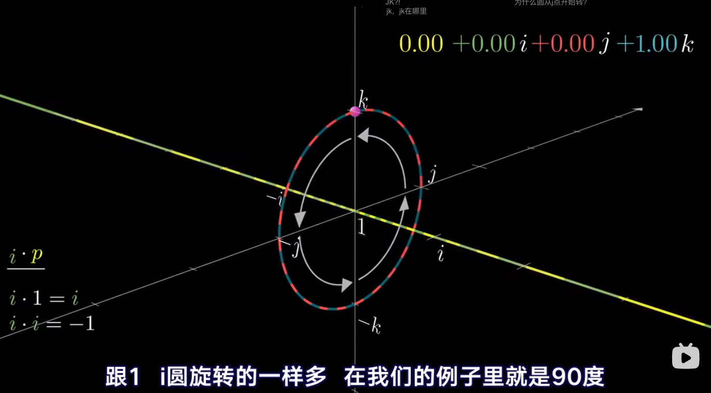
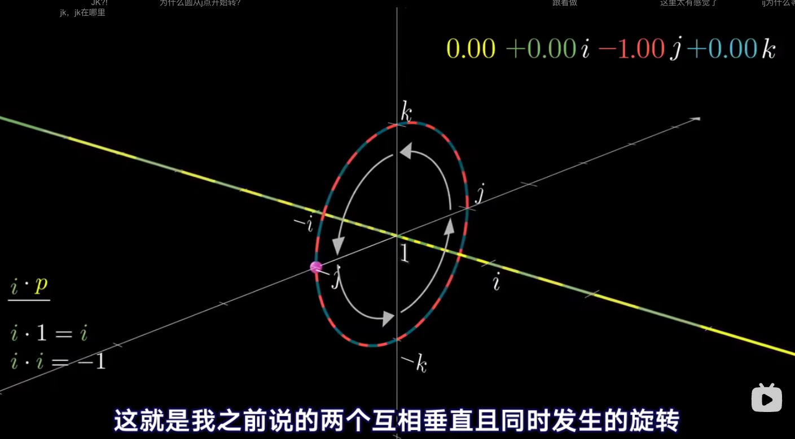
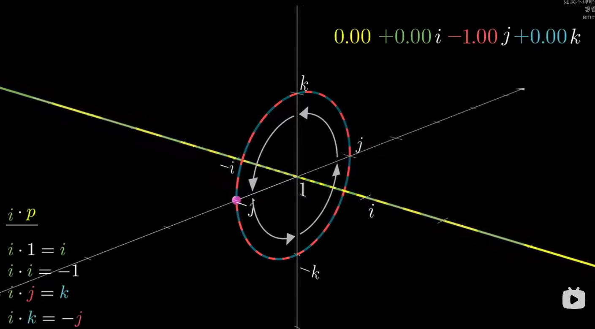

# 四元数

video from： 
https://www.bilibili.com/video/BV1SW411y7W1/?spm_id_from=333.999.0.0&vd_source=b8f06880d75af199bfde2947072422ab 
https://www.bilibili.com/video/BV1Lt411U7og/?spm_id_from=333.999.0.0&vd_source=b8f06880d75af199bfde2947072422ab 

正如负数是实数的二维延伸，四元数是复数的四维延伸 
重点是，理解四元数里两个相互垂直的旋转，比如在二维里，就有两个一维在变换(一个旋转)，在三维里，就有3个一维在变换(可以理解成1.5个一维，所以它还是可以在三个方向旋转但是不能同时表示两个方向旋转)，四维就可以同时表示两个方向旋转了！

四元数在三维空间上任意一个轴的旋转，都代表着jk两个虚部在同时同步发生变化！ 
像在这里就是，k从1变成0 就代表着j从0变成-1； 
可以理解成 *i 代表着旋转90度; 

所以 i * j = k, i * k = -j; 
  

  

  
