## 14-引擎工具链高级概念
Day2023/09/25

### 工具链课程大纲
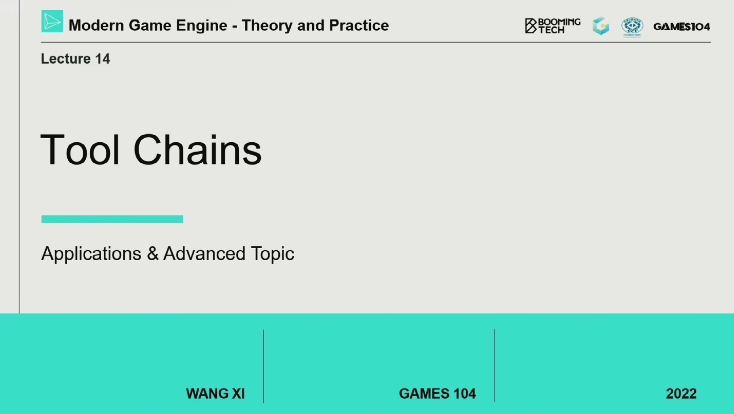

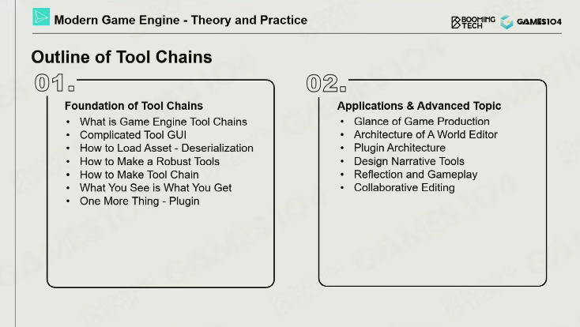

首先介绍工具链基础，然后介绍地图编辑器 和 plug in architecture；然后还有个各种系统，比如反射系统； 
然后讲完反射系统，就要讲协助式编辑！

### 游戏制作一览
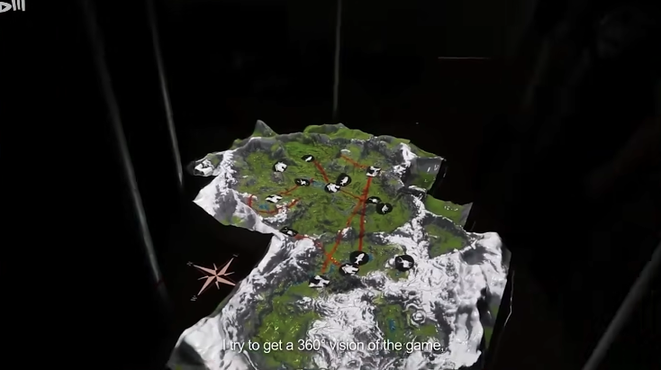

会有各种各样的游戏制作工具，然后有各种Genres，意义就是不同的游戏类型，不噢那个的Genres的layout和组织结构都不愿意，需要的工具链也都不一样。 
需要实现一个WYSIWYG的逻辑，WYSIWYG 是 "What You See Is What You Get" 的缩写，直译为“所见即所得”。这是一种用户界面，可以让开发者在设计和编辑过程中看到最终的效果，而不必等到运行游戏才能看到。

### 世界编辑器
世界编辑器实际上是一个平台，把各种各样的游戏逻辑和玩法都能在其中加入的平台，每一个逻辑都可以是一个plugin。 
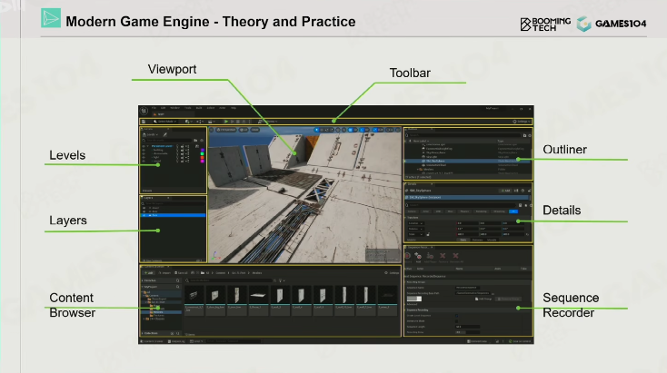

不同的用户群体，都能有不同的view，不同的操作面板，最重要的好似一个viewport；
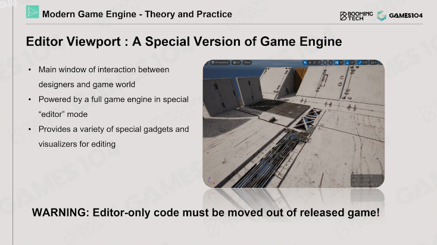

最重要的一个就是Editor Viewport，底下跑的就是一个editable的游戏。这就意味着引擎有一些代码，需要时editor only的一些代码。要是我们把这些editable的代码包含在正式发布的版本里，就很有可能变成是外挂的脚本的插入点。（需要包在Editor Only的宏下） 
通常会有好几个viewport，希望能让引擎兼容多个view，相当于一个本地的小型网络同步了。

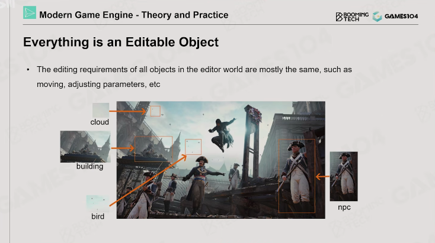

世界编辑器里，几乎所有的对象，都是可以被选中和编辑的，每一个东西都要被抽象成一个editable的object； 
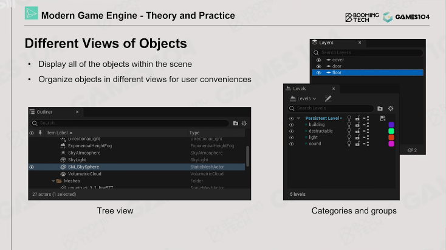

我们要对不同的对象和object设置不同的view；用大的layer进行归类之后，再进行grouping；会需要根据Artist的习惯来锁定和开放不同的view；
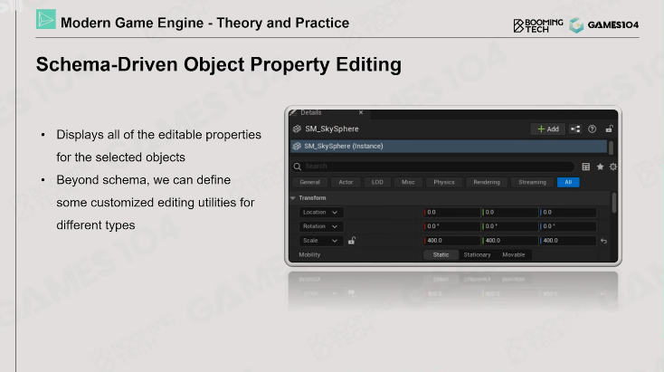

Schema-Driven的功能，就是点一下能看到这个对象或者实例，就能看到他的属性，然后进行编辑；
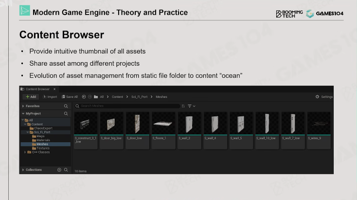

当然不能缺少的是Content Browser！！ 如果我们需要管理所有的资产，就需要一个很好的Content Browser！是一个非常深非常有序的树状结构。 不过这个树状结构是难以迁移的，所以这个时候需要重用这个资产的目录结构。在Content Browser里面，没有一个树状的文件目录结构的概念，而是一个池的概念，只需要知道一个资产的ID，就能很好的挂到它或者找到它。 我们可以根据不同的项目来形成不同的view！它的意义就在于把一个资源的文件目录变成了一个资源的海洋。

鼠标的选取 
鼠标的选取是一切的基础，最简单的办法就是Ray Casting！ 其实要是Ray Casting比较慢的话，就需要额外渲染一个RenderPass单独渲染其ID。然后鼠标点选中一个物体就得到像素的ID就可以了。 
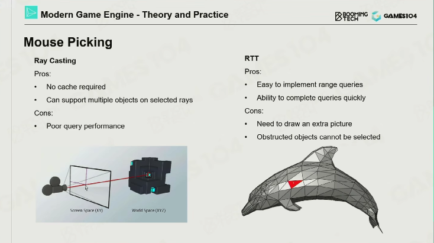

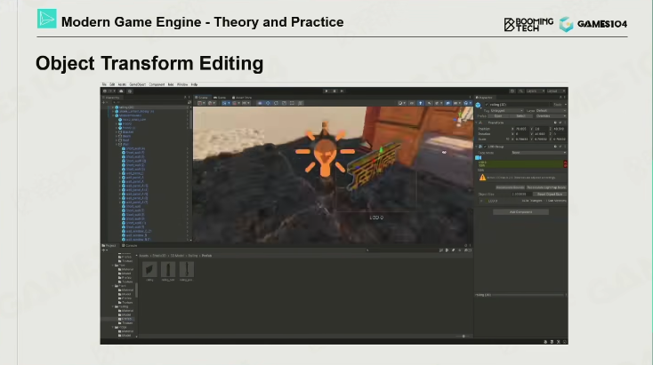

在选取之后，就是一个Transform的操作，Transform的操作，需要设计的非常顺手而非非常逻辑和物理

### 编辑器插件架构

### 设计叙事工具

### 反射和游戏逻辑
GPT说到： 
玩家的操作反射，或者说是游戏的反应性，通常是通过游戏设计和编程实现的。这种反应性可以表现为对玩家行为的直接反馈（例如，玩家按下跳跃键，游戏角色就会跳跃），也可以是游戏世界对玩家行为的适应性反应（例如，玩家做出的选择改变了游戏剧情或环境）。
以下是一些实现这种反应性的常见方法： 

事件监听和响应：在游戏开发中，通常会有一个事件系统，监听和响应玩家的输入。例如，当玩家按下跳跃键时，事件监听器会捕捉到这个输入，然后调用相应的函数或方法，使游戏角色执行跳跃动作。 

状态机：状态机是一种编程构造，用于管理游戏对象的状态。例如，游戏角色可能有行走、跳跃、攻击等状态。当玩家的输入导致状态改变时，状态机会更新游戏对象的行为。 

AI和决策系统：对于更复杂的反应性，可能需要使用人工智能和决策系统。例如，游戏中的非玩家角色可能会根据玩家的行为做出反应。这可能涉及到决策树、行为树、有限状态机等技术。 

物理引擎：物理引擎可以模拟现实世界的力学，如重力、摩擦力等，使游戏角色和环境的互动更加逼真。例如，当玩家移动游戏角色撞击物体时，物理引擎会根据两者的质量、速度等因素，计算并显示出物体的反弹或移动。 

### 协同编辑

### 作业和参考资料