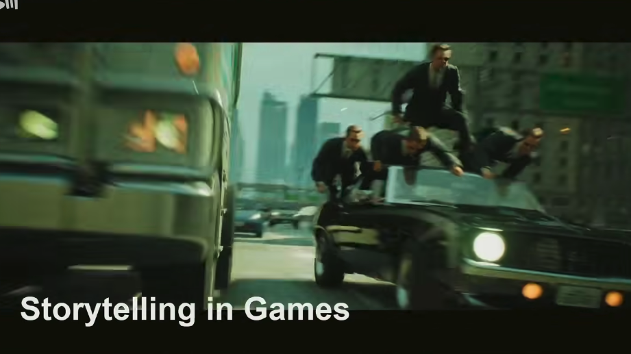
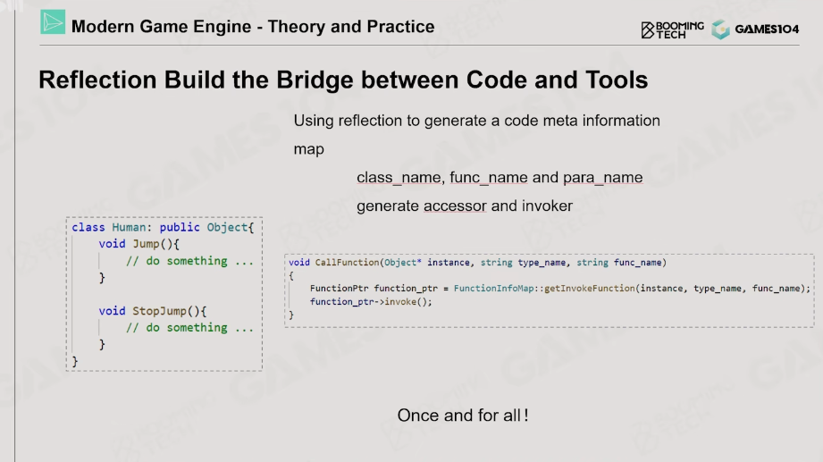
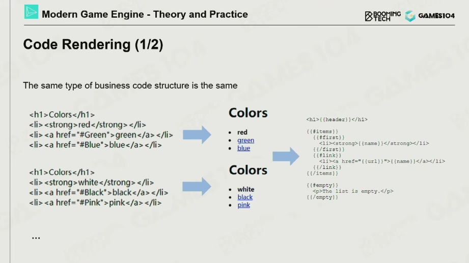
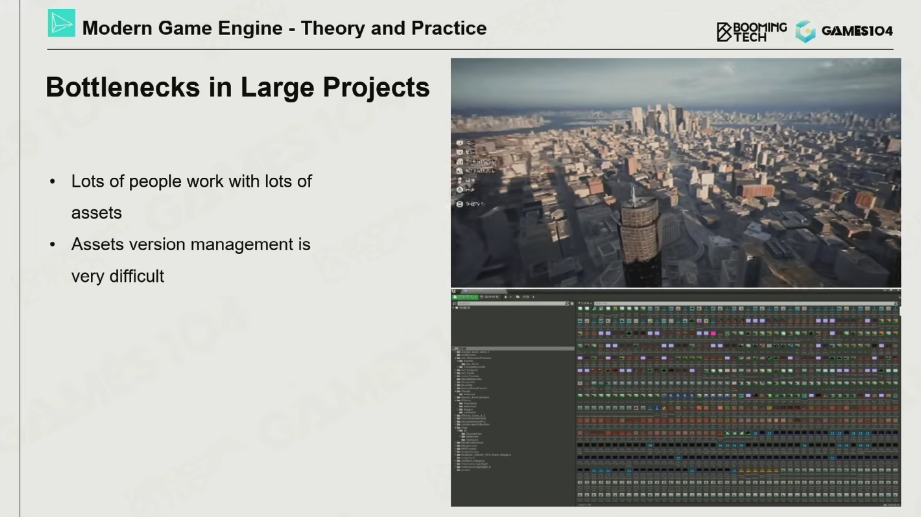

## 14-引擎工具链高级概念
Day2023/09/25

### 工具链课程大纲
</p>
</p>
首先介绍工具链基础，然后介绍地图编辑器 和 plug in architecture；然后还有个各种系统，比如反射系统；</br>
然后讲完反射系统，就要讲协助式编辑！

### 游戏制作一览
</p>
会有各种各样的游戏制作工具，然后有各种Genres，意义就是不同的游戏类型，不噢那个的Genres的layout和组织结构都不愿意，需要的工具链也都不一样。</br>
需要实现一个WYSIWYG的逻辑，WYSIWYG 是 "What You See Is What You Get" 的缩写，直译为“所见即所得”。这是一种用户界面，可以让开发者在设计和编辑过程中看到最终的效果，而不必等到运行游戏才能看到。

### 世界编辑器
世界编辑器实际上是一个平台，把各种各样的游戏逻辑和玩法都能在其中加入的平台，每一个逻辑都可以是一个plugin。</br>
</p>
不同的用户群体，都能有不同的view，不同的操作面板，最重要的好似一个viewport；
</p>
最重要的一个就是Editor Viewport，底下跑的就是一个editable的游戏。这就意味着引擎有一些代码，需要时editor only的一些代码。要是我们把这些editable的代码包含在正式发布的版本里，就很有可能变成是外挂的脚本的插入点。（需要包在Editor Only的宏下）</br>
通常会有好几个viewport，希望能让引擎兼容多个view，相当于一个本地的小型网络同步了。

</p>
世界编辑器里，几乎所有的对象，都是可以被选中和编辑的，每一个东西都要被抽象成一个editable的object；</br>
</p>
我们要对不同的对象和object设置不同的view；用大的layer进行归类之后，再进行grouping；会需要根据Artist的习惯来锁定和开放不同的view；
</p>
Schema-Driven的功能，就是点一下能看到这个对象或者实例，就能看到他的属性，然后进行编辑；
</p>
当然不能缺少的是Content Browser！！ 如果我们需要管理所有的资产，就需要一个很好的Content Browser！是一个非常深非常有序的树状结构。 不过这个树状结构是难以迁移的，所以这个时候需要重用这个资产的目录结构。在Content Browser里面，没有一个树状的文件目录结构的概念，而是一个池的概念，只需要知道一个资产的ID，就能很好的挂到它或者找到它。 我们可以根据不同的项目来形成不同的view！它的意义就在于把一个资源的文件目录变成了一个资源的海洋。

鼠标的选取</br>
鼠标的选取是一切的基础，最简单的办法就是Ray Casting！ 其实要是Ray Casting比较慢的话，就需要额外渲染一个RenderPass单独渲染其ID。然后鼠标点选中一个物体就得到像素的ID就可以了。 
</p>
</p>
在选取之后，就是一个Transform的操作，Transform的操作，需要设计的非常顺手而非非常逻辑和物理.
</p>
对于地形，需要有一个HighBrush！ 对于山药拉起来，但是有一个smooth的效果是最重要的，艺术家希望过渡的效果是自然的，这就有很多讲究。</be>
而且艺术家需要有自己可拓展的能力，比如说自己定义一个高度图，和自己定义一个笔刷的能力；
</p>
当然还有一个非常重要是是Instance Brush，比如说是刷草和种树；
</p>
另外一个是对大量光源位置的摆放，可以吧一个场景的气氛渲染的特别好，这些environment都是由各种各样的插件完成的；
</p>
真正难的是，这些不同的模块之间是需要有相互的规则的，比如路得地面是平的，而且路上不能长树木，这就涉及到很多不同的系统之间复杂的交互效果；而且这些参数化的解决方法，就可以大大的解决这些问题，就是程序化的解决方法，以下就是一个rule system，不同的tree和rode之间的分布都可以是不同的！</br>
另外的需求是一个局部性，就是已经生成的instance在下一次的修改中，不会随机的改变，虽然这些事基于随机算法的；</br>
而且不同的场景有不同的pgc逻辑，比如美国的城市和中国的城市，寒带的植物和热带的植物都是不同的。
</p>
</p>
</p>

### 编辑器插件架构
编辑器使用的是一个插件结构，npc，building，和cloud，都是不同的矩阵。要是我们希望给一个world editor进行plug in的区分和设计，比如粒子系统，就需要用一个插件的功能去实现。以满足后期的不同的插件形式去实现。另外比如需要做一个npc的行为，我们就可以之间选择这个npc的行为模型，也是插件里的功能。</br>
</p>
这里是一个横向的是不同的instance类型，纵向是不同的system。都需要有编辑器插件来实现。
</p>

有一个覆盖系统，就是新的plugin能去覆盖旧的plugin；或者是分布式的系统，或者一些pipeline系统，还有洋葱圈系统，其实讲的就是不同plugin之间的组合逻辑。比如rule系统就是洋葱圈的结构，它需要和各种不同的plugin去交互。</br>
任何一个架构，只要能解决问题，就是以一个好的架构。
</p>
</p>
plugin最大的问题就是一个plugin的version control，要考虑插件的接口，作为引擎的研发者，需要把一些接口预留给插件的开发者，一个好的引擎的设计在这一点是很能体现功力的，是一个商业引擎的必须，需要很好的理解系统的复杂度和多样性。

### 设计叙事工具
我们在游戏里怎么表达一个线性和叙事性的东西；
游戏做的越来愈像电影，一切的一切都是被设计好的。
</p>
这一个叙事逻辑是被安排在一个时间轴上的，什么时候应该播放声音，什么时候应该播放效果和动画 调整灯光都是被规划在一个时间轴上的。我们有大量的内容都是发生在时间上的。
</p>
比如我们看虚幻里，有一个Sequencer，我们对任何一个属性都可以定义一个时间轴上的变化，我们可以在k-frame之间插值，组合在一起就可以形成一个非常丰富的世界。看到是同时发生的，但是在游戏里面都是写好来规划好的。我们是躲在像素之后的人。
</p>
举个例子，我们需要让这个小鸡动起来，我们就可以把一个小鸡绑定在一个actor上，然后给一个sequence，在每一个k-frame上设置它的属性，比如位置和他的一些缩放和变换，然后我们也可以让他在不同的k-frame之间走来走去。
</p>

### 反射和游戏逻辑
GPT说到：</br>
玩家的操作反射，或者说是游戏的反应性，通常是通过游戏设计和编程实现的。这种反应性可以表现为对玩家行为的直接反馈（例如，玩家按下跳跃键，游戏角色就会跳跃），也可以是游戏世界对玩家行为的适应性反应（例如，玩家做出的选择改变了游戏剧情或环境）。
以下是一些实现这种反应性的常见方法：</br>

事件监听和响应：在游戏开发中，通常会有一个事件系统，监听和响应玩家的输入。例如，当玩家按下跳跃键时，事件监听器会捕捉到这个输入，然后调用相应的函数或方法，使游戏角色执行跳跃动作。</br>

状态机：状态机是一种编程构造，用于管理游戏对象的状态。例如，游戏角色可能有行走、跳跃、攻击等状态。当玩家的输入导致状态改变时，状态机会更新游戏对象的行为。</br>

AI和决策系统：对于更复杂的反应性，可能需要使用人工智能和决策系统。例如，游戏中的非玩家角色可能会根据玩家的行为做出反应。这可能涉及到决策树、行为树、有限状态机等技术。</br>

物理引擎：物理引擎可以模拟现实世界的力学，如重力、摩擦力等，使游戏角色和环境的互动更加逼真。例如，当玩家移动游戏角色撞击物体时，物理引擎会根据两者的质量、速度等因素，计算并显示出物体的反弹或移动。</br>
</p>
</p>
游戏里的gameplay是非常复杂的，其核心就是一个反射系统。引擎团队要能增加接口，来拓展的玩法的支持；
</p>
是近期语言的一个很大的进步，就像C++是没有反射系统的。比如像汇编和C语言就是没有反射的，但是像Java和C#是有反射系统的。外部的接口不需要重新编译就能找到函数。反射的实际上就是在引擎里构建了一个很好的桥梁，引擎构建好了之后，反射会构建一个表告诉使用者有哪些接口，有哪些类可以使用，以及一堆掉用的函数，比如一个人，有各种属性，还可以走跑跳，当我们在可视化脚本里创建一个类叫人的话，就可以看到并修改这个人的各种动作和属性。图形化的编程方法就可以把引擎的使用者从程序员拓展到大量的艺术家，就需要图形化的编程方法。
</p>
反射就是链接图形化编程到c++的桥梁。反射（Reflection）在编程中是指一种能力，使得程序能够在运行时访问、检查和修改它自己的结构和行为。这包括获取类型信息，动态调用方法，操作类和对象的属性等。在很多动态语言中，如Java，Python，C#等，反射是一个内建的功能。然而，C++在标准库中并没有提供反射的功能。

反射在许多领域都有应用，包括但不限于ORM（对象关系映射）、序列化和反序列化、测试框架等。在图形化编程环境，如Unity3D的C#脚本，Unreal Engine的蓝图系统等，反射也有广泛应用。在这些环境中，反射被用来在运行时动态创建对象，调用方法，或者将对象和方法关联到图形界面的元素。
</p>
</p>
</p>
</p>
</p>
关于Clang：</br>
我们一般可以用Clang去实现代码的分析，Clang是一个开源的编译器前端，它支持C、C++、Objective-C和Objective-C++编程语言。它的优势在于它的性能、生成的代码质量以及对C++标准的良好支持。它可以提取出一个类的接口等有用的信息。</p>

关于Schema：</br>
在计算机科学中，"Schema"（模式）是一个术语，主要用来描述数据的结构。这个词在许多上下文中有着不同的具体含义，但总的来说，它用来定义数据的组织方式和数据之间的关系。在这里表示的是我们从AST中生成的一个表, 生成Schema从AST可以有多种目的。一种可能的用途是为了更好地理解和分析AST的结构。例如，你可能想要知道你的代码中使用了哪些语言特性，或者你可能想要统计特定类型的节点出现的频率。另一种可能的用途是为了将AST序列化到磁盘，以便后续进一步处理或分析。

关于AST:</br>
抽象语法树（AST）是源代码的抽象语法结构的树状表现形式，这树状图的每个节点都表示源代码中的一种结构。之所以说语法是"抽象"的，是因为这里的语法并不会表示出真实语法中出现的每个细节。例如，嵌套括号被隐含在树的结构中，并没有以节点的形式呈现。
在编译器设计中，AST在语法分析阶段被生成，并作为语义分析阶段的输入。一个编译器通常会使用一个AST来进行诸如类型检查、代码优化等操作。

</p>
</p>
我们有几百个数据结构，但是不是每一个都需要反射的，只有部分的是需要反射的，和资源打交道的一部分数据结构才需要反射。我们是通过一个宏去实现的，通过宏来添加添加对反射代码的控制；通过_attribute_;</br>
</p>
因为反射机制会修改原来的代码，所以也会生成本来对象的Accessors，就比如 Get，Set，Invoke。其中Get 和 Set都是封装的去修改value的函数，然后Invoke是就是去调用成员函数。

</p>
</p>
一个Code Rendering的操作，就是能自己帮我生成大量的冗余代码，只需要一次性debug就可以了。主要都是自动生成的，所以其实是可以实现数据和逻辑的分离。
</p>
在小引擎里，用的是一个叫Mustache的代码生成工具去做反射后的代码生成。
Mustache是一个逻辑-less（逻辑较少）的模板系统，它可以用于HTML、配置文件、源代码等任何类型的文本文件。Mustache模板是简单的字符串，通常用于动态生成字符串输出。Mustache的设计目标是能够在不同的编程语言中使用，使得从一个语言到另一个语言的迁移变得容易。

一个基本的Mustache模板可能看起来像这样：
```
Hello, {{name}}!
```
在这个模板中，{{name}}是一个标签。当你使用一个包含name属性的对象来渲染这个模板时，{{name}}将会被对象中name属性的值替代。例如，如果我们使用包含属性name且值为John的对象来渲染这个模板，输出将会是Hello, John!。

小引擎的反射完整逻辑：</br>
调用Clang生成内存中的Schema，然后更具预先写好的模板，再调用Mustache生成大量的Accessor Code；</br>
1-调用Clang生成内存中的Schema：Clang是一个编译器前端，它能理解C、C++、Objective-C和其他语言的源代码。在这里，Clang被用来解析源代码，生成一个表示代码结构的Schema。这个Schema可能包含源代码中定义的类、函数、变量等的信息。这个Schema被存储在内存中，以便后续处理。</br>
2-根据预先写好的模板：这里的模板可能是一个Mustache模板，它描述了访问器代码应该有什么样的结构。例如，模板可能包含如何定义一个访问器函数，如何获取和设置变量的值等。</br>
3-调用Mustache生成大量的Accessor Code：最后，使用Mustache和前面生成的Schema来填充模板，生成访问器代码。这个过程可能会为源代码中的每个类、函数、变量等生成相应的访问器代码。</br>

### 协同编辑
现代游戏引擎非常重要的发展方向，需要很多人共同编辑；</br>
</p>
</p>
和写代码一样，多人编辑就会产生很多很多文件，然后会产生很多冲突，这个时候就需要人工去Merge；我们可以做u一些操作去减少协同编辑下的冲突；
</p>
比如下面的例子，我们需要把整个场景进行分层，然后给不同的artist编辑。分层是最古老的办法，而且分层会有很多依赖关系。
</p>
另一种方法就是简单的分块，但是这样不能有很高的效率，存在的问题就是，湖泊，房子，可能是跨界的，就需要支持不规则的划分。
</p>
另外一些方法就是ubnreal推出的方法，就是每一个Actor都有自己的一个file，然后彼此之间就不会冲突了，可以简称为OFPA；是非常了不起的，其实这个问题是会产生无数的小文件，比如进行版本管理的时候，需要提交很多很多的文件。这样就会产生很多额外的负载。还是一个前沿的方向，可以彻底的解决协同编辑里merge的问题；
</p>
真正困难的时多个人可以同时在编辑，有点类似于共享文档；核心是对所有的编辑化处理进行原子操作，而且在协同编辑里最大的问题就是undo和redo；
</p>
最简单的实现原子操作的方法就是加一个锁，但是在undo和redo的时候还是会有问题，会有竞争的问题。
</p>
</p>
有一个思路是 我们所有的操作并不会直接作用到最终结果，而是需要在一个服务器统一结算完之后再一起发回给大家。付出的代价是有一点点延迟，但是结果没有错。但是这个系统的健壮性和鲁棒性是基于那一个服务器的设备不会崩掉。
</p>


### 作业和参考资料
</p>