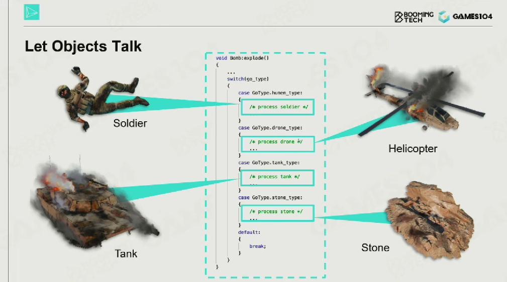
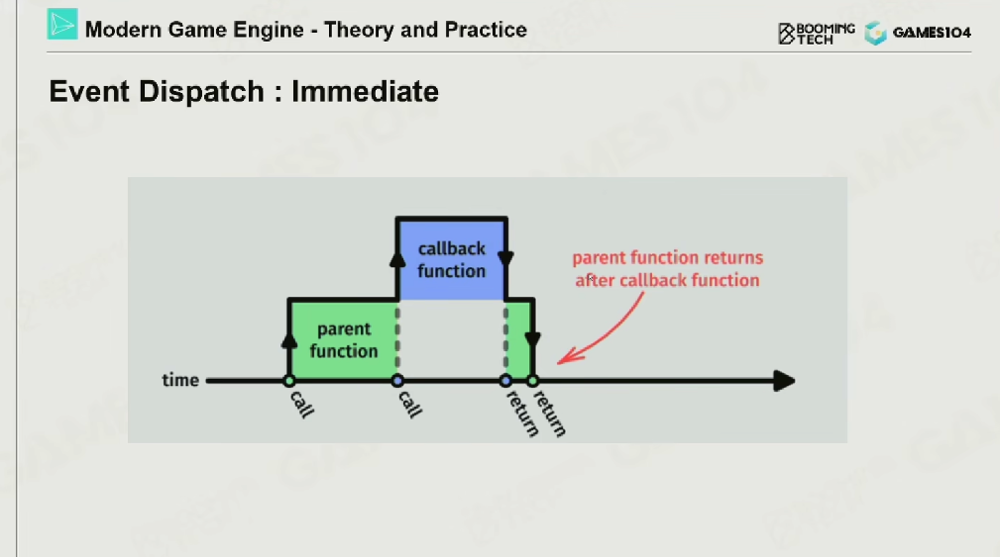

## 15-Gameplay
Day2023/09/25

### 1-Gameplay的课程框架
</p>
分为传统的Gameplay机制和AI系统。
</p>
一个玩法回合游戏里，gameplay的工程师要和素有环节结合，所以gameplay的工程师一般是一个杂学家。
</p>
而且Gameplay有很多分支，一个游戏里可以有格斗场景 也可以有大牌场景，有各种场景混合在一起。
</p>
像堡垒之夜，一个系统就只需要两个月就整出来了，是一个非常迅猛的过程。所以GamePlay是很忙碌很辛苦的，因为要一直跟随着设计师的想法来迭代。因为需要支持快速迭代的功能。所以GamePlay要杂学且迅猛

### 2-事件机制
</p>
事件机制的GameObject之间是需要能talk的，所以要有一个事件机制。
事件机制的设计模式是一个Publish-subscribe Pattern的设计模式；订阅者模式。</br>

发布-订阅模式（Publish-Subscribe Pattern，又称 Pub-Sub Pattern）是一种常见的消息传递模式，主要用于处理事件驱动的系统。它包括了三个主要的参与者：发布者（Publishers）、订阅者（Subscribers）和消息队列或者消息中间件。

以下是发布-订阅模式的基本工作流程：

发布者（Publishers）：发布者负责创建和发布消息。在发布-订阅模式中，发布者并不会直接发送消息给特定的接收者。相反，它只是将消息发布出去，然后由消息系统决定需要将这些消息传送给哪些订阅者。

订阅者（Subscribers）：订阅者订阅他们感兴趣的消息类型。当这些消息被发布时，订阅者就会收到这些消息。订阅者不需要知道是哪个发布者发布的消息。

消息队列或消息中间件（Event Dispatcher）：这是一个中间层，负责存储和转发发布者发布的消息。这个中间层知道哪些订阅者订阅了哪些消息，并将消息正确地传送给相应的订阅者。

这种模式的主要优点是它支持松耦合和动态的网络架构，这意味着发布者和订阅者可以独立地添加或删除，而不会影响到系统的其他部分。这使得系统可以更容易地扩展和修改。

</br>


订阅者模式的三个Key Components：

回调注册（Callback Registration）是一种常见的编程模式，主要用于事件驱动的编程或异步编程。在这种模式中，一个函数（称为回调函数）被传递给另一个函数（称为高阶函数）作为参数。当特定事件或条件发生时，高阶函数将调用这个回调函数。

以下是回调注册的基本工作流程：

定义回调函数：首先，你会定义一个函数，这个函数将在特定的事件或条件发生时被调用。这个函数称为回调函数。

注册回调函数：然后，你将这个回调函数作为参数传递给另一个函数或方法。这个过程通常被称为回调函数的注册。

触发事件：当特定的事件或条件发生时，注册的回调函数就会被触发（即被调用）。

这里的重点是：在 main 函数中，greet 函数被传递给 registerCallback 函数作为参数。在 C++ 中，你可以直接使用函数名来获取这个函数的函数指针。所以，callback(name); 这行代码实际上就是在调用 greet 函数。由于 callback 指向 greet 函数，所以这行代码的效果就是打印出 "Hello, Alice"。

在游戏里的使用主要是事件驱动的编程：在图形用户界面（GUI）编程或游戏编程中，回调函数常用于处理用户的输入事件，如点击、按键等。你可以注册一个回调函数，当特定的事件发生时这个函数就会被调用。

```cpp
#include <iostream>

// 定义回调函数
void greet(const std::string& name) {
    std::cout << "Hello, " << name << std::endl;
}

// 注册回调函数
void registerCallback(void (*callback)(const std::string&)) {
    std::string name = "Alice";
    callback(name);
}

int main() {
    // 注册并调用回调函数
    registerCallback(greet);  // 输出: "Hello, Alice"
    return 0;
}
```

</br>

我们可以通过枚举的类型来定义event；
</br>

Gameplay里最简单的思想是，每一个event都去写一个类，程序员定义每一个event的各种的属性。但是hardcode是不可取的，因为event的各个属性应该是设计师定义的，应该是允许editable的，所以就需要有一个反射机制？

来自GPT，解决问题的方法可能如下：

数据驱动设计是一种让游戏逻辑由数据而非硬编码来驱动的方法。在这种模式中，事件的属性可以存储在一个数据文件（如 JSON、XML 或数据库）中，然后在游戏运行时动态地加载和应用这些属性。这样，游戏设计师就可以通过简单地修改数据文件来改变事件的行为，而无需修改和重新编译代码。

脚本语言（如 Python、Lua）也常被用于游戏开发，因为它们通常比静态类型语言（如 C++）更灵活和易于修改。你可以用脚本语言来编写游戏逻辑和事件处理代码，然后在游戏运行时解释和执行这些脚本。这样，游戏设计师就可以通过修改脚本来改变事件的行为，甚至可以在游戏运行时动态地加载和执行新的脚本。

反射是一种让程序能够检查和修改其自身结构和行为的能力。在支持反射的编程语言（如 Java、C#）中，你可以在运行时动态地创建对象、调用方法、修改字段等。这样，你就可以根据数据文件或脚本中的信息来动态地创建和配置事件，而无需为每个事件硬编码一个类。然而，需要注意的是，反射通常会带来一定的性能开销，并且可能会使代码更难理解和维护。

另外也可以用dll的方式，DLL（动态链接库，Dynamic-Link Library）是一种包含可执行代码和/或数据的二进制文件，它可以在运行时被一个或多个程序动态地加载和链接。DLL 是在 Microsoft Windows 中使用的一种共享库的实现方式，类似的概念在 Unix-like 系统中被称为共享对象（SO）。

DLL 可以提供一种可扩展性的解决方案，因为它允许你将代码分割成多个独立的、可动态加载的模块。这意味着你可以在不修改或重新编译主程序的情况下添加、更新或删除这些模块。这对于游戏开发来说是非常有用的，因为它可以使你更容易地添加新的事件、特性或其他游戏元素。

例如，你可以定义一个事件接口，并在一个或多个 DLL 中实现这个接口，每个 DLL 代表一种特定类型的事件。然后，你可以在游戏运行时动态地加载这些 DLL，并使用其中的事件类来创建和处理事件。这样，当你要添加新的事件类型时，你只需要编写一个新的 DLL，而无需修改和重新编译主程序。

</br>
</br>

callback的另一个名称叫invoke，叫触发或者激活，更贴切一点。当有一个event来了之后，就触发一个处理方法。
</br>

回调函数的注册和执行，其实是分开的，在这个过程里就会出各种各样的问题；包括物体的生命周期和callback的安全性。
</br>

这里举一个例子，就是一个伤害已经触发了，但是在上一帧，应该被伤害的物体已经被销毁了，这个时候就会出问题。
</br>

所以引进了一些概念。</br>
</br>
强引用，被引用的物体要是还被引用着，就不能被删除，就像shared pointer要是还被week pointer引用着就不能被删除一个道理。会保证整个引用的安全性，但是也会产生冗余导致内存占用越来越大。</br>
</br>
弱引用，week reference。就是在调用之前需要去检查一下引用的这个对象还是否存在，会让释放变得轻松一点。

strong和week reference都是非常重要的方式。callback其实week reference用的多一点。

</br>
然后就是EventDispatch，需要根据消息的种类去分发，但是这样的分发效率会非常非常低下。是M * N * K的复杂度，会挺满的。

</br>
在事件分发（Event Dispatch）中，Immediate 机制是指当一个事件产生时，立即执行该事件的处理函数，而不是将事件放入事件队列等待后续处理。

举个例子，假设我们有一个点击按钮的事件。在 Immediate 机制下，当用户点击按钮时，相关的事件处理函数（例如按钮点击的回调函数）会立即执行。这意味着在用户的点击动作完成后，事件处理函数已经执行完毕。

这种机制的优点是响应时间快，因为事件处理函数是在事件产生的那一刻立即执行的。但是，这也可能带来一些问题。例如，如果事件处理函数的执行时间过长，它可能会阻塞其他的事件或者主线程的执行。另外，由于事件处理函数是立即执行的，所以如果在事件处理函数中产生了新的事件，那么这个新的事件可能会在当前事件处理完成之前就被处理，这可能会导致事件的处理顺序和预期不一致。

为了阻塞线程和顺序不一致的问题，很多系统会使用事件队列和事件循环的机制来处理事件。在这种机制下，当一个事件产生时，它会被放入事件队列。然后，事件循环会逐个取出事件并执行其处理函数。这样可以保证事件的处理顺序，也可以避免长时间的事件处理阻塞其他的事件或主线程。然而，这种机制的响应时间可能会比 Immediate 机制慢，因为事件的处理需要等待事件循环的调度。

</br>
像这个手雷一层层往下的情况，其实就会有处理顺序的问题；

</br>
这个是一个等待时间的问题，手雷炸之前需要有一个烟雾的效果，这个是非常费算力的，所有后续都要等待，导致帧率会突然不稳定。

</br>
另外一个缺点是这个调用时一层套一层的，所以很难并行化。

</br>
事件队列

在事件驱动的编程模型中，事件队列是一种数据结构，通常用于存储和管理在程序运行中产生的事件。这些事件可以是用户的行为（如点击、键盘输入等），或者是系统生成的（如定时器、网络请求等）。

当一个事件产生时，它不会立即被处理，而是被放入事件队列中。接着，程序通过一个被称为事件循环（Event Loop）的过程，从队列中取出并处理事件。事件循环会持续运行，等待新的事件进入队列，这样一来，每当事件进入队列，事件循环就会处理它。

下面是一个基本的事件队列和事件循环的工作过程：

1-事件发生，例如用户点击了一个按钮。</br>
2-应用程序将事件信息（如事件类型、发生时间、相关数据等）打包成一个事件对象，并将其加入到事件队列中。</br>
3-事件循环从事件队列中取出事件对象。</br>
4-事件循环调用与该事件对象相关的事件处理器（Handler）进行处理。这些处理器是在程序中预先定义好的，用于响应特定类型的事件。</br>
5-事件处理器完成对事件的处理后，事件循环继续从队列中取出下一个事件进行处理。</br>
6-如果事件队列空了，事件循环就会等待，直到新的事件进入队列。</br>

事件队列的使用有许多优点。首先，它能有效地管理事件，确保事件按照一定的顺序（通常是它们发生的顺序）被处理。其次，它使得事件的处理可以异步进行，使得程序在等待某些事件（如网络请求）的响应时，能够继续处理其他的事件。最后，通过适当地控制事件的处理，事件队列可以帮助避免程序的阻塞，从而提高程序的响应性和效率。

为什么event queue可以异步执行但是 immediate不行？

Immediate 机制是同步的，当事件发生时，事件处理函数会立即被调用并执行。这意味着主程序必须等待事件处理函数执行完成才能继续执行其他任务。这种方式的优点是可以立即响应事件，但如果事件处理函数执行时间较长，可能会导致主程序的其他部分被阻塞，影响程序的性能和响应性。

Event Queue 机制则是异步的，当事件发生时，它会被添加到事件队列中，然后主程序可以继续执行其他任务。事件循环会在后台不断地从事件队列中取出并处理事件。因此，即使事件处理函数的执行时间较长，也不会阻塞主程序的其他部分。这种方式的优点是可以提高程序的性能和响应性，但可能会稍微延迟处理事件，因为事件需要等待在事件队列中被事件循环取出。

</br>

序列化 是将数据结构或对象状态转换为可以存储或传输的形式的过程。这种形式需要能在后续使用中被轻松读取（反序列化）。序列化后的数据可以写入磁盘，或者通过网络发送到其他机器。序列化的主要目的是保存对象的状态，或者在网络上发送对象。

反序列化 是将序列化的数据转换回其原始形式的过程。

其实在反射机制里的序列化是很好做的，因为我们已经知道了其大小；

</br>
event在内存中存储的数据结构叫做 ring buffer；</br>
环形缓冲区（Ring Buffer），也被称为循环缓冲区（Circular Buffer），是一种先进先出（FIFO）的数据结构，它在处理流数据和实现数据缓存时非常有用。环形缓冲区的特点是，当它被填满后，新的元素将覆盖最早添加的元素。假设每一帧最多会存5000个或者1000个event，这样的好处就是不用再去申请新的内存了，当read指针和write指针重叠的时候就能知道此时已经满了。

</br>
我们会根据event的类型，把不同类型的event给分发在不同的queue里。而且这样debug起来也会非常轻松且容易。所以在架设引擎event系统的时候需要分类；

</br>
event queue的并行问题是会忽略本来按照顺序提交的命令，比如这里我们希望是先 effect再audio，他就直接并行了。所以有时候也要用immidate；

</br>
这也是 Event Queue比 Immediate不好的地方，有时我们需要在同一帧内出效果，但是用event queue往往会拖到两到三帧之后。这是因为，事件循环通常是在每一帧（Frame）更新后运行一次，处理在上一帧中产生并添加到事件队列的事件。

具体来说，当一个事件发生时（比如用户的输入或系统发出的信号），这个事件首先会被添加到事件队列中。然后，事件循环需要等待到下一帧才开始处理事件队列中的事件。因此，处理这个事件的实际时间会比事件发生的时间晚一帧，这就是所谓的“一帧延迟”。

在许多情况下，这种一帧的延迟是可以接受的，因为在大多数现代系统中，帧率（Frame Rate）通常非常高（例如，60帧/秒），所以这种延迟通常只有几毫秒。然而，在需要高精度时间反馈的系统（例如，某些实时游戏或高频率的交互系统）中，这种延迟可能会成为问题。

为了减少或避免一帧延迟，可以采用一些策略，如优化事件处理的速度，以便在同一帧中处理更多的事件；或者使用其他并行或并发的技术，使得事件的处理可以在事件发生后立即进行，而不是等待到下一帧。然而，这些策略可能会增加系统复杂性，需要根据具体的应用和性能需求来权衡。

### 3-游戏的逻辑与脚本系统
 


### 4-可视化脚本

### 5-游戏性开发中的3C
Character Control and Camera