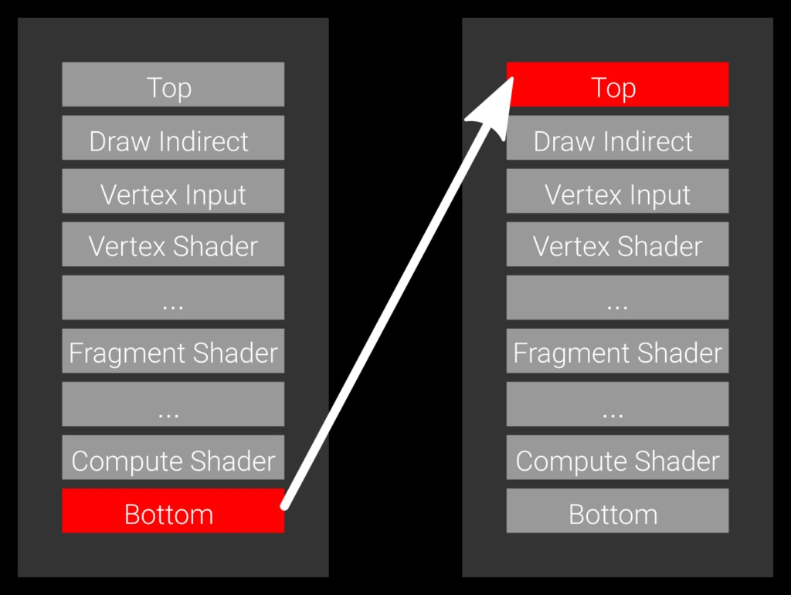
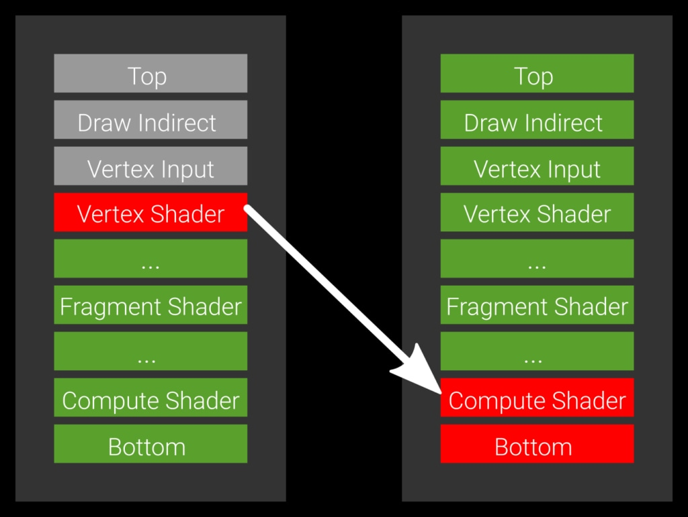
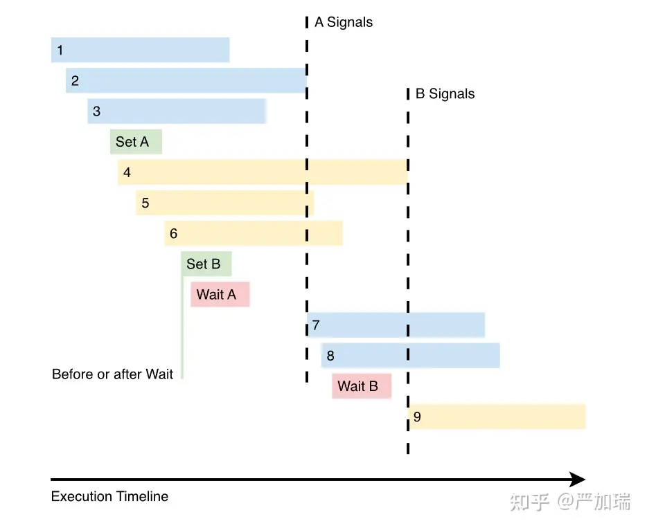

# Vulkan Synchronization

## 单队列内的同步

### 1-Pipeline Barriers
Pipeline Barriers（管线屏障）是一个重要的概念。Pipeline Barriers 用于管理图形渲染管线中各个Pass之间的数据依赖和同步。 
Pipeline Barriers 仅局限于管线的GPU阶段，它决定管线的哪个阶段要在哪个阶段之前完成。 
barriers有两种类型，它们是: Execution barriers 和 Memory barriers。

***1-1 Why need Pipeline Barriers？***

Pipeline Barriers可以用于管理同一帧中的不同render pass之间的依赖关系，以及同一render pass中的不同subpass之间的依赖关系。
每个subpass代表了渲染管线中的一个阶段，例如颜色填充、深度测试等。当一个subpass需要使用另一个subpass的输出结果时，可以在它们之间插入一个Pipeline Barrier来确保数据的可用性和正确性。

此外，Pipeline Barriers还可以用于管理不同帧之间的依赖关系。在多帧渲染中，前一帧的渲染结果可能需要作为后一帧的输入，或者需要等待前一帧的某些计算任务完成后才能开始下一帧的渲染。Pipeline Barriers可以在帧之间插入，以确保正确的数据传递和同步。

***1-2 Execution Barriers:*** 

Execution Barriers 用于保证GPU上的指令的执行顺序。举个例子，我们都知道Deffered Rendering 分为两个阶段：几何阶段（Geometry Pass）和光照阶段（Lighting Pass）。在Geometry Pass，场景中的几何信息被渲染到 G-Buffer 中。在Lighting Pass，使用G-Buffer中的数据进行光照计算，并将最终的颜色输出到Frame Buffer中。 
通过在 Geometry Pass 和 Lighting Pass 间插入Pipeline Barriers，可以确保 G-Buffer 的写入操作在Lighting Pass开始之前完成，然后再在 Lighting Pass 进行数据读写，这样可以避免数据竞争和不一致性。

在vkCmdPipelineBarrier函数中，**srcStageMask** 和 **dstStageMask** 分别代表 Source 和 Target 阶段。也就是这个Barrier控制了 **Source要在Target之前执行** 。 
那首先要知道总共有多少个bit，也就是GPU pipeline 每个阶段的标记： 

TOP_OF_PIPE_BIT 
DRAW_INDIRECT_BIT 
VERTEX_INPUT_BIT 
VERTEX_SHADER_BIT 
TESSELLATION_CONTROL_SHADER_BIT 
TESSELLATION_EVALUATION_SHADER_BIT 
GEOMETRY_SHADER_BIT 
FRAGMENT_SHADER_BIT 
EARLY_FRAGMENT_TESTS_BIT 
LATE_FRAGMENT_TESTS_BIT 
COLOR_ATTACHMENT_OUTPUT_BIT 
TRANSFER_BIT 
COMPUTE_SHADER_BIT 
BOTTOM_OF_PIPE_BIT

 Vulkan官方给Pipeline Barriers定义了两个形容词：Conservative 和 Relaxed，其中 Conservative 表示更加保守的Pipeline，它绝对不会错但是效率低；Relaxed 是在保证不会错的前提下最大化效率。

 **Conservative one**： 
 先看一个最保守的，直接规定上一个Pass完全执行完 才开始下一Pass，这样有些没有数据依赖的阶段，比如Deffered Rendering的Lighting Pass的Vertex Shader不需要用Geometry Pass的结果，也要白白等待，显然是低效的。

    vkCmdPipelineBarrier(
        commandBuffer,
        VK_PIPELINE_STAGE_BOTTOM_OF_PIPE_BIT, // source stage
        VK_PIPELINE_STAGE_TOP_OF_PIPE_BIT,    // destination stage
        /* remaining parameters omitted */);

 
 在Vulkan和Arm的官方测试文档里，我们可以看到，要是采用保守的Bootom to top方法，那Vertex Shader和Fragment Shader几乎会是同个阶段执行的，不会错开执行，因为Barriers严格的控制了执行顺序。
 

 **Relaxed one**： 
 下面这张来自AMD文档的图显示的是一个相当Relaxed的Pipeline Barriers，它下一个Pass的Compute shader只需要在上一个pass的Vertex Shader结束之后就能运行。 

    vkCmdPipelineBarrier(
        commandBuffer,
        VK_PIPELINE_VERTEX_SHADER_BIT,     // source stage
        VK_PIPELINE_COMPUTE_SHADER_BIT,    // destination stage
        /* remaining parameters omitted */);

 

 Arm给出的例子，如果我们使用Frag to Frag代替Bootom to Top，能看到Fragment Shader的计算和Vertex Shader是错开的，Frame Times也缩短了13%，这就是Relaxed的Barriers对 Performance的提升。

 

***1-3 Memory Barriers:*** 

Memory Barriers 和 Execution Barriers类似，但是是用来管理资源的读取之间的同步的。可以分成以下三类：

 1-**Global memory barriers**是通过pMemoryBarriers参数添加的，并且会作用于所有的memory objects上。 
 2-**Buffer memory barriers**是通过pBufferMemoryBarriers参数添加的，并且仅仅作用于被绑定到VkBuffer对象上的device memory上。 
 3-**Image memory barriers**是通过pImageMemoryBarriers参数添加的，并且仅仅作用于被绑定到VkImage对象上的device memory上。 

 我们也许想要这样设置pipeline barrier：我们在compute shader中向一个纹理图片buffer中写数据并且在写完之后，我们想要在一个fragment shader中使用它。这样的设置也许看起来像是来自于Vulkan synchronization examples wiki 里的这个例子：

    vkCmdDispatch(...);

    VkImageMemoryBarrier imageMemoryBarrier = {
    ...
    .srcAccessMask = VK_ACCESS_SHADER_WRITE_BIT,
    .dstAccessMask = VK_ACCESS_SHADER_READ_BIT,
    .oldLayout = VK_IMAGE_LAYOUT_GENERAL,
    .newLayout = VK_IMAGE_LAYOUT_SHADER_READ_ONLY_OPTIMAL
    /* .image and .subresourceRange should identify image subresource accessed */};

    vkCmdPipelineBarrier(
    ...
    VK_PIPELINE_STAGE_COMPUTE_SHADER_BIT,  // srcStageMask
    VK_PIPELINE_STAGE_FRAGMENT_SHADER_BIT, // dstStageMask
    ...
    1,                                     // imageMemoryBarrierCount
    &imageMemoryBarrier,                   // pImageMemoryBarriers
    ...);
    

    ... // Render pass setup etc.

    vkCmdDraw(...);
### 2-Events
 用vkCmdSetEvent设置一个event，然后用vkCmdWaitEvents等待一个event。Events会协调vkCmdSetEvent前的执行任务与访存，和vkCmdWaitEvents后的执行任务与访存。发生在vkCmdSetEvent和vkCmdWaitEvents之间的指令是不受event影响的。 

 用一个实际的例子看一下：

对应着以下代码：

    // 三个没有资源访问冲突的dispatches
    vkCmdDispatch( 1 );
    vkCmdDispatch( 2 );
    vkCmdDispatch( 3 );

    // 4, 5, 6 不和 1, 2, 3 共享资源
    // 我们没有理由去阻挡他们, 所以设置一个之后要等待的事件
    vkCmdSetEvent( A, srcStageMask = COMPUTE );
    vkCmdDispatch( 4 );
    vkCmdDispatch( 5 );
    vkCmdDispatch( 6 );

    // 7 和 8 使用的资源与 4, 5, 6 不一样. 所以我们使用如下的event
    vkCmdSetEvent( B, srcStageMask = COMPUTE );

    // 7 和 8 需要 1, 2, 3 的资源
    // 所以我们将会通过等待A的方式，等待这些资源
    vkCmdWaitEvents( A, dstStageMask = COMPUTE );
    vkCmdDispatch( 7 );
    vkCmdDispatch( 8 );

    // 9和4, 5, 6使用同样的资源，所以我们等待.
    // 同样，我们假设9不需要7和8中的资源.
    vkCmdWaitEvents( B, dstStageMask = COMPUTE );
    vkCmdDispatch( 9 );

### 3-Subpass Dependencies
 这种方法和pipeline barriers类似，但是它仅仅是用在表达一个pass内部多个render subpasses之间的同步，而pipeline barriers一般是作用于pass与pass之间。Subpass Dependencies的主体是Attachments，包含有七个信息。

 srcSubpass：Source pass 也就是这个dependency之前的subpass。 
 dstSubpass：Target pass 是dependency之后的subpass。

 srcStageMask：Source 的Pipeline Stage 要在 Target Stage之前完成。 
 dstStageMask：Target Stage 需要等待 Source Stage。

 srcAccessMask：Source 的资源访问需要在 Target的资源访问之前完成。 
 dstAccessMask：需要等待Source的资源访问结束之后才开始。

 dependencyFlags：额外的依赖标志，用于更精确地控制依赖关系的行为。

 
 下面以面以 SaschaWillems 的Vulkan Examples系列里的triangle为例。这里有两个 Attachment， Depth 和 Color。我们首先看到secSubpass 和 dstSubpass，这里表示执行完外部的其他pass 进入index = 0的subpass时候的同步操作。因为这个Triangle特别简单只有一个subpass，所以这里的同步仅限于外部和这个subpass。在depth的attachment上，外部的深度测试需要比该subpass的深度测试更早完成，然后外部需要写入depth然后这个pass才能读和写，对于color来说外部并没有读或者写的操作，所以srcAccess = 0。 

    // Setup subpass dependencies
    // These will add the implicit attachment layout transitions specified by the attachment descriptions
    // The actual usage layout is preserved through the layout specified in the attachment reference
    // Each subpass dependency will introduce a memory and execution dependency between the source and dest subpass described by
    // srcStageMask, dstStageMask, srcAccessMask, dstAccessMask (and dependencyFlags is set)
    // Note: VK_SUBPASS_EXTERNAL is a special constant that refers to all commands executed outside of the actual renderpass)
    std::array<VkSubpassDependency, 2> dependencies;

    // Does the transition from final to initial layout for the depth an color attachments

    // Depth attachment
    dependencies[0].srcSubpass = VK_SUBPASS_EXTERNAL;
    dependencies[0].dstSubpass = 0;
    dependencies[0].srcStageMask = VK_PIPELINE_STAGE_EARLY_FRAGMENT_TESTS_BIT | VK_PIPELINE_STAGE_LATE_FRAGMENT_TESTS_BIT;
    dependencies[0].dstStageMask = VK_PIPELINE_STAGE_EARLY_FRAGMENT_TESTS_BIT | VK_PIPELINE_STAGE_LATE_FRAGMENT_TESTS_BIT;
    dependencies[0].srcAccessMask = VK_ACCESS_DEPTH_STENCIL_ATTACHMENT_WRITE_BIT;
    dependencies[0].dstAccessMask = VK_ACCESS_DEPTH_STENCIL_ATTACHMENT_WRITE_BIT | VK_ACCESS_DEPTH_STENCIL_ATTACHMENT_READ_BIT;
    dependencies[0].dependencyFlags = 0;

    // Color attachment
    dependencies[1].srcSubpass = VK_SUBPASS_EXTERNAL;
    dependencies[1].dstSubpass = 0;
    dependencies[1].srcStageMask = VK_PIPELINE_STAGE_COLOR_ATTACHMENT_OUTPUT_BIT;
    dependencies[1].dstStageMask = VK_PIPELINE_STAGE_COLOR_ATTACHMENT_OUTPUT_BIT;
    dependencies[1].srcAccessMask = 0;
    dependencies[1].dstAccessMask = VK_ACCESS_COLOR_ATTACHMENT_WRITE_BIT | VK_ACCESS_COLOR_ATTACHMENT_READ_BIT;
    dependencies[1].dependencyFlags = 0

## 队列间的同步

### 4-Semaphores
 我们在 GPU Device 上有很多运行的Queue，Vulkan的Command Buffer提交到Queue上执行绘制。 Semaphores（信号量）就负责Queue与Queue之间，或者Command Buffer之间的同步。这个举个具体的例子会比较好理解，下面以 SaschaWillems 的Vulkan Examples系列里的triangle为例。 
 https://github.com/SaschaWillems/Vulkan/blob/master/examples/triangle/triangle.cpp

 这里就定义了两个类型的Semaphores：

 **presentCompleteSemaphores**；表示上一帧的present已经结束了，可以重新在这个Queue上submit一个command buffer去绘制。原文是“ensure that image presentation is complete before starting to submit again”。在vkQueueSubmit的时候要等待这个信号量。

 **renderCompleteSemaphores**；表示渲染完成可以呈现在屏幕上，原文是“ensure that all commands submitted have been finished before submitting the image to the queue”。这个信号量在 vkQueueSubmit 运行完成后发出，表示render好了可以present到屏幕上了，然后vkQueue PresentKHR 等待到这个信号量，就执行了present的操作。

 等待和发出Semaphores的操作

 **waitSemaphore**：这是一个用于等待信号量的操作。当一个命令需要在某个信号量发出信号之后才能执行时，可以使用waitSemaphore操作。

 **signalSemaphore**：这是一个用于发出信号量的操作。当一个命令完成后，可以使用signalSemaphore操作来发出一个信号量。

### 5-Fences
 Fence和Semaphore不同点在于：Semaphores专注于做GPU任务的同步，而Fence是专注于做CPU与GPU之间的同步。下面还是以 SaschaWillems 的Vulkan Examples系列里的triangle为例。 

    // Use a fence to wait until the command buffer has finished execution before using it again
    vkWaitForFences(device, 1, &waitFences[currentFrame], VK_TRUE, UINT64_MAX);

    // 准备 Shader Data 和 Uniform Buffer
    
    // Reset Fences
    VK_CHECK_RESULT(vkResetFences(device, 1, &waitFences[currentFrame]));
 
 我们可以看到 在Render函数中，我们需要等待Fence，能加载Data和Uniform Buffer数据。目的是等待 Commmand Buffer 结束执行之后才能去reuse（重新加载数据和Bind各种Pipeline和Descriptor）。也就是Fence告诉GPU什么时候可以开始下一帧的操作。

## 参考资料
[1] https://zhuanlan.zhihu.com/p/449222522#ref_1  
[2] https://www.khronos.org/blog/understanding-vulkan-synchronization  
[3] https://github.com/ARM-software/vulkan_best_practice_for_mobile_developers 
[4] https://github.com/ARM-software/vulkan_best_practice_for_mobile_developers/blob/master/samples/performance/pipeline_barriers/pipeline_barriers_tutorial.md 
[5] https://gpuopen.com/learn/vulkan-barriers-explained/ 
[6] https://github.com/SaschaWillems/Vulkan/blob/master/examples/triangle/triangle.cpp
